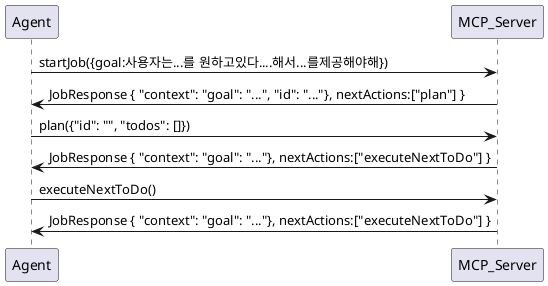

# MCP (Model Context Protocol) Tools를 활용한 확장성 높은 Agentic Workflow

- MCP Tools의 Chaining을 통해 다양한 Tool을 활용하여 복잡한 Task를 수행하도록 하기 위한 MCP Tool 기반 Framework 제공
- 범용적 Framework으로써 많은 Workflow를 수용할 수 있음

## Framework Concept

- Tool Call의 Parameter를 통해 각 단계의 필요한 정보의 생성을 강제화
- Job Context를 Tool 호출 시 항상 노출하여 맥락의 유지를 강화
- LLM 기반 Agent는 이 MCP 도구를 호출하면서 자연스럽게 복잡한 Task를 수행해나가게됨
- 각 단계는 다음단계가 명시적이며 다음에 어떤 도구를 호출해야 하는지 nextAction의 값으로 LLM 기반 Agent에 Return하게됨
- Return된 정보는 Tool Output으로 Message Context 내에 포함되게됨

### Context Type

```ts

interface ToDo {
    id: number;
    text: string;
    check: boolean;
}

interface ToDoUpdate {
    id: number;
    check: boolean
}

interface JobContext {
    goal: string;
    status: 'ongoing'|'complete';
    todos: ToDo[];
    thoughts: string[]
}

interface JobResponse {
    context: JobContext;
    nextAction: string; // function call that agent should call next
}

```

### Workflow


