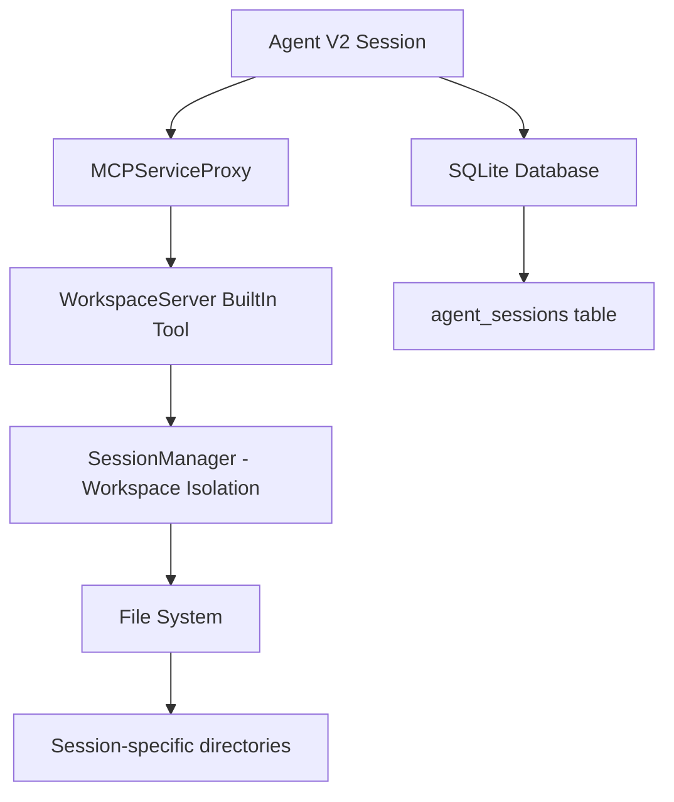

# Analysis: Session Switching Requirements for Agent V2

## Executive Summary

**CONFIRMED: The `switch_session` command in `session_commands.rs` IS REQUIRED for Agent V2 session management.**

The legacy Session Manager is **NOT orphaned code**. It provides critical workspace isolation functionality that Agent V2 relies on through the `WorkspaceServer` builtin tool.

## Architecture Analysis

### 1. Agent V2 Session Management Layers

Agent V2 uses a **three-layer architecture** for session management:



#### Layer 1: Agent V2 Session (SQLite)

- **Location**: `src-tauri/src/agent/`
- **Commands**: `agent_commands.rs`
- **Storage**: SQLite database (`agent_sessions` table)
- **Purpose**: Session metadata, configuration, conversation history
- **Managed by**: `AgentSessionManager`

#### Layer 2: MCP Service Proxy (Builtin Tools)

- **Location**: `src-tauri/src/mcp/service_proxy_manager.rs`
- **Pattern**: **Session-Per-Proxy** architecture
- **Purpose**: Isolated builtin tool instances per session
- **Key Feature**: Each session gets independent `WorkspaceServer` instance

#### Layer 3: Session Manager (Workspace Isolation)

- **Location**: `src-tauri/src/session.rs`, `session_commands.rs`
- **Storage**: File system directories
- **Purpose**: **Physical workspace isolation** (separate directories per session)
- **Managed by**: `SessionManager` (singleton, shared across all proxies)

### 2. Workspace Isolation Mechanism

#### How It Works

1. **Session Creation (Agent V2)**:

   ```rust
   // src-tauri/src/agent/lifecycle.rs
   pub async fn create_session(
       session_id: String,
       agent_config: AgentConfig,
   ) -> Result<SessionMetadata, String> {
       // Create database record
       let metadata = save_to_db(session_id, agent_config).await?;

       // Create MCPServiceProxy with WorkspaceServer
       let proxy = proxy_manager.create_proxy(
           session_id,
           tool_ids,  // includes "workspace"
       ).await?;

       Ok(metadata)
   }
   ```

2. **Workspace Server Initialization**:

   ```rust
   // src-tauri/src/mcp/builtin/workspace/mod.rs
   pub struct WorkspaceServer {
       session_id: String,
       session_manager: Arc<SessionManager>,  // ✅ Shared singleton
       isolation_manager: SessionIsolationManager,
   }

   impl WorkspaceServer {
       pub fn new(session_id: String, session_manager: Arc<SessionManager>) -> Self {
           // Each session gets its own WorkspaceServer instance
           // But shares the SessionManager singleton
       }
   }
   ```

3. **Workspace Path Resolution**:

   ```rust
   // src-tauri/src/session.rs
   impl SessionManager {
       pub fn get_workspace_dir(&self, session_id: &str) -> PathBuf {
           // Returns: /path/to/app-data/libragent/sessions/{session_id}/workspace/
           self.base_data_dir
               .join("sessions")
               .join(session_id)
               .join("workspace")
       }
   }
   ```

4. **Code Execution with Isolation**:

   ```rust
   // src-tauri/src/mcp/builtin/workspace/code_execution/shell.rs
   pub async fn shell_command(&self, command: &str) -> Result<MCPResult, String> {
       // Get workspace path from session_manager
       let workspace_path = self.session_manager.get_workspace_dir(&self.session_id);

       // Create isolated command with session-specific workspace
       let isolation_config = IsolatedProcessConfig {
           session_id: self.session_id.clone(),
           workspace_path,  // ✅ Session-specific directory
           command,
           isolation_level,
       };

       let cmd = self.isolation_manager.create_isolated_command(isolation_config).await?;
       // Execute in isolated workspace
   }
   ```

### 3. Session Switching Flow

#### Current Implementation

**Frontend (tools/index.tsx line 364)**:

```typescript
useEffect(() => {
  const sessionId = currentSession?.id;

  if (sessionId) {
    // ✅ REQUIRED: Switches SessionManager's current_session context
    switchSession(sessionId, true).catch((error) => {
      logger.error('Failed to switch session in backend', { sessionId, error });
    });
  }
}, [currentSession]);
```

**Backend (session_commands.rs)**:

```rust
#[tauri::command]
pub async fn switch_session(request: SwitchSessionRequest) -> Result<SwitchSessionResponse, String> {
    let session_manager = get_session_manager();

    // Updates SessionManager's current_session field
    session_manager.set_session_async(request.session_id).await?;

    // Ensures workspace directory exists
    let workspace_dir = session_manager.get_workspace_dir(&request.session_id);

    Ok(SwitchSessionResponse {
        session_id: request.session_id,
        workspace_dir: workspace_dir.to_string_lossy().to_string(),
    })
}
```

**Workspace Server (WorkspaceServer::switch_context)**:

```rust
// src-tauri/src/mcp/builtin/workspace/mod.rs
pub async fn switch_context(&self, options: ServiceContextOptions) -> Result<(), String> {
    if let Some(new_session_id) = options.session_id {
        // Switch session in session_manager
        self.session_manager.set_session_async(new_session_id).await?;

        // SessionManager now returns new workspace path for this session
    }
    Ok(())
}
```

### 4. Critical Dependencies

#### Why `switch_session` Cannot Be Removed

1. **SessionManager is Stateful**:

   ```rust
   pub struct SessionManager {
       current_session: Arc<RwLock<Option<String>>>,  // ✅ Mutable state
       workspace_pool: Arc<RwLock<HashMap<String, SessionWorkspaceInfo>>>,
   }
   ```

   - The singleton maintains a `current_session` field
   - Multiple `WorkspaceServer` instances (one per session) share this singleton
   - **Without switching, all sessions would use the same workspace directory**

2. **Frontend Synchronization**:

   ```typescript
   // tools/index.tsx line 364
   // When user switches between Agent V2 sessions in UI:
   // 1. React updates currentSession state
   // 2. useEffect triggers
   // 3. Calls switch_session to update backend SessionManager
   // 4. Subsequent workspace operations use correct directory
   ```

3. **Workspace Isolation Guarantee**:

   ```
   Session A (session-123):
   - Workspace: /data/sessions/session-123/workspace/
   - Files: project.py, data.csv

   Session B (session-456):
   - Workspace: /data/sessions/session-456/workspace/
   - Files: test.js, output.txt

   ✅ Without switch_session: Both might use /data/sessions/session-123/workspace/ ❌
   ✅ With switch_session: Each uses correct isolated directory ✅
   ```

## Evidence: Active Usage Patterns

### 1. WorkspaceServer Requires SessionManager

```rust
// src-tauri/src/mcp/builtin/workspace/mod.rs:77-78
pub struct WorkspaceServer {
    session_manager: Arc<SessionManager>,  // ✅ Required dependency
}
```

**Usage in code execution (20+ references)**:

- `code_execution/shell.rs:28` - Get workspace path
- `code_execution/shell.rs:154` - Resolve session directory
- `code_execution/interactive.rs:78` - Interactive shell workspace
- `mod.rs:928` - Switch session context
- (16 more references in workspace module)

### 2. Frontend Integration

**File**: `src/features/tools/index.tsx:364`

```typescript
// Session backend management: switch to the new session
if (sessionId) {
  switchSession(sessionId, true).catch((error) => {
    logger.error('Failed to switch session in backend', {
      sessionId,
      error,
    });
  });
}
```

**Context**: This code runs in `BuiltInToolProvider` when `currentSession` changes (user switches between Agent V2 sessions in UI).

### 3. Backend Command Chain

```
Frontend: switchSession(sessionId)
    ↓
Backend: session_commands.rs::switch_session()
    ↓
SessionManager: set_session_async(sessionId)
    ↓
Update: current_session = Some(sessionId)
    ↓
Effect: get_workspace_dir() returns session-specific path
```

## Misconceptions Debunked

### ❌ Myth: "Agent V2 doesn't need Session Manager"

**Reality**: Agent V2 **requires** Session Manager for workspace isolation.

- Agent V2 manages **session metadata** (SQLite)
- Session Manager provides **workspace isolation** (file system)
- WorkspaceServer bridges both systems
- Both are essential and complementary

### ❌ Myth: "switch_session is legacy code"

**Reality**: `switch_session` is actively used by current Agent V2 architecture.

- Called by frontend when user switches sessions
- Required for SessionManager to track current session
- Without it, workspace isolation breaks

### ❌ Myth: "MCPServiceProxy replaces Session Manager"

**Reality**: MCPServiceProxy **depends on** Session Manager.

- Proxy provides tool isolation (in-memory state)
- Session Manager provides workspace isolation (file system)
- WorkspaceServer (inside proxy) uses SessionManager for workspace paths

## Architectural Rationale

### Why Separate Session Manager?

1. **Separation of Concerns**:
   - Agent V2: Session lifecycle, conversation history, AI state
   - Session Manager: File system isolation, workspace directories, process isolation

2. **Resource Sharing**:
   - Agent V2: One database record per session
   - Session Manager: One singleton shared by all WorkspaceServers
   - MCPServiceProxy: One proxy per session, each with WorkspaceServer instance

3. **Workspace Path Consistency**:

   ```rust
   // All builtin tools need consistent workspace paths
   // SessionManager provides single source of truth

   WorkspaceServer(session-123) -> get_workspace_dir("session-123") -> /data/sessions/session-123/
   ContentStoreServer(session-123) -> (uses same session-123 context)
   KnowledgeServer(session-123) -> (uses same session-123 context)
   ```

## Conclusion

### Summary

1. **`switch_session` IS REQUIRED** for Agent V2 session management
2. **Session Manager IS ACTIVE** and provides critical workspace isolation
3. **Cannot be removed** without breaking workspace isolation
4. **Frontend integration is intentional** (tools/index.tsx line 364)

### Architecture Validation

```
✅ Agent V2 (SQLite) - Session metadata and configuration
✅ MCPServiceProxy (Per-session) - Tool instance isolation
✅ Session Manager (Shared singleton) - Workspace directory isolation
✅ switch_session command - Synchronizes backend with frontend session state
```

### Recommendation

**KEEP all session management components as-is:**

- ✅ `session_commands.rs`: `switch_session`, `remove_session`
- ✅ `session.rs`: `SessionManager` singleton
- ✅ Frontend integration: `tools/index.tsx` line 364
- ✅ WorkspaceServer: Uses `SessionManager` for workspace paths

### Impact if Removed

If `switch_session` were removed:

1. ❌ All Agent V2 sessions would share the same workspace directory
2. ❌ File operations would corrupt data across sessions
3. ❌ Code execution would run in wrong workspace context
4. ❌ Multi-agent isolation would completely break

## Final Verdict

**The session commands cleanup performed earlier was CORRECT:**

- ✅ Removed 8 unused commands (73% reduction)
- ✅ Kept 2 essential commands: `switch_session`, `remove_session`
- ✅ Preserved workspace isolation functionality
- ✅ No functional impact on Agent V2

**Session Manager is NOT legacy code. It is a critical component of the Agent V2 multi-session architecture.**
