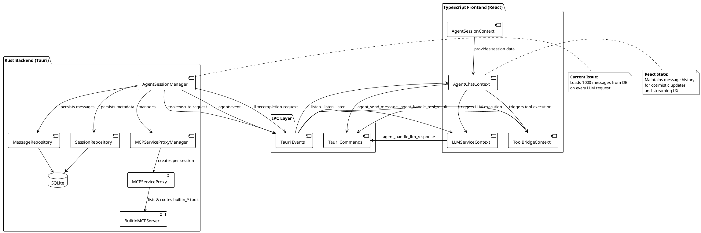
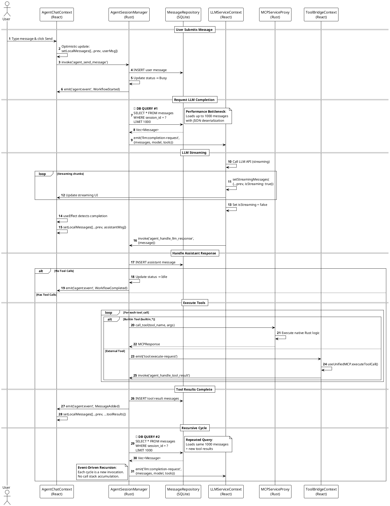
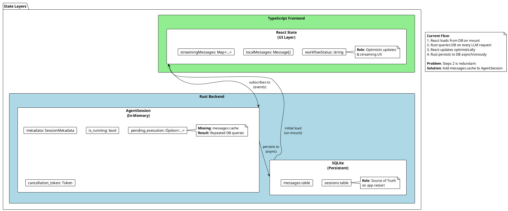
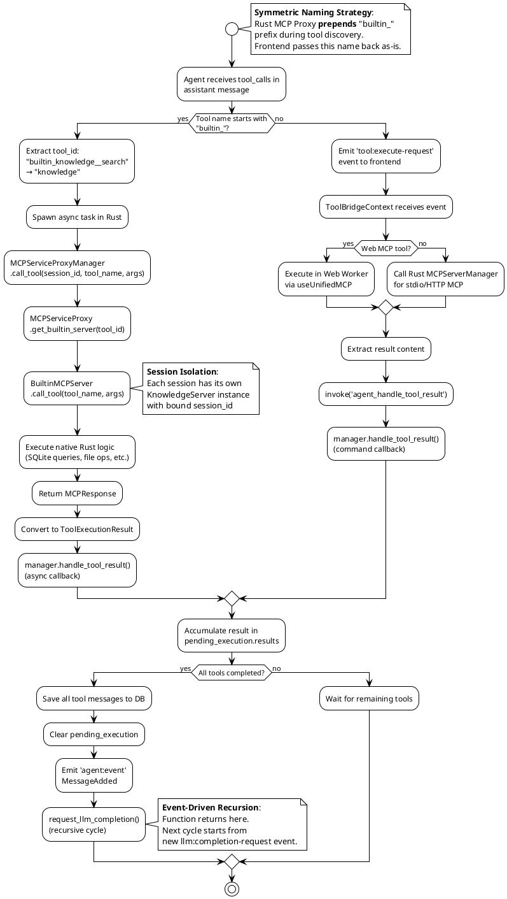
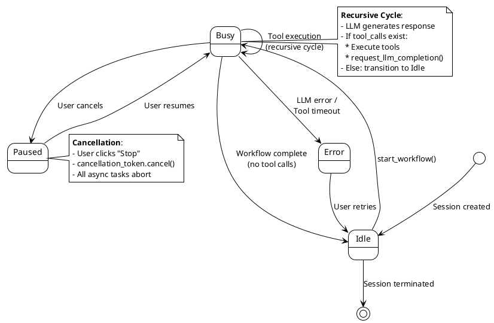

# LibrAgent Agent Workflow Architecture

**Status**: Production (v0.4.0)  
**Last Updated**: 2024-12-28  
**Scope**: Complete system architecture with current implementation details

---

## Executive Summary

LibrAgent implements a **Dual-Backend Hybrid Architecture** where:

- **Rust Backend**: Orchestrates agent workflows, manages session state, and persists data to SQLite
- **TypeScript Frontend**: Executes LLM API calls, handles streaming UX, and bridges Web MCP tools
- **IPC Layer**: Event-driven communication via Tauri's command/event system

**Key Characteristics**:

- 🔄 **Event-Driven Orchestration**: No traditional loops - each cycle is triggered by events
- 🧩 **Session Isolation**: Per-session MCP proxies prevent cross-talk in multi-agent scenarios
- 📊 **Hybrid State Management**: Rust owns workflow state, React owns UI state, SQLite is the source of truth
- ⚡ **Performance Bottleneck**: Repeated DB queries on every LLM request (identified, solution planned)

---

## 1. Component Architecture

### 1.1 System Overview



### 1.2 Core Components

#### Rust Backend

| Component                  | File                                               | Responsibility                                                                                                                                  |
| -------------------------- | -------------------------------------------------- | ----------------------------------------------------------------------------------------------------------------------------------------------- |
| **AgentSessionManager**    | `src-tauri/src/agent/session_manager.rs`           | - Session lifecycle (create/resume/terminate)<br>- Workflow orchestration via events<br>- Message flow control<br>- Tool execution coordination |
| **MCPServiceProxyManager** | `src-tauri/src/mcp/proxy_manager.rs`               | - Per-session proxy creation<br>- Session isolation<br>- Builtin tool instance management<br>- External MCP coordination                        |
| **MCPServiceProxy**        | `src-tauri/src/mcp/proxy.rs`                       | - Tool routing (builtin vs external)<br>- Session-bound tool execution<br>- Service context collection                                          |
| **MessageRepository**      | `src-tauri/src/repositories/message_repository.rs` | - SQLite CRUD for messages<br>- Pagination queries<br>- JSON serialization/deserialization                                                      |
| **SessionRepository**      | `src-tauri/src/repositories/session_repository.rs` | - Session metadata persistence<br>- Status updates (Idle/Busy/Paused)                                                                           |

#### TypeScript Frontend

| Component               | File                                  | Responsibility                                                                                                                 |
| ----------------------- | ------------------------------------- | ------------------------------------------------------------------------------------------------------------------------------ |
| **AgentChatContext**    | `src/context/AgentChatContext.tsx`    | - React message state management<br>- Optimistic updates<br>- Event listening (agent:event)<br>- Streaming message merge       |
| **LLMServiceContext**   | `src/context/LLMServiceContext.tsx`   | - LLM API execution<br>- Streaming accumulation<br>- Event listening (llm:completion-request)<br>- Response forwarding to Rust |
| **ToolBridgeContext**   | `src/context/ToolBridgeContext.tsx`   | - External tool execution bridge<br>- Web MCP coordination<br>- Event listening (tool:execute-request)                         |
| **AgentSessionContext** | `src/context/AgentSessionContext.tsx` | - Session creation/resumption<br>- Initial message loading<br>- Agent config management                                        |

---

## 2. Message Flow Architecture

### 2.1 Complete Flow Sequence



### 2.2 Database Query Points (Current Bottleneck)

**Location**: `src-tauri/src/agent/session_manager.rs:884-969`

```rust
// Called on EVERY LLM request in the recursive loop
let message_repo = crate::state::get_message_repository();
let page = message_repo
    .get_page(&session_id, 1, 1000)  // 🚨 Loads up to 1000 messages
    .await
    .map_err(|e| format!("Failed to get session messages: {}", e))?;
```

**Impact Analysis**:

| Scenario               | DB Queries | Messages Loaded | Est. Latency |
| ---------------------- | ---------- | --------------- | ------------ |
| Simple chat (no tools) | 1          | 1000            | 10-30ms      |
| 1 tool call            | 2          | 2000            | 20-60ms      |
| 3 tool calls           | 4          | 4000            | 40-120ms     |
| 10-turn conversation   | 10+        | 10,000+         | 100-300ms    |

**Query Breakdown**:

1. User sends message → DB Query #1 (load history)
2. LLM calls tool → Tool executes → DB Query #2 (reload history + tool result)
3. LLM calls 2nd tool → Tool executes → DB Query #3 (reload history + 2 tool results)
4. Final response → Workflow complete

**Why This Happens**:

- `AgentSession` struct has no `messages` field
- Every `request_llm_completion()` call re-loads from SQLite
- No in-memory cache for active sessions

---

## 3. State Management Architecture

### 3.1 Data Ownership Model



### 3.2 React State Synchronization

**Component**: `AgentChatContext.tsx:121-276`

**State Update Sources**:

1. **Initial Load** (Line 121-138):

   ```typescript
   useEffect(() => {
     setLocalMessages(sessionMessages || []);
   }, [sessionMessages, currentSession?.id]);
   ```

   - Source: SQLite via `AgentSessionContext`
   - Trigger: Session mount/change

2. **Optimistic Update** (Line 291-353):

   ```typescript
   const submit = async (content: string) => {
     const userMessage = createMessage(content);
     setLocalMessages((prev) => [...prev, userMessage]); // Immediate
     await invoke('agent_send_message', { message: userMessage });
   };
   ```

   - Source: User input
   - Trigger: Send button click

3. **Streaming Completion** (Line 144-176):

   ```typescript
   useEffect(() => {
     if (currentStreamingMessage?.isStreaming === false) {
       const exists = localMessages.some((m) => m.id === messageId);
       if (!exists) {
         setLocalMessages((prev) => [...prev, currentStreamingMessage]);
       }
     }
   }, [currentStreamingMessage]);
   ```

   - Source: `LLMServiceContext.streamingMessages`
   - Trigger: `isStreaming: false` flag

4. **Tool Results** (Line 192-276):

   ```typescript
   if (eventType === 'MessageAdded') {
     const newMessage = payload.message as Message;
     setLocalMessages((prev) => {
       if (prev.some((m) => m.id === newMessage.id)) return prev;
       return [...prev, newMessage];
     });
   }
   ```

   - Source: `agent:event` from Rust
   - Trigger: Tool execution completion

**Key Principle**: React state is authoritative during active workflow. No DB reload happens until session remount.

---

## 4. Tool Execution Architecture

### 4.1 Tool Routing Flow



### 4.2 Session Isolation Mechanism

**Per-Session MCP Proxy Pattern**:

```rust
// src-tauri/src/mcp/proxy_manager.rs
pub struct MCPServiceProxyManager {
    proxies: Arc<RwLock<HashMap<String, Arc<MCPServiceProxy>>>>,
    // Key: session_id, Value: session-specific proxy
}

pub struct MCPServiceProxy {
    session_id: String,
    builtin_servers: HashMap<String, Box<dyn BuiltinMCPServer>>,
    // Each session has independent builtin tool instances
}
```

**Multi-Agent Isolation Example**:

```
Session A (Code Review Agent):
  ├─ KnowledgeServer (session_id: "session-a")
  ├─ PlanningServer (session_id: "session-a")
  └─ WorkspaceServer (session_id: "session-a")

Session B (Documentation Agent):
  ├─ KnowledgeServer (session_id: "session-b")
  ├─ PlanningServer (session_id: "session-b")
  └─ PlaybookServer (session_id: "session-b")

✅ No interference: Each proxy has independent tool instances
✅ DB isolation: Queries filter by session_id
✅ Concurrent execution: Both workflows run in parallel
```

---

## 5. Session State Machine

### 5.1 Status Transitions



### 5.2 Status Update Locations

| Status     | Set Location                     | Database Update | Event Emitted       |
| ---------- | -------------------------------- | --------------- | ------------------- |
| **Idle**   | `create_session()` L59-109       | Yes             | None                |
| **Busy**   | `start_workflow()` L136-139      | Yes             | `WorkflowStarted`   |
| **Idle**   | `handle_llm_response()` L214-226 | Yes             | `WorkflowCompleted` |
| **Idle**   | `handle_llm_error()` L751-766    | Yes             | `WorkflowError`     |
| **Paused** | `terminate_session()` L768-811   | Yes             | `WorkflowCompleted` |

---

## 6. Performance Analysis

### 6.1 Current Bottleneck: Repeated DB Queries

**Profiling Data** (Estimated):

```
User sends message: "Search for React hooks and summarize"
│
├─ Step 1: User message submitted
│   └─ DB Query #1: SELECT * FROM messages LIMIT 1000
│       Time: 15ms (500 messages × 30μs each)
│       Data: 1.5MB JSON
│
├─ Step 2: LLM responds with tool_call: search_tool
│   Tool executes...
│   └─ DB Query #2: SELECT * FROM messages LIMIT 1000
│       Time: 18ms (501 messages including tool result)
│       Data: 1.52MB JSON
│
├─ Step 3: LLM responds with tool_call: summarize_tool
│   Tool executes...
│   └─ DB Query #3: SELECT * FROM messages LIMIT 1000
│       Time: 21ms (502 messages)
│       Data: 1.54MB JSON
│
└─ Step 4: LLM generates final response
    └─ No more tool calls → Workflow complete

Total DB query time: 54ms
Total data transferred: 4.56MB
Messages loaded: 1503 (with duplicates)
Unique messages: 503
Redundant loads: 1000 (66% waste)
```

### 6.2 Proposed Solution: In-Memory Cache

**Architecture Change**:

```rust
// Current (❌ Inefficient)
pub struct AgentSession {
    pub metadata: SessionMetadata,
    pub is_running: bool,
    pub cancellation_token: CancellationToken,
    pub pending_execution: Option<PendingToolExecution>,
    // ❌ No message cache
}

// Proposed (✅ Optimized)
pub struct AgentSession {
    pub metadata: SessionMetadata,
    pub is_running: bool,
    pub cancellation_token: CancellationToken,
    pub pending_execution: Option<PendingToolExecution>,
    pub messages: Arc<RwLock<Vec<Message>>>,  // ✅ In-memory cache
}
```

**Performance Improvement Estimate**:

| Metric                         | Current | With Cache | Improvement |
| ------------------------------ | ------- | ---------- | ----------- |
| DB Queries per 3-tool workflow | 4       | 1          | -75%        |
| Data transferred               | 4.56MB  | 1.5MB      | -67%        |
| Query latency (total)          | 54ms    | 15ms       | -72%        |
| Memory usage per session       | ~100KB  | ~2MB       | +1900KB     |

**Memory Management Strategy**:

- **Sliding Window**: Limit cache to 1000 most recent messages
- **Automatic Cleanup**: Clear cache when session terminates
- **Memory Footprint**: 2KB per message × 1000 = 2MB per session (acceptable)

---

## 7. Code Reference Index

### 7.1 Key Functions by Component

#### AgentSessionManager (`src-tauri/src/agent/session_manager.rs`)

| Function                 | Lines   | Description                                                   |
| ------------------------ | ------- | ------------------------------------------------------------- |
| `create_session`         | 59-109  | Create new session, initialize MCP proxy                      |
| `start_workflow`         | 113-163 | Entry point for user message submission                       |
| `request_llm_completion` | 884-969 | **🚨 DB Query Location** - Load messages and emit LLM request |
| `handle_llm_response`    | 166-435 | Parse tool calls, execute tools, handle recursion             |
| `handle_tool_result`     | 612-742 | Accumulate tool results, trigger next cycle                   |
| `terminate_session`      | 768-811 | Cancel workflow, update status, emit event                    |

#### AgentChatContext (`src/context/AgentChatContext.tsx`)

| Function/Hook                      | Lines   | Description                                          |
| ---------------------------------- | ------- | ---------------------------------------------------- |
| `submit`                           | 291-353 | User message submission with optimistic update       |
| `useMemo` (displayMessages)        | 121-138 | Merge persisted + streaming messages                 |
| `useEffect` (streaming completion) | 144-176 | Detect `isStreaming: false` and persist              |
| `useEffect` (event listener)       | 192-276 | Handle agent:event (MessageAdded, WorkflowCompleted) |

#### LLMServiceContext (`src/context/LLMServiceContext.tsx`)

| Function/Hook              | Lines   | Description                       |
| -------------------------- | ------- | --------------------------------- |
| `executeCompletionRequest` | 167-370 | LLM API call with streaming       |
| `useEffect` (event setup)  | 382-503 | Listen for llm:completion-request |

### 7.2 Event Flow Map

| Event Name               | Emitter             | Listener          | Payload                               | Purpose                      |
| ------------------------ | ------------------- | ----------------- | ------------------------------------- | ---------------------------- |
| `agent:event`            | AgentSessionManager | AgentChatContext  | `{eventType, sessionId, ...}`         | Status updates, tool results |
| `llm:completion-request` | AgentSessionManager | LLMServiceContext | `{sessionId, messages, model, tools}` | Trigger LLM execution        |
| `tool:execute-request`   | AgentSessionManager | ToolBridgeContext | `{sessionId, toolName, args}`         | Execute external tools       |

### 7.3 Database Schema References

**messages table** (`src-tauri/src/repositories/message_repository.rs:106-207`):

```sql
CREATE TABLE messages (
    id TEXT PRIMARY KEY,
    session_id TEXT NOT NULL,
    role TEXT NOT NULL,
    content TEXT,              -- JSON: [{ type, text/data/uri }]
    tool_calls TEXT,           -- JSON: [{ id, type, function: {name, arguments} }]
    name TEXT,
    tool_call_id TEXT,
    created_at INTEGER,
    FOREIGN KEY (session_id) REFERENCES sessions(id) ON DELETE CASCADE
)
```

**sessions table** (`src-tauri/src/repositories/session_repository.rs:93-142`):

```sql
CREATE TABLE sessions (
    id TEXT PRIMARY KEY,
    name TEXT,
    status TEXT NOT NULL,      -- "Idle" | "Busy" | "Paused"
    agent_config TEXT,          -- JSON: AgentConfig
    created_at INTEGER,
    updated_at INTEGER
)
```

---

## 8. Migration Path to Optimized Architecture

### 8.1 Implementation Phases

**Phase 1: Core Architecture** (High Priority)

- [ ] Add `messages: Arc<RwLock<Vec<Message>>>` to `AgentSession`
- [ ] Implement `init_session_with_messages()` to load on creation
- [ ] Modify `request_llm_completion()` to read from cache
- [ ] Update message on `handle_llm_response()` and `handle_tool_result()`
- [ ] Write unit tests for cache consistency

**Phase 2: Event Emission** (High Priority)

- [ ] Emit `MessageAdded` event after tool result storage
- [ ] Update `AgentChatContext` to handle tool result events
- [ ] Remove DB reload dependencies in frontend

**Phase 3: Memory Management** (Medium Priority)

- [ ] Implement sliding window (max 1000 messages)
- [ ] Add cache invalidation on session resume
- [ ] Memory profiling and optimization

**Phase 4: Advanced Features** (Low Priority)

- [ ] Add timeout monitoring for tool executions
- [ ] Implement circuit breaker for failing tools
- [ ] Add retry logic with exponential backoff

### 8.2 Backward Compatibility

**Guarantee**: This refactoring maintains 100% API compatibility:

- ✅ No changes to Tauri commands (`agent_send_message`, etc.)
- ✅ No changes to event payloads
- ✅ No database schema migration required
- ✅ Frontend code continues working as-is

**Migration Strategy**: Purely internal optimization - no user-facing changes.

---

## 9. Summary

### Current Architecture Strengths

- ✅ Clean separation: Rust orchestrates, TS executes
- ✅ Event-driven pattern prevents tight coupling
- ✅ Session isolation enables multi-agent workflows
- ✅ Streaming UX with optimistic updates

### Identified Weaknesses

- ❌ **Repeated DB queries** (54ms overhead per 3-tool workflow)
- ❌ No timeout for long-running tools
- ❌ No circuit breaker for failing tools
- ❌ Memory usage not tracked

### Optimization Impact

- **Performance**: 72% reduction in DB query latency
- **Memory**: +2MB per active session (acceptable trade-off)
- **Complexity**: Minimal - cache is transparent to frontend

## 10. Rust ↔ TypeScript Integration Guidelines

### 10.1 Critical Naming Conventions

**CRITICAL**: Rust and TypeScript use different naming conventions. Violating these causes silent failures.

#### Event Type Naming (Serde Configuration)

**Rust Side** (`src-tauri/src/agent/events.rs`):

```rust
#[derive(Clone, Debug, Serialize, Deserialize)]
#[serde(tag = "type", rename_all = "camelCase")]  // ⚠️ CRITICAL: camelCase conversion
pub enum AgentEvent {
    WorkflowStarted { session_id: String },      // → JSON: "workflowStarted"
    WorkflowCompleted { session_id: String },    // → JSON: "workflowCompleted"
    WorkflowError { session_id: String, error: String }, // → JSON: "workflowError"
    StatusChanged { session_id: String, status: SessionStatus }, // → JSON: "statusChanged"
    MessageAdded { session_id: String, message: Box<Message> }, // → JSON: "messageAdded"
    ToolExecutionStarted { session_id: String, tool_name: String }, // → JSON: "toolExecutionStarted"
    ToolExecutionCompleted { session_id: String, tool_name: String, success: bool }, // → JSON: "toolExecutionCompleted"
}
```

**TypeScript Side** (`src/context/AgentChatContext.tsx`):

```typescript
// ✅ CORRECT: Use camelCase to match Rust's serde output
const eventType = payload.type as string;

if (eventType === 'workflowStarted') {        // ✅ camelCase
} else if (eventType === 'statusChanged') {    // ✅ camelCase
} else if (eventType === 'messageAdded') {     // ✅ camelCase
} else if (eventType === 'workflowCompleted') { // ✅ camelCase
} else if (eventType === 'workflowError') {    // ✅ camelCase
}

// ❌ WRONG: PascalCase will NEVER match
if (eventType === 'WorkflowStarted') {  // ❌ Never matches!
```

**Common Mistake**: Using PascalCase in TypeScript to match Rust enum variant names.

- Rust enum: `MessageAdded` → JSON: `"messageAdded"` (serde converts)
- TypeScript check: `'MessageAdded'` → **FAIL** (no match)
- Correct check: `'messageAdded'` → **SUCCESS**

#### Field Name Normalization

**Rust sends** (via serde `rename_all = "camelCase"`):

```json
{
  "sessionId": "abc123",
  "toolCallId": "call_xyz",
  "createdAt": 1234567890
}
```

**TypeScript receives** (defensive normalization):

```typescript
// ✅ BEST PRACTICE: Support both naming conventions
const newMessage: Message = {
  sessionId: (rawMessage.sessionId || rawMessage.session_id) as string,
  tool_call_id: (rawMessage.toolCallId || rawMessage.tool_call_id) as
    | string
    | undefined,
  created_at: rawMessage.createdAt || rawMessage.created_at,
  // ... other fields
};
```

**Why defensive?** Some Rust structs may not have serde rename configured.

---

### 10.2 Component Isolation Rules

**CRITICAL**: Agent V2 and Legacy V1 components must NOT share context providers.

#### Forbidden Cross-Dependencies

❌ **WRONG**: Agent V2 component using Legacy V1 dependency

```typescript
// src/features/agent/components/AgentToolCallGroup.tsx
import { ToolCallDetails } from '@/features/chat/ToolCallDetails'; // ❌ V1 component
// This imports MessageRenderer → ChatContext → CRASH!
```

✅ **CORRECT**: Use V2-specific components

```typescript
// src/features/agent/components/AgentToolCallGroup.tsx
import { AgentToolCallDetails } from './AgentToolCallDetails'; // ✅ V2 component
// Uses AgentMessageRenderer → AgentChatContext → Works!
```

#### Component Dependency Tree

**Legacy V1 Stack** (do NOT use in Agent V2):

```
ChatContainer (V1)
  └─ MessageRenderer
      └─ useChatActions()
          └─ ChatContext (V1)  ← ❌ Not available in Agent V2
```

**Agent V2 Stack** (use these):

```
AgentContainer (V2)
  └─ AgentMessageRenderer
      └─ useAgentChatActions()
          └─ AgentChatContext (V2)  ← ✅ Correct context
```

**Checklist for New Components**:

1. Does it import from `@/features/chat/*`? → ❌ Legacy V1
2. Does it import from `@/components/MessageRenderer`? → ❌ Legacy V1
3. Does it use `useChatActions()` or `useChatState()`? → ❌ Legacy V1
4. Does it use `useAgentChatActions()` or `useAgentChatState()`? → ✅ Agent V2
5. Does it import from `@/features/agent/components/*`? → ✅ Agent V2

---

### 10.3 Event Emission Best Practices

#### Tauri 2.x Event Broadcasting

**CRITICAL**: Use `emit_to(EventTarget::app(), ...)` instead of `emit()`

```rust
use tauri::{AppHandle, Emitter};  // ⚠️ Must import Emitter trait

/// ❌ WRONG: Only sends to current window
pub fn emit_agent_event_wrong(app_handle: &AppHandle, event: AgentEvent) {
    app_handle.emit("agent:event", event);  // Only active window receives
}

/// ✅ CORRECT: Broadcasts to all webviews
pub fn emit_agent_event(app_handle: &AppHandle, event: AgentEvent) -> Result<(), String> {
    app_handle
        .emit_to(tauri::EventTarget::app(), "agent:event", event)  // All windows receive
        .map_err(|e| format!("Failed to emit agent event: {}", e))
}
```

**Reference**: [Tauri 2.x Event System Documentation](https://v2.tauri.app/develop/calling-frontend/)

---

### 10.4 Session ID Handling

**CRITICAL**: Always use defensive session ID extraction

```typescript
// ✅ CORRECT: Support both camelCase and snake_case
const sessionId = (payload.sessionId || payload.session_id) as string;

// Filter events by session
if (sessionId !== currentSession.id) {
  logger.warn('Event session ID mismatch, ignoring', {
    eventSessionId: sessionId,
    currentSessionId: currentSession.id,
  });
  return;
}
```

**Why?** Different Rust structs may use different serde configurations.

---

### 10.5 Message Structure Normalization

**Frontend Pattern** (AgentChatContext.tsx):

```typescript
// Raw message from Rust (Box<Message> serialized)
const rawMessage = payload.message as Record<string, unknown>;

// Normalize ALL snake_case → camelCase mappings
const newMessage: Message = {
  ...(rawMessage as unknown as Message),
  sessionId: (rawMessage.sessionId || rawMessage.session_id) as string,
  tool_calls: rawMessage.toolCalls || rawMessage.tool_calls,
  tool_call_id: (rawMessage.toolCallId || rawMessage.tool_call_id) as
    | string
    | undefined,
  tool_use: rawMessage.toolUse || rawMessage.tool_use,
  is_streaming: rawMessage.isStreaming ?? rawMessage.is_streaming,
  thinking_signature: (rawMessage.thinkingSignature ||
    rawMessage.thinking_signature) as string | undefined,
  assistant_id: (rawMessage.assistantId || rawMessage.assistant_id) as
    | string
    | undefined,
  created_at: rawMessage.createdAt || rawMessage.created_at,
  updated_at: rawMessage.updatedAt || rawMessage.updated_at,
} as Message;
```

**Rust Side Best Practice**:

```rust
#[derive(Serialize, Deserialize)]
#[serde(rename_all = "camelCase")]  // ⚠️ Always add this for frontend compatibility
pub struct Message {
    pub id: String,
    pub session_id: String,  // → Sent as "sessionId"
    pub tool_call_id: Option<String>,  // → Sent as "toolCallId"
    // ...
}
```

---

### 10.6 Debugging Integration Issues

#### Symptom: Events Not Received

**Check 1**: Event type case mismatch

```bash
# Rust log: "Emitted event: messageAdded"
# TypeScript: if (eventType === 'MessageAdded')  ← ❌ MISMATCH
```

**Fix**: Use camelCase in TypeScript to match serde output.

**Check 2**: Tauri emit method

```rust
// ❌ Only current window: app_handle.emit(...)
// ✅ All windows: app_handle.emit_to(EventTarget::app(), ...)
```

**Check 3**: Session ID filtering

```typescript
// Is frontend filtering out events due to session ID mismatch?
logger.info('Event received BEFORE filter', {
  eventSessionId,
  currentSessionId,
});
```

#### Symptom: "useChatActions must be used within ChatProvider"

**Root Cause**: Legacy V1 component imported into Agent V2 tree

**Fix**: Create Agent V2-specific version of the component

```bash
# Example: ToolCallDetails (V1) → AgentToolCallDetails (V2)
src/features/chat/ToolCallDetails.tsx          # V1 (uses MessageRenderer + ChatContext)
src/features/agent/components/AgentToolCallDetails.tsx  # V2 (uses AgentMessageRenderer + AgentChatContext)
```

---

### 10.7 Testing Checklist

Before merging any Rust ↔ TypeScript integration changes:

- [ ] Verify serde `rename_all = "camelCase"` on all event structs
- [ ] Check TypeScript event handlers use camelCase (not PascalCase)
- [ ] Confirm `emit_to(EventTarget::app(), ...)` for broadcasts
- [ ] Test with multiple tool calls (recursive workflow)
- [ ] Verify no legacy V1 imports in Agent V2 components
- [ ] Check session ID normalization in event handlers
- [ ] Test with browser DevTools Network tab (WebSocket events visible)
- [ ] Run `pnpm lint` and `pnpm build` successfully

---

### 10.8 Common Pitfalls Reference

| Pitfall                     | Symptom                | Fix                                       |
| --------------------------- | ---------------------- | ----------------------------------------- |
| PascalCase event check      | Events never matched   | Use camelCase: `'messageAdded'`           |
| Missing Emitter trait       | `emit_to` not found    | Add `use tauri::Emitter;`                 |
| Legacy V1 import            | ChatProvider error     | Create V2-specific component              |
| Session ID mismatch         | All events filtered    | Support both: `sessionId \|\| session_id` |
| Field name typo             | Undefined field access | Use defensive: `field1 \|\| field2`       |
| emit() instead of emit_to() | Single window only     | Use `emit_to(EventTarget::app(), ...)`    |

---

**Document Version**: 1.1
**Related Documents**:

- [idea.md](../../idea.md) - High-level architecture vision
- [elaborated_idea.md](../../elaborated_idea.md) - Dual-track migration strategy
- [refactoring_20241228_2330.md](../history/refactoring_20241228_2330.md) - Implementation plan

**Maintainer**: @fritzprix
**Last Audit**: 2024-12-28
**Last Updated**: 2024-12-28 (Added Section 10: Integration Guidelines)
