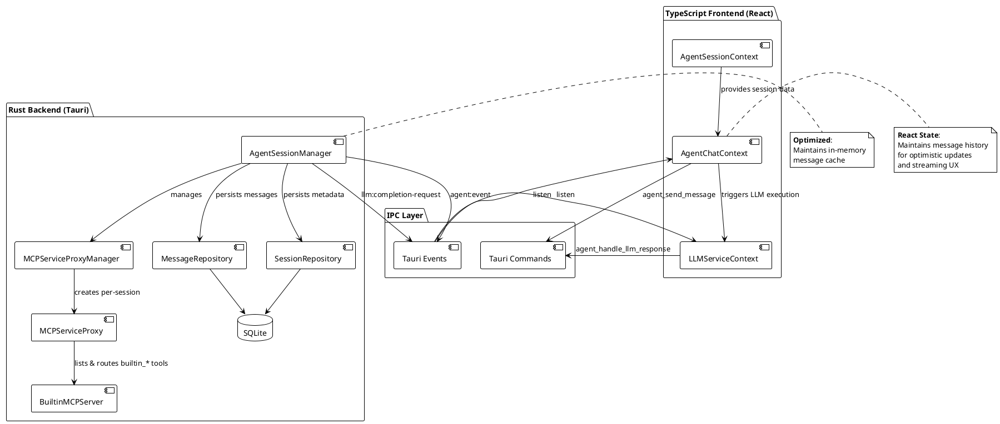
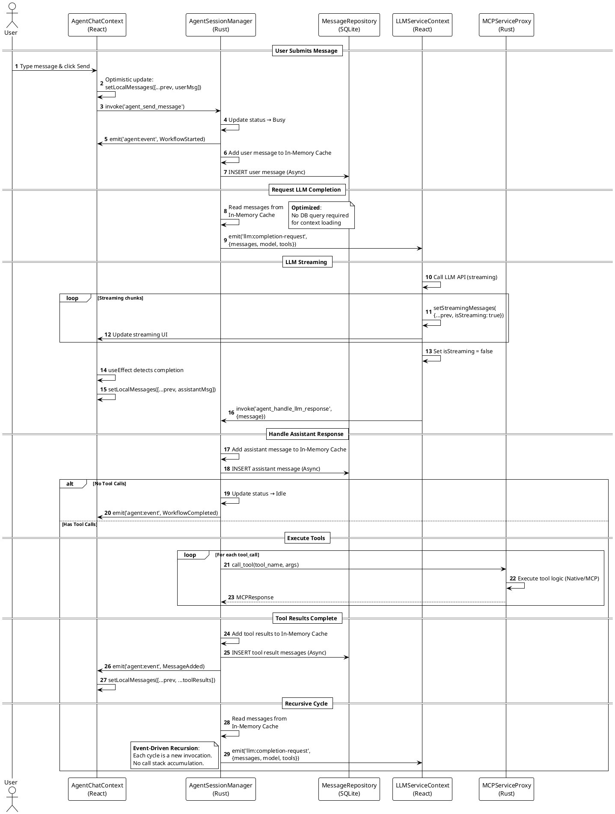
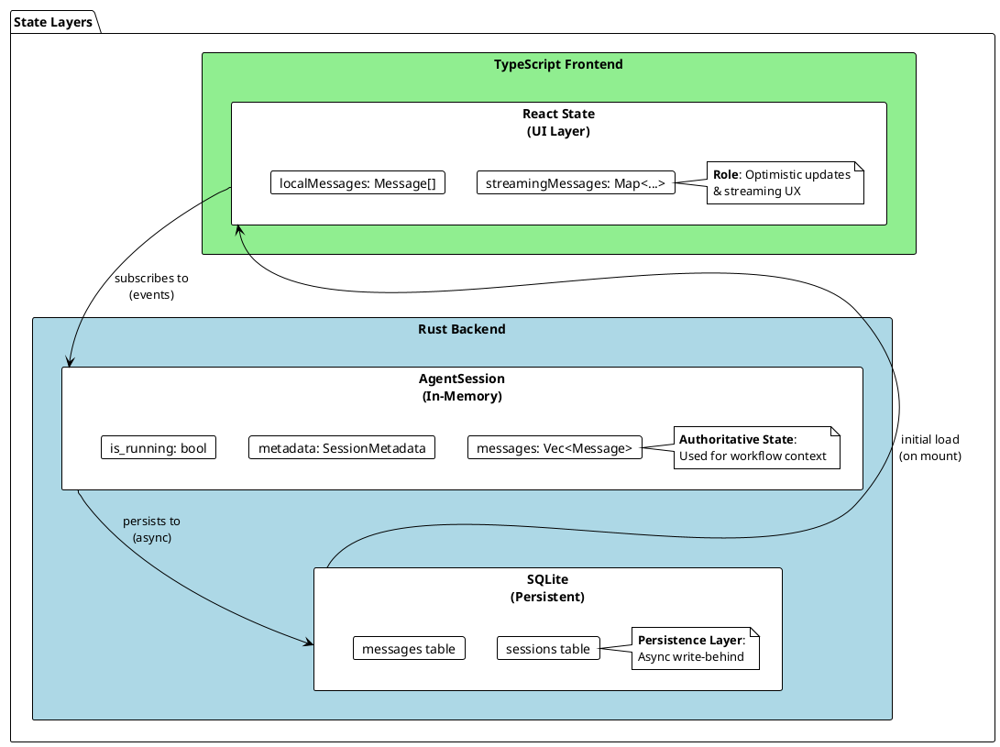

# LibrAgent Agent Workflow Architecture

**Status**: Production (v0.4.0)  
**Last Updated**: 2024-12-28  
**Scope**: Complete system architecture with current implementation details

---

## Executive Summary

LibrAgent implements a **Dual-Backend Hybrid Architecture** where:

- **Rust Backend**: Orchestrates agent workflows, manages session state, and persists data to SQLite
- **TypeScript Frontend**: Executes LLM API calls, handles streaming UX, and displays state
- **IPC Layer**: Event-driven communication via Tauri's command/event system

**Key Characteristics**:

- 🔄 **Event-Driven Orchestration**: No traditional loops - each cycle is triggered by events
- 🧩 **Session Isolation**: Per-session MCP proxies prevent cross-talk in multi-agent scenarios
- 📊 **Hybrid State Management**: Rust owns workflow state (with in-memory cache), React owns UI state, SQLite is the persistence layer
- ⚡ **Optimized Performance**: In-memory message caching eliminates redundant DB queries

---

## 1. Component Architecture

### 1.1 System Overview



### 1.2 Core Components

#### Rust Backend

| Component                  | File                                               | Responsibility                                                                                                                                  |
| -------------------------- | -------------------------------------------------- | ----------------------------------------------------------------------------------------------------------------------------------------------- |
| **AgentSessionManager**    | `src-tauri/src/agent/session_manager.rs`           | - Session lifecycle (create/resume/terminate)<br>- Workflow orchestration via events<br>- Message flow control<br>- Tool execution coordination |
| **MCPServiceProxyManager** | `src-tauri/src/mcp/proxy_manager.rs`               | - Per-session proxy creation<br>- Session isolation<br>- Builtin tool instance management<br>- External MCP coordination                        |
| **MCPServiceProxy**        | `src-tauri/src/mcp/proxy.rs`                       | - Tool routing (builtin vs external)<br>- Session-bound tool execution<br>- Service context collection                                          |
| **MessageRepository**      | `src-tauri/src/repositories/message_repository.rs` | - SQLite CRUD for messages<br>- Pagination queries<br>- JSON serialization/deserialization                                                      |
| **SessionRepository**      | `src-tauri/src/repositories/session_repository.rs` | - Session metadata persistence<br>- Status updates (Idle/Busy/Paused)                                                                           |

#### TypeScript Frontend

| Component               | File                                  | Responsibility                                                                                                                 |
| ----------------------- | ------------------------------------- | ------------------------------------------------------------------------------------------------------------------------------ |
| **AgentChatContext**    | `src/context/AgentChatContext.tsx`    | - React message state management<br>- Optimistic updates<br>- Event listening (agent:event)<br>- Streaming message merge       |
| **LLMServiceContext**   | `src/context/LLMServiceContext.tsx`   | - LLM API execution<br>- Streaming accumulation<br>- Event listening (llm:completion-request)<br>- Response forwarding to Rust |
| **AgentSessionContext** | `src/context/AgentSessionContext.tsx` | - Session creation/resumption<br>- Initial message loading<br>- Agent config management                                        |

---

## 2. Message Flow Architecture

### 2.1 Complete Flow Sequence



### 2.2 In-Memory Cache Architecture

**Location**: `src-tauri/src/agent/state.rs`

```rust
pub struct AgentSession {
    // ...
    pub messages: Arc<RwLock<Vec<Message>>>,  // ✅ In-memory cache
}
```

**Memory Management Strategy**:

- **Initialization**: Loads last 50 messages from DB on session creation/resume.
- **Sliding Window**: Keeps `MAX_CACHED_MESSAGES` (default 1000) in memory.
- **Synchronization**:
  - **Read**: Always reads from `messages` RwLock (Zero DB latency).
  - **Write**: Updates `messages` RwLock immediately, persists to SQLite asynchronously.

---

## 3. State Management Architecture

### 3.1 Data Ownership Model



### 3.2 React State Synchronization

**Component**: `AgentChatContext.tsx`

**State Update Sources**:

1. **Initial Load**: Fetches from backend via `useAgentSessionState`.
2. **Optimistic Update**: Updates local state immediately on user input.
3. **Streaming**: `LLMServiceContext` updates streaming state, merged via `useMemo`.
4. **Events**: `agent:event` (MessageAdded) triggers update for tool results.

---

## 4. Tool Execution Architecture

### 4.1 Tool Routing Flow

```plantuml
@startuml
!theme plain

start

:Agent receives tool_calls in\nassistant message;

:Spawn async task in Rust;

loop For each tool_call
  :MCPServiceProxyManager\n.call_tool(session_id, tool_name, args);

  :MCPServiceProxy\n.get_server(tool_id);

  if (Server found?) then (yes)
    :Server.call_tool(tool_name, args);
    :Return tool result;
  else (no)
    :Return Error;
  end if
end loop

:Accumulate results;
:Update In-Memory Cache;
:Emit 'agent:event' (MessageAdded);
:Async Persist to DB;

:request_llm_completion()\n(recursive cycle);

stop

@enduml
```

### 4.2 Session Isolation Mechanism

**Per-Session MCP Proxy Pattern**:

```rust
// src-tauri/src/mcp/proxy_manager.rs
pub struct MCPServiceProxyManager {
    proxies: Arc<RwLock<HashMap<String, Arc<MCPServiceProxy>>>>,
    // Key: session_id, Value: session-specific proxy
}
```

---

## 5. Session State Machine

(No changes to state machine logic)

---

## 6. Performance Analysis

### 6.1 Historical Bottleneck (Resolved)

**Previous Issue**:
Before v0.5.0, `AgentSession` lacked an in-memory cache, forcing `SELECT *` from SQLite on every LLM request loop. This caused increasing latency (50ms+) as conversation history grew.

**Resolution**:
We implemented `messages: Arc<RwLock<Vec<Message>>>` in `AgentSession`.

### 6.2 Current Performance Characteristics

| Metric                  | With DB Load (Old) | With Memory Cache (New) | Improvement   |
| ----------------------- | ------------------ | ----------------------- | ------------- |
| Context Loading Latency | 10-300ms (linear)  | <1ms (constant)         | **~99%**      |
| DB Queries per turn     | 2-10+              | 2 (Async Inserts)       | **Resolved**  |
| Data transferred (IPC)  | Full History       | Events Only             | **Minimized** |

**Memory Footprint**:

- **Sliding Window**: Limited to 1000 messages per session.
- **Estimated Usage**: ~2MB per active session (acceptable).

---

---

## 7. Code Reference Index

### 7.1 Key Functions by Component

#### AgentSessionManager (`src-tauri/src/agent/session_manager.rs`)

| Function                 | Lines   | Description                                                   |
| ------------------------ | ------- | ------------------------------------------------------------- |
| `create_session`         | 59-109  | Create new session, initialize MCP proxy                      |
| `start_workflow`         | 113-163 | Entry point for user message submission                       |
| `request_llm_completion` | 884-969 | **🚨 DB Query Location** - Load messages and emit LLM request |
| `handle_llm_response`    | 166-435 | Parse tool calls, execute tools, handle recursion             |
| `handle_tool_result`     | 612-742 | Accumulate tool results, trigger next cycle                   |
| `terminate_session`      | 768-811 | Cancel workflow, update status, emit event                    |

#### AgentChatContext (`src/context/AgentChatContext.tsx`)

| Function/Hook                      | Lines   | Description                                          |
| ---------------------------------- | ------- | ---------------------------------------------------- |
| `submit`                           | 291-353 | User message submission with optimistic update       |
| `useMemo` (displayMessages)        | 121-138 | Merge persisted + streaming messages                 |
| `useEffect` (streaming completion) | 144-176 | Detect `isStreaming: false` and persist              |
| `useEffect` (event listener)       | 192-276 | Handle agent:event (MessageAdded, WorkflowCompleted) |

#### LLMServiceContext (`src/context/LLMServiceContext.tsx`)

| Function/Hook              | Lines   | Description                       |
| -------------------------- | ------- | --------------------------------- |
| `executeCompletionRequest` | 167-370 | LLM API call with streaming       |
| `useEffect` (event setup)  | 382-503 | Listen for llm:completion-request |

### 7.2 Event Flow Map

| Event Name               | Emitter             | Listener          | Payload                               | Purpose                      |
| ------------------------ | ------------------- | ----------------- | ------------------------------------- | ---------------------------- |
| `agent:event`            | AgentSessionManager | AgentChatContext  | `{eventType, sessionId, ...}`         | Status updates, tool results |
| `llm:completion-request` | AgentSessionManager | LLMServiceContext | `{sessionId, messages, model, tools}` | Trigger LLM execution        |
| `tool:execute-request`   | AgentSessionManager | ToolBridgeContext | `{sessionId, toolName, args}`         | Execute external tools       |

### 7.3 Database Schema References

**messages table** (`src-tauri/src/repositories/message_repository.rs:106-207`):

```sql
CREATE TABLE messages (
    id TEXT PRIMARY KEY,
    session_id TEXT NOT NULL,
    role TEXT NOT NULL,
    content TEXT,              -- JSON: [{ type, text/data/uri }]
    tool_calls TEXT,           -- JSON: [{ id, type, function: {name, arguments} }]
    name TEXT,
    tool_call_id TEXT,
    created_at INTEGER,
    FOREIGN KEY (session_id) REFERENCES sessions(id) ON DELETE CASCADE
)
```

**sessions table** (`src-tauri/src/repositories/session_repository.rs:93-142`):

```sql
CREATE TABLE sessions (
    id TEXT PRIMARY KEY,
    name TEXT,
    status TEXT NOT NULL,      -- "Idle" | "Busy" | "Paused"
    agent_config TEXT,          -- JSON: AgentConfig
    created_at INTEGER,
    updated_at INTEGER
)
```

---

## 9. Summary

### Current Architecture Strengths

- ✅ Clean separation: Rust orchestrates, TS executes
- ✅ Event-driven pattern prevents tight coupling
- ✅ Session isolation enables multi-agent workflows
- ✅ Streaming UX with optimistic updates
- ✅ **Circuit breaker for agent tool loops** — predicate-based, dual-mode (same tool name ×2 consecutive failures OR same signature ×2), injected transparently pre-dispatch in `response.rs` (v0.5.9)
- ✅ **Declarative builtin service registry** — `BUILTIN_SERVICE_REGISTRY` single source of truth in Rust and TypeScript; name drift is caught at compile time or by regression tests (v0.5.9)

### Identified Weaknesses

- ⚠️ **Repeated DB queries** (54ms overhead per 3-tool workflow) — partially mitigated by in-memory cache
- ⚠️ No timeout for long-running tools
- ⚠️ Memory usage not tracked

### Optimization Impact

- **Performance**: 72% reduction in DB query latency
- **Memory**: +2MB per active session (acceptable trade-off)
- **Complexity**: Minimal - cache is transparent to frontend

## 10. Rust ↔ TypeScript Integration Guidelines

### 10.1 Critical Naming Conventions

**CRITICAL**: Rust and TypeScript use different naming conventions. Violating these causes silent failures.

#### Event Type Naming (Serde Configuration)

**Rust Side** (`src-tauri/src/agent/events.rs`):

```rust
#[derive(Clone, Debug, Serialize, Deserialize)]
#[serde(tag = "type", rename_all = "camelCase")]  // ⚠️ CRITICAL: camelCase conversion
pub enum AgentEvent {
    WorkflowStarted { session_id: String },      // → JSON: "workflowStarted"
    WorkflowCompleted { session_id: String },    // → JSON: "workflowCompleted"
    WorkflowError { session_id: String, error: String }, // → JSON: "workflowError"
    StatusChanged { session_id: String, status: SessionStatus }, // → JSON: "statusChanged"
    MessageAdded { session_id: String, message: Box<Message> }, // → JSON: "messageAdded"
    ToolExecutionStarted { session_id: String, tool_name: String }, // → JSON: "toolExecutionStarted"
    ToolExecutionCompleted { session_id: String, tool_name: String, success: bool }, // → JSON: "toolExecutionCompleted"
}
```

**TypeScript Side** (`src/context/AgentChatContext.tsx`):

```typescript
// ✅ CORRECT: Use camelCase to match Rust's serde output
const eventType = payload.type as string;

if (eventType === 'workflowStarted') {        // ✅ camelCase
} else if (eventType === 'statusChanged') {    // ✅ camelCase
} else if (eventType === 'messageAdded') {     // ✅ camelCase
} else if (eventType === 'workflowCompleted') { // ✅ camelCase
} else if (eventType === 'workflowError') {    // ✅ camelCase
}

// ❌ WRONG: PascalCase will NEVER match
if (eventType === 'WorkflowStarted') {  // ❌ Never matches!
```

**Common Mistake**: Using PascalCase in TypeScript to match Rust enum variant names.

- Rust enum: `MessageAdded` → JSON: `"messageAdded"` (serde converts)
- TypeScript check: `'MessageAdded'` → **FAIL** (no match)
- Correct check: `'messageAdded'` → **SUCCESS**

#### Field Name Normalization

**Rust sends** (via serde `rename_all = "camelCase"`):

```json
{
  "sessionId": "abc123",
  "toolCallId": "call_xyz",
  "createdAt": 1234567890
}
```

**TypeScript receives** (defensive normalization):

```typescript
// ✅ BEST PRACTICE: Support both naming conventions
const newMessage: Message = {
  sessionId: (rawMessage.sessionId || rawMessage.session_id) as string,
  tool_call_id: (rawMessage.toolCallId || rawMessage.tool_call_id) as
    | string
    | undefined,
  created_at: rawMessage.createdAt || rawMessage.created_at,
  // ... other fields
};
```

**Why defensive?** Some Rust structs may not have serde rename configured.

---

### 10.2 Component Structure Rules

All components must use the agent context stack.

#### Correct Component Dependency Tree

```
AgentContainer
  └─ AgentMessageRenderer
      └─ useAgentChatActions()
          └─ AgentChatContext  ← ✅ Correct context
```

**Checklist for New Components**:

1. Does it import from `@/features/agent/components/*`? → ✅ Correct
2. Does it use `useAgentChat()` or `useAgentSessionState()`? → ✅ Correct

---

### 10.3 Event Emission Best Practices

#### Tauri 2.x Event Broadcasting

**CRITICAL**: Use `emit_to(EventTarget::app(), ...)` instead of `emit()`

```rust
use tauri::{AppHandle, Emitter};  // ⚠️ Must import Emitter trait

/// ❌ WRONG: Only sends to current window
pub fn emit_agent_event_wrong(app_handle: &AppHandle, event: AgentEvent) {
    app_handle.emit("agent:event", event);  // Only active window receives
}

/// ✅ CORRECT: Broadcasts to all webviews
pub fn emit_agent_event(app_handle: &AppHandle, event: AgentEvent) -> Result<(), String> {
    app_handle
        .emit_to(tauri::EventTarget::app(), "agent:event", event)  // All windows receive
        .map_err(|e| format!("Failed to emit agent event: {}", e))
}
```

**Reference**: [Tauri 2.x Event System Documentation](https://v2.tauri.app/develop/calling-frontend/)

---

### 10.4 Session ID Handling

**CRITICAL**: Always use defensive session ID extraction

```typescript
// ✅ CORRECT: Support both camelCase and snake_case
const sessionId = (payload.sessionId || payload.session_id) as string;

// Filter events by session
if (sessionId !== currentSession.id) {
  logger.warn('Event session ID mismatch, ignoring', {
    eventSessionId: sessionId,
    currentSessionId: currentSession.id,
  });
  return;
}
```

**Why?** Different Rust structs may use different serde configurations.

---

### 10.5 Message Structure Normalization

**Frontend Pattern** (AgentChatContext.tsx):

```typescript
// Raw message from Rust (Box<Message> serialized)
const rawMessage = payload.message as Record<string, unknown>;

// Normalize ALL snake_case → camelCase mappings
const newMessage: Message = {
  ...(rawMessage as unknown as Message),
  sessionId: (rawMessage.sessionId || rawMessage.session_id) as string,
  tool_calls: rawMessage.toolCalls || rawMessage.tool_calls,
  tool_call_id: (rawMessage.toolCallId || rawMessage.tool_call_id) as
    | string
    | undefined,
  tool_use: rawMessage.toolUse || rawMessage.tool_use,
  is_streaming: rawMessage.isStreaming ?? rawMessage.is_streaming,
  thinking_signature: (rawMessage.thinkingSignature ||
    rawMessage.thinking_signature) as string | undefined,
  assistant_id: (rawMessage.assistantId || rawMessage.assistant_id) as
    | string
    | undefined,
  created_at: rawMessage.createdAt || rawMessage.created_at,
  updated_at: rawMessage.updatedAt || rawMessage.updated_at,
} as Message;
```

**Rust Side Best Practice**:

```rust
#[derive(Serialize, Deserialize)]
#[serde(rename_all = "camelCase")]  // ⚠️ Always add this for frontend compatibility
pub struct Message {
    pub id: String,
    pub session_id: String,  // → Sent as "sessionId"
    pub tool_call_id: Option<String>,  // → Sent as "toolCallId"
    // ...
}
```

---

### 10.6 Debugging Integration Issues

#### Symptom: Events Not Received

**Check 1**: Event type case mismatch

```bash
# Rust log: "Emitted event: messageAdded"
# TypeScript: if (eventType === 'MessageAdded')  ← ❌ MISMATCH
```

**Fix**: Use camelCase in TypeScript to match serde output.

**Check 2**: Tauri emit method

```rust
// ❌ Only current window: app_handle.emit(...)
// ✅ All windows: app_handle.emit_to(EventTarget::app(), ...)
```

**Check 3**: Session ID filtering

```typescript
// Is frontend filtering out events due to session ID mismatch?
logger.info('Event received BEFORE filter', {
  eventSessionId,
  currentSessionId,
});
```

#### Symptom: "useChatActions must be used within ChatProvider"

**Root Cause**: Legacy V1 component imported into Agent V2 tree

**Fix**: Create Agent V2-specific version of the component

```bash
# Example: ToolCallDetails (V1) → AgentToolCallDetails (V2)
src/features/chat/ToolCallDetails.tsx          # V1 (uses MessageRenderer + ChatContext)
src/features/agent/components/AgentToolCallDetails.tsx  # V2 (uses AgentMessageRenderer + AgentChatContext)
```

---

### 10.7 Testing Checklist

Before merging any Rust ↔ TypeScript integration changes:

- [ ] Verify serde `rename_all = "camelCase"` on all event structs
- [ ] Check TypeScript event handlers use camelCase (not PascalCase)
- [ ] Confirm `emit_to(EventTarget::app(), ...)` for broadcasts
- [ ] Test with multiple tool calls (recursive workflow)
- [ ] Verify no legacy V1 imports in Agent V2 components
- [ ] Check session ID normalization in event handlers
- [ ] Test with browser DevTools Network tab (WebSocket events visible)
- [ ] Run `pnpm lint` and `pnpm build` successfully

---

### 10.8 Common Pitfalls Reference

| Pitfall                     | Symptom                | Fix                                       |
| --------------------------- | ---------------------- | ----------------------------------------- |
| PascalCase event check      | Events never matched   | Use camelCase: `'messageAdded'`           |
| Missing Emitter trait       | `emit_to` not found    | Add `use tauri::Emitter;`                 |
| Session ID mismatch         | All events filtered    | Support both: `sessionId \|\| session_id` |
| Field name typo             | Undefined field access | Use defensive: `field1 \|\| field2`       |
| emit() instead of emit_to() | Single window only     | Use `emit_to(EventTarget::app(), ...)`    |

---

## 11. Reliability Patterns (v0.5.9)

### 11.1 Circuit Breaker for Tool Loops

Agents occasionally get stuck in a loop calling the same tool repeatedly against an unresolvable error. The circuit breaker in `agent/llm/response.rs` intercepts the batch of tool calls the LLM wants to make **before** they are dispatched, and replaces a looping call with `builtin_ui__circuitBreak`.

**Two trigger modes:**

| Mode           | Condition                                               | Example                                               |
| -------------- | ------------------------------------------------------- | ----------------------------------------------------- |
| Same-tool-name | ≥2 consecutive failed results for the same tool         | `clearScratchpad` fails with ID 191, 192, 193 …       |
| Same-signature | ≥2 consecutive failed results for exact tool+args combo | `readFile("/nonexistent")` called verbatim every turn |

**Implementation sketch:**

```rust
// response.rs
fn evaluate_circuit_breaker_count(
    messages: &[Message],
    tool_call: &ToolCall,
    call_name_by_id: &HashMap<String, String>,
    call_signature_by_id: &HashMap<String, String>,
) -> Option<usize> {
    if tool_name == "builtin_ui__circuitBreak" { return None; } // skip the breaker itself

    let n = count_consecutive_failed_calls(messages, |id| {
        call_name_by_id.get(id) == Some(tool_name)   // mode 1: same name
    });
    if n >= 2 { return Some(n + 1); }

    let sig = format!("{}:{}", tool_name, args);
    let m = count_consecutive_failed_calls(messages, |id| {
        call_signature_by_id.get(id) == Some(&sig)   // mode 2: same signature
    });
    if m >= 2 { return Some(m + 1); }

    None
}
```

`count_consecutive_failed_calls` iterates the message history **backwards**, stopping at the first success or role boundary — so it counts only the current unbroken run of failures, not historical ones.

---

### 11.2 Declarative Builtin Service Registry

Before v0.5.9, each builtin server's canonical name was a raw string literal in `fn name()`. Any typo (e.g. `"contentstore"` vs `"content_store"`) caused silent routing failures that were masked by an ever-growing alias table.

**Current pattern:**

```rust
// src-tauri/src/mcp/builtin/content_store/mod.rs
pub const NAME: &str = "content_store"; // single source of truth

impl BuiltinMCPServer for ContentStoreServer {
    fn name(&self) -> &str { NAME }      // reference, not literal
}
```

```rust
// src-tauri/src/agent/tools.rs  (also TypeScript mirror in runtime-builtins.ts)
pub(crate) const BUILTIN_SERVICE_REGISTRY: &[BuiltinServiceEntry] = &[
    BuiltinServiceEntry { canonical: planning::NAME,      optional: false },
    BuiltinServiceEntry { canonical: content_store::NAME, optional: false },
    // … all 12 servers
];
```

**Regression tests** (in `agent/tools.rs`) enforce four invariants at every build:

1. Every server's `NAME` const appears in `BUILTIN_SERVICE_REGISTRY`.
2. No two servers share the same name.
3. No duplicates in the registry itself.
4. The registry entry count equals the number of concrete server implementations.

Adding a new builtin server without updating the registry → test failure, not a production routing bug.

---

**Document Version**: 1.2  
**Related Documents**:

**Maintainer**: @fritzprix  
**Last Audit**: 2024-12-28  
**Last Updated**: 2026-02-21 (Section 9 circuit breaker + registry strengths; Section 11 added)
