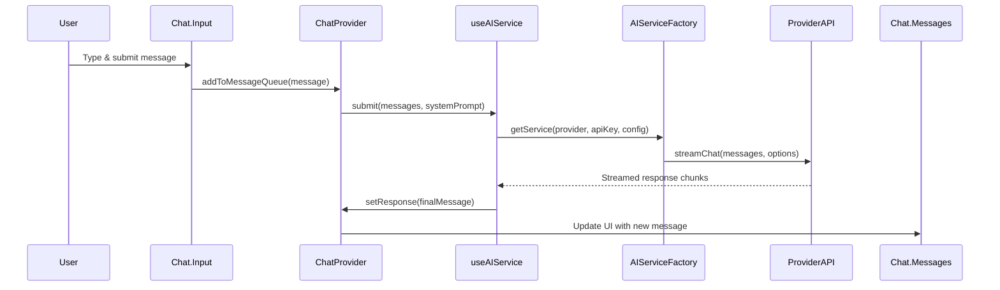

# SynapticFlow Chat Feature: Architecture & Implementation Manual

This document focuses on the **chat feature** of SynapticFlow, detailing its architecture, data flow, and implementation patterns. It is intended for developers working on the chat system, excluding general project setup and non-chat features.

---

## 1. **Architecture Overview**

- **Frontend:** React 18, feature-based structure ([`src/features/chat`](src/features/chat ))
- **State Management:** React Context (`ChatProvider`)
- **Service Layer:** AI communication and business logic ([`src/lib/ai-service`](src/lib/ai-service ))
- **Backend:** Tauri (Rust) for native operations and MCP integration

---

## 2. **Core Components & Data Flow**

### **A. Chat Context Provider (`ChatProvider`)**

- **Location:** [`src/context/ChatContext.tsx`](src/context/ChatContext.tsx )
- **Responsibilities:**
  - Manages chat state: message history, streaming messages, message queue
  - Handles message submission, retry, cancellation, and tool execution
  - Combines system prompts and agent configuration
  - Exposes chat actions via React Context

### **B. Message Submission Flow**

1. **User Input:**  
   User sends a message via the chat UI (`Chat.Input` compound component).

2. **Message Queueing:**  
   Message is added to the queue for processing (tool calls, multi-step actions).

3. **Session History:**  
   Message is persisted in IndexedDB via session history hooks.

4. **System Prompt Construction:**  
   System prompt is built from agent and extension prompts.

5. **AI Service Invocation:**  
   Calls `useAIService.submit()` with the prepared message list and system prompt.

---

### **C. AI Service Layer (`useAIService` Hook)**

- **Location:** [`src/hooks/use-ai-service.ts`](src/hooks/use-ai-service.ts )
- **Responsibilities:**
  - Preprocesses messages (attachments, tool calls, JSON sanitization)
  - Validates tool call/response pairs
  - Truncates messages to fit model context window (token limit)
  - Selects AI provider and model from settings
  - Instantiates provider via `AIServiceFactory`
  - Streams response from provider (`streamChat`)
  - Handles errors and updates chat state

---

### **D. AI Provider Integration ([`src/lib/ai-service`](src/lib/ai-service ))**

- **Pattern:**  
  - Each provider (OpenAI, Anthropic, Gemini, etc.) implements `IAIService`
  - Factory pattern (`AIServiceFactory`) selects the correct provider
  - All providers expose a unified `streamChat(messages, options)` API

- **Streaming:**  
  - Responses are streamed chunk-by-chunk
  - Each chunk updates the streaming message in context
  - Final message is persisted in history

---

### **E. Tool Call & Response Handling**

- **Tool Calls:**  
  - Messages may contain tool calls (function calls, code execution, etc.)
  - Tool calls are validated and paired with tool responses
  - Dangling tool calls are removed before sending to the AI provider

- **Tool Execution:**  
  - Tool processor (`useToolProcessor`) executes tool calls and updates messages
  - Tool results are injected into the message queue for further AI processing

---

## 3. **Logging & Error Handling**

- **Centralized Logging:**  
  - Use `getLogger('ChatContext')` and `getLogger('useAIService')`
  - All logs are structured and context-specific
  - Errors are standardized and passed to the UI for display

---

## 4. **Compound Component Pattern**

- **Chat UI Structure:**  
  - `Chat.Header`: Session info, agent controls
  - `Chat.Messages`: Message list, streaming state
  - `Chat.Input`: User input, submit, tool triggers

- **State Sharing:**  
  - All chat actions and state are provided via `ChatContext`
  - No prop drilling; use context hooks for access

---

## 5. **Data Flow Diagram**

---

## 6. **Key Implementation Patterns**

- **Strict Typing:**  
  - All message and tool types are defined in [`src/models/chat.ts`](src/models/chat.ts )
  - No usage of `any`; use precise interfaces

- **Service Layer Separation:**  
  - All business logic and AI communication in [`src/lib/ai-service`](src/lib/ai-service )
  - No direct API calls from components

- **Error Handling:**  
  - All errors logged via centralized logger
  - UI displays user-friendly error messages

- **Compound Components:**  
  - Chat UI split into logical subcomponents for maintainability

---

## 7. **Extending the Chat Feature**

- **Add New AI Provider:**  
  - Implement `IAIService` in `src/lib/ai-service/{provider}.ts`
  - Register in `AIServiceFactory`

- **Add New Tool:**  
  - Define tool in `src/models/tool.ts`
  - Integrate with tool processor and message queue

- **Customize UI:**  
  - Extend compound components in [`src/features/chat/components`](src/features/chat/components )

---

## 8. **References**

- [`src/context/ChatContext.tsx`](src/context/ChatContext.tsx ) – Chat state and actions
- [`src/hooks/use-ai-service.ts`](src/hooks/use-ai-service.ts ) – AI service hook and streaming
- [`src/lib/ai-service`](src/lib/ai-service ) – Provider implementations and factory
- [`.github/copilot-instructions.md`](.github/copilot-instructions.md ) – Coding style and architecture guidelines
- [`agents.md`](agents.md ) – Agent system overview

---

**This manual covers the chat feature architecture and implementation. For general project setup, refer to the main project documentation.**
