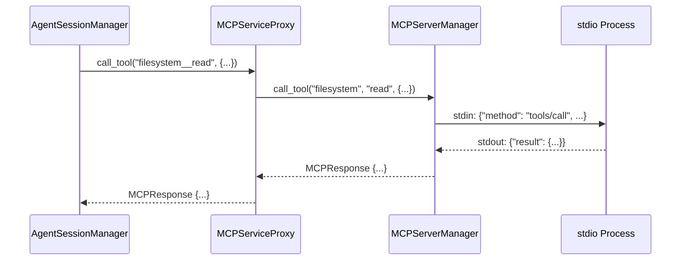
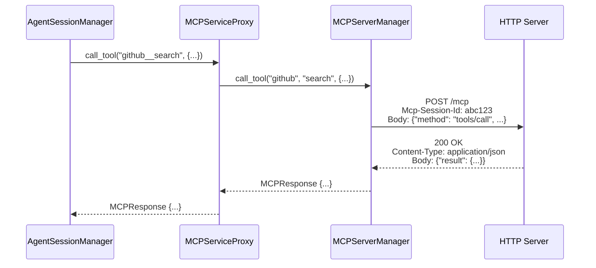
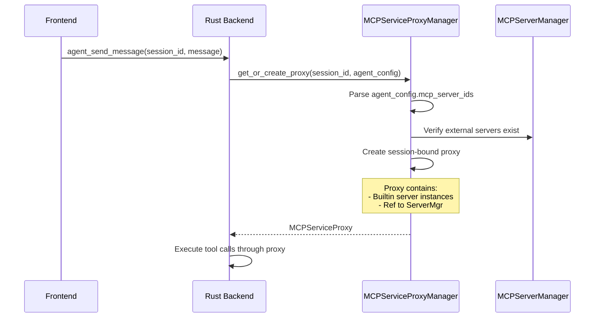

# External MCP Integration Architecture

## Overview

LibrAgent integrates with external Model Context Protocol (MCP) servers through a dual-transport architecture that supports both local subprocess communication (stdio) and remote HTTP connections. This document provides a comprehensive guide to understanding the integration for developers new to the codebase.

---

## Table of Contents

1. [Architecture Overview](#architecture-overview)
2. [Transport Layer](#transport-layer)
3. [Session Isolation](#session-isolation)
4. [Agent V2 Integration](#agent-v2-integration)
5. [Data Flow](#data-flow)
6. [Key Components](#key-components)
7. [Code Examples](#code-examples)
8. [Best Practices](#best-practices)
9. [Troubleshooting](#troubleshooting)

---

## Architecture Overview

### High-Level Architecture

```
┌─────────────────────────────────────────────────────────────┐
│                    Agent V2 Sessions                         │
│  ┌──────────────┐  ┌──────────────┐  ┌──────────────┐      │
│  │  Session A   │  │  Session B   │  │  Session C   │      │
│  └──────┬───────┘  └──────┬───────┘  └──────┬───────┘      │
└─────────┼──────────────────┼──────────────────┼─────────────┘
          │                  │                  │
          ▼                  ▼                  ▼
┌─────────────────────────────────────────────────────────────┐
│              MCPServiceProxyManager (Global)                 │
│  - Creates session-bound MCPServiceProxy instances           │
│  - Routes to appropriate transport layer                     │
└─────────────────────────────────────────────────────────────┘
          │
          ├─────────────────────┬─────────────────────┐
          ▼                     ▼                     ▼
┌──────────────────┐  ┌──────────────────┐  ┌──────────────────┐
│  Builtin Tools   │  │  stdio Transport │  │  HTTP Transport  │
│  (Per-Session)   │  │  (Isolated)      │  │  (Shared+ID)     │
└──────────────────┘  └──────────────────┘  └──────────────────┘
```

### Design Principles

1. **Transport Abstraction**: Unified interface for both stdio and HTTP transports
2. **Session Isolation**: Each agent session operates independently
3. **Resource Efficiency**: Reuse HTTP connections, isolate stdio processes
4. **MCP Spec Compliance**: Implements MCP 2025-06-18 specification
5. **Type Safety**: Rust's type system prevents runtime errors

---

## Transport Layer

LibrAgent implements two MCP transport mechanisms as defined in the MCP specification:

### 1. stdio Transport (Local Subprocess)

**Use Case**: Local MCP servers (filesystem, git, database tools)

**Location**: `src-tauri/src/mcp/server/lifecycle.rs::start_stdio_server()`

#### How It Works

```rust
// 1. Create command with environment
let cmd = Command::new(command).configure(|cmd| {
    for arg in args {
        cmd.arg(arg);
    }
    for (key, value) in env {
        cmd.env(key, value);
    }
});

// 2. Create transport and connect
let transport = TokioChildProcess::new(cmd)?;
let client = ().serve(transport).await?;

// 3. Store connection per session
let connection = MCPConnection { client, config };
connections.insert(name.clone(), connection);
```

#### Key Characteristics

| Feature              | Implementation               | Benefit                       |
| -------------------- | ---------------------------- | ----------------------------- |
| **Isolation**        | OS process per session       | Complete state separation     |
| **Communication**    | stdin/stdout pipes           | Standard, language-agnostic   |
| **Resource Usage**   | Higher (multiple processes)  | Guaranteed no state conflicts |
| **Lifecycle**        | Client controls subprocess   | Clean termination             |
| **Session Tracking** | Implicit (process = session) | No protocol overhead          |

#### Configuration Example

```json
{
  "name": "filesystem",
  "transport": {
    "type": "stdio",
    "command": "npx",
    "args": ["-y", "@modelcontextprotocol/server-filesystem", "/workspace"],
    "env": {
      "NODE_ENV": "production"
    }
  }
}
```

---

### 2. HTTP Streamable Transport (Remote Server)

**Use Case**: Remote/cloud MCP servers, shared services, HTTP-based tools

**Location**: `src-tauri/src/mcp/server/lifecycle.rs::start_http_server()`

#### How It Works

```rust
// 1. Build header map with Mcp-Session-Id
let mut header_map = reqwest::header::HeaderMap::new();
if let Some(sid) = session_id {
    let k = reqwest::header::HeaderName::from_bytes(b"Mcp-Session-Id")?;
    let v = reqwest::header::HeaderValue::from_str(&sid)?;
    header_map.insert(k, v);  // ✅ MCP Spec § 2.5
}

// 2. Create HTTP client with default headers
let client = reqwest::Client::builder()
    .default_headers(header_map)  // Session ID sent on ALL requests
    .build()?;

// 3. Create StreamableHttpClientTransport
let mut transport_config = StreamableHttpClientTransportConfig::with_uri(url);
transport_config.allow_stateless = !enable_sse;  // SSE control

let transport = StreamableHttpClientTransport::with_client(client, transport_config);

// 4. Connect to HTTP server
let client = ().serve(transport).await?;
```

#### Key Characteristics

| Feature              | Implementation             | Benefit                         |
| -------------------- | -------------------------- | ------------------------------- |
| **Isolation**        | `Mcp-Session-Id` header    | Server-side state tracking      |
| **Communication**    | HTTP POST + SSE streams    | Firewall-friendly, standard     |
| **Resource Usage**   | Lower (shared connections) | Efficient for multiple sessions |
| **Lifecycle**        | Server manages sessions    | 404 triggers re-init            |
| **Session Tracking** | Explicit (protocol-level)  | Server can enforce policies     |

#### Configuration Example

```json
{
  "name": "github-api",
  "transport": {
    "type": "http",
    "url": "https://mcp.example.com/v1",
    "protocol_version": "2025-06-18",
    "session_id": "abc123-uuid-here",
    "enable_sse": true,
    "headers": {
      "Authorization": "Bearer token123"
    },
    "security": {
      "enable_dns_rebinding_protection": true,
      "allowed_origins": ["https://libragent.app"]
    }
  }
}
```

#### MCP Specification Compliance

| Spec Requirement             | Implementation                 | Location               |
| ---------------------------- | ------------------------------ | ---------------------- |
| POST for client messages     | ✅ `rmcp` transport layer      | `lifecycle.rs:143`     |
| GET for SSE streams          | ✅ `enable_sse` flag           | `lifecycle.rs:136`     |
| `Mcp-Session-Id` header      | ✅ Injected at connection time | `lifecycle.rs:117-123` |
| `Accept: text/event-stream`  | ✅ `rmcp` handles              | RMCP library           |
| Protocol version negotiation | ✅ `protocol_version` field    | `types.rs:23`          |
| DNS rebinding protection     | ✅ `SecurityConfig`            | `types.rs:39-45`       |
| Session termination (404)    | ⚠️ Server responsibility       | -                      |

---

## Session Isolation

### Problem Statement

Multiple agent sessions running concurrently must not interfere with each other's tool execution state. Example:

- **Session A**: Reading `/config.json` line 10
- **Session B**: Writing to `/config.json`
- **Risk**: Session A reads modified data unexpectedly

### Solution: Transport-Specific Strategies

#### stdio: Process Isolation

```
Session A                    Session B
    │                            │
    ├─ spawn process #1          ├─ spawn process #2
    │   └─ filesystem server     │   └─ filesystem server
    │       (PID 1001)           │       (PID 1002)
    │       Memory: 0x1000       │       Memory: 0x2000
    │       State: isolated      │       State: isolated
    │                            │
    └─ No shared state ✅        └─ No shared state ✅
```

**Implementation**: `src-tauri/src/mcp/session_isolation/stdio_manager.rs`

```rust
pub struct SessionMCPManager {
    session_id: String,
    processes: Arc<RwLock<HashMap<String, MCPProcess>>>,  // Per-session processes
    server_manager: Arc<MCPServerManager>,
}

impl SessionMCPManager {
    pub async fn start_server(&self, config: MCPServerConfig) -> Result<()> {
        // Each call spawns a NEW subprocess
        let process = MCPProcess::spawn(config, &self.session_id).await?;
        self.processes.write().await.insert(config.name.clone(), process);
    }
}
```

#### HTTP: Session ID Injection

```
Session A                    Session B
    │                            │
    │  POST /mcp                 │  POST /mcp
    │  Mcp-Session-Id: aaa       │  Mcp-Session-Id: bbb
    │                            │
    ▼                            ▼
┌────────────────────────────────────┐
│  Shared HTTP MCP Server            │
│  ┌──────────┐  ┌──────────┐       │
│  │ Session  │  │ Session  │       │
│  │  aaa     │  │  bbb     │       │
│  │ state    │  │ state    │       │
│  └──────────┘  └──────────┘       │
└────────────────────────────────────┘
```

**Implementation**: `src-tauri/src/mcp/session_isolation/http_manager.rs`

```rust
pub struct HttpSessionManager {
    session_id: String,  // Unique per agent session
    server_manager: Arc<MCPServerManager>,  // Shared connections
    http_configs: Arc<RwLock<HashMap<String, MCPServerConfig>>>,
}

impl HttpSessionManager {
    pub async fn call_tool(&self, ...) -> Result<MCPResponse> {
        // Mcp-Session-Id header was set during connection creation
        // Server receives header and routes to correct session state
        self.server_manager.call_tool(server_name, tool_name, args, None).await
    }
}
```

---

## Agent V2 Integration

Agent V2 uses external MCP servers through a three-layer architecture:

### Layer 1: AgentSessionManager (Orchestrator)

**Location**: `src-tauri/src/agent/mod.rs`

**Responsibilities**:

- Manages "Think-Act-Observe" loop
- Calls tools through MCPServiceProxy
- Handles cancellation and error recovery

```rust
// Simplified flow
pub async fn send_message(&self, request: SendMessageRequest) -> Result<()> {
    loop {
        // 1. Think: Call LLM
        let response = self.call_llm(messages).await?;

        // 2. Act: Execute tool calls
        if let Some(tool_calls) = response.tool_calls {
            for tool_call in tool_calls {
                let result = self.proxy.call_tool(&tool_call.name, tool_call.args).await?;
                tool_results.push(result);
            }
        }

        // 3. Observe: Add results to context
        messages.extend(tool_results);

        // 4. Check if done
        if response.stop_reason == "end_turn" { break; }
    }
}
```

### Layer 2: MCPServiceProxy (Router)

**Location**: `src-tauri/src/mcp/service_proxy.rs`

**Responsibilities**:

- Routes tool calls to builtin or external servers
- Maintains per-session builtin server instances
- Provides unified interface for tool execution

```rust
pub struct MCPServiceProxy {
    session_id: String,
    builtin_servers: HashMap<String, Box<dyn BuiltinMCPServer>>,  // Per-session
    external_mcp_manager: Arc<MCPServerManager>,  // Shared
    _session_manager: Arc<SessionManager>,
}

impl MCPServiceProxy {
    pub async fn call_tool(&self, tool_name: &str, args: Value) -> Result<MCPResponse> {
        if tool_name.starts_with("builtin_") {
            // Route to session-specific builtin server
            let tool_id = extract_tool_id(tool_name)?;
            let server = self.builtin_servers.get(tool_id)?;
            server.handle_call(tool_name, args).await
        } else {
            // Route to external MCP (stdio or HTTP)
            let (server_name, real_tool_name) = tool_name.split_once("__")?;
            self.external_mcp_manager
                .call_tool(server_name, real_tool_name, args, None)
                .await
        }
    }
}
```

### Layer 3: MCPServerManager (Transport Layer)

**Location**: `src-tauri/src/mcp/server/mod.rs`

**Responsibilities**:

- Manages connections to external MCP servers
- Handles both stdio and HTTP transports
- Provides tool listing and execution

```rust
pub struct MCPServerManager {
    connections: Arc<Mutex<HashMap<String, MCPConnection>>>,
    builtin_servers: Arc<Mutex<Option<BuiltinServerRegistry>>>,
    oauth_manager: Arc<OAuthManager>,
}

impl MCPServerManager {
    pub async fn call_tool(&self, server_name: &str, tool_name: &str, ...) -> MCPResponse {
        let connections = self.connections.lock().await;
        let connection = connections.get(server_name)?;

        // Call through rmcp client (handles stdio or HTTP transport)
        connection.client.call_tool(tool_name, args).await
    }
}
```

---

## Data Flow

### Tool Execution Flow (stdio)



### Tool Execution Flow (HTTP)



### Session Initialization Flow



---

## Key Components

### File Structure

```
src-tauri/src/
├── mcp/
│   ├── server/
│   │   ├── mod.rs              # MCPServerManager main struct
│   │   ├── lifecycle.rs        # start_server(), stop_server()
│   │   └── tools.rs            # call_tool(), list_tools()
│   │
│   ├── session_isolation/
│   │   ├── mod.rs              # Module exports
│   │   ├── stdio_manager.rs   # SessionMCPManager (per-session processes)
│   │   ├── http_manager.rs    # HttpSessionManager (session ID injection)
│   │   └── process.rs          # MCPProcess wrapper
│   │
│   ├── service_proxy.rs        # MCPServiceProxy (session-bound router)
│   ├── service_proxy_manager.rs # MCPServiceProxyManager (global registry)
│   └── types.rs                # TransportConfig, MCPServerConfig, etc.
│
├── agent/
│   ├── mod.rs                  # AgentSessionManager
│   ├── tools.rs                # collect_available_tools()
│   └── llm.rs                  # LLM integration
│
└── commands/
    ├── agent_commands.rs       # Tauri commands for Agent V2
    └── mcp_commands.rs         # Tauri commands for MCP management
```

### Type Definitions

**TransportConfig** (`src-tauri/src/mcp/types.rs:8-33`)

```rust
#[derive(Debug, Clone, Serialize, Deserialize)]
#[serde(tag = "type", rename_all = "lowercase")]
pub enum TransportConfig {
    Stdio {
        command: String,
        args: Vec<String>,
        env: HashMap<String, String>,
    },
    Http {
        url: String,
        protocol_version: String,
        session_id: Option<String>,
        headers: Option<HashMap<String, String>>,
        enable_sse: Option<bool>,
        security: Option<SecurityConfig>,
    },
}
```

**MCPServerConfig** (`src-tauri/src/mcp/types.rs:94-103`)

```rust
#[derive(Debug, Clone, Serialize, Deserialize)]
pub struct MCPServerConfig {
    pub name: String,
    pub transport: TransportConfig,
    pub authentication: Option<OAuthConfig>,
    pub metadata: Option<ServerMetadata>,
}
```

**MCPConnection** (`src-tauri/src/mcp/types.rs:268-272`)

```rust
pub struct MCPConnection {
    pub client: rmcp::Client<rmcp::types::ClientCapabilities>,
    pub config: MCPServerConfig,
}
```

### Key Functions

**Tool Collection** (`src-tauri/src/agent/tools.rs:13-95`)

```rust
pub async fn collect_available_tools(
    session_id: &str,
    agent_config: &AgentConfig,
    proxy_manager: &Arc<MCPServiceProxyManager>,
) -> Result<Vec<MCPTool>, String> {
    let mut all_tools = Vec::new();

    // 1. Collect builtin tools
    if let Some(proxy) = proxy_manager.get_proxy(session_id).await {
        for tool_id in proxy.builtin_tool_ids() {
            let server_tools = proxy.get_builtin_server_tools(&tool_id);
            all_tools.extend(server_tools);
        }
    }

    // 2. Collect external tools (filtered by agent_config.mcp_server_ids)
    let external_tools = proxy_manager.list_all_external_tools().await?;
    let filtered_tools = external_tools
        .into_iter()
        .filter(|tool| {
            let server_name = tool.name.split("__").next()?;
            agent_config.mcp_server_ids.contains(&server_name.to_string())
        })
        .collect();

    all_tools.extend(filtered_tools);
    Ok(all_tools)
}
```

**Tool Execution** (`src-tauri/src/mcp/service_proxy.rs:95-122`)

```rust
pub async fn call_tool(&self, tool_name: &str, args: Value) -> Result<MCPResponse> {
    if tool_name.starts_with("builtin_") {
        // Extract: "builtin_content_store__addContent" -> "content_store"
        let tool_id = tool_name
            .strip_prefix("builtin_")
            .and_then(|s| s.split("__").next())?;

        let server = self.builtin_servers.get(tool_id)?;
        let result = server.handle_call(tool_name, args).await?;

        Ok(MCPResponse {
            result: Some(MCPResponseResult::ToolCall(result)),
            error: None,
        })
    } else {
        // External: "filesystem__read_file" -> server="filesystem", tool="read_file"
        let (server_name, real_tool_name) = tool_name.split_once("__")?;

        self.external_mcp_manager
            .call_tool(server_name, real_tool_name, args, None)
            .await
    }
}
```

---

## Code Examples

### Example 1: Starting an stdio MCP Server

```rust
use crate::mcp::types::{MCPServerConfig, TransportConfig};

let config = MCPServerConfig {
    name: "filesystem".to_string(),
    transport: TransportConfig::Stdio {
        command: "npx".to_string(),
        args: vec![
            "-y".to_string(),
            "@modelcontextprotocol/server-filesystem".to_string(),
            "/workspace".to_string(),
        ],
        env: HashMap::new(),
    },
    authentication: None,
    metadata: None,
};

let manager = MCPServerManager::new_with_session_manager(session_manager);
let result = manager.start_server(config).await?;
// Result: "Started and connected to MCP server: filesystem"
```

### Example 2: Starting an HTTP MCP Server

```rust
let config = MCPServerConfig {
    name: "github-api".to_string(),
    transport: TransportConfig::Http {
        url: "https://mcp.github.com/v1".to_string(),
        protocol_version: "2025-06-18".to_string(),
        session_id: Some("session-abc123".to_string()),
        headers: Some({
            let mut h = HashMap::new();
            h.insert("Authorization".to_string(), "Bearer token123".to_string());
            h
        }),
        enable_sse: Some(true),
        security: Some(SecurityConfig {
            enable_dns_rebinding_protection: true,
            allowed_origins: vec!["https://libragent.app".to_string()],
            allowed_hosts: vec!["mcp.github.com".to_string()],
        }),
    },
    authentication: None,
    metadata: None,
};

let result = manager.start_server(config).await?;
// Result: "Started and connected to HTTP MCP server: github-api at https://mcp.github.com/v1"
```

### Example 3: Calling a Tool Through Proxy

```rust
use serde_json::json;

// Get session-bound proxy
let proxy = proxy_manager.get_proxy(session_id).await?;

// Call external stdio tool
let result = proxy.call_tool(
    "filesystem__read_file",
    json!({
        "path": "/workspace/config.json"
    })
).await?;

// Call external HTTP tool
let result = proxy.call_tool(
    "github__search_repos",
    json!({
        "query": "rust mcp",
        "limit": 10
    })
).await?;

// Call builtin tool
let result = proxy.call_tool(
    "builtin_content_store__addContent",
    json!({
        "content": "Important data",
        "metadata": {"type": "note"}
    })
).await?;
```

### Example 4: Agent Config with External MCP

```typescript
// Frontend: src/models/assistant.ts
interface AgentConfig {
  assistant_id: string;
  allowed_built_in_service_aliases?: string[]; // ["workspace", "planning", ...]
  mcp_server_ids: string[]; // ["filesystem", "github", "slack"]
}

// Agent with only stdio servers
const config1: AgentConfig = {
  assistant_id: 'asst_123',
  allowed_built_in_service_aliases: ['workspace', 'planning'],
  mcp_server_ids: ['filesystem', 'git'], // stdio servers
};

// Agent with HTTP servers
const config2: AgentConfig = {
  assistant_id: 'asst_456',
  allowed_built_in_service_aliases: ['ui', 'browser'],
  mcp_server_ids: ['github', 'slack-api'], // HTTP servers
};

// Agent with mixed transports
const config3: AgentConfig = {
  assistant_id: 'asst_789',
  allowed_built_in_service_aliases: ['workspace'],
  mcp_server_ids: ['filesystem', 'github', 'database'], // Mixed
};
```

---

## Best Practices

### 1. Choosing Transport Type

| Scenario              | Recommended Transport | Reason                                  |
| --------------------- | --------------------- | --------------------------------------- |
| Local file operations | **stdio**             | No network overhead, OS-level isolation |
| Database access       | **stdio**             | Connection pooling per session          |
| Cloud API integration | **HTTP**              | Single connection, server handles state |
| Stateful operations   | **stdio**             | Process memory is session-exclusive     |
| Stateless operations  | **HTTP**              | Connection reuse, lower resource usage  |
| Development/testing   | **stdio**             | Easier debugging, logs to stderr        |
| Production remote     | **HTTP**              | Centralized server, better monitoring   |

### 2. Session Isolation Checklist

✅ **stdio Servers**:

- Each session spawns independent subprocess
- No configuration needed—automatic isolation
- Verify `command` path is correct for all environments
- Use absolute paths or ensure PATH is set correctly

✅ **HTTP Servers**:

- Server MUST implement `Mcp-Session-Id` header parsing
- Server MUST return 404 for expired/invalid sessions
- Client should handle 404 by re-initializing session
- Use unique, cryptographically secure session IDs (UUIDs)

### 3. Error Handling Patterns

```rust
// ❌ WRONG: Silent failure
let result = manager.call_tool(server, tool, args, None).await;
if result.error.is_some() {
    // Do nothing
}

// ✅ CORRECT: Explicit error handling
match manager.call_tool(server, tool, args, None).await {
    Ok(response) => {
        if let Some(error) = response.error {
            log::error!("Tool execution failed: {:?}", error);
            return Err(format!("Tool error: {}", error.message));
        }
        // Process response.result
    }
    Err(e) => {
        log::error!("Failed to call tool: {:?}", e);
        return Err(format!("Connection error: {}", e));
    }
}
```

### 4. Resource Cleanup

```rust
impl Drop for MCPServiceProxy {
    fn drop(&mut self) {
        // Builtin servers are automatically dropped
        // External connections remain active (shared)
        log::debug!("Dropped MCPServiceProxy for session {}", self.session_id);
    }
}

// For stdio servers, explicitly stop when session ends
pub async fn cleanup_session(session_id: &str, manager: &MCPServerManager) {
    // Get list of servers for this session
    let servers = get_session_servers(session_id).await;

    for server_name in servers {
        if let Err(e) = manager.stop_server(&server_name).await {
            log::warn!("Failed to stop server {}: {:?}", server_name, e);
        }
    }
}
```

### 5. Tool Naming Conventions

| Tool Type      | Naming Pattern              | Example                       |
| -------------- | --------------------------- | ----------------------------- |
| External stdio | `{server}__{tool}`          | `filesystem__read_file`       |
| External HTTP  | `{server}__{tool}`          | `github__search_repos`        |
| Builtin        | `builtin_{service}__{tool}` | `builtin_workspace__editFile` |

**Important**: Use double underscore (`__`) as separator, NOT single underscore.

---

## Troubleshooting

### Common Issues

#### 1. Tool Not Found

**Symptom**: `Tool not found: filesystem__read_file`

**Diagnosis**:

```rust
// Check if server is connected
let connected = manager.get_connected_servers().await;
if !connected.contains(&"filesystem") {
    // Server not started or failed to connect
}

// Check if tool exists
let tools = manager.list_tools("filesystem").await?;
let tool_names: Vec<_> = tools.iter().map(|t| &t.name).collect();
// Verify "read_file" is in tool_names
```

**Solutions**:

1. Verify server config in agent_config.mcp_server_ids
2. Check server started successfully: `mcp_start_server(config)`
3. Confirm tool name matches server's list_tools output
4. Check server logs for initialization errors

---

#### 2. Session State Leak (stdio)

**Symptom**: Session A sees data modified by Session B

**Diagnosis**: This should NEVER happen with stdio transport—OS process isolation prevents it.

**If it happens**:

1. Verify separate processes were spawned: `ps aux | grep mcp`
2. Check logs for process reuse: `grep "Created transport" logs.txt`
3. Ensure each session calls `start_server()` independently

**Root Cause**: Likely incorrect server implementation or shared file system state, not transport issue.

---

#### 3. HTTP Session Not Isolated

**Symptom**: HTTP server returns wrong session's data

**Diagnosis**:

```rust
// Verify session ID is being sent
let config = get_server_config("github").await;
match config.transport {
    TransportConfig::Http { session_id, .. } => {
        assert!(session_id.is_some(), "Session ID missing!");
    }
    _ => panic!("Not HTTP transport"),
}
```

**Solutions**:

1. Ensure `session_id` field is set in TransportConfig::Http
2. Verify server logs show `Mcp-Session-Id` header in requests
3. Check server implementation handles header correctly
4. Confirm session IDs are unique per agent session

---

#### 4. SSE Stream Not Working

**Symptom**: HTTP server responses are slow or timeout

**Diagnosis**:

```rust
// Check SSE is enabled
match config.transport {
    TransportConfig::Http { enable_sse, .. } => {
        assert_eq!(enable_sse, Some(true), "SSE disabled!");
    }
    _ => {}
}
```

**Solutions**:

1. Set `enable_sse: Some(true)` in HTTP config
2. Verify server supports SSE (check server docs)
3. Check firewall allows streaming responses
4. Monitor network tab for `Content-Type: text/event-stream`

---

#### 5. Tool Execution Timeout

**Symptom**: Tool calls hang indefinitely

**Diagnosis**:

```rust
// Add timeout wrapper
use tokio::time::{timeout, Duration};

let result = timeout(
    Duration::from_secs(30),
    manager.call_tool(server, tool, args, None)
).await;

match result {
    Ok(Ok(response)) => { /* success */ }
    Ok(Err(e)) => { log::error!("Tool error: {:?}", e); }
    Err(_) => { log::error!("Tool timed out after 30s"); }
}
```

**Solutions**:

1. Check server process is alive: `ps aux | grep {server}`
2. Verify network connectivity for HTTP servers
3. Check server logs for hanging operations
4. Implement timeout at application level
5. For stdio: verify stdin/stdout are not blocked

---

## Debugging Tips

### Enable Verbose Logging

```bash
# Environment variable for Rust logging
export RUST_LOG=libr_agent::mcp=debug

# Run with detailed logs
pnpm tauri dev
```

### Inspect Active Connections

```rust
// In Rust backend
let connected = manager.get_connected_servers().await;
log::info!("Connected servers: {:?}", connected);

for server_name in connected {
    let tools = manager.list_tools(&server_name).await?;
    log::info!("Server '{}' has {} tools", server_name, tools.len());
}
```

### Monitor stdio Processes

```bash
# List MCP server processes
ps aux | grep -E "mcp-server|npx.*@modelcontextprotocol"

# Check process resource usage
top -p $(pgrep -f mcp-server)

# View server stderr logs
tail -f /tmp/libragent-mcp-{server_name}.log
```

### Test HTTP Transport

```bash
# Manual HTTP request with session ID
curl -X POST https://mcp.example.com/v1 \
  -H "Content-Type: application/json" \
  -H "Mcp-Session-Id: test-session-123" \
  -H "Accept: application/json, text/event-stream" \
  -d '{
    "jsonrpc": "2.0",
    "method": "tools/list",
    "id": 1
  }'

# Check SSE stream
curl -N -H "Accept: text/event-stream" \
     -H "Mcp-Session-Id: test-session-123" \
     https://mcp.example.com/v1
```

---

## Additional Resources

### Documentation

- [MCP Specification 2025-06-18](https://modelcontextprotocol.io/specification/2025-06-18/basic/transports)
- [RMCP Library Docs](https://docs.rs/rmcp/latest/rmcp/)
- [Agent V2 Architecture](./chat-feature-architecture.md)
- [Builtin Tools Best Practices](../../builtin_tool_bp.md)

### Code References

| Component                 | File                                                   | Lines  |
| ------------------------- | ------------------------------------------------------ | ------ |
| stdio transport           | `src-tauri/src/mcp/server/lifecycle.rs`                | 36-78  |
| HTTP transport            | `src-tauri/src/mcp/server/lifecycle.rs`                | 83-171 |
| Session isolation (stdio) | `src-tauri/src/mcp/session_isolation/stdio_manager.rs` | 1-150  |
| Session isolation (HTTP)  | `src-tauri/src/mcp/session_isolation/http_manager.rs`  | 1-149  |
| Tool collection           | `src-tauri/src/agent/tools.rs`                         | 13-95  |
| Tool routing              | `src-tauri/src/mcp/service_proxy.rs`                   | 95-165 |

### Testing

Run integration tests:

```bash
cd src-tauri
cargo test --test '*' --features test-integration mcp
```

Test specific component:

```bash
cargo test -p libr-agent --lib mcp::session_isolation::http_manager::tests
```

---

## Appendix: MCP Spec Quick Reference

### Transport Types (§ 1 & § 2)

| Feature                | stdio                       | HTTP Streamable           |
| ---------------------- | --------------------------- | ------------------------- |
| **Local/Remote**       | Local only                  | Both                      |
| **Process Model**      | Subprocess per client       | Single server             |
| **Message Format**     | JSON-RPC over stdin/stdout  | JSON-RPC over HTTP        |
| **Streaming**          | N/A (request/response)      | SSE (Server-Sent Events)  |
| **Session Management** | Implicit (process lifetime) | Explicit (Mcp-Session-Id) |
| **Initialization**     | Client spawns server        | Client connects to URL    |
| **Termination**        | Kill subprocess             | HTTP DELETE or timeout    |

### Session Lifecycle (§ 2.5)

1. **Initialization**: Client sends `InitializeRequest`, server responds with `Mcp-Session-Id` header
2. **Active**: Client includes `Mcp-Session-Id` in all subsequent requests
3. **Termination**: Server returns 404, or client sends DELETE
4. **Re-initialization**: On 404, client starts new session

### Security Considerations (§ 2.0.1)

For HTTP transport:

1. Validate `Origin` header (DNS rebinding protection)
2. Bind to localhost (127.0.0.1) for local servers
3. Implement authentication for all connections

---

**Document Version**: 1.0  
**Last Updated**: January 18, 2026  
**Author**: LibrAgent Team  
**Spec Version**: MCP 2025-06-18
