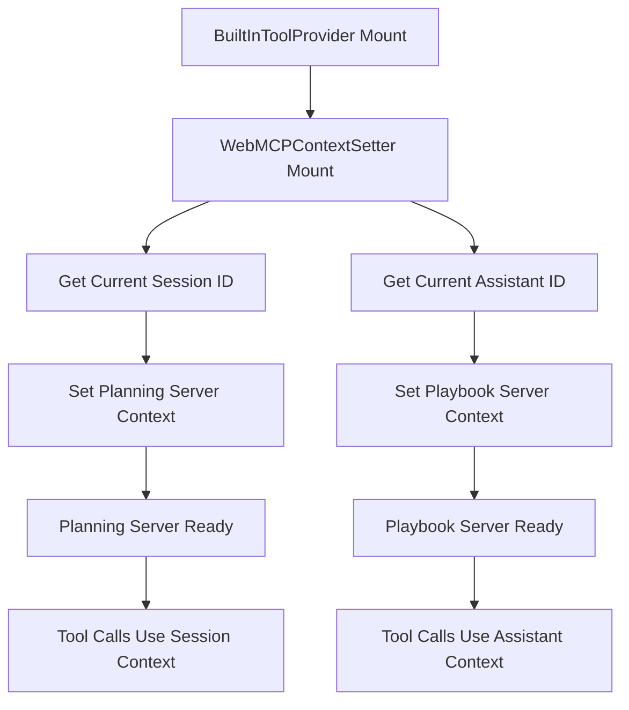

# Built-in Tools Documentation

## Overview

LibrAgent provides a comprehensive set of built-in tools that enable AI agents to interact with web browsers, manage MCP servers, and perform various automation tasks. These tools are organized into three main categories:

1. **Browser Tools** - Web browser automation and interaction
2. **Rust MCP Tools** - Native system-level operations via Rust backend
3. **Web MCP Tools** - Browser-based MCP server tools

## Built-in Tool Architecture and Context Coupling

### Tight Coupling with Client Context

The built-in tool system implements a **tight coupling** between tool execution and client application context, ensuring that Web MCP servers automatically receive relevant session and assistant information without explicit parameter passing.

#### Context Management Components

##### WebMCPContextSetter Component

- **Location**: `src/lib/web-mcp/WebMCPContextSetter.tsx`
- **Purpose**: Headless component that automatically sets context for Web MCP servers
- **Integration**: Mounted within `BuiltInToolProvider` for automatic context propagation

##### BuiltInToolProvider Integration

- **Location**: `src/features/tools/index.tsx`
- **Architecture**: Wraps `WebMCPContextSetter` to ensure context is set before any tool operations
- **Lifecycle**: Context is established on provider mount and updated when session/assistant changes

#### Automatic Context Propagation

##### Planning Server Context

- **Session ID**: Automatically receives current session ID via `setContext({ sessionId })`
- **State Isolation**: Each session maintains separate planning state (goals, todos, observations)
- **Persistence**: Session-specific state persists across tool calls within the same session

##### Playbook Server Context

- **Assistant ID**: Automatically receives current assistant ID via `setContext({ assistantId })`
- **Data Filtering**: All operations (create, list, update) are filtered by assistant context
- **Security**: Ensures assistants only access their own playbooks and workflows

#### Context Setting Flow



#### Benefits of Tight Coupling

##### 1. Simplified Tool Interface

- No need to pass `sessionId` or `assistantId` parameters explicitly
- Tools automatically operate within the correct context
- Reduced parameter complexity for AI agents

##### 2. Automatic State Management

- Session-based planning state isolation
- Assistant-specific playbook management
- Context-aware tool behavior without manual intervention

##### 3. Enhanced Security

- Automatic context filtering prevents cross-session/assistant data access
- Built-in isolation between different users/assistants
- Context validation at the infrastructure level

##### 4. Developer Experience

- Context management is handled automatically
- No need to manually track and pass context identifiers
- Consistent behavior across all Web MCP tool operations

#### Context Update Triggers

##### Session Changes

- User switches to different chat session
- New session is created
- Planning server context automatically updates to new session ID

##### Assistant Changes

- User selects different AI assistant
- Assistant configuration changes
- Playbook server context automatically updates to new assistant ID

#### Error Handling

##### Context Not Set

- Tools return appropriate error messages when context is missing
- Graceful fallback behavior for context-dependent operations
- Logging for debugging context-related issues

##### Context Update Failures

- Automatic retry logic for transient failures
- Error logging with context information
- Non-blocking context updates (tools continue to work with previous context)

## Browser Tools

Browser tools provide comprehensive web automation capabilities, allowing AI agents to control browser sessions, navigate pages, interact with elements, and extract content.

### Session Management

#### `createSession`

Creates a new interactive browser session in a separate window.

**Parameters:**

- `url` (string, required): The initial URL to navigate to
- `title` (string, optional): Optional title for the browser session window

**Returns:** Session ID of the created browser session

**Example:**

```json
{
  "url": "https://example.com",
  "title": "My Browser Session"
}
```

#### `closeSession`

Closes an existing browser session and its window.

**Parameters:**

- `sessionId` (string, required): The ID of the browser session to close

**Returns:** Confirmation message

#### `listSessions`

Retrieves a list of all active browser sessions.

**Parameters:** None

**Returns:** Array of browser session objects with IDs, URLs, and titles

### Navigation Tools

#### `navigateToUrl`

Navigates to a new URL in an existing browser session.

**Parameters:**

- `sessionId` (string, required): The ID of the browser session
- `url` (string, required): The URL to navigate to

**Returns:** Navigation result message

#### `navigateBack`

Navigates backward in the browser history.

**Parameters:**

- `sessionId` (string, required): The ID of the browser session

**Returns:** Navigation result message

#### `navigateForward`

Navigates forward in the browser history.

**Parameters:**

- `sessionId` (string, required): The ID of the browser session

**Returns:** Navigation result message

#### `getCurrentUrl`

Gets the current URL of the browser page.

**Parameters:**

- `sessionId` (string, required): The ID of the browser session

**Returns:** Current page URL as string

#### `getPageTitle`

Gets the title of the current browser page.

**Parameters:**

- `sessionId` (string, required): The ID of the browser session

**Returns:** Page title as string

#### `scrollPage`

Scrolls the browser page in a specified direction.

**Parameters:**

- `sessionId` (string, required): The ID of the browser session
- `direction` (string, required): Direction to scroll ("up", "down", "left", "right")
- `amount` (number, optional): Amount to scroll in pixels (default: 500)

**Returns:** Scroll operation result

### Element Interaction Tools

#### `clickElement`

Clicks on a DOM element using CSS selector with detailed failure analysis.

This tool performs comprehensive element validation before attempting to click:

- Element existence check
- Visibility validation
- Clickability assessment
- Disabled state verification
- Position and dimension analysis

**Parameters:**

- `sessionId` (string, required): The ID of the browser session
- `selector` (string, required): CSS selector of the element to click

**Returns:** Detailed success/failure message with diagnostic information

**Failure Analysis:**
The tool provides detailed error messages for various failure scenarios:

- Element not found
- Element not visible (zero dimensions, off-screen positioning)
- Element disabled
- Element not clickable despite being visible
- Operation timeout

#### `inputText`

Inputs text into a form element.

**Parameters:**

- `sessionId` (string, required): The ID of the browser session
- `selector` (string, required): CSS selector of the input element
- `text` (string, required): Text content to input

**Returns:** Text input operation result

### Content Extraction Tools

#### `extractPageContent`

Extracts and converts page content to various formats.

**Parameters:**

- `sessionId` (string, required): The ID of the browser session
- `saveRawHtml` (boolean, optional): Whether to save raw HTML to workspace (default: false)

**Returns:** Structured response containing:

- Page content in multiple formats (markdown, text, HTML)
- Page metadata (title, URL, timestamp)
- DOM structure information
- Optional raw HTML file saved to workspace

**Supported Formats:**

- `markdown`: Clean markdown representation
- `text`: Plain text extraction
- `html`: Raw HTML content
- `domMap`: Structured DOM element mapping

#### `extractInteractable`

Extracts information about all interactable elements on the page.

**Parameters:**

- `sessionId` (string, required): The ID of the browser session

**Returns:** Array of interactable elements with:

- Element selectors and paths
- Element types and attributes
- Position and dimension information
- Interaction capabilities

## Rust MCP Tools

Rust MCP tools provide access to native system-level operations through the Tauri Rust backend. These tools are implemented as native Rust code for optimal performance and security.

### Available Rust MCP Servers

#### Content Store Server (`content_store`)

Provides advanced file content management with semantic search capabilities.

**Tools:**

- `createStore`: Create a new content store for file management
- `addContent`: Add and parse file content with chunking and BM25 indexing
- `listContent`: List content in a store with pagination
- `readContent`: Read content with line range filtering
- `keywordSimilaritySearch`: Perform BM25-based keyword search across stored content
- `semanticSimilaritySearch`: Perform semantic search using embeddings
- `deleteContent`: Remove content from a store
- `updateContent`: Update existing content in a store
- `getStoreInfo`: Get information about a content store
- `listStores`: List all available content stores

**Features:**

- BM25 keyword indexing for fast text search
- Semantic search using embeddings
- Content chunking for large files
- Session-based store isolation
- File attachment support

#### Workspace Server (`workspace`)

Provides integrated workspace management with file operations, code execution, and export capabilities.

**File Operation Tools:**

- `read_file`: Read file contents with optional line ranges
- `write_file`: Write or create files
- `list_directory`: List directory contents with filtering
- `search_files`: Search for files by name/pattern
- `replace_lines_in_file`: Replace specific lines in a file
- `grep`: Search for text patterns in files
- `import_file`: Import files from external sources

**Code Execution Tools:**

- `execute_python`: Execute Python code with session isolation
- `execute_typescript`: Execute TypeScript code
- `execute_shell` (Unix only): Execute shell commands using bash/sh
- `execute_windows_cmd` (Windows only): Execute commands using cmd.exe

**Export Tools:**

- `export_file`: Export files to various formats
- `export_zip`: Create ZIP archives of workspace content

**Features:**

- Session-based workspace isolation
- Secure file operations with permission checks
- Code execution sandboxing
- Directory structure visualization
- File size limits and validation

### Service Context

Rust MCP tools can provide service-specific context information for enhanced operation:

**Content Store Context:**

```text
# Content Store Server Status
**Server**: content_store
**Status**: Active
**Stores Available**: X stores
**Total Content**: Y items
```

**Workspace Context:**

```text
# Workspace Server Status
**Server**: workspace
**Status**: Active
**Working Directory**: /path/to/workspace
**Available Tools**: 12 tools

## Current Directory Structure
directory_tree_here
```

## Web MCP Tools

Web MCP tools run in browser-based MCP servers, providing client-side functionality without native dependencies.

### Server Management

Web MCP servers are loaded dynamically and can be:

- Planning servers for task orchestration
- Custom tool servers for specific domains
- Integration servers for external services

### Tool Registration

Web MCP tools are automatically registered when servers are loaded, providing seamless integration with the built-in tool system.

## Tool Providers

### BrowserToolProvider

React component that registers all browser automation tools with the built-in tool system.

**Features:**

- Automatic tool registration on mount
- Browser script execution integration
- Session state management
- Error handling and logging

### RustMCPToolProvider

React component that exposes Rust backend MCP tools to the application.

**Features:**

- Server discovery and tool enumeration
- Tool execution delegation to Rust backend
- Service context management
- Async loading and caching

**Integration Architecture:**
The RustMCPToolProvider follows this integration flow:

1. **Server Discovery**: Calls `listBuiltinServers()` from `useRustBackend()` hook to discover available MCP servers in the Rust backend
2. **Tool Enumeration**: For each server, calls `listBuiltinTools(serverId)` to get the list of available tools
3. **Service Registration**: Creates `BuiltInService` objects that implement the required interface:
   - `listTools()`: Returns cached tool list
   - `executeTool()`: Delegates to `callBuiltinTool()` with proper argument parsing
   - `loadService()`: No-op (preloaded)
   - `unloadService()`: No-op
   - `getServiceContext()`: Returns service-specific context via `getServiceContext()`
4. **Tool Name Mapping**: Tools are registered with names like `builtin_rustserver__toolname`

**Argument Handling:**
The provider includes robust argument parsing that handles both string and object formats:

```typescript
// Safely parse tool arguments
let args: Record<string, unknown> = {};
try {
  const raw = toolCall.function.arguments;
  if (typeof raw === 'string') {
    args = raw.length ? JSON.parse(raw) : {};
  } else if (typeof raw === 'object' && raw !== null) {
    args = raw as Record<string, unknown>;
  }
} catch (e) {
  // Fallback to raw arguments
  args = { raw: toolCall.function.arguments };
}
```

### WebMCPServiceRegistry

React component that manages web-based MCP server registration.

**Features:**

- Dynamic server loading
- Tool discovery and caching
- Server state tracking
- Activity monitoring

**Integration Architecture:**
The WebMCPServiceRegistry manages browser-based MCP servers:

1. **Server Loading**: Accepts `servers` prop with array of server names to load
2. **Proxy Initialization**: Uses `useWebMCP()` context to get server proxy and loading functions
3. **Dynamic Loading**: For each server, calls `getServerProxy(serverName)` to load the server
4. **State Management**: Maintains server states in `serverStatesRef` with loading status, tools, and error information
5. **Service Registration**: Creates `BuiltInService` objects for each loaded server:
   - `listTools()`: Returns tools from server state
   - `executeTool()`: Delegates to `proxy.callTool()` with JSON-parsed arguments
   - `loadService()`: Loads server via `loadServer()`
   - `unloadService()`: No-op
   - `getServiceContext()`: Returns context via `proxy.getServiceContext()`

**Server State Tracking:**

```typescript
interface WebMCPServerState {
  loaded: boolean;
  tools: MCPTool[];
  lastActivity: number;
  lastError?: string;
}
```

**Execution Flow:**

```text
WebMCPServiceRegistry Props → Server Loading → BuiltInService Creation → BuiltInToolProvider Registration → Tool Execution via Proxy
```

## Tool Architecture

### Type System

The tool system uses a layered type architecture:

```typescript
// Base MCP tool interface
interface MCPTool {
  name: string;
  description: string;
  inputSchema: JSONSchema;
}

// Local tools (no external dependencies)
type StrictLocalMCPTool = MCPTool & {
  execute: (args: Record<string, unknown>) => Promise<MCPResponse<unknown>>;
};

// Browser tools (require executeScript)
type StrictBrowserMCPTool = MCPTool & {
  execute: (
    args: Record<string, unknown>,
    executeScript?: (sessionId: string, script: string) => Promise<string>,
  ) => Promise<MCPResponse<unknown>>;
};
```

### Execution Flow

1. **Tool Registration**: Providers register tools with the BuiltInToolProvider
2. **Tool Discovery**: AI agents query available tools through the provider
3. **Tool Execution**: Tools are executed with validated parameters
4. **Result Processing**: Responses are formatted and returned to agents

### Context Coupling Error Handling

All tools implement comprehensive error handling:

- Parameter validation
- Execution error catching
- Detailed error messages
- Logging and debugging information

## Usage Examples

### Basic Browser Automation

```typescript
// Create a session and navigate
const sessionId = await createSessionTool.execute({
  url: 'https://example.com',
});
await navigateToUrlTool.execute({ sessionId, url: 'https://example.com/page' });

// Extract page content
const content = await extractPageContentTool.execute({ sessionId });

// Click an element
await clickElementTool.execute({ sessionId, selector: 'button.submit' });
```

### Advanced Interaction

```typescript
// Fill out a form
await inputTextTool.execute({
  sessionId,
  selector: "input[name='email']",
  text: 'user@example.com',
});

// Extract interactable elements for analysis
const elements = await extractInteractableTool.execute({ sessionId });
```

## Configuration

Tools are configured through the provider components and can be customized via:

- MCP server configuration files
- Environment variables
- Application settings
- Runtime parameters

## Performance Considerations

- Browser tools use polling for async operations to avoid blocking
- Element validation prevents unnecessary operations
- Content extraction includes format optimization
- Memory management through session lifecycle handling

## Security

- All browser operations are sandboxed within sessions
- Input validation prevents injection attacks
- File system access is controlled through Rust backend
- MCP server communication uses secure protocols

## Web MCP Server Details

### Planning Server Implementation

The planning server (`planning-server.ts`) provides comprehensive task planning and goal management for AI agents. It maintains state across sessions and provides tools for structured task management.

**Core Features:**

- **Goal Management**: Set, track, and archive goals
- **Todo System**: Create, complete, and manage task lists
- **Observation Logging**: Record events and context for decision making
- **State Persistence**: Maintain planning state across sessions
- **Progress Tracking**: Monitor completion status and provide status reports

**State Management:**
The server maintains a `PlanningState` object that includes:

- Current goal and previously cleared goals
- Todo list with completion status
- Observation history for context awareness

**Integration with Web Worker:**
The planning server is loaded via static import in `mcp-worker.ts`:

```typescript
// Static imports for MCP server modules
import planningServer from './modules/planning-server';

// Static module registry
const MODULE_REGISTRY = [
  { key: 'planning', module: planningServer },
  // Future modules can be added here
] as const;
```

This approach ensures:

- Better bundling compatibility with Vite
- Type safety through static imports
- Elimination of dynamic import warnings
- Faster server initialization
