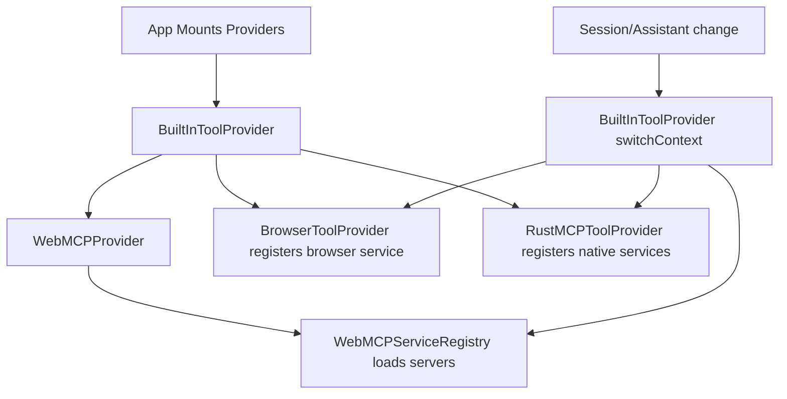

# Built-in Tools Documentation

## Overview

LibrAgent provides a comprehensive set of built-in tools that enable AI agents to interact with web browsers, manage MCP servers, and perform various automation tasks. These tools are organized into three main categories:

1. **Browser Tools** - Web browser automation and interaction
2. **Rust MCP Tools** - Native system-level operations via Rust backend
3. **Web MCP Tools** - Browser-based MCP server tools running in Web Workers

## Service Naming Convention

### Tool Name Format

All built-in tools follow a standardized naming pattern:

```text
builtin_<service_alias>__<tool_name>
```

- `builtin_` - Fixed prefix identifying built-in tools
- `<service_alias>` - Service identifier (server name)
- `__` (double underscore) - Delimiter separating service from tool
- `<tool_name>` - Specific tool name

**Examples:**

- `builtin_browser__clickElement` - Browser service, click element tool
- `builtin_mcp_manager__list_servers` - MCP Manager service, list servers tool
- `builtin_workspace__read_file` - Workspace service, read file tool

### Service Alias Rules

Service aliases must adhere to these naming rules to ensure proper parsing and registration:

#### ✅ Valid Service Names

- **Single words**: `browser`, `workspace`, `planning`, `ui`
- **Snake case with single underscores**: `mcp_manager`, `content_store`, `playbook_store`
- **Multiple segments**: `a_b_c_d_e_f` (any number of single underscores)
- **Alphanumeric**: Letters (a-z, A-Z) and numbers (0-9) are allowed

#### ❌ Invalid Service Names

- **Double underscores**: `service__name`, `a__b` (conflicts with delimiter)
- **Leading/trailing underscores**: `_service`, `service_`
- **Special characters**: `service-name`, `service.name`, `service name`
- **Consecutive underscores**: `service___name`
- **Empty strings**: Must have at least one character

#### Validation

The system includes automatic validation via `isValidServiceAlias()` function:

```typescript
// Valid examples
isValidServiceAlias('browser'); // ✅ true
isValidServiceAlias('mcp_manager'); // ✅ true
isValidServiceAlias('content_store'); // ✅ true
isValidServiceAlias('a_b_c_d'); // ✅ true

// Invalid examples
isValidServiceAlias('service__name'); // ❌ false (double underscore)
isValidServiceAlias('_service'); // ❌ false (leading underscore)
isValidServiceAlias('service-name'); // ❌ false (hyphen)
isValidServiceAlias(''); // ❌ false (empty)
```

### Why These Rules?

1. **Parser Reliability**: The `extractBuiltInServiceAlias()` function uses a non-greedy regex pattern (`/^builtin_(.+?)__/`) that stops at the first occurrence of `__`. Double underscores in service names would cause incorrect parsing.

2. **Consistency**: Snake_case naming provides consistent, readable service identifiers across the codebase.

3. **JavaScript Compatibility**: The `toValidJsName()` function ensures service names can be used as JavaScript identifiers.

4. **Collision Avoidance**: Strict naming rules prevent ambiguity and tool name collisions.

### Best Practices

- Use descriptive, lowercase names: `content_store` instead of `cs`
- Separate words with single underscores: `mcp_manager` not `mcpmanager`
- Keep names concise but meaningful: `browser` not `web_browser_automation`
- Follow existing patterns: Check registered services before adding new ones

## Built-in Tool Architecture and Context Coupling

### Tight Coupling with Client Context

The built-in tool system implements a **tight coupling** between tool execution and client application context, ensuring that Web MCP servers automatically receive relevant session and assistant information without explicit parameter passing.

#### Context Management Components

##### Context management in practice

- Web MCP worker/provider: `src/context/WebMCPContext.tsx` initializes the worker (`mcp-worker.ts`) and exposes `getServerProxy`, `getServiceContext`, and `switchServerContext`.
- Built-in tool registry: `src/features/tools/index.tsx` (BuiltInToolProvider) aggregates all services and, on session/assistant change, calls each service's `switchContext({ sessionId, assistantId, threadId })` and collects `getServiceContext()` output for tool prompts.

##### BuiltInToolProvider Integration

- **Location**: `src/features/tools/index.tsx`
- **Architecture**: Central registry that other providers register into (WebMCP, Browser, Rust). It builds the tool list (`builtin_<alias>__<tool>`) and routes calls.
- **Lifecycle**: On mount, providers register services. When session/assistant changes, it propagates context via each service's `switchContext`.

#### Automatic Context Propagation

##### Planning Server Context

- **Session ID**: Automatically receives current session ID via `setContext({ sessionId })`
- **State Isolation**: Each session maintains separate planning state (goals, todos, observations)
- **Persistence**: Session-specific state persists across tool calls within the same session

##### Playbook Server Context

- **Assistant ID**: Automatically receives current assistant ID via `setContext({ assistantId })`
- **Data Filtering**: All operations (create, list, update) are filtered by assistant context
- **Security**: Ensures assistants only access their own playbooks and workflows

#### Context Setting Flow


```mermaid
graph TD
  A[App Mounts Providers] --> B[BuiltInToolProvider]
  B --> C[WebMCPProvider]
  C --> D[WebMCPServiceRegistry loads servers]
  B --> E[BrowserToolProvider registers browser service]
  B --> F[RustMCPToolProvider registers native services]
  G[Session/Assistant change] --> H[BuiltInToolProvider switchContext]
  H --> D
  H --> E
  H --> F
```

#### Benefits of Tight Coupling

##### 1. Simplified Tool Interface

- No need to pass `sessionId` or `assistantId` parameters explicitly
- Tools automatically operate within the correct context
- Reduced parameter complexity for AI agents

##### 2. Automatic State Management

- Session-based planning state isolation
- Assistant-specific playbook management
- Context-aware tool behavior without manual intervention

##### 3. Enhanced Security

- Automatic context filtering prevents cross-session/assistant data access
- Built-in isolation between different users/assistants
- Context validation at the infrastructure level

##### 4. Developer Experience

- Context management is handled automatically
- No need to manually track and pass context identifiers
- Consistent behavior across all Web MCP tool operations

#### Context Update Triggers

##### Session Changes

- User switches to different chat session
- New session is created
- Planning server context automatically updates to new session ID

##### Assistant Changes

- User selects different AI assistant
- Assistant configuration changes
- Playbook server context automatically updates to new assistant ID

#### Error Handling

##### Context Not Set

- Tools return appropriate error messages when context is missing
- Graceful fallback behavior for context-dependent operations
- Logging for debugging context-related issues

##### Context Update Failures

- Automatic retry logic for transient failures
- Error logging with context information
- Non-blocking context updates (tools continue to work with previous context)

## Browser Tools

Browser tools provide comprehensive web automation capabilities, allowing AI agents to control browser sessions, navigate pages, interact with elements, and extract content.

### Session Management

#### `createSession`

Creates a new interactive browser session in a separate window.

**Parameters:**

- `url` (string, required): The initial URL to navigate to
- `title` (string, optional): Optional title for the browser session window

**Returns:** Session ID of the created browser session

**Example:**

```json
{
  "url": "https://example.com",
  "title": "My Browser Session"
}
```

#### `closeSession`

Closes an existing browser session and its window.

**Parameters:**

- `sessionId` (string, required): The ID of the browser session to close

**Returns:** Confirmation message

#### `listSessions`

Retrieves a list of all active browser sessions.

**Parameters:** None

**Returns:** Array of browser session objects with IDs, URLs, and titles

### Navigation Tools

#### `navigateToUrl`

Navigates to a new URL in an existing browser session.

**Parameters:**

- `sessionId` (string, required): The ID of the browser session
- `url` (string, required): The URL to navigate to

**Returns:** Navigation result message

#### `navigateBack`

Navigates backward in the browser history.

**Parameters:**

- `sessionId` (string, required): The ID of the browser session

**Returns:** Navigation result message

#### `navigateForward`

Navigates forward in the browser history.

**Parameters:**

- `sessionId` (string, required): The ID of the browser session

**Returns:** Navigation result message

#### `getCurrentUrl`

Gets the current URL of the browser page.

**Parameters:**

- `sessionId` (string, required): The ID of the browser session

**Returns:** Current page URL as string

#### `getPageTitle`

Gets the title of the current browser page.

**Parameters:**

- `sessionId` (string, required): The ID of the browser session

**Returns:** Page title as string

#### `scrollPage`

Scrolls the browser page in a specified direction.

**Parameters:**

- `sessionId` (string, required): The ID of the browser session
- `direction` (string, required): Direction to scroll ("up", "down", "left", "right")
- `amount` (number, optional): Amount to scroll in pixels (default: 500)

**Returns:** Scroll operation result

### Element Interaction Tools

#### `clickElement`

Clicks on a DOM element using CSS selector with detailed failure analysis.

This tool performs comprehensive element validation before attempting to click:

- Element existence check
- Visibility validation
- Clickability assessment
- Disabled state verification
- Position and dimension analysis

**Parameters:**

- `sessionId` (string, required): The ID of the browser session
- `selector` (string, required): CSS selector of the element to click

**Returns:** Detailed success/failure message with diagnostic information

**Failure Analysis:**
The tool provides detailed error messages for various failure scenarios:

- Element not found
- Element not visible (zero dimensions, off-screen positioning)
- Element disabled
- Element not clickable despite being visible
- Operation timeout

#### `inputText`

Inputs text into a form element.

**Parameters:**

- `sessionId` (string, required): The ID of the browser session
- `selector` (string, required): CSS selector of the input element
- `text` (string, required): Text content to input

**Returns:** Text input operation result

### Content Extraction Tools

#### `extractPageContent`

Extracts and converts page content to various formats.

**Parameters:**

- `sessionId` (string, required): The ID of the browser session
- `saveRawHtml` (boolean, optional): Whether to save raw HTML to workspace (default: false)

**Returns:** Structured response containing:

- Page content in multiple formats (markdown, text, HTML)
- Page metadata (title, URL, timestamp)
- DOM structure information
- Optional raw HTML file saved to workspace

**Supported Formats:**

- `markdown`: Clean markdown representation
- `text`: Plain text extraction
- `html`: Raw HTML content
- `domMap`: Structured DOM element mapping

#### `extractInteractable`

Extracts information about all interactable elements on the page.

**Parameters:**

- `sessionId` (string, required): The ID of the browser session

**Returns:** Array of interactable elements with:

- Element selectors and paths
- Element types and attributes
- Position and dimension information
- Interaction capabilities

## Rust MCP Tools

Rust MCP tools provide access to native system-level operations through the Tauri Rust backend. These tools are implemented as native Rust code for optimal performance, security, and direct system access.

### Available Rust MCP Servers

#### Content Store Server (`content_store`)

Provides file content management with BM25 keyword search. Current implemented tools (see `src-tauri/src/mcp/builtin/content_store/server.rs`):

**Tools (exact as implemented):**

- `addContent` — Add and parse file content with chunking and BM25 indexing
- `listContent` — List content in a store with pagination
- `readContent` — Read content with optional line range filtering
- `keywordSimilaritySearch` — BM25-based keyword search across stored content
- `deleteContent` — Remove content from a store

**Features:**

- BM25 keyword indexing for fast full-text search
- Semantic search using vector embeddings
- Intelligent content chunking for large files
- Session-based store isolation
- File attachment support with metadata
- Configurable chunk size and overlap
- Relevance scoring and ranking

**Use Cases:**

- Document retrieval and search
- Code analysis and navigation
- Knowledge base management
- Context-aware content suggestions

#### Workspace Server (`workspace`)

Provides session-scoped workspace file operations, process management, and export utilities. Implemented tool sets (see `src-tauri/src/mcp/builtin/workspace/tools/`):

**File Operation Tools:**

- `read_file` — Read file contents with optional line ranges
- `write_file` — Write or append content to a file
- `list_directory` — List contents of a directory
- `replace_lines_in_file` — Replace or delete specific lines/ranges
- `import_file` — Import external file into session workspace

**Code/Process Tools:**

- `execute_shell` (Unix) / `execute_windows_cmd` (Windows) — Execute sandboxed commands (sync/async)
- `poll_process` — Poll async process status/output
- `read_process_output` — Read accumulated output for a process
- `list_processes` — List managed processes for current session

**Export Tools:**

- `export_file` — Export file (format-specific server-side handling)
- `export_zip` — Create a ZIP archive of selected files

**Features:**

- Session-based workspace isolation
- Secure file operations with permission checks
- Code execution sandboxing with resource limits
- Directory structure visualization
- File size limits and validation
- Atomic write operations
- Cross-platform path handling

**Security:**

- Sandboxed execution environments
- Path traversal protection
- Resource usage limits
- Permission validation
- Safe file system access

### Service Context

Rust MCP tools provide service-specific context information for enhanced operation awareness:

**Content Store Context:**

```text
# Content Store Server Status
**Server**: content_store
**Status**: Active
**Stores Available**: X stores
**Total Content**: Y items
**Indexing**: BM25 + Semantic (if enabled)
```

**Workspace Context:**

```text
# Workspace Server Status
**Server**: workspace
**Status**: Active
**Working Directory**: /path/to/workspace
**Available Tools**: 12 tools
**Platform**: Linux/Windows/macOS

## Current Directory Structure
directory_tree_here
```

## Web MCP Tools

Web MCP tools run in browser-based MCP servers via Web Workers, providing client-side functionality without native dependencies. These tools are dynamically loaded and executed in an isolated worker context.

### MCP Server Manager (`mcp_manager`)

The MCP Server Manager provides comprehensive management and monitoring capabilities for all Web MCP servers running in the application.

**Tools:**

- `list_servers`: List all registered Web MCP servers with their status and tool counts
- `search_server`: Search for specific servers by name or metadata
- `get_server_info`: Get detailed information about a specific server including tools and capabilities

**Features:**

- Real-time server status monitoring
- Tool inventory and capability discovery
- Server metadata inspection
- Service health checking

**Usage Example:**

```typescript
// List all available Web MCP servers
const servers = await listServersTool.execute({});
// Returns: Array of server objects with name, status, toolCount

// Search for specific server
const planningServer = await searchServerTool.execute({
  query: 'planning',
});

// Get detailed server information
const info = await getServerInfoTool.execute({
  serverName: 'planning',
});
```

### Planning Server (`planning`)

The planning server provides goal/todo/memo management and a sequential-thinking tool. Tool names reflect the implementation in `src/lib/web-mcp/modules/planning-server/tools.ts`.

**Tools (exact):**

- `create_goal` — Set a goal for the session
- `clear_goal` — Clear the current goal
- `add_todo` — Add a todo item
- `mark_todo` — Mark a todo as completed or pending (optional summary)
- `clear_todos` — Clear specific IDs or all todos
- `add_memo` — Add a memo/observation
- `clear_memo` — Remove a memo by id
- `get_current_state` — Return structured planning state for UI
- `sequentialthinking` — Multi-step reflective thinking with per-session history

**Features:**

- Session-based goal tracking
- Todo list management with completion status
- Observation history for context awareness
- State persistence across tool calls
- Progress monitoring and status reporting

**Context Integration:**

The planning server receives `sessionId` automatically through tight context coupling with the client application. No manual session management required.

### Playbook Server (`playbook`)

The playbook server manages reusable workflows (see `src/lib/web-mcp/modules/playbook-store/tools.ts`).

**Tools (high level):**

- `create_playbook`, `update_playbook`, `delete_playbook`
- `list_playbooks` (text listing), `show_playbooks` (interactive UI), `get_playbook_page` (pagination)
- `select_playbook`, `get_playbook`

**Features:**

- Assistant-specific playbook storage
- Template-based workflow management
- Versioning and update tracking
- Playbook execution guidance

**Context Integration:**

The playbook server receives `assistantId` automatically through tight context coupling. All operations are filtered to the current assistant's context.

### Bootstrap Server (`bootstrap`)

The bootstrap server provides example tools and templates for developing new Web MCP servers.

**Tools:**

- `echo`: Echo back provided text (basic test tool)
- `get_template`: Get MCP server development templates
- `list_examples`: List available server implementation examples

**Features:**

- Development examples and best practices
- Template-based server creation
- Testing and validation helpers

### Server Management

Web MCP servers are loaded dynamically through the `WebMCPServiceRegistry` and can be:

- Task orchestration servers (planning, playbook)
- Management and monitoring servers (mcp_manager)
- Custom domain-specific tool servers
- Integration servers for external services

### Tool Registration

Web MCP tools are automatically registered when servers are loaded, providing seamless integration with the built-in tool system through the `BuiltInToolProvider`.

## Tool Providers

### BuiltInToolProvider

Central React context provider that manages all built-in tool registration and execution. Located at `src/features/tools/index.tsx`.

**Responsibilities:**

- Unified tool registry for browser, Rust MCP, and Web MCP tools
- Tool name validation and service alias parsing
- Tool execution routing and result handling
- Service metadata management
- Context propagation to Web MCP servers

**Key Features:**

- Service alias validation via `isValidServiceAlias()`
- Tool name parsing via `extractBuiltInServiceAlias()`
- Automatic context setting for Web MCP servers
- Warning logs for invalid service names

**Architecture:**

```text
BuiltInToolProvider
├── WebMCPProvider (worker transport)
├── WebMCPServiceRegistry (web workers)
├── BrowserToolProvider (browser automation)
└── RustMCPToolProvider (native operations)
```

### BrowserToolProvider

React component that registers all browser automation tools with the built-in tool system. Located at `src/features/tools/BrowserToolProvider.tsx`.

**Features:**

- Automatic tool registration on mount
- Browser script execution integration via `useBrowserScriptExecutor()`
- Session state management
- Error handling and logging

**Registered Tools (names as implemented):**

- Session management: `createSession`, `closeSession`, `listSessions`
- Navigation: `navigateToUrl`, `navigateBack`, `navigateForward`, `scrollPage`
- Page info: `getCurrentUrl`, `getPageTitle`
- Element interaction: `clickElement`, `inputText`
- Content extraction: `extractPageContent`, `listInteractable`

Note: `inject_javascript` exists but is currently not registered in the provider.

**Service Name:** `browser`

### RustMCPToolProvider

React component that exposes Rust backend MCP tools to the application. Located at `src/features/rust-mcp-tools/RustMCPToolProvider.tsx`.

**Features:**

- Server discovery and tool enumeration
- Tool execution delegation to Rust backend
- Service context management
- Async loading and caching
- Comprehensive error handling

**Integration Architecture:**
The RustMCPToolProvider follows this integration flow:

1. **Server Discovery**: Calls `listBuiltinServers()` from `useRustBackend()` hook to discover available MCP servers in the Rust backend
2. **Tool Enumeration**: For each server, calls `listBuiltinTools(serverId)` to get the list of available tools
3. **Service Registration**: Creates `BuiltInService` objects that implement the required interface:
   - `listTools()`: Returns cached tool list
   - `executeTool()`: Delegates to `callBuiltinTool()` with proper argument parsing
   - `loadService()`: No-op (preloaded)
   - `unloadService()`: No-op
   - `getServiceContext()`: Returns service-specific context via `getServiceContext()`
4. **Tool Name Mapping**: Tools are registered with names like `builtin_<serverId>__<toolName>`

**Argument Handling:**
The provider includes robust argument parsing that handles both string and object formats:

```typescript
// Safely parse tool arguments
let args: Record<string, unknown> = {};
try {
  const raw = toolCall.function.arguments;
  if (typeof raw === 'string') {
    args = raw.length ? JSON.parse(raw) : {};
  } else if (typeof raw === 'object' && raw !== null) {
    args = raw as Record<string, unknown>;
  }
} catch (e) {
  // Fallback to raw arguments
  args = { raw: toolCall.function.arguments };
}
```

**Supported Servers:** `content_store`, `workspace`

### WebMCPServiceRegistry

React component that manages web-based MCP server registration and lifecycle. Located at `src/features/tools/WebMCPServiceRegistry.tsx`.

**Features:**

- Dynamic server loading via Web Workers
- Tool discovery and caching
- Server state tracking with activity monitoring
- Error handling and retry logic
- Service context propagation

**Integration Architecture:**
The WebMCPServiceRegistry manages browser-based MCP servers:

1. **Server Loading**: Accepts `servers` prop with array of server names to load
2. **Proxy Initialization**: Uses `useWebMCP()` context to get server proxy and loading functions
3. **Dynamic Loading**: For each server, calls `getServerProxy(serverName)` to load the server
4. **State Management**: Maintains server states in `serverStatesRef` with loading status, tools, and error information
5. **Service Registration**: Creates `BuiltInService` objects for each loaded server:
   - `listTools()`: Returns tools from server state
   - `executeTool()`: Delegates to `proxy.callTool()` with JSON-parsed arguments
   - `loadService()`: Loads server via `loadServer()`
   - `unloadService()`: No-op
   - `getServiceContext()`: Returns context via `proxy.getServiceContext()`

**Server State Tracking:**

```typescript
interface WebMCPServerState {
  loaded: boolean;
  tools: MCPTool[];
  lastActivity: number;
  lastError?: string;
}
```

**Execution Flow:**

```text
WebMCPServiceRegistry Props
  → Server Loading (getServerProxy)
  → BuiltInService Creation
  → BuiltInToolProvider Registration
  → Tool Execution via Proxy
  → Result Return to Agent
```

**Supported Servers:** `planning`, `playbook`, `ui`, `bootstrap`, `mcp_manager`

## Tool Architecture

### Type System

The tool system uses a layered type architecture for different execution contexts:

```typescript
// Base MCP tool interface
interface MCPTool {
  name: string;
  description: string;
  inputSchema: JSONSchema;
}

// Local tools (no external dependencies)
type StrictLocalMCPTool = MCPTool & {
  execute: (args: Record<string, unknown>) => Promise<MCPResponse<unknown>>;
};

// Browser tools (require executeScript)
type StrictBrowserMCPTool = MCPTool & {
  execute: (
    args: Record<string, unknown>,
    executeScript?: (sessionId: string, script: string) => Promise<string>,
  ) => Promise<MCPResponse<unknown>>;
};
```

### Tool Name Parsing

The system uses `extractBuiltInServiceAlias()` function to parse tool names:

```typescript
// Extract service alias from tool name
extractBuiltInServiceAlias('builtin_browser__clickElement'); // → 'browser'
extractBuiltInServiceAlias('builtin_mcp_manager__list_servers'); // → 'mcp_manager'
extractBuiltInServiceAlias('builtin_content_store__readContent'); // → 'content_store'

// Invalid tool names return null
extractBuiltInServiceAlias('invalid_tool_name'); // → null
extractBuiltInServiceAlias('builtin_only'); // → null
```

**Implementation:**

- Regex Pattern: `/^builtin_(.+?)__/`
- Non-greedy matching: `.+?` stops at first occurrence of `__`
- Handles underscores within service names correctly

### Service Validation

All service registrations go through validation:

```typescript
// Validation check in BuiltInToolProvider
if (!isValidServiceAlias(serviceAlias)) {
  logger.warn(
    `Service name "${serviceAlias}" contains invalid characters. ` +
      'Service names must not contain double underscores (__) and should use snake_case.',
  );
  return; // Skip registration
}
```

### Execution Flow

1. **Tool Registration**: Providers register tools with the BuiltInToolProvider
   - Service name validation via `isValidServiceAlias()`
   - Tool name mapping with `builtin_<alias>__<tool>` format
2. **Tool Discovery**: AI agents query available tools through the provider
   - Service alias extraction via `extractBuiltInServiceAlias()`
   - Metadata lookup via `getServiceMetadata()`
3. **Tool Execution**: Tools are executed with validated parameters
   - Argument parsing and validation
   - Execution delegation to appropriate provider
   - Error handling and logging
4. **Result Processing**: Responses are formatted and returned to agents
   - Consistent MCPResponse format
   - Error messages with context
   - Execution time tracking

### Context Coupling

**Automatic Context Propagation:**

- BuiltInToolProvider watches session/assistant changes and invokes each service's `switchContext({ sessionId, assistantId, threadId })`.
- WebMCPProvider exposes `switchServerContext` which is used by `WebMCPServiceRegistry` via service wrappers.
- No manual parameter passing required in tool calls.

**Benefits:**

- Simplified tool interfaces
- Automatic state isolation
- Enhanced security through context filtering
- Consistent behavior across tool calls

### Tool Error Handling

All tools implement comprehensive error handling:

- **Parameter validation**: Schema-based input validation
- **Execution error catching**: Try-catch blocks with detailed logging
- **Detailed error messages**: Context-aware error descriptions
- **Logging and debugging**: Centralized logger with component context

## Usage Examples

### Basic Browser Automation

```typescript
// Create a session and navigate
const sessionResult = await createSessionTool.execute({
  url: 'https://example.com',
  title: 'My Automation Session',
});
const sessionId = sessionResult.content[0].text;

// Navigate to another page
await navigateToUrlTool.execute({
  sessionId,
  url: 'https://example.com/login',
});

// Extract page content
const content = await extractPageContentTool.execute({
  sessionId,
  saveRawHtml: true,
});

// Click an element
await clickElementTool.execute({
  sessionId,
  selector: 'button.submit',
});

// Clean up
await closeSessionTool.execute({ sessionId });
```

### Advanced Browser Interaction

```typescript
// Fill out a form
await inputTextTool.execute({
  sessionId,
  selector: "input[name='email']",
  text: 'user@example.com',
});

await inputTextTool.execute({
  sessionId,
  selector: "input[name='password']",
  text: 'secure_password',
});

// Extract all interactable elements
const elements = await extractInteractableTool.execute({ sessionId });
console.log(`Found ${elements.content[0].text.length} interactable elements`);

// Scroll to load more content
await scrollPageTool.execute({
  sessionId,
  direction: 'down',
  amount: 1000,
});
```

### Planning Server Workflow

```typescript
// Set a goal (sessionId is automatic via context)
await setGoalTool.execute({
  goal: 'Build a web scraping tool for product data',
});

// Add todos
await addTodoTool.execute({
  title: 'Create browser session',
  description: 'Initialize browser automation session',
});

await addTodoTool.execute({
  title: 'Navigate to product page',
  description: 'Load the target e-commerce website',
});

// Add observations
await addObservationTool.execute({
  observation: 'Product page uses dynamic loading, need to wait for content',
});

// Get status
const status = await getStatusTool.execute({});
console.log(status.content[0].text);

// Complete a todo
await completeTodoTool.execute({
  todoId: 0, // First todo
});
```

### Content Store Operations

```typescript
// Create a new store
await createStoreTool.execute({
  storeId: 'project_docs',
  description: 'Project documentation and code files',
});

// Add content with automatic indexing
await addContentTool.execute({
  storeId: 'project_docs',
  uri: 'file:///path/to/README.md',
  content: 'Documentation content...',
  mimeType: 'text/markdown',
});

// Search with BM25
const searchResults = await keywordSimilaritySearchTool.execute({
  storeId: 'project_docs',
  query: 'authentication implementation',
  limit: 5,
});

// Read specific content
const fileContent = await readContentTool.execute({
  storeId: 'project_docs',
  uri: 'file:///path/to/auth.ts',
  startLine: 10,
  endLine: 50,
});
```

### Workspace Server Operations

```typescript
// Read file with line range
const codeContent = await readFileTool.execute({
  path: 'src/auth/login.ts',
  startLine: 1,
  endLine: 100,
});

// Search files
const searchResults = await searchFilesTool.execute({
  pattern: '*.ts',
  query: 'authentication',
});

// Execute Python code
const pythonResult = await executePythonTool.execute({
  code: 'import pandas as pd\ndf = pd.DataFrame({"a": [1, 2, 3]})\nprint(df)',
  sessionId: 'analysis_session',
});

// Export workspace as ZIP
await exportZipTool.execute({
  outputPath: 'project_backup.zip',
  sourcePaths: ['src', 'docs', 'package.json'],
});
```

### MCP Server Manager

```typescript
// List all available Web MCP servers
const serverList = await listServersTool.execute({});
console.log(serverList.content[0].text);

// Search for specific server
const planningInfo = await searchServerTool.execute({
  query: 'planning',
});

// Get detailed server info
const serverDetails = await getServerInfoTool.execute({
  serverName: 'planning',
});
console.log(serverDetails.content[0].text);
```

## Configuration

### Tool Provider Configuration

Tools are configured through the provider components in the application:

**BuiltInToolProvider Configuration (as used in App.tsx):**

```typescript
// src/app/App.tsx
<BuiltInToolProvider>
  <WebMCPProvider>
    <WebMCPServiceRegistry
      servers={["planning", "playbook", "ui", "bootstrap", "mcp_manager"]}
    />
    <BrowserToolProvider />
    <RustMCPToolProvider />
    {children}
  </WebMCPProvider>
</BuiltInToolProvider>
```

**Service Registration:**

```typescript
// Register a new service
register(serviceAlias, {
  listTools: () => [...tools],
  executeTool: async (toolCall) => {
    // Implementation
  },
  loadService: async () => {
    // Load logic
  },
  unloadService: async () => {
    // Cleanup logic
  },
  getServiceContext: () => {
    // Context information
  },
});
```

### Environment Configuration

Some tools support environment-based configuration:

- **Browser Tools**: No environment variables required
- **Rust MCP Tools**: Configured via `tauri.conf.json` and Rust backend settings
- **Web MCP Tools**: Configured via server-specific settings in worker context

### Runtime Parameters

Tool behavior can be customized at runtime through:

- MCP server configuration files
- Application settings in the UI
- Per-session parameters
- Context-specific overrides

## Performance Considerations

### Browser Tool Performance

- **Async Operations**: Use polling mechanism to avoid blocking UI
- **Element Validation**: Pre-flight checks prevent unnecessary operations
- **Content Extraction**: Format-specific optimization (markdown, text, HTML)
- **Memory Management**: Session-based lifecycle ensures proper cleanup
- **Script Execution**: Efficient serialization and communication with browser context

### Rust MCP Tool Performance

- **Native Performance**: Direct system access without JavaScript overhead
- **Concurrent Operations**: Tokio async runtime for parallel execution
- **Resource Management**: Automatic cleanup and resource limits
- **Caching**: Tool metadata and service context caching
- **Optimized Indexing**: BM25 and vector search with efficient data structures

### Web MCP Tool Performance

- **Web Worker Isolation**: Non-blocking execution in separate thread
- **State Persistence**: Efficient in-memory state management
- **Message Passing**: Optimized serialization for tool calls
- **Lazy Loading**: On-demand server loading reduces initial overhead
- **Context Caching**: Session and assistant context cached for reuse

### General Optimizations

- **Tool Discovery Caching**: Tools enumerated once and cached
- **Service Metadata**: Lightweight context information
- **Error Fast-Fail**: Quick validation prevents expensive operations
- **Batch Operations**: Support for bulk operations where applicable

## Security

### Browser Tools Security

- **Session Sandboxing**: Each session isolated in separate browser context
- **Input Validation**: All selectors and inputs validated before execution
- **Script Injection Protection**: Safe script execution with proper escaping
- **Cross-Origin Handling**: Respect CORS and security policies
- **Session Lifecycle**: Automatic cleanup prevents resource leaks

### Rust MCP Tools Security

- **File System Access Control**: Path validation and permission checks
- **Code Execution Sandboxing**: Isolated environments for code execution
- **Resource Limits**: CPU, memory, and time limits for operations
- **Path Traversal Protection**: Prevent access outside workspace
- **Input Sanitization**: All inputs validated and sanitized

### Web MCP Tools Security

- **Worker Isolation**: Tools run in separate worker context
- **State Isolation**: Session and assistant-based state separation
- **Message Validation**: All tool calls validated before execution
- **Context Verification**: Automatic context validation and filtering
- **Error Information Control**: Sanitized error messages prevent information leakage

### API Key Management

- **Secure Storage**: API keys stored in encrypted application storage
- **No Version Control**: Keys never committed to repository
- **Runtime Only**: Keys loaded at runtime, never bundled
- **Rotation Support**: Easy key update through application settings

### General Security Practices

- **Principle of Least Privilege**: Tools have minimal required permissions
- **Input Validation**: Schema-based validation for all tool parameters
- **Error Handling**: Safe error messages without sensitive information
- **Logging Security**: No sensitive data in logs
- **Regular Updates**: Security patches and dependency updates

## Troubleshooting

### Common Issues

#### Service Not Appearing in UI

**Problem:** New service like `mcp_manager` not visible in Built-in Tools list

**Solution:**

1. Check service name follows naming convention (no `__`, valid snake_case)
2. Verify service registered in correct provider (Browser/Rust/Web MCP)
3. Check browser console for validation warnings
4. Ensure `extractBuiltInServiceAlias()` can parse tool names correctly

#### Tool Execution Failures

**Problem:** Tool calls fail with unclear error messages

**Solution:**

1. Validate tool arguments match inputSchema
2. Check service context is properly set (for Web MCP tools)
3. Review logs for detailed error information
4. Verify service is loaded and initialized

#### Context Not Available

**Problem:** Planning or playbook tools can't access session/assistant context

**Solution:**

1. Ensure `WebMCPContextSetter` is mounted in component tree
2. Check context values are set before tool execution
3. Verify `BuiltInToolProvider` wraps all tool consumers
4. Review context propagation in provider implementation

### Debug Tools

- **Browser Console**: Check for warning/error logs from providers
- **Network Tab**: Monitor Web Worker communication
- **Tauri DevTools**: Debug Rust backend MCP operations
- **Logger Output**: Review centralized logging with context

## Web MCP Server Implementation Details

### Planning Server Implementation

The planning server (`planning-server.ts`) provides comprehensive task planning and goal management for AI agents. It maintains state across sessions and provides tools for structured task management.

**Core Features:**

- **Goal Management**: Set, track, and archive goals
- **Todo System**: Create, complete, and manage task lists
- **Observation Logging**: Record events and context for decision making
- **State Persistence**: Maintain planning state across sessions
- **Progress Tracking**: Monitor completion status and provide status reports

**State Management:**
The server maintains a `PlanningState` object that includes:

- Current goal and previously cleared goals
- Todo list with completion status
- Observation history for context awareness

**Integration with Web Worker:**
The planning server is loaded via static import in `mcp-worker.ts`:

```typescript
// Static imports for MCP server modules
import planningServer from './modules/planning-server';

// Static module registry
const MODULE_REGISTRY = [
  { key: 'planning', module: planningServer },
  // Future modules can be added here
] as const;
```

This approach ensures:

- Better bundling compatibility with Vite
- Type safety through static imports
- Elimination of dynamic import warnings
- Faster server initialization
