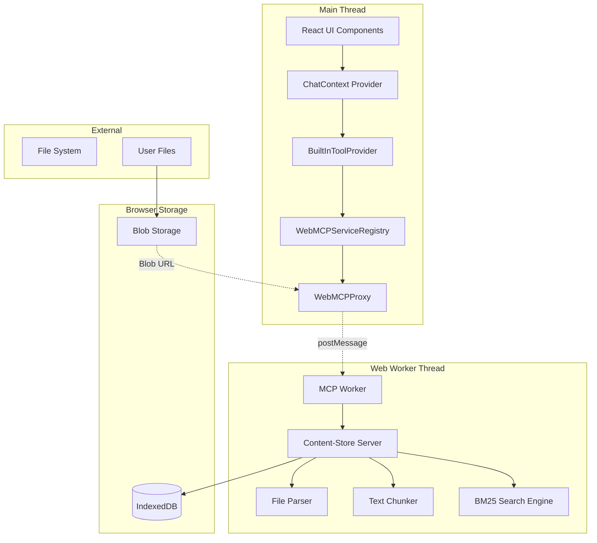
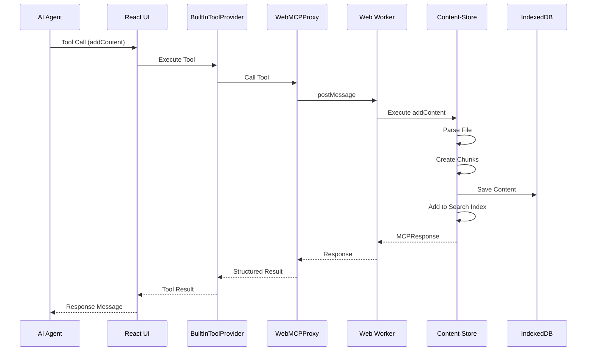
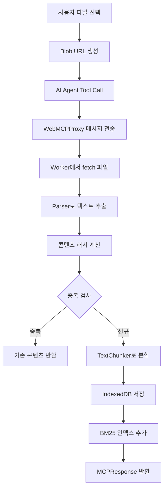
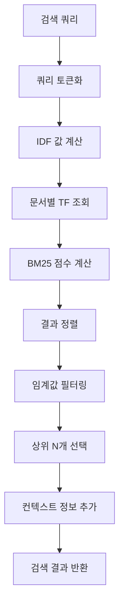
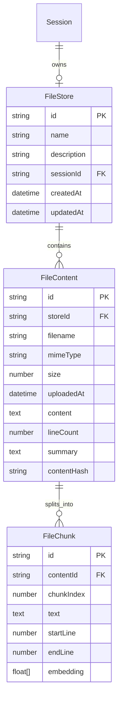

# Content-Store MCP Server Architecture

**작성일**: 2025-09-20  
**버전**: 1.1.0  
**호환성**: Tauri 2.x, React 18.3, Web Worker API

## 목적과 범위

### 해결하는 문제

Content-Store MCP 서버는 SynapticFlow AI 에이전트 플랫폼에서 파일 첨부, 파싱, 청킹, 검색 기능을 제공합니다. 다음과 같은 핵심 문제들을 해결합니다:

- **파일 처리 격리**: 대용량 파일 파싱이 메인 UI 스레드를 차단하지 않도록 Web Worker에서 격리 실행
- **다양한 파일 형식 지원**: PDF, DOCX, TXT 등 다양한 파일 형식의 일관된 텍스트 추출
- **지능형 검색**: BM25 알고리즘 기반 키워드 유사도 검색으로 관련 콘텐츠 빠른 검색
- **세션별 파일 관리**: 채팅 세션마다 독립적인 파일 스토어로 컨텍스트 격리
- **중복 방지**: 콘텐츠 해시 기반 중복 파일 업로드 방지

### 비즈니스 요구사항과의 연관성

- **AI 에이전트 컨텍스트 확장**: 파일 첨부를 통해 AI가 참조할 수 있는 지식 베이스 구축
- **대화형 파일 분석**: 업로드된 문서에 대한 질의응답과 요약 기능 지원
- **효율적인 정보 검색**: 대용량 문서에서 특정 정보를 빠르게 찾을 수 있는 검색 기능

### 시스템 경계와 제약사항

**시스템 경계**:

- 브라우저 Web Worker 환경에서 실행 (Node.js/Python 의존성 없음)
- IndexedDB 기반 로컬 저장소 사용
- MCP (Model Context Protocol) 표준 준수

**제약사항**:

- 파일 크기: 최대 50MB
- 텍스트 콘텐츠: 최대 10MB
- 브라우저 보안 정책: file:// URL 직접 접근 불가, Blob URL만 지원
- 저장소: 브라우저 IndexedDB 용량 제한

## 고수준 아키텍처



### 데이터 흐름

1. **파일 업로드**: 사용자가 파일을 선택하면 Blob URL 생성
2. **Tool Call**: AI 에이전트가 `addContent` 도구 호출
3. **Worker 처리**: Web Worker에서 파일 파싱, 청킹, 저장
4. **검색 인덱싱**: BM25 엔진에 청크 추가
5. **응답 반환**: 구조화된 MCPResponse로 결과 반환

### 제어 흐름



## 핵심 설계 결정사항

### 1. Web Worker 격리 실행

**결정**: Content-Store를 Web Worker에서 실행  
**이유**:

- 대용량 파일 파싱 시 UI 차단 방지
- CPU 집약적 작업(파싱, 청킹, 검색)의 백그라운드 처리
- 메인 스레드와 격리된 안전한 실행 환경

**트레이드오프**:

- 장점: UI 반응성 향상, 안정성 증대
- 단점: 메시지 기반 통신의 직렬화 오버헤드

### 2. IndexedDB 로컬 저장소

**결정**: 브라우저 IndexedDB 사용  
**이유**:

- 브라우저 네이티브 지원, 별도 백엔드 불필요
- 대용량 데이터 저장 지원
- 비동기 API로 성능 최적화

**트레이드오프**:

- 장점: 오프라인 지원, 빠른 액세스
- 단점: 브라우저별 용량 제한, 데이터 휘발성

### 3. BM25 검색 알고리즘

**결정**: BM25 (Best Matching 25) 알고리즘 사용  
**이유**:

- 키워드 검색에 최적화된 확률적 랭킹 함수
- TF-IDF보다 향상된 관련성 점수 계산
- 문서 길이 정규화로 공정한 점수 산출

### 4. 500자 청킹 전략

**결정**: 500자 크기, 50자 오버랩 청킹  
**이유**:

- 검색 정확도와 성능의 균형점
- 문장 단위 분할로 의미 보존
- 오버랩으로 컨텍스트 연속성 유지

## 구성 요소 상세

### 1. WebMCPServiceRegistry

**파일 위치**: `src/features/tools/WebMCPServiceRegistry.tsx`

#### 책임과 역할

- MCP 서버들을 BuiltInToolProvider에 등록
- 서버 로딩과 라이프사이클 관리
- Tool 실행 중개 및 에러 처리

#### 구현 세부사항

```typescript
export function WebMCPServiceRegistry({
  servers = [],
}: WebMCPServiceRegistryProps) {
  const { proxy, isLoading, initialized, getServerProxy } = useWebMCP();
  const { register, unregister } = useBuiltInTool();

  // 서비스 등록
  const services: Record<string, BuiltInService> = useMemo(() => {
    return servers.reduce((acc, serverName) => {
      acc[serverName] = {
        listTools: () => proxy?.listTools(serverName) || [],
        executeTool: async (call: ToolCall) =>
          await executeTool(serverName, call),
        loadService: () => loadServer(serverName),
        getServiceContext: async (options) => {
          const serverProxy = getServerProxy(serverName);
          return (await serverProxy?.getServiceContext?.(options)) || '';
        },
      };
      return acc;
    }, {});
  }, [servers, executeTool, loadServer, getServerProxy]);
}
```

#### API 및 인터페이스

- `loadServer(serverName: string)`: MCP 서버 로딩
- `executeTool(serviceId: string, call: ToolCall)`: 도구 실행
- `getServiceContext(options)`: 서비스 컨텍스트 조회

### 2. WebMCPProxy

**파일 위치**: `src/lib/web-mcp/mcp-proxy.ts`

#### 책임과 역할

- Web Worker와의 메시지 기반 통신 관리
- 요청/응답 매칭과 타임아웃 처리
- Worker 라이프사이클 관리 (지연 초기화)

#### 구현 세부사항

```typescript
export class WebMCPProxy {
  private worker: Worker | null = null;
  private pendingRequests = new Map<
    string,
    {
      resolve: (value: unknown) => void;
      reject: (error: Error) => void;
      timeout: ReturnType<typeof setTimeout>;
    }
  >();

  async callTool(
    serverName: string,
    toolName: string,
    args: unknown,
  ): Promise<MCPResponse<unknown>> {
    await this.ensureInitialization();

    return this.sendMessage({
      type: 'callTool',
      serverName,
      toolName,
      args,
    });
  }

  private async sendMessage(message: WebMCPWorkerMessage): Promise<unknown> {
    const requestId = crypto.randomUUID();
    const timeoutMs = this.config.timeout;

    return new Promise((resolve, reject) => {
      const timeout = setTimeout(() => {
        this.pendingRequests.delete(requestId);
        reject(new Error(`Request timeout after ${timeoutMs}ms`));
      }, timeoutMs);

      this.pendingRequests.set(requestId, { resolve, reject, timeout });

      this.worker!.postMessage({ ...message, requestId });
    });
  }
}
```

### 3. Content-Store Server

**파일 위치**: `src/lib/web-mcp/modules/content-store/server.ts`

#### 책임과 역할

- MCP 도구 구현 (`createStore`, `addContent`, `listContent`, `readContent`, `keywordSimilaritySearch`)
- 파일 파싱과 텍스트 추출
- 콘텐츠 청킹과 검색 인덱싱
- 중복 검사와 데이터 무결성 보장

#### 주요 도구 구현

##### createStore

```typescript
async function createStore(
  input: CreateStoreInput,
): Promise<MCPResponse<CreateStoreOutput>> {
  const now = new Date();
  const store: FileStore = {
    id: `store_${Date.now()}`,
    name: input.metadata?.name || 'Unnamed Store',
    description: input.metadata?.description,
    sessionId: input.metadata?.sessionId,
    createdAt: now,
    updatedAt: now,
  };

  await dbService.fileStores.upsert(store);

  return createMCPStructuredResponse<CreateStoreOutput>(
    `Store created with ID: ${store.id}`,
    { storeId: store.id, createdAt: now },
  );
}
```

##### addContent

```typescript
async function addContent(
  input: AddContentInput,
): Promise<MCPResponse<AddContentOutput>> {
  // 1. 파일 URL에서 콘텐츠 파싱
  if (input.fileUrl) {
    const parseResult = await parseFileFromUrl(input.fileUrl, input.metadata);
    finalContent = parseResult.content;
    // ...
  }

  // 2. 중복 검사
  const contentHash = await computeContentHash(finalContent);
  const existingContent = await dbService.fileContents.findByHashAndStore(
    contentHash,
    input.storeId,
  );

  if (existingContent) {
    return createMCPStructuredResponse(/*기존 콘텐츠 반환*/);
  }

  // 3. 텍스트 청킹
  const chunksData = textChunker.chunkText(finalContent);
  const chunks: FileChunk[] = chunksData.map((chunkData, index) => ({
    id: `${contentId}_chunk_${index}`,
    contentId,
    chunkIndex: index,
    text: chunkData.text,
    startLine: chunkData.startLine,
    endLine: chunkData.endLine,
  }));

  // 4. 데이터베이스 저장
  await dbService.fileContents.upsert(content);
  await dbService.fileChunks.upsertMany(chunks);

  // 5. 검색 인덱스 추가
  await searchEngine.addToIndex(input.storeId, chunks);

  return createMCPStructuredResponse(/*구조화된 응답*/);
}
```

### 4. 파일 파서 (Parser)

**파일 위치**: `src/lib/web-mcp/modules/content-store/parser.ts`

#### 책임과 역할

- 다양한 파일 형식의 텍스트 추출
- ParserFactory를 통한 확장 가능한 파서 아키텍처
- 에러 처리와 로깅

#### 구현 세부사항

```typescript
export async function parseRichFile(file: File): Promise<string> {
  try {
    logger.info('Starting file parsing', {
      filename: file.name,
      size: file.size,
      type: file.type,
    });

    const result = await ParserFactory.parseFile(file);

    logger.info('File parsing completed', {
      filename: file.name,
      contentLength: result.length,
    });

    return result;
  } catch (error) {
    if (error instanceof ParserError) {
      logger.error('Parser error', {
        filename: file.name,
        error: error.message,
        code: error.code,
      });
      throw error;
    }

    throw new ParserError(
      `Failed to parse file: ${error instanceof Error ? error.message : String(error)}`,
      'PARSER_UNKNOWN_ERROR',
      { filename: file.name },
    );
  }
}
```

### 5. 텍스트 청커 (TextChunker)

**파일 위치**: `src/lib/web-mcp/modules/content-store/chunker.ts`

#### 책임과 역할

- 텍스트를 검색 최적화된 청크로 분할
- 문장 경계 보존과 의미 단위 유지
- 오버랩 처리로 컨텍스트 연속성 보장

#### 구현 세부사항

```typescript
export class TextChunker {
  private static readonly DEFAULT_CHUNK_SIZE = 1000;
  private static readonly DEFAULT_OVERLAP = 200;

  static chunkText(text: string, options: ChunkOptions = {}): string[] {
    const {
      chunkSize = TextChunker.DEFAULT_CHUNK_SIZE,
      chunkOverlap = TextChunker.DEFAULT_OVERLAP,
      preserveLines = true,
    } = options;

    if (preserveLines) {
      const lines = text.split('\n');
      let currentChunk = '';
      let currentSize = 0;

      for (const line of lines) {
        const lineWithNewline = line + '\n';
        const lineSize = lineWithNewline.length;

        if (currentSize > 0 && currentSize + lineSize > chunkSize) {
          chunks.push(currentChunk.trim());

          // 오버랩 처리
          const overlapText = this.getOverlapText(currentChunk, chunkOverlap);
          currentChunk = overlapText + lineWithNewline;
          currentSize = currentChunk.length;
        } else {
          currentChunk += lineWithNewline;
          currentSize += lineSize;
        }
      }

      return chunks;
    }
  }
}
```

### 6. BM25 검색 엔진

**파일 위치**: `src/lib/web-mcp/modules/bm25/bm25-search-engine.ts`

#### 책임과 역할

- BM25 알고리즘 기반 키워드 검색
- 역인덱스 구축과 관리
- 관련성 점수 계산과 결과 랭킹

#### 구현 세부사항

```typescript
export class BM25SearchEngine {
  private k1 = 1.2; // 용어 빈도 가중치
  private b = 0.75; // 문서 길이 정규화 파라미터

  async search(
    storeId: string,
    query: string,
    options = {},
  ): Promise<SearchResult[]> {
    const { topN = 10, threshold = 0.0 } = options;

    // 쿼리 토큰화
    const queryTerms = this.tokenize(query);

    // BM25 점수 계산
    const scores = await this.calculateBM25Scores(storeId, queryTerms);

    // 결과 정렬 및 필터링
    return scores
      .filter((result) => result.score >= threshold)
      .sort((a, b) => b.score - a.score)
      .slice(0, topN);
  }

  private async calculateBM25Scores(
    storeId: string,
    queryTerms: string[],
  ): Promise<SearchResult[]> {
    // IDF 계산
    const idfValues = await this.calculateIDF(storeId, queryTerms);

    // 각 문서에 대해 BM25 점수 계산
    const documentScores = new Map<string, number>();

    for (const term of queryTerms) {
      const termResults = await this.getTermResults(storeId, term);

      for (const result of termResults) {
        const tf = result.termFrequency;
        const docLength = result.documentLength;
        const avgDocLength = await this.getAverageDocumentLength(storeId);

        // BM25 공식 적용
        const score =
          (idfValues.get(term)! * (tf * (this.k1 + 1))) /
          (tf + this.k1 * (1 - this.b + this.b * (docLength / avgDocLength)));

        documentScores.set(
          result.documentId,
          (documentScores.get(result.documentId) || 0) + score,
        );
      }
    }

    return Array.from(documentScores.entries()).map(([docId, score]) => ({
      documentId: docId,
      score,
      // ... 추가 메타데이터
    }));
  }
}
```

## 데이터 흐름

### 1. 파일 업로드 흐름



### 2. 검색 처리 흐름



### 3. 상태 관리

#### 전역 상태

- **MCP Server 상태**: 로딩, 초기화, 에러 상태
- **검색 인덱스**: 메모리 내 역인덱스 캐시

#### 로컬 상태

- **파일 업로드 진행상태**: 파싱, 청킹, 저장 단계별 상태
- **검색 세션**: 쿼리 히스토리와 결과 캐시

#### 상태 동기화

- IndexedDB 변경 시 검색 인덱스 자동 업데이트
- 세션 종료 시 임시 데이터 정리

## 데이터베이스 스키마

### FileStore 테이블

```typescript
interface FileStore {
  id: string; // "store_${timestamp}"
  name: string; // 사용자 정의 스토어 이름
  description?: string; // 스토어 설명
  sessionId?: string; // 연결된 채팅 세션 ID
  createdAt: Date; // 생성 시간
  updatedAt: Date; // 최종 수정 시간
}

// 인덱스: id (PK), sessionId, createdAt, updatedAt, name
```

### FileContent 테이블

```typescript
interface FileContent {
  id: string; // "content_${timestamp}_${random}"
  storeId: string; // 소속 스토어 ID (FK)
  filename: string; // 원본 파일명
  mimeType: string; // MIME 타입
  size: number; // 파일 크기 (바이트)
  uploadedAt: Date; // 업로드 시간
  content: string; // 파싱된 전체 텍스트
  lineCount: number; // 라인 수
  summary: string; // 요약 (첫 20줄)
  contentHash?: string; // 중복 검사용 SHA-256 해시
}

// 인덱스: id (PK), storeId, filename, uploadedAt, mimeType,
//        contentHash, [storeId+contentHash] (복합 인덱스)
```

### FileChunk 테이블

```typescript
interface FileChunk {
  id: string; // "${contentId}_chunk_${index}"
  contentId: string; // 소속 콘텐츠 ID (FK)
  chunkIndex: number; // 청크 순서 (0부터 시작)
  text: string; // 청크 텍스트 (500자 크기)
  startLine: number; // 시작 라인 번호 (1부터 시작)
  endLine: number; // 종료 라인 번호 (포함)
  embedding?: number[]; // 향후 벡터 검색용 (선택적)
}

// 인덱스: id (PK), contentId, chunkIndex
```

### 데이터 관계



## 통합 지점

### 1. ChatContext 통합

**파일 위치**: `src/context/ChatContext.tsx`

#### 통합 방식

```typescript
// Tool 실행 후 결과를 메시지로 변환
const executeToolCall = async (toolCall: ToolCall): Promise<Message> => {
  try {
    const result = await useUnifiedMCP().executeTool(toolCall);

    // structuredContent가 있는 경우 첨부 파일 정보로 활용
    const structuredContent = extractStructuredContent(result);

    return {
      id: generateId(),
      role: 'tool',
      content: result.content,
      toolCallId: toolCall.id,
      metadata: {
        structuredContent,
        executionTime: Date.now() - startTime,
      },
    };
  } catch (error) {
    return createErrorMessage(error, toolCall.id);
  }
};
```

#### 세션 컨텍스트 관리

```typescript
// 세션별 스토어 생성 및 관리
const initializeSessionStore = async (sessionId: string) => {
  const existingSession = await dbService.sessions.read(sessionId);

  if (!existingSession?.storeId) {
    // 새 스토어 생성
    const storeResult = await contentStoreServer.createStore({
      metadata: {
        name: `Session ${sessionId}`,
        sessionId,
      },
    });

    // 세션에 스토어 ID 연결
    await dbService.sessions.upsert({
      ...existingSession,
      id: sessionId,
      storeId: storeResult.storeId,
    });
  }
};
```

### 2. 에러 처리와 재시도 로직

#### 파일 파싱 에러

```typescript
async function parseFileFromUrl(
  fileUrl: string,
  metadata?: AddContentInput['metadata'],
): Promise<ParseResult> {
  const maxRetries = 3;
  let lastError: Error;

  for (let attempt = 1; attempt <= maxRetries; attempt++) {
    try {
      const response = await fetch(fileUrl);

      if (!response.ok) {
        throw new FileStoreError('Failed to fetch blob URL', 'FETCH_FAILED', {
          fileUrl,
          status: response.status,
        });
      }

      const blob = await response.blob();

      // 파일 크기 검증
      if (blob.size > MAX_FILE_SIZE) {
        throw new FileStoreError(
          `File size exceeds limit: ${blob.size} bytes (max: ${MAX_FILE_SIZE})`,
          'FILE_TOO_LARGE',
          { fileSize: blob.size, maxSize: MAX_FILE_SIZE },
        );
      }

      const file = new File([blob], metadata?.filename || 'unknown_file', {
        type: blob.type,
      });
      const content = await parseRichFile(file);

      return {
        content,
        filename: file.name,
        mimeType: file.type,
        size: file.size,
      };
    } catch (error) {
      lastError = error;
      logger.warn(`File parsing attempt ${attempt} failed`, {
        error: error.message,
      });

      if (attempt < maxRetries) {
        await new Promise((resolve) => setTimeout(resolve, 1000 * attempt)); // 지수 백오프
      }
    }
  }

  logger.error('File parsing failed after all retries', lastError);
  if (lastError instanceof FileStoreError) throw lastError;
  throw new FileStoreError('File parsing failed', 'PARSE_FAILED', {
    fileUrl,
    originalError:
      lastError instanceof Error ? lastError.message : String(lastError),
  });
}
```

#### 데이터베이스 트랜잭션

```typescript
async function addContentTransaction(
  content: FileContent,
  chunks: FileChunk[],
): Promise<void> {
  const db = LocalDatabase.getInstance();

  await db.transaction('rw', [db.fileContents, db.fileChunks], async () => {
    // 콘텐츠 저장
    await db.fileContents.put(content);

    // 청크들 일괄 저장
    await db.fileChunks.bulkPut(chunks);

    // 인덱스 업데이트는 트랜잭션 외부에서 처리 (검색 엔진 독립성)
  });

  // 트랜잭션 성공 후 검색 인덱스 업데이트
  await searchEngine.addToIndex(content.storeId, chunks);
}
```

### 3. 이벤트와 메시징

#### Worker 메시지 프로토콜

```typescript
interface WebMCPWorkerMessage {
  type: 'callTool' | 'listTools' | 'getServiceContext';
  requestId: string;
  serverName: string;
  toolName?: string;
  args?: unknown;
  options?: ServiceContextOptions;
}

interface WebMCPWorkerResponse {
  requestId: string;
  success: boolean;
  data?: unknown;
  error?: {
    message: string;
    code?: string;
    context?: Record<string, unknown>;
  };
}
```

#### 비동기 처리 패턴

```typescript
// Worker에서의 메시지 처리
self.addEventListener(
  'message',
  async (event: MessageEvent<WebMCPWorkerMessage>) => {
    const { type, requestId, serverName, toolName, args, options } = event.data;

    try {
      let result: unknown;

      switch (type) {
        case 'callTool':
          const server = await loadMCPServer(serverName);
          result = await server.callTool(toolName!, args);
          break;

        case 'listTools':
          const serverInstance = await loadMCPServer(serverName);
          result = serverInstance.tools || [];
          break;

        case 'getServiceContext':
          const contextServer = await loadMCPServer(serverName);
          result = (await contextServer.getServiceContext?.(options)) || '';
          break;

        default:
          throw new Error(`Unknown message type: ${type}`);
      }

      self.postMessage({
        requestId,
        success: true,
        data: result,
      } as WebMCPWorkerResponse);
    } catch (error) {
      console.error(`Worker error processing ${type}:`, error);

      self.postMessage({
        requestId,
        success: false,
        error: {
          message: error instanceof Error ? error.message : String(error),
          code: error instanceof FileStoreError ? error.code : 'UNKNOWN_ERROR',
          context: error instanceof FileStoreError ? error.context : undefined,
        },
      } as WebMCPWorkerResponse);
    }
  },
);
```

## 보안 고려사항

### 1. 입력 검증과 Sanitization

#### 파일 크기 및 형식 검증

```typescript
// 파일 크기 제한
const MAX_FILE_SIZE = 50 * 1024 * 1024; // 50MB
const MAX_CONTENT_LENGTH = 10 * 1024 * 1024; // 10MB

// MIME 타입 화이트리스트
const ALLOWED_MIME_TYPES = [
  'text/plain',
  'text/html',
  'text/markdown',
  'application/pdf',
  'application/msword',
  'application/vnd.openxmlformats-officedocument.wordprocessingml.document',
  // ... 추가 허용 타입
];

async function validateFile(file: File): Promise<void> {
  if (file.size > MAX_FILE_SIZE) {
    throw new FileStoreError('File too large', 'FILE_TOO_LARGE');
  }

  if (!ALLOWED_MIME_TYPES.includes(file.type)) {
    throw new FileStoreError('Unsupported file type', 'UNSUPPORTED_FILE_TYPE');
  }
}
```

#### 콘텐츠 검증

```typescript
function sanitizeContent(content: string): string {
  // HTML 태그 제거 (기본 텍스트만 허용)
  const sanitized = content.replace(/<[^>]*>/g, '');

  // 특수 문자 이스케이프
  return sanitized
    .replace(/&/g, '&amp;')
    .replace(/</g, '&lt;')
    .replace(/>/g, '&gt;')
    .replace(/"/g, '&quot;')
    .replace(/'/g, '&#x27;');
}
```

### 2. 데이터 보호

#### 콘텐츠 해싱

```typescript
import { computeContentHash } from '@/lib/content-hash';

// SHA-256 해시로 콘텐츠 무결성 보장
async function ensureContentIntegrity(content: string): Promise<string> {
  const hash = await computeContentHash(content);

  // 해시 충돌 검사 (매우 드물지만 보안상 중요)
  const existingContent = await dbService.fileContents.findByHash(hash);
  if (existingContent && existingContent.content !== content) {
    throw new FileStoreError('Hash collision detected', 'HASH_COLLISION');
  }

  return hash;
}
```

#### 세션 격리

```typescript
// 세션별 데이터 접근 제어
async function validateStoreAccess(
  storeId: string,
  sessionId: string,
): Promise<void> {
  const store = await dbService.fileStores.read(storeId);

  if (!store) {
    throw new StoreNotFoundError(storeId);
  }

  if (store.sessionId !== sessionId) {
    throw new FileStoreError('Access denied to store', 'ACCESS_DENIED', {
      storeId,
      sessionId,
    });
  }
}
```

### 3. Worker 샌드박싱

#### 제한된 API 접근

```typescript
// Worker 환경에서는 제한된 Web API만 사용
const ALLOWED_APIS = [
  'fetch', // Blob URL 접근용
  'IndexedDB', // 로컬 저장소
  'crypto', // 해싱용
  'TextEncoder', // 텍스트 인코딩
  'TextDecoder', // 텍스트 디코딩
];

// 위험한 API 접근 차단
if (typeof window !== 'undefined') {
  throw new Error('Content-Store must run in Worker environment');
}
```

## 성능과 확장성

### 1. 최적화 전략

#### 청킹 최적화

```typescript
class OptimizedTextChunker {
  // 적응형 청크 크기 - 문서 타입에 따라 조정
  private getOptimalChunkSize(mimeType: string): number {
    const sizeMap: Record<string, number> = {
      'text/plain': 800, // 일반 텍스트
      'text/markdown': 600, // 마크다운 (구조 고려)
      'application/pdf': 500, // PDF (파싱 복잡도 고려)
      'text/html': 400, // HTML (태그 제거 후)
    };

    return sizeMap[mimeType] || 500;
  }

  // 병렬 청킹 (대용량 문서용)
  async chunkLargeText(
    text: string,
    options: ChunkOptions = {},
  ): Promise<string[]> {
    if (text.length < 100000) {
      return this.chunkText(text, options);
    }

    // 문서를 섹션별로 분할하여 병렬 처리
    const sections = this.splitIntoSections(text);
    const chunkPromises = sections.map((section) =>
      this.chunkText(section, options),
    );

    const chunkArrays = await Promise.all(chunkPromises);
    return chunkArrays.flat();
  }
}
```

#### 검색 인덱스 최적화

```typescript
class OptimizedBM25SearchEngine extends BM25SearchEngine {
  private indexCache = new Map<string, InvertedIndex>();
  private readonly CACHE_TTL = 30 * 60 * 1000; // 30분

  // 인덱스 캐싱으로 검색 성능 향상
  async getIndex(storeId: string): Promise<InvertedIndex> {
    const cached = this.indexCache.get(storeId);

    if (cached && Date.now() - cached.lastUpdated < this.CACHE_TTL) {
      return cached;
    }

    const index = await this.buildIndex(storeId);
    this.indexCache.set(storeId, index);

    return index;
  }

  // 증분 인덱스 업데이트
  async incrementalIndexUpdate(
    storeId: string,
    newChunks: FileChunk[],
  ): Promise<void> {
    const existingIndex = await this.getIndex(storeId);

    // 새 청크들만 인덱싱
    for (const chunk of newChunks) {
      await this.addChunkToIndex(existingIndex, chunk);
    }

    existingIndex.lastUpdated = Date.now();
  }
}
```

#### 데이터베이스 최적화

```typescript
// 배치 처리로 성능 향상
class BatchProcessor {
  private pendingChunks: FileChunk[] = [];
  private readonly BATCH_SIZE = 100;
  private batchTimer: NodeJS.Timeout | null = null;

  addChunk(chunk: FileChunk): void {
    this.pendingChunks.push(chunk);

    if (this.pendingChunks.length >= this.BATCH_SIZE) {
      this.processBatch();
    } else {
      this.scheduleBatch();
    }
  }

  private scheduleBatch(): void {
    if (this.batchTimer) return;

    this.batchTimer = setTimeout(() => {
      this.processBatch();
    }, 1000); // 1초 후 배치 처리
  }

  private async processBatch(): Promise<void> {
    if (this.pendingChunks.length === 0) return;

    const chunks = this.pendingChunks.splice(0);
    this.batchTimer = null;

    try {
      await dbService.fileChunks.upsertMany(chunks);
      await searchEngine.addToIndex(chunks[0].storeId, chunks);
    } catch (error) {
      logger.error('Batch processing failed', {
        chunkCount: chunks.length,
        error,
      });
      // 실패한 청크들을 다시 큐에 추가하여 재시도
      this.pendingChunks.unshift(...chunks);
    }
  }
}
```

### 2. 확장성 고려사항

#### 수평 확장 (다중 Worker)

```typescript
class WorkerPool {
  private workers: Worker[] = [];
  private readonly poolSize: number;
  private currentWorkerIndex = 0;

  constructor(poolSize = navigator.hardwareConcurrency || 4) {
    this.poolSize = Math.min(poolSize, 8); // 최대 8개 Worker
    this.initializeWorkers();
  }

  private initializeWorkers(): void {
    for (let i = 0; i < this.poolSize; i++) {
      const worker = new Worker(new URL('./mcp-worker.ts', import.meta.url), {
        type: 'module',
      });

      this.workers.push(worker);
    }
  }

  getNextWorker(): Worker {
    const worker = this.workers[this.currentWorkerIndex];
    this.currentWorkerIndex = (this.currentWorkerIndex + 1) % this.poolSize;
    return worker;
  }

  async distributeTask<T>(task: () => Promise<T>): Promise<T> {
    const worker = this.getNextWorker();
    // Worker에서 작업 실행
    return await this.executeOnWorker(worker, task);
  }
}
```

#### 메모리 관리

```typescript
class MemoryOptimizedContentStore {
  private readonly MAX_MEMORY_USAGE = 100 * 1024 * 1024; // 100MB
  private currentMemoryUsage = 0;

  async addContent(
    input: AddContentInput,
  ): Promise<MCPResponse<AddContentOutput>> {
    // 메모리 사용량 확인
    if (this.currentMemoryUsage > this.MAX_MEMORY_USAGE) {
      await this.cleanup();
    }

    // 스트리밍 방식으로 대용량 파일 처리
    if (input.fileUrl) {
      return await this.processFileStreaming(input);
    }

    return await this.processFileInMemory(input);
  }

  private async processFileStreaming(
    input: AddContentInput,
  ): Promise<MCPResponse<AddContentOutput>> {
    const response = await fetch(input.fileUrl!);
    const reader = response.body?.getReader();

    if (!reader) {
      throw new FileStoreError('Failed to get file reader', 'STREAM_ERROR');
    }

    let content = '';
    const decoder = new TextDecoder();

    try {
      while (true) {
        const { done, value } = await reader.read();

        if (done) break;

        content += decoder.decode(value, { stream: true });

        // 청크 단위로 처리하여 메모리 절약
        if (content.length > 10000) {
          await this.processContentChunk(content);
          content = '';
        }
      }

      // 남은 콘텐츠 처리
      if (content.length > 0) {
        await this.processContentChunk(content);
      }
    } finally {
      reader.releaseLock();
    }
  }

  private async cleanup(): Promise<void> {
    // 오래된 캐시 정리
    await this.clearExpiredCache();

    // 가비지 컬렉션 힌트
    if (typeof globalThis.gc === 'function') {
      globalThis.gc();
    }

    this.currentMemoryUsage = 0;
  }
}
```

### 3. 모니터링 지표

#### 성능 메트릭

```typescript
interface PerformanceMetrics {
  fileParsingTime: number;
  chunkingTime: number;
  indexingTime: number;
  searchLatency: number;
  memoryUsage: number;
  cacheHitRate: number;
}

class MetricsCollector {
  private metrics: PerformanceMetrics[] = [];

  async recordOperation<T>(
    operation: string,
    fn: () => Promise<T>,
  ): Promise<T> {
    const startTime = performance.now();
    const startMemory = this.getMemoryUsage();

    try {
      const result = await fn();

      const endTime = performance.now();
      const endMemory = this.getMemoryUsage();

      this.recordMetric({
        operation,
        duration: endTime - startTime,
        memoryDelta: endMemory - startMemory,
        success: true,
      });

      return result;
    } catch (error) {
      this.recordMetric({
        operation,
        duration: performance.now() - startTime,
        success: false,
        error: error.message,
      });

      throw error;
    }
  }

  private getMemoryUsage(): number {
    if ('memory' in performance) {
      return (performance as any).memory.usedJSHeapSize;
    }
    return 0;
  }
}
```

## 문제 해결 가이드

### 1. 일반적인 문제와 해결책

#### 파일 파싱 실패

**증상**: 파일 업로드 시 "File parsing failed" 에러

**가능한 원인**:

- 지원되지 않는 파일 형식
- 파일 크기 제한 초과
- 손상된 파일

**해결 방법**:

```typescript
// 1. 파일 형식 확인
console.log('File type:', file.type);
console.log('File size:', file.size);

// 2. 지원 형식 확인
const supportedTypes = ['text/plain', 'application/pdf', 'application/msword'];
if (!supportedTypes.includes(file.type)) {
  console.error('Unsupported file type');
}

// 3. 파일 크기 확인
if (file.size > 50 * 1024 * 1024) {
  console.error('File too large');
}
```

#### 검색 결과 없음

**증상**: 키워드 검색 시 결과가 반환되지 않음

**가능한 원인**:

- 검색 인덱스 미구축
- 너무 높은 임계값 설정
- 오타 또는 부정확한 키워드

**해결 방법**:

```typescript
// 1. 인덱스 상태 확인
const isReady = await searchEngine.isReady();
if (!isReady) {
  await searchEngine.initialize();
}

// 2. 임계값 낮추기
const results = await searchEngine.search(storeId, query, {
  threshold: 0.0, // 임계값을 0으로 설정
  topN: 10,
});

// 3. 키워드 변형 시도
const variations = [query, query.toLowerCase(), query.replace(/s$/, '')];
for (const variant of variations) {
  const results = await searchEngine.search(storeId, variant);
  if (results.length > 0) break;
}
```

#### Worker 통신 실패

**증상**: "Request timeout" 또는 Worker 응답 없음

**가능한 원인**:

- Worker 초기화 실패
- 메시지 직렬화 에러
- 네트워크 문제 (Blob URL 접근)

**해결 방법**:

```typescript
// 1. Worker 상태 확인
const proxy = new WebMCPProxy({
  workerUrl: './mcp-worker.ts',
  timeout: 60000, // 타임아웃 증가
});

// 2. 초기화 상태 확인
await proxy.ensureInitialization();

// 3. 에러 핸들러 추가
proxy.onError((error) => {
  console.error('Worker error:', error);
});
```

### 2. 디버깅 도구

#### 로깅 설정

```typescript
// 상세 로깅 활성화
const logger = createWorkerSafeLogger('content-store');
logger.setLevel('debug');

// 성능 로깅
const performanceLogger = {
  time: (label: string) => console.time(label),
  timeEnd: (label: string) => console.timeEnd(label),
};

// 사용 예시
performanceLogger.time('file-parsing');
const content = await parseRichFile(file);
performanceLogger.timeEnd('file-parsing');
```

#### 데이터베이스 상태 확인

```typescript
// 스토어 상태 조회
async function debugStoreState(storeId: string): Promise<void> {
  const store = await dbService.fileStores.read(storeId);
  console.log('Store:', store);

  const contents = await dbService.fileContents.getPage(1, 100);
  const storeContents = contents.items.filter((c) => c.storeId === storeId);
  console.log('Contents:', storeContents.length);

  for (const content of storeContents) {
    const chunks = await dbUtils.getFileChunksByContent(content.id);
    console.log(`Content ${content.id}: ${chunks.length} chunks`);
  }
}
```

#### 검색 인덱스 진단

```typescript
// 인덱스 상태 확인
async function debugSearchIndex(storeId: string): Promise<void> {
  const indexStats = await searchEngine.getIndexStats(storeId);
  console.log('Index stats:', indexStats);

  // 샘플 검색 수행
  const testQueries = ['test', 'document', 'content'];
  for (const query of testQueries) {
    const results = await searchEngine.search(storeId, query, { topN: 5 });
    console.log(`Query "${query}": ${results.length} results`);
  }
}
```

## 향후 개선 사항

### 1. 벡터 검색 지원

```typescript
interface FutureFileChunk extends FileChunk {
  embedding: number[]; // 벡터 임베딩
  semanticHash: string; // 의미적 해시
}

class HybridSearchEngine {
  async hybridSearch(
    storeId: string,
    query: string,
    options: {
      keywordWeight: number; // 키워드 검색 가중치
      semanticWeight: number; // 의미적 검색 가중치
    },
  ): Promise<SearchResult[]> {
    // BM25 + 벡터 유사도 결합 검색
    const keywordResults = await this.bm25Search(storeId, query);
    const semanticResults = await this.vectorSearch(storeId, query);

    return this.combineResults(keywordResults, semanticResults, options);
  }
}
```

### 2. 실시간 협업 기능

```typescript
interface CollaborativeStore extends FileStore {
  collaborators: string[]; // 협업자 ID 목록
  permissions: Permission[]; // 권한 설정
  syncState: SyncState; // 동기화 상태
}

class RealtimeSync {
  async syncStoreChanges(
    storeId: string,
    changes: StoreChange[],
  ): Promise<void> {
    // WebRTC 또는 WebSocket을 통한 실시간 동기화
    await this.broadcastChanges(storeId, changes);
  }
}
```

### 3. 지능형 콘텐츠 분석

```typescript
class IntelligentContentAnalyzer {
  async analyzeContent(content: string): Promise<ContentAnalysis> {
    return {
      summary: await this.generateSummary(content),
      topics: await this.extractTopics(content),
      entities: await this.extractEntities(content),
      sentiment: await this.analyzeSentiment(content),
      readabilityScore: this.calculateReadability(content),
    };
  }
}
```

---

**문서 업데이트 이력**:

- 2025-09-20: 초기 작성 (v1.0.0)
- 향후 코드 변경 시 이 문서도 함께 업데이트 필요

**관련 문서**:

- [MCP Integration Architecture](../mcp-integration/architecture.md)
- [Database Schema](../../api/types.md)
- [Performance Guidelines](../../architecture/performance.md)
