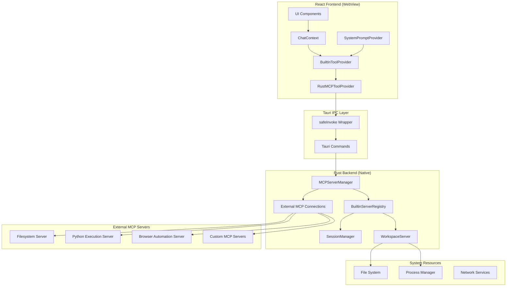
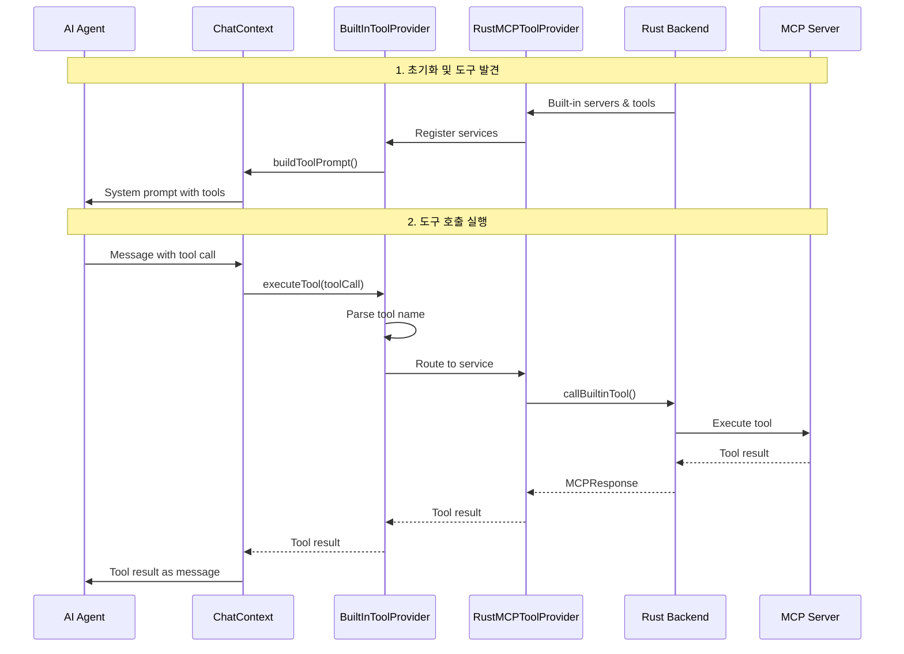
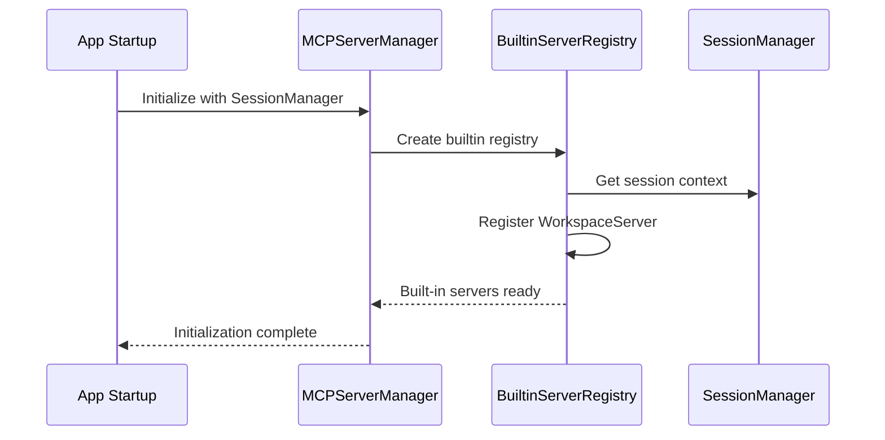
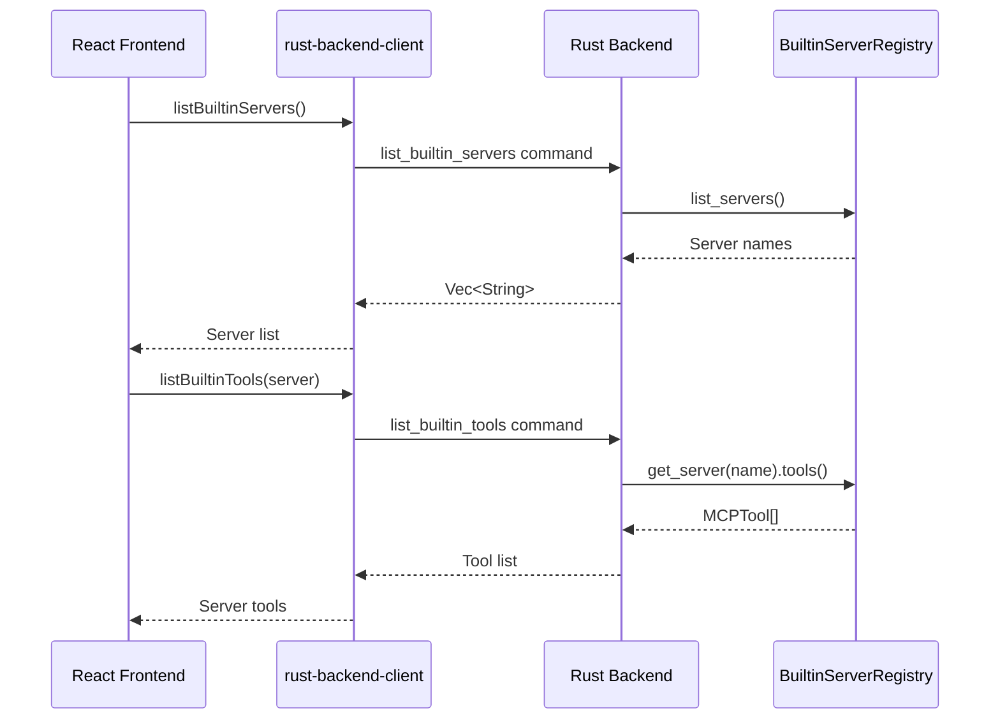
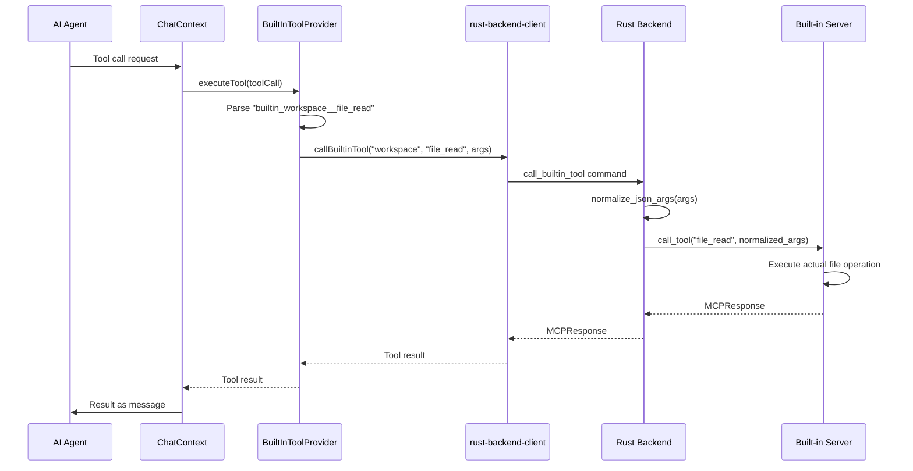

# Rust Backend MCP Integration Architecture

**작성일**: 2025-09-20  
**버전**: 2.0.0  
**호환성**: Tauri 2.x, React 18.3, RMCP 0.2.1, MCP Protocol

## 목적과 범위

### 해결하는 문제

Rust Backend MCP 통합은 SynapticFlow AI 에이전트 플랫폼에서 고성능 네이티브 도구와 AI Agent 간의 안전하고 효율적인 통신을 제공합니다. 다음과 같은 핵심 문제들을 해결합니다:

- **고성능 네이티브 작업**: 파일 시스템 접근, 프로세스 관리, 시스템 리소스 사용이 필요한 작업
- **보안 격리**: 브라우저 샌드박스를 벗어나는 작업의 안전한 실행
- **외부 MCP 서버 관리**: stdio 기반 외부 MCP 서버의 라이프사이클 관리
- **통합된 도구 인터페이스**: 내장 도구와 외부 도구의 일관된 사용 경험
- **AI Agent 컨텍스트 통합**: 동적 시스템 프롬프트와 서비스별 컨텍스트 제공

### 비즈니스 요구사항과의 연관성

- **확장 가능한 AI 플랫폼**: 다양한 외부 도구와의 통합으로 AI 기능 확장
- **개발자 생산성**: 파일 시스템, 코드 실행, 웹 자동화 등 개발 작업 지원
- **안전한 도구 실행**: 사용자 시스템에 대한 안전하고 제어된 접근
- **세션 기반 작업**: 채팅 세션별 독립적인 작업 환경 제공

### 시스템 경계와 제약사항

**시스템 경계**:

- Tauri 2.x 런타임 환경에서 실행
- MCP (Model Context Protocol) 표준 준수
- stdio, HTTP, WebSocket 전송 지원
- Built-in 서버와 외부 서버 통합 관리

**제약사항**:

- 플랫폼별 도구 가용성 (Windows/macOS/Linux)
- MCP 서버 프로세스 관리 오버헤드
- JSON-RPC 통신 직렬화 비용
- 보안 정책에 따른 시스템 접근 제한

## 고수준 아키텍처



### 데이터 흐름

1. **도구 발견**: Frontend가 Built-in 및 외부 서버의 도구 목록을 조회
2. **AI Agent 컨텍스트**: 시스템 프롬프트에 도구 정보와 서비스 컨텍스트 통합
3. **도구 호출**: AI Agent가 도구 호출 요청 생성
4. **라우팅**: BuiltInToolProvider가 도구 이름을 파싱하여 적절한 서비스로 라우팅
5. **실행**: Rust Backend에서 실제 도구 실행
6. **응답**: 표준화된 MCPResponse로 결과 반환

### 제어 흐름



## 핵심 설계 결정사항

### 1. 이중 MCP 백엔드 시스템

**결정**: Rust Built-in + Web Worker 이중 백엔드 구조  
**이유**:

- **Rust Backend**: 시스템 레벨 작업, 외부 MCP 서버 관리, 고성능 요구 작업
- **Web Worker Backend**: 브라우저 기반 작업, 의존성 없는 도구, UI 비차단 처리

**트레이드오프**:

- 장점: 최적의 성능과 호환성, 유연한 확장성
- 단점: 복잡한 도구 라우팅, 이중 관리 오버헤드

### 2. 통합 도구 네이밍 스키마

**결정**: `builtin_<alias>__<toolName>` 네이밍 규칙 적용  
**이유**:

- AI Agent가 도구를 구분할 수 있는 명확한 네임스페이스
- alias를 통한 서비스 라우팅으로 확장성 보장
- 도구 이름 충돌 방지

**구현 세부사항**:

```typescript
// 예시: builtin_workspace__file_read
// - prefix: "builtin_"
// - alias: "workspace" → serviceId 매핑
// - toolName: "file_read"
```

### 3. JSON 인수 정규화 시스템

**결정**: Rust Backend에서 AI 생성 JSON 자동 복구  
**이유**:

- AI가 생성한 부정확한 JSON 파라미터 처리
- 따옴표 불일치, 이스케이프 오류 등 일반적 문제 해결
- 도구 실행 성공률 향상

## 구성 요소 상세

### 1. MCPServerManager (Rust)

**파일 위치**: `src-tauri/src/mcp/server.rs`

#### 책임과 역할

- **외부 MCP 서버 관리**: stdio 기반 외부 서버의 시작/중지/연결 관리
- **Built-in 서버 레지스트리**: 내장 서버들의 통합 관리
- **도구 실행 라우팅**: 서버별 도구 호출 및 응답 처리
- **연결 상태 관리**: 서버별 연결 상태 추적 및 복구

#### 구현 세부사항

**주요 구조체**:

```rust
pub struct MCPServerManager {
    connections: Arc<Mutex<HashMap<String, MCPConnection>>>,
    builtin_servers: Arc<Mutex<Option<BuiltinServerRegistry>>>,
}
```

**핵심 메서드**:

- `start_server(config: MCPServerConfig)`: 외부 MCP 서버 시작
- `call_tool(server_name, tool_name, arguments)`: 도구 실행
- `list_builtin_servers()`: 내장 서버 목록 조회
- `stop_server(server_name)`: 서버 정리 및 중지

#### API 및 인터페이스

**Tauri Commands**:

```rust
#[tauri::command]
pub async fn list_builtin_servers() -> Result<Vec<String>, String>

#[tauri::command]
pub async fn call_builtin_tool(
    server_name: String,
    tool_name: String,
    arguments: serde_json::Value,
    state: tauri::State<'_, AppState>,
) -> Result<MCPResponse<serde_json::Value>, String>
```

#### 예제 코드

**기본 사용법**:

```rust
// MCPServerManager 초기화
let manager = MCPServerManager::new_with_session_manager(session_manager);

// 외부 서버 시작
let config = MCPServerConfig {
    name: "filesystem".to_string(),
    transport: "stdio".to_string(),
    command: Some("npx".to_string()),
    args: Some(vec!["-y".to_string(), "@modelcontextprotocol/server-filesystem".to_string()]),
    env: None,
};
let result = manager.start_server(config).await?;

// 도구 호출
let response = manager.call_tool(
    "filesystem",
    "read_file",
    serde_json::json!({"path": "/path/to/file.txt"})
).await;
```

### 2. BuiltinServerRegistry (Rust)

**파일 위치**: `src-tauri/src/mcp/builtin/mod.rs`

#### 책임과 역할

- **내장 서버 등록**: BuiltinMCPServer 트레이트 구현체들의 레지스트리
- **JSON 정규화**: AI 생성 인수의 자동 복구 및 정규화
- **서비스 컨텍스트**: 각 서버의 상태 정보를 AI Agent에게 제공

#### 구현 세부사항

**BuiltinMCPServer 트레이트**:

```rust
#[async_trait]
pub trait BuiltinMCPServer: Send + Sync {
    fn name(&self) -> &str;
    fn tools(&self) -> Vec<MCPTool>;
    async fn call_tool(&self, tool_name: &str, args: Value) -> MCPResponse;
    fn get_service_context(&self, options: Option<&Value>) -> String;
}
```

**JSON 정규화 기능**:

```rust
fn normalize_json_args(args: Value) -> Value {
    // "raw" 필드에서 파싱 실패한 JSON 복구
    if let Some(raw_value) = obj.get("raw").cloned() {
        if let Value::String(raw_str) = raw_value {
            let normalized_raw = Self::normalize_raw_json_string(&raw_str);
            match serde_json::from_str::<Value>(&normalized_raw) {
                Ok(parsed) => return Self::normalize_json_args(parsed),
                Err(_) => return Self::extract_from_malformed_json(&raw_str),
            }
        }
    }
    // 코드/명령어 파라미터의 따옴표 불일치 수정
    // ...
}
```

### 3. RustMCPToolProvider (TypeScript)

**파일 위치**: `src/features/tools/RustMCPToolProvider.tsx`

#### 책임과 역할

- **Rust 도구 등록**: Rust Backend의 Built-in 도구를 BuiltInService로 등록
- **도구 실행 위임**: 도구 호출을 Rust Backend로 안전하게 위임
- **JSON 파싱 처리**: Frontend에서의 인수 파싱 실패 시 raw 데이터 전달

#### 구현 세부사항

**서비스 등록 과정**:

```typescript
const [{ loading, value, error }, loadBuiltInServers] = useAsyncFn(async () => {
  const servers = await listBuiltinServers();
  const toolsByServer = await Promise.all(
    servers.map(async (s) => ({
      server: s,
      tools: await listBuiltinTools(s),
    })),
  );

  const serverTools: Record<string, MCPTool[]> = {};
  for (const entry of toolsByServer) {
    serverTools[entry.server] = entry.tools;
  }
  return serverTools;
}, [listBuiltinServers, listBuiltinTools]);
```

**도구 실행 로직**:

```typescript
executeTool: async (toolCall) => {
  const toolName = toolCall.function.name;
  let args: Record<string, unknown> = {};

  try {
    const raw = toolCall.function.arguments;
    if (typeof raw === 'string') {
      args = raw.length ? JSON.parse(raw) : {};
    } else if (typeof raw === 'object' && raw !== null) {
      args = raw as Record<string, unknown>;
    }
  } catch (e) {
    // 파싱 실패 시 raw 데이터로 전달하여 Rust에서 복구
    args = { raw: toolCall.function.arguments };
  }

  return await callBuiltinTool(serviceId, toolName, args);
};
```

### 4. BuiltInToolProvider (TypeScript)

**파일 위치**: `src/features/tools/index.tsx`

#### 책임과 역할

- **통합 도구 관리**: 여러 BuiltInService의 중앙 집중식 관리
- **도구 라우팅**: alias 기반 서비스 검색 및 도구 호출 라우팅
- **시스템 프롬프트 생성**: AI Agent를 위한 동적 도구 컨텍스트 구성

#### 구현 세부사항

**도구 이름 파싱**:

```typescript
const executeTool = useCallback(async (toolcall: ToolCall) => {
  // "builtin_workspace__file_read" → alias="workspace", toolName="file_read"
  let strippedToolName = toolcall.function.name.slice(BUILTIN_PREFIX.length);
  const idx = strippedToolName.indexOf('__');

  const alias = strippedToolName.slice(0, idx);
  const serviceId = aliasToIdTableRef.current.get(alias);
  const entry = serviceEntriesRef.current.get(serviceId);

  if (entry.status !== 'ready') {
    throw new Error(`Service "${serviceId}" is not ready`);
  }

  const toolName = strippedToolName.slice(idx + 2);
  return entry.service.executeTool({
    ...toolcall,
    function: { ...toolcall.function, name: toolName },
  });
}, []);
```

**시스템 프롬프트 구성**:

```typescript
const buildToolPrompt = useCallback(async (): Promise<string> => {
  const prompts: string[] = [];

  // 1. 기본 도구 정보
  prompts.push(`# Available Built-in Tools
You have access to built-in tools for file operations, code execution, and web-based processing.
**Available Built-In Tools:** ${availableTools.length}
**Important:** Use tool names exactly as they appear, including the "builtin_" prefix.`);

  // 2. 각 서비스의 컨텍스트 정보
  const currentSession = getCurrentSession();
  const contextOptions = { sessionId: currentSession?.id };

  for (const [serviceId, entry] of serviceEntries.entries()) {
    if (entry.status === 'ready' && entry.service.getServiceContext) {
      const prompt = await entry.service.getServiceContext(contextOptions);
      if (prompt) prompts.push(prompt);
    }
  }

  return prompts.join('\n\n');
}, [serviceEntries, availableTools.length, getCurrentSession]);
```

### 5. SystemPromptProvider (TypeScript)

**파일 위치**: `src/context/SystemPromptContext.tsx`

#### 책임과 역할

- **동적 프롬프트 관리**: 여러 소스의 시스템 프롬프트 통합
- **우선순위 기반 정렬**: 중요도에 따른 프롬프트 순서 관리
- **비동기 프롬프트 지원**: 함수 기반 동적 프롬프트 생성

#### 구현 세부사항

**프롬프트 확장 시스템**:

```typescript
interface SystemPromptExtension {
  id: string;
  key: string;
  content: SystemPrompt; // string | (() => string) | (() => Promise<string>)
  priority: number;
}

const register = useCallback(
  (key: string, prompt: SystemPrompt, priority: number = 0): string => {
    const id = createId();
    const extension = { id, key, content: prompt, priority };

    setExtensions((prev) => {
      const filtered = prev.filter((ext) => ext.key !== key);
      const updated = [...filtered, extension];
      return updated.sort((a, b) => b.priority - a.priority);
    });

    return id;
  },
  [],
);
```

## 데이터 흐름

### 1. 초기화 흐름



### 2. 도구 발견 흐름



### 3. 도구 실행 흐름



## 통합 지점

### 1. Tauri IPC 통신

**안전한 명령 호출**:

```typescript
// rust-backend-client.ts
async function safeInvoke<T>(command: string, args?: unknown): Promise<T> {
  try {
    const result = await invoke<T>(command, args);
    return result;
  } catch (error) {
    logger.error(`Tauri command failed: ${command}`, { args, error });
    throw new Error(`Backend command failed: ${error}`);
  }
}

export async function callBuiltinTool(
  serverName: string,
  toolName: string,
  args: Record<string, unknown>,
): Promise<MCPResponse<unknown>> {
  return safeInvoke('call_builtin_tool', {
    server_name: serverName,
    tool_name: toolName,
    arguments: args,
  });
}
```

### 2. MCP 프로토콜 준수

**표준 MCPResponse 형식**:

```rust
pub struct MCPResponse<T = serde_json::Value> {
    pub jsonrpc: String,
    pub id: Option<serde_json::Value>,
    pub result: Option<T>,
    pub error: Option<MCPError>,
}

pub struct MCPError {
    pub code: i32,
    pub message: String,
    pub data: Option<serde_json::Value>,
}
```

### 3. 세션 기반 컨텍스트

**WorkspaceServer 세션 통합**:

```rust
impl WorkspaceServer {
    pub fn new(session_manager: Arc<SessionManager>) -> Self {
        Self { session_manager }
    }

    fn get_service_context(&self, options: Option<&Value>) -> String {
        let session_id = options
            .and_then(|v| v.get("sessionId"))
            .and_then(|v| v.as_str());

        let workspace_info = if let Some(session_id) = session_id {
            self.session_manager.get_session_workspace_info(session_id)
        } else {
            "No session context available".to_string()
        };

        format!("# Workspace Server Status\n**Session**: {}\n**Workspace**: {}",
               session_id.unwrap_or("None"), workspace_info)
    }
}
```

## 보안 고려사항

### 1. 도구 실행 보안

**입력 검증**:

- JSON 파라미터 스키마 검증
- 파일 경로 sanitization
- 명령어 인젝션 방지

**권한 관리**:

- 세션별 작업 디렉토리 격리
- 파일 시스템 접근 제한
- 프로세스 실행 권한 관리

### 2. 외부 MCP 서버 보안

**프로세스 관리**:

- 서버 프로세스 격리
- 리소스 사용량 모니터링
- 비정상 종료 처리

**통신 보안**:

- stdio 파이프 보안
- JSON-RPC 메시지 검증
- 타임아웃 및 재시도 제한

## 성능과 확장성

### 1. 최적화 전략

**연결 관리**:

- 서버 연결 풀링
- 유휴 연결 정리
- 연결 상태 캐싱

**JSON 처리**:

- 스트리밍 파싱
- 메모리 효율적 직렬화
- 대용량 응답 청킹

### 2. 확장성 고려사항

**서버 확장**:

- 동적 서버 등록
- 플러그인 아키텍처
- 서버별 독립적 업데이트

**도구 네임스페이스**:

- alias 기반 충돌 방지
- 버전별 도구 관리
- 하위 호환성 보장

## 예제 코드

### 1. 새로운 Built-in 서버 추가

```rust
// src-tauri/src/mcp/builtin/example_server.rs
use super::BuiltinMCPServer;
use crate::mcp::{MCPResponse, MCPTool};
use async_trait::async_trait;
use serde_json::Value;

pub struct ExampleServer {
    name: String,
}

impl ExampleServer {
    pub fn new() -> Self {
        Self {
            name: "example".to_string(),
        }
    }
}

#[async_trait]
impl BuiltinMCPServer for ExampleServer {
    fn name(&self) -> &str {
        &self.name
    }

    fn description(&self) -> &str {
        "Example built-in MCP server"
    }

    fn tools(&self) -> Vec<MCPTool> {
        vec![
            MCPTool {
                name: "hello_world".to_string(),
                description: "Returns a hello world message".to_string(),
                input_schema: serde_json::json!({
                    "type": "object",
                    "properties": {
                        "name": {"type": "string", "description": "Name to greet"}
                    },
                    "required": ["name"]
                }),
            }
        ]
    }

    async fn call_tool(&self, tool_name: &str, args: Value) -> MCPResponse {
        match tool_name {
            "hello_world" => {
                let name = args.get("name")
                    .and_then(|v| v.as_str())
                    .unwrap_or("World");

                MCPResponse {
                    jsonrpc: "2.0".to_string(),
                    id: Some(serde_json::Value::String("hello".to_string())),
                    result: Some(serde_json::json!({
                        "content": [{"type": "text", "text": format!("Hello, {}!", name)}]
                    })),
                    error: None,
                }
            }
            _ => MCPResponse {
                jsonrpc: "2.0".to_string(),
                id: None,
                result: None,
                error: Some(crate::mcp::MCPError {
                    code: -32601,
                    message: format!("Tool '{}' not found", tool_name),
                    data: None,
                }),
            }
        }
    }

    fn get_service_context(&self, _options: Option<&Value>) -> String {
        "# Example Server\n**Status**: Active\n**Tools**: hello_world".to_string()
    }
}

// 서버 등록 (mod.rs에서)
registry.register_server(Box::new(ExampleServer::new()));
```

### 2. 외부 MCP 서버 설정

```typescript
// 외부 MCP 서버 구성 및 시작
const mcpServerConfig = {
  name: 'filesystem',
  transport: 'stdio',
  command: 'npx',
  args: ['-y', '@modelcontextprotocol/server-filesystem', '/path/to/directory'],
  env: {
    NODE_ENV: 'production',
  },
};

// 서버 시작
try {
  const result = await startMCPServer(mcpServerConfig);
  console.log('Server started:', result);

  // 도구 목록 조회
  const tools = await listMCPTools('filesystem');
  console.log('Available tools:', tools);

  // 도구 호출
  const response = await callMCPTool('filesystem', 'read_file', {
    path: '/path/to/file.txt',
  });
  console.log('File content:', response);
} catch (error) {
  console.error('MCP server operation failed:', error);
}
```

### 3. AI Agent 도구 사용

```typescript
// AI Agent가 생성하는 도구 호출 예시
const toolCall: ToolCall = {
  id: 'call_123',
  type: 'function',
  function: {
    name: 'builtin_workspace__file_read',
    arguments: JSON.stringify({
      path: '/workspace/project/README.md',
    }),
  },
};

// ChatContext에서 처리
const result = await executeTool(toolCall);
// result: MCPResponse with file content
```

## 문제 해결

### 1. 일반적인 문제

**MCP 서버 연결 실패**:

```typescript
// 연결 상태 확인
const serverStatus = await checkServerStatus('filesystem');
if (!serverStatus) {
  // 서버 재시작 시도
  await stopMCPServer('filesystem');
  await startMCPServer(originalConfig);
}
```

**JSON 파싱 오류**:

```rust
// Rust에서 자동 복구됨
fn normalize_json_args(args: Value) -> Value {
    // AI가 생성한 부정확한 JSON을 자동으로 수정
    // 예: 따옴표 불일치, 이스케이프 문제 등
}
```

### 2. 디버깅 가이드

**로깅 활성화**:

```rust
// Rust 로깅
log::info!("Tool execution: {} with args: {:?}", tool_name, args);
```

```typescript
// TypeScript 로깅
const logger = getLogger('RustMCPToolProvider');
logger.debug('Tool call received', { toolCall });
```

**상태 진단**:

```typescript
// 서비스 상태 확인
const allStatus = await checkAllServersStatus();
console.log('Server status:', allStatus);

// 도구 목록 검증
const tools = await listAllToolsUnified();
console.log('Available tools:', tools.length);
```

---

이 문서는 SynapticFlow의 Rust Backend MCP 통합 아키텍처를 완전히 문서화하고 있으며, 개발자가 시스템을 이해하고 확장하는 데 필요한 모든 정보를 제공합니다.
