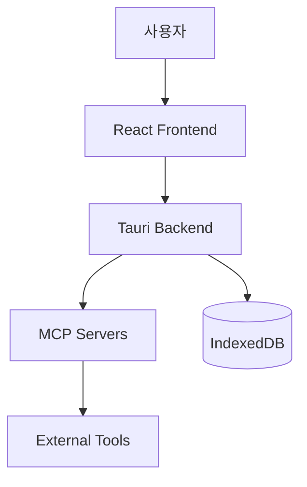
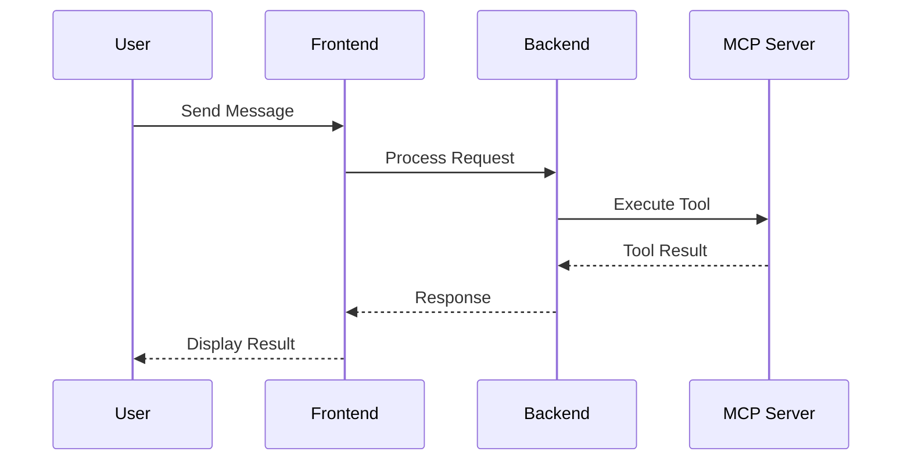

# Architecture Documentation Guide

## 개요

이 가이드는 LibrAgent 프로젝트의 아키텍처를 문서화할 때 필수적으로 포함해야 할 항목들과 구조를 제시합니다. 새로운 개발자가 코드베이스를 이해하고 유지보수할 수 있도록 돕는 것이 목표입니다.

## 문서 작성 원칙

### 1. 명확성 (Clarity)

- 기술적 개념을 쉽게 이해할 수 있도록 설명
- 전문 용어 사용 시 정의와 예시 제공
- 다이어그램과 코드 예시를 적극 활용

### 2. 완전성 (Completeness)

- 시스템의 모든 주요 구성 요소 포함
- 데이터 흐름과 제어 흐름 모두 설명
- 외부 의존성과 통합 지점 명시

### 3. 최신성 (Currency)

- 코드 변경 시 관련 문서 동시 업데이트
- 문서 작성/수정 날짜 명시
- 버전 정보와 호환성 명시

### 4. 실용성 (Practicality)

- 실제 개발 시나리오와 사용 사례 제공
- 문제 해결을 위한 가이드라인 포함
- 코드 위치와 파일 경로 명시

## 필수 문서 구조

### 1. 시스템 개요 (System Overview)

#### 필수 포함 항목

```markdown
# [Feature/System Name] Architecture

## 목적과 범위

- 해당 기능/시스템이 해결하는 문제
- 비즈니스 요구사항과의 연관성
- 시스템 경계와 제약사항

## 고수준 아키텍처

- 주요 구성 요소 간의 관계도
- 데이터 흐름과 제어 흐름
- 외부 시스템과의 인터페이스

## 핵심 설계 결정사항

- 기술 선택의 이유
- 아키텍처 패턴 적용 배경
- 트레이드오프와 제약사항
```

### 2. 구성 요소 상세 (Component Details)

#### 각 구성 요소별 필수 정보

```markdown
## [Component Name]

### 책임과 역할

- 주요 기능과 책임
- 다른 구성 요소와의 관계
- 외부 의존성

### 구현 세부사항

- 주요 클래스/함수/모듈
- 파일 위치: `src/path/to/file.ts`
- 설정 파일과 환경 변수

### API 및 인터페이스

- 공개 메서드와 함수
- 이벤트와 콜백
- 데이터 구조와 타입

### 예제 코드

- 기본 사용법
- 일반적인 사용 시나리오
- 에러 처리 패턴

### 설정 및 환경

- 필요한 환경 변수
- 설정 파일과 기본값
- 런타임 요구사항
```

### 3. 데이터 흐름 (Data Flow)

#### 필수 포함 정보

```markdown
## 데이터 흐름

### 요청-응답 주기

1. 사용자 입력/이벤트 발생
2. 데이터 검증과 변환
3. 비즈니스 로직 처리
4. 데이터 저장/조회
5. 응답 생성과 반환

### 상태 관리

- 전역 상태와 로컬 상태
- 상태 변경 트리거
- 상태 동기화 메커니즘

### 데이터 변환 지점

- 입력 데이터 검증
- 포맷 변환과 직렬화
- 출력 데이터 형식화
```

### 4. 통합 지점 (Integration Points)

#### 필수 문서화 내용

```markdown
## 외부 통합

### API 및 서비스 연동

- 외부 API 엔드포인트
- 인증과 권한 부여
- 에러 처리와 재시도 로직

### 데이터베이스 연동

- 스키마와 테이블 구조
- 쿼리 패턴과 최적화
- 트랜잭션 관리

### 이벤트와 메시징

- 이벤트 발행과 구독
- 메시지 큐와 브로커
- 비동기 처리 패턴
```

### 5. 보안 고려사항 (Security Considerations)

#### 필수 보안 문서

```markdown
## 보안

### 인증과 권한 부여

- 사용자 인증 방식
- 권한 검사 지점
- 세션 관리

### 데이터 보호

- 민감 데이터 처리
- 암호화와 해싱
- 입력 검증과 sanitization

### 보안 취약점 대응

- 알려진 취약점과 대응책
- 보안 테스트 방법
- 모니터링과 로깅
```

### 6. 성능과 확장성 (Performance & Scalability)

#### 필수 성능 문서

```markdown
## 성능

### 최적화 전략

- 캐싱 전략
- 데이터베이스 최적화
- 네트워크 최적화

### 확장성 고려사항

- 수평/수직 확장 방법
- 병목 지점과 해결책
- 모니터링 지표
```

## 코드 예시 작성 가이드

### 1. 실제 동작하는 코드 제공

```typescript
// ❌ 나쁜 예: 의사코드
function handleUserInput() {
  // ... 사용자 입력 처리
}

// ✅ 좋은 예: 실제 구현
export async function handleChatMessage(
  message: string,
  sessionId: string,
  assistantId: string,
): Promise<ChatResponse> {
  const session = await getSession(sessionId);
  const assistant = await getAssistant(assistantId);

  return await aiService.generateResponse({
    message,
    context: session.context,
    systemPrompt: assistant.systemPrompt,
  });
}
```

### 2. 에러 처리 포함

```typescript
// 에러 처리를 포함한 완전한 예시
try {
  const result = await mcpClient.callTool(toolName, parameters);
  return { success: true, data: result };
} catch (error) {
  logger.error('Tool execution failed', { toolName, error });

  if (error instanceof TimeoutError) {
    return { success: false, error: 'Tool execution timed out' };
  }

  throw new MCPToolError(`Failed to execute ${toolName}: ${error.message}`);
}
```

### 3. 설정과 환경 정보

```typescript
// 환경 변수와 설정 예시
interface MCPServerConfig {
  command: string;
  args: string[];
  timeout: number; // 기본값: 30000ms
  maxRetries: number; // 기본값: 3
}

// 사용 예시
const config: MCPServerConfig = {
  command: 'npx',
  args: ['-y', '@modelcontextprotocol/server-filesystem', '/path/to/directory'],
  timeout: 60000,
  maxRetries: 5,
};
```

## 다이어그램 가이드

### 1. 시스템 아키텍처 다이어그램



### 2. 시퀀스 다이어그램



### 3. 데이터 흐름 다이어그램


## 문서 구성 템플릿

### 기능별 문서 구조

```text
docs/
├── architecture/
│   ├── overview.md                 # 전체 시스템 개요
│   ├── data-flow.md               # 데이터 흐름
│   ├── security.md                # 보안 아키텍처
│   └── performance.md             # 성능 고려사항
├── features/
│   ├── chat/
│   │   ├── README.md             # 기능 개요
│   │   ├── architecture.md       # 상세 아키텍처
│   │   ├── api.md               # API 문서
│   │   └── examples.md          # 사용 예시
│   ├── mcp-integration/
│   │   ├── README.md
│   │   ├── server-management.md
│   │   ├── tool-execution.md
│   │   └── security.md
│   └── file-management/
│       ├── README.md
│       ├── content-store.md
│       └── attachment-handling.md
├── api/
│   ├── tauri-commands.md          # Tauri 명령어 API
│   ├── mcp-protocol.md           # MCP 프로토콜
│   └── types.md                  # 타입 정의
└── guides/
    ├── getting-started.md         # 시작 가이드
    ├── development.md            # 개발 가이드
    └── troubleshooting.md        # 문제 해결
```

## 문서 품질 체크리스트

### 완성도 검사

- [ ] 모든 주요 구성 요소가 문서화되었는가?
- [ ] 데이터 흐름이 명확하게 설명되었는가?
- [ ] 외부 의존성과 통합 지점이 포함되었는가?
- [ ] 에러 처리와 예외 상황이 다뤄졌는가?

### 실용성 검사

- [ ] 실제 동작하는 코드 예시가 제공되었는가?
- [ ] 파일 경로와 위치가 정확한가?
- [ ] 설정 방법과 환경 요구사항이 명시되었는가?
- [ ] 문제 해결을 위한 가이드가 포함되었는가?

### 유지보수성 검사

- [ ] 문서 작성/수정 날짜가 명시되었는가?
- [ ] 코드 변경 시 업데이트해야 할 문서가 식별되었는가?
- [ ] 버전 정보와 호환성이 명시되었는가?
- [ ] 관련 문서들 간의 연결이 명확한가?
