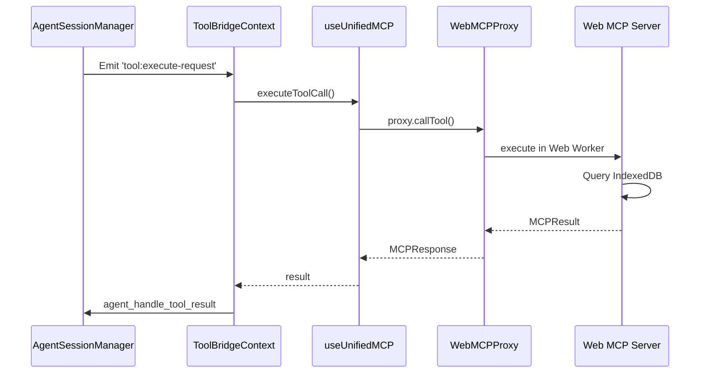
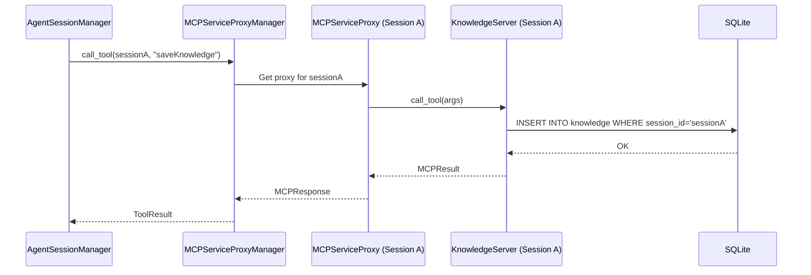

# Web MCP Tools Migration to Rust Built-in Backend

**Date:** 2024-12-26 14:30  
**Strategy:** Additive Migration (Zero Impact on Existing Code)  
**Target:** Migrate Web MCP modules to Rust Built-in servers for session-aware, multi-agent execution

---

## 작업의 목적

Web MCP 도구들을 Rust Backend로 이관하여 다음 목표를 달성:

1. **Session 격리**: 여러 Agent Session이 동시 실행될 때 도구 상태가 완전히 격리됨
2. **Multi-Agent 지원**: Frontend 상태와 무관하게 Background에서 여러 Agent가 병렬로 실행 가능
3. **성능 향상**: IndexedDB → SQLite, TypeScript → Rust로 전환하여 검색/쿼리 성능 개선
4. **일관성 확보**: SQLite를 Single Source of Truth로 사용하여 데이터 일관성 보장
5. **단순화**: ToolBridgeProvider 의존성 제거하여 아키텍처 복잡도 감소

---

## 현재의 상태 / 문제점

### 현재 구조

```
Frontend (React)
├── WebMCPContext (Web Worker 관리)
│   ├── assistant-manager (IndexedDB)
│   ├── bootstrap-server (Browser API)
│   ├── knowledge-server (IndexedDB)
│   ├── mcp-manager (IndexedDB + Tauri commands)
│   ├── planning-server (IndexedDB)
│   ├── playbook-store (IndexedDB + Handlebars)
│   └── ui-tools (React Components + Handlebars)
└── ToolBridgeContext (Rust ↔ TS 브릿지)

Backend (Rust)
├── MCPServerManager (External MCP only)
└── BuiltinServerRegistry
    ├── WorkspaceServer
    └── ContentStoreServer
```

### 문제점

1. **Session 전환 시 상태 손실**
   - Web MCP 도구는 IndexedDB에 session 정보를 저장하지만, Frontend Context가 unmount되면 in-memory 상태 손실
   - 예: `planning-server`의 goal/todos가 session 전환 후 복원되지 않음

2. **Multi-Agent 불가능**
   - Web Worker는 싱글톤으로 동작하며, 여러 session이 동일한 도구 인스턴스를 공유
   - Session A와 B가 동시에 `knowledge-server`를 호출하면 context 충돌 발생

3. **성능 병목**
   - BM25 검색이 TypeScript로 구현되어 대량 데이터 처리 시 느림
   - IndexedDB 트랜잭션이 Main Thread를 블로킹하여 UI 응답성 저하

4. **데이터 분산**
   - Message history는 Rust SQLite, 도구 상태는 IndexedDB에 분산 저장
   - 백업/복원 시 두 저장소를 모두 처리해야 함

5. **복잡한 브릿지 로직**
   - `ToolBridgeContext`가 Rust → TS 도구 호출을 중계
   - Event emitter + Tauri command의 이중 IPC로 인한 오버헤드

---

## 관련 코드의 구조 및 동작 방식 Summary

### 현재 Web MCP 통합 흐름



### 목표 Rust Built-in 통합 흐름



---

## 변경 이후의 상태 / 해결 판정 기준

### 목표 구조

```
Backend (Rust)
├── MCPServiceProxyManager (NEW)
│   ├── proxies: HashMap<SessionId, Arc<MCPServiceProxy>>
│   ├── external_mcp_manager: Arc<MCPServerManager>
│   └── db_pool: Arc<SqlitePool>
└── MCPServiceProxy (Per-Session Instance)
    ├── session_id: String
    ├── builtin_servers: HashMap<ToolId, Box<dyn BuiltinMCPServer>>
    └── external_mcp_manager: Arc<MCPServerManager>

Built-in Servers (NEW)
├── BootstrapServer (Stateless)
├── KnowledgeServer (session_id, db_pool)
├── PlanningServer (session_id, db_pool)
├── PlaybookServer (session_id, db_pool, handlebars)
└── AssistantServer (db_pool) // Global scope

Frontend (React) - No Changes to Existing Code
├── WebMCPContext (Deprecated but functional)
└── ToolBridgeContext (Transitional, gradually unused)
```

### 해결 판정 기준

**Phase 1 완료 조건:**

- [ ] `MCPServiceProxyManager` 구현 완료
- [ ] `BootstrapServer` 동작 확인 (platform detection, bootstrap guides)
- [ ] 기존 Web MCP `bootstrap-server` 여전히 동작 (병행 운영)
- [ ] 새 V2 Agent Session이 Rust `BootstrapServer` 사용

**Phase 2 완료 조건:**

- [ ] `KnowledgeServer`, `PlanningServer` 구현 완료
- [ ] SQLite 테이블 생성 작동
- [ ] Session별 데이터 격리 검증 (Multi-Agent 동시 실행 테스트)
- [ ] Web MCP 버전과 Rust 버전 병행 동작

**Phase 3 완료 조건:**

- [x] `PlaybookServer` UI resource 렌더링 동작
- [x] Handlebars 템플릿과 postMessage 이벤트 처리 확인
- [ ] ToolBridgeContext 완전 제거 가능

**최종 검증:**

- [ ] 2개 이상의 Agent Session이 동시에 동일 도구 호출 시 격리 확인
- [ ] Session 전환 후 도구 상태 유지 확인
- [ ] 기존 V1 Session은 여전히 Web MCP 사용
- [ ] Performance benchmark: Rust BM25 > TS BM25 (2x 이상)

---

## 수정이 필요한 코드 및 수정부분

### 1. MCPServiceProxyManager 구현 (NEW)

**파일:** `src-tauri/src/mcp/service_proxy_manager.rs` (신규)

```rust
use std::collections::HashMap;
use std::sync::Arc;
use tokio::sync::RwLock;
use sqlx::SqlitePool;

use crate::mcp::server::MCPServerManager;
use crate::mcp::service_proxy::MCPServiceProxy;

pub struct MCPServiceProxyManager {
    proxies: Arc<RwLock<HashMap<String, Arc<MCPServiceProxy>>>>,
    external_mcp_manager: Arc<MCPServerManager>,
    db_pool: Arc<SqlitePool>,
}

impl MCPServiceProxyManager {
    pub fn new(external_mcp_manager: Arc<MCPServerManager>, db_pool: Arc<SqlitePool>) -> Self {
        Self {
            proxies: Arc::new(RwLock::new(HashMap::new())),
            external_mcp_manager,
            db_pool,
        }
    }

    /// Create a new session-specific proxy with dedicated tool instances
    pub async fn create_proxy(
        &self,
        session_id: String,
        tool_ids: Vec<String>,
    ) -> Result<Arc<MCPServiceProxy>, String> {
        let proxy = MCPServiceProxy::new(
            session_id.clone(),
            tool_ids,
            self.external_mcp_manager.clone(),
            self.db_pool.clone(),
        )
        .await?;

        let proxy_arc = Arc::new(proxy);
        self.proxies
            .write()
            .await
            .insert(session_id, proxy_arc.clone());

        Ok(proxy_arc)
    }

    /// Get existing proxy for a session
    pub async fn get_proxy(&self, session_id: &str) -> Option<Arc<MCPServiceProxy>> {
        self.proxies.read().await.get(session_id).cloned()
    }

    /// Destroy proxy and cleanup resources
    pub async fn destroy_proxy(&self, session_id: &str) {
        self.proxies.write().await.remove(session_id);
        // Built-in tool instances are automatically dropped
    }

    /// Call a tool via the appropriate session proxy
    pub async fn call_tool(
        &self,
        session_id: &str,
        tool_name: &str,
        args: serde_json::Value,
    ) -> Result<crate::mcp::MCPResponse, String> {
        let proxy = self
            .get_proxy(session_id)
            .await
            .ok_or_else(|| format!("No proxy found for session: {}", session_id))?;

        proxy.call_tool(tool_name, args).await
    }
}
```

### 2. MCPServiceProxy 구현 (NEW)

**파일:** `src-tauri/src/mcp/service_proxy.rs` (신규)

```rust
use std::collections::HashMap;
use std::sync::Arc;
use serde_json::Value;
use sqlx::SqlitePool;

use crate::mcp::builtin::BuiltinMCPServer;
use crate::mcp::server::MCPServerManager;
use crate::mcp::{MCPResponse, MCPResult};

pub struct MCPServiceProxy {
    session_id: String,
    builtin_servers: HashMap<String, Box<dyn BuiltinMCPServer>>,
    external_mcp_manager: Arc<MCPServerManager>,
}

impl MCPServiceProxy {
    pub async fn new(
        session_id: String,
        tool_ids: Vec<String>,
        external_mcp_manager: Arc<MCPServerManager>,
        db_pool: Arc<SqlitePool>,
    ) -> Result<Self, String> {
        let mut builtin_servers = HashMap::new();

        for tool_id in tool_ids {
            if let Some(server) = create_builtin_server(&tool_id, session_id.clone(), db_pool.clone()).await? {
                builtin_servers.insert(tool_id, server);
            }
        }

        Ok(Self {
            session_id,
            builtin_servers,
            external_mcp_manager,
        })
    }

    pub async fn call_tool(
        &self,
        tool_name: &str,
        args: Value,
    ) -> Result<MCPResponse, String> {
        if tool_name.starts_with("builtin_") {
            // Extract tool ID from full name (builtin_knowledge__searchKnowledge -> knowledge)
            let tool_id = tool_name
                .strip_prefix("builtin_")
                .and_then(|s| s.split("__").next())
                .ok_or_else(|| format!("Invalid builtin tool name: {}", tool_name))?;

            let server = self
                .builtin_servers
                .get(tool_id)
                .ok_or_else(|| format!("Built-in server not found: {}", tool_id))?;

            let result = server.call_tool(tool_name, args).await?;
            Ok(MCPResponse {
                result: Some(result),
                error: None,
            })
        } else {
            // Route to external MCP manager
            self.external_mcp_manager.call_tool(tool_name, args).await
        }
    }
}

/// Factory function to create session-bound builtin server instances
async fn create_builtin_server(
    tool_id: &str,
    session_id: String,
    db_pool: Arc<SqlitePool>,
) -> Result<Option<Box<dyn BuiltinMCPServer>>, String> {
    match tool_id {
        "bootstrap" => Ok(Some(Box::new(
            crate::mcp::builtin::bootstrap::BootstrapServer::new()
        ))),
        "knowledge" => Ok(Some(Box::new(
            crate::mcp::builtin::knowledge::KnowledgeServer::new(session_id, db_pool).await?
        ))),
        "planning" => Ok(Some(Box::new(
            crate::mcp::builtin::planning::PlanningServer::new(session_id, db_pool).await?
        ))),
        "playbook" => Ok(Some(Box::new(
            crate::mcp::builtin::playbook::PlaybookServer::new(session_id, db_pool).await?
        ))),
        _ => Ok(None), // Unknown tool, skip
    }
}
```

### 3. BootstrapServer 구현 (NEW)

**파일:** `src-tauri/src/mcp/builtin/bootstrap/mod.rs` (신규)

```rust
use async_trait::async_trait;
use serde_json::{json, Value};

use crate::mcp::builtin::BuiltinMCPServer;
use crate::mcp::types::{MCPResult, ServiceContext};
use crate::mcp::MCPTool;

mod platform;
mod guides;

#[derive(Debug)]
pub struct BootstrapServer;

impl BootstrapServer {
    pub fn new() -> Self {
        Self
    }

    fn detect_platform(&self) -> MCPResult {
        let platform = platform::detect_current_platform();

        MCPResult {
            content: Some(vec![crate::mcp::types::MCPContent::Text {
                text: serde_json::to_string_pretty(&platform).unwrap(),
            }]),
            structured_content: Some(platform),
            is_error: Some(false),
        }
    }

    fn get_bootstrap_guide(&self, args: Value) -> MCPResult {
        let tool = args.get("tool").and_then(|v| v.as_str()).unwrap_or("");
        let platform = args.get("platform").and_then(|v| v.as_str());

        let guide = guides::get_installation_guide(tool, platform);

        MCPResult {
            content: Some(vec![crate::mcp::types::MCPContent::Text {
                text: serde_json::to_string_pretty(&guide).unwrap(),
            }]),
            structured_content: Some(guide),
            is_error: Some(false),
        }
    }
}

#[async_trait]
impl BuiltinMCPServer for BootstrapServer {
    fn name(&self) -> &str {
        "bootstrap"
    }

    fn description(&self) -> &str {
        "Platform detection and development tool installation guides"
    }

    fn tools(&self) -> Vec<MCPTool> {
        vec![
            MCPTool {
                name: "detectPlatform".to_string(),
                description: Some("Detect current OS, architecture, and shell".to_string()),
                input_schema: json!({
                    "type": "object",
                    "properties": {},
                    "required": []
                }),
            },
            MCPTool {
                name: "getBootstrapGuide".to_string(),
                description: Some("Get installation guide for development tools".to_string()),
                input_schema: json!({
                    "type": "object",
                    "properties": {
                        "tool": {
                            "type": "string",
                            "enum": ["node", "python", "uv", "docker", "git"],
                            "description": "Tool to install"
                        },
                        "platform": {
                            "type": "string",
                            "enum": ["windows", "linux", "darwin", "auto"],
                            "description": "Target platform (auto-detect if omitted)"
                        }
                    },
                    "required": ["tool"]
                }),
            },
        ]
    }

    fn get_service_context(&self, _options: Option<&Value>) -> ServiceContext {
        ServiceContext {
            context_prompt: "Bootstrap Server: Platform detection and installation guides available".to_string(),
            structured_state: None,
        }
    }

    async fn call_tool(&self, tool_name: &str, args: Value) -> Result<MCPResult, String> {
        match tool_name {
            "detectPlatform" => Ok(self.detect_platform()),
            "getBootstrapGuide" => Ok(self.get_bootstrap_guide(args)),
            _ => Err(format!("Unknown tool: {}", tool_name)),
        }
    }
}
```

### 4. KnowledgeServer 구현 (NEW)

**파일:** `src-tauri/src/mcp/builtin/knowledge/mod.rs` (신규)

```rust
use async_trait::async_trait;
use serde_json::{json, Value};
use sqlx::SqlitePool;
use std::sync::Arc;

use crate::mcp::builtin::BuiltinMCPServer;
use crate::mcp::types::{MCPResult, ServiceContext};
use crate::mcp::MCPTool;

#[derive(Debug)]
pub struct KnowledgeServer {
    session_id: String,
    db_pool: Arc<SqlitePool>,
}

impl KnowledgeServer {
    pub async fn new(session_id: String, db_pool: Arc<SqlitePool>) -> Result<Self, String> {
        // Ensure table exists
        sqlx::query(
            r#"
            CREATE TABLE IF NOT EXISTS knowledge (
                id INTEGER PRIMARY KEY AUTOINCREMENT,
                session_id TEXT NOT NULL,
                assistant_id TEXT,
                title TEXT NOT NULL,
                content TEXT NOT NULL,
                tags TEXT, -- JSON array
                created_at INTEGER NOT NULL,
                updated_at INTEGER NOT NULL,
                FOREIGN KEY (session_id) REFERENCES sessions(id) ON DELETE CASCADE
            )
            "#,
        )
        .execute(db_pool.as_ref())
        .await
        .map_err(|e| format!("Failed to create knowledge table: {}", e))?;

        Ok(Self { session_id, db_pool })
    }

    async fn save_knowledge(&self, args: Value) -> Result<MCPResult, String> {
        let title = args.get("title").and_then(|v| v.as_str())
            .ok_or("Missing 'title' parameter")?;
        let content = args.get("content").and_then(|v| v.as_str())
            .ok_or("Missing 'content' parameter")?;
        let tags = args.get("tags").and_then(|v| v.as_array())
            .map(|arr| serde_json::to_string(arr).unwrap())
            .unwrap_or_else(|| "[]".to_string());

        let now = chrono::Utc::now().timestamp_millis();

        let result = sqlx::query(
            r#"
            INSERT INTO knowledge (session_id, title, content, tags, created_at, updated_at)
            VALUES (?, ?, ?, ?, ?, ?)
            "#,
        )
        .bind(&self.session_id)
        .bind(title)
        .bind(content)
        .bind(&tags)
        .bind(now)
        .bind(now)
        .execute(self.db_pool.as_ref())
        .await
        .map_err(|e| format!("Failed to save knowledge: {}", e))?;

        Ok(MCPResult {
            content: Some(vec![crate::mcp::types::MCPContent::Text {
                text: format!("Knowledge saved: {} (ID: {})", title, result.last_insert_rowid()),
            }]),
            structured_content: Some(json!({
                "id": result.last_insert_rowid(),
                "title": title,
            })),
            is_error: Some(false),
        })
    }

    async fn search_knowledge(&self, args: Value) -> Result<MCPResult, String> {
        let query = args.get("query").and_then(|v| v.as_str()).unwrap_or("");

        let rows = sqlx::query_as::<_, (i64, String, String, String)>(
            r#"
            SELECT id, title, content, tags
            FROM knowledge
            WHERE session_id = ? AND (title LIKE ? OR content LIKE ?)
            ORDER BY updated_at DESC
            LIMIT 10
            "#,
        )
        .bind(&self.session_id)
        .bind(format!("%{}%", query))
        .bind(format!("%{}%", query))
        .fetch_all(self.db_pool.as_ref())
        .await
        .map_err(|e| format!("Failed to search knowledge: {}", e))?;

        let results: Vec<Value> = rows
            .into_iter()
            .map(|(id, title, content, tags)| {
                json!({
                    "id": id,
                    "title": title,
                    "content": content,
                    "tags": serde_json::from_str::<Vec<String>>(&tags).unwrap_or_default(),
                })
            })
            .collect();

        Ok(MCPResult {
            content: Some(vec![crate::mcp::types::MCPContent::Text {
                text: format!("Found {} knowledge items", results.len()),
            }]),
            structured_content: Some(json!({
                "items": results,
                "total": results.len(),
            })),
            is_error: Some(false),
        })
    }
}

#[async_trait]
impl BuiltinMCPServer for KnowledgeServer {
    fn name(&self) -> &str {
        "knowledge"
    }

    fn description(&self) -> &str {
        "Session-scoped knowledge base with search capabilities"
    }

    fn tools(&self) -> Vec<MCPTool> {
        vec![
            MCPTool {
                name: "saveKnowledge".to_string(),
                description: Some("Save a piece of knowledge to the session's knowledge base".to_string()),
                input_schema: json!({
                    "type": "object",
                    "properties": {
                        "title": { "type": "string" },
                        "content": { "type": "string" },
                        "tags": { "type": "array", "items": { "type": "string" } }
                    },
                    "required": ["title", "content"]
                }),
            },
            MCPTool {
                name: "searchKnowledge".to_string(),
                description: Some("Search knowledge items in the current session".to_string()),
                input_schema: json!({
                    "type": "object",
                    "properties": {
                        "query": { "type": "string" }
                    }
                }),
            },
        ]
    }

    fn get_service_context(&self, _options: Option<&Value>) -> ServiceContext {
        ServiceContext {
            context_prompt: format!("Knowledge Server active for session {}", self.session_id),
            structured_state: None,
        }
    }

    async fn call_tool(&self, tool_name: &str, args: Value) -> Result<MCPResult, String> {
        match tool_name {
            "saveKnowledge" => self.save_knowledge(args).await,
            "searchKnowledge" => self.search_knowledge(args).await,
            _ => Err(format!("Unknown tool: {}", tool_name)),
        }
    }
}
```

### 5. AssistantServer 구현 (NEW)

**파일:** `src-tauri/src/mcp/builtin/assistant/mod.rs` (신규)

```rust
use async_trait::async_trait;
use serde_json::{json, Value};
use sqlx::SqlitePool;
use std::sync::Arc;

use crate::mcp::builtin::BuiltinMCPServer;
use crate::mcp::types::{MCPResult, ServiceContext};
use crate::mcp::MCPTool;

#[derive(Debug)]
pub struct AssistantServer {
    db_pool: Arc<SqlitePool>,
}

impl AssistantServer {
    pub async fn new(db_pool: Arc<SqlitePool>) -> Result<Self, String> {
        // Ensure table exists (Global scope, no session_id FK)
        sqlx::query(
            r#"
            CREATE TABLE IF NOT EXISTS assistants (
                id TEXT PRIMARY KEY,
                name TEXT NOT NULL,
                config TEXT NOT NULL, -- JSON
                created_at INTEGER NOT NULL,
                updated_at INTEGER NOT NULL
            )
            "#,
        )
        .execute(db_pool.as_ref())
        .await
        .map_err(|e| format!("Failed to create assistants table: {}", e))?;

        Ok(Self { db_pool })
    }

    // Implement CRUD methods...
}

#[async_trait]
impl BuiltinMCPServer for AssistantServer {
    fn name(&self) -> &str {
        "assistant"
    }

    fn description(&self) -> &str {
        "Global assistant management"
    }

    fn tools(&self) -> Vec<MCPTool> {
        vec![
            // Define tools...
        ]
    }

    fn get_service_context(&self, _options: Option<&Value>) -> ServiceContext {
        ServiceContext {
            context_prompt: "Assistant Management Server".to_string(),
            structured_state: None,
        }
    }

    async fn call_tool(&self, tool_name: &str, args: Value) -> Result<MCPResult, String> {
        // Implement tool routing...
        Err(format!("Tool not implemented: {}", tool_name))
    }
}
```

### 6. AgentSessionManager 통합 (MODIFY)

**파일:** `src-tauri/src/agent/session_manager.rs`

```rust
// ADD: Import MCPServiceProxyManager
use crate::mcp::service_proxy_manager::MCPServiceProxyManager;

pub struct AgentSessionManager {
    active_sessions: Arc<RwLock<HashMap<String, AgentSession>>>,
    app_handle: AppHandle,
    proxy_manager: Arc<MCPServiceProxyManager>, // NEW
}

impl AgentSessionManager {
    pub fn new(app_handle: AppHandle, proxy_manager: Arc<MCPServiceProxyManager>) -> Self {
        Self {
            active_sessions: Arc::new(RwLock::new(HashMap::new())),
            app_handle,
            proxy_manager,
        }
    }

    pub async fn create_session(
        &self,
        session_id: String,
        name: Option<String>,
        agent_config: crate::agent::AgentConfig,
    ) -> Result<SessionMetadata, String> {
        // ... existing session creation logic ...

        // NEW: Create proxy for this session
        let tool_ids = agent_config.tools.clone(); // e.g., ["knowledge", "planning"]
        self.proxy_manager
            .create_proxy(session_id.clone(), tool_ids)
            .await?;

        // ... rest of existing logic ...
    }

    pub async fn start_workflow(
        &self,
        session_id: String,
        user_message: Message,
    ) -> Result<(), String> {
        // ... existing workflow logic ...

        // When tool calls are detected:
        for tool_call in tool_calls {
            // NEW: Try to route through proxy manager first
            // If the tool is handled by Rust backend (V2), execute it.
            // If not (V1 Web MCP), fall back to existing event emission.

            let proxy_result = self.proxy_manager
                .call_tool(&session_id, &tool_call.function.name, tool_call.function.arguments.clone())
                .await;

            match proxy_result {
                Ok(mcp_response) => {
                    // Handle Rust backend tool result
                    // ... process mcp_response ...
                    continue;
                }
                Err(e) => {
                    // Log error or check if it's a "Tool not found" error
                    // If tool not found in Rust, proceed to legacy Web MCP handling (emit event)
                    // ... existing event emission logic ...
                }
            }
        }

        Ok(())
    }

    pub async fn terminate_session(&self, session_id: String) -> Result<(), String> {
        // ... existing termination logic ...

        // NEW: Cleanup proxy
        self.proxy_manager.destroy_proxy(&session_id).await;

        Ok(())
    }
}
```

---

## 재사용 가능한 연관 코드

### 기존 Rust 코드 (재사용)

| 파일 경로                                             | 주요 기능                            | 재사용 방법                   |
| :---------------------------------------------------- | :----------------------------------- | :---------------------------- |
| `src-tauri/src/mcp/builtin/mod.rs`                    | `BuiltinMCPServer` trait             | 새 서버가 구현할 인터페이스   |
| `src-tauri/src/mcp/types.rs`                          | `MCPTool`, `MCPResult`, `MCPContent` | 도구 정의 및 응답 구조        |
| `src-tauri/src/mcp/server/mod.rs`                     | `MCPServerManager`                   | External MCP 관리 (공유)      |
| `src-tauri/src/mcp/builtin/workspace/ui_resources.rs` | `create_html_export_ui()`            | Handlebars 템플릿 렌더링 패턴 |
| `src-tauri/src/repositories/*.rs`                     | SQLite CRUD 패턴                     | 새 테이블의 Repository 구현   |

### 기존 Web MCP 코드 (참조용)

| 파일 경로                                                       | 주요 기능         | 참조 목적                        |
| :-------------------------------------------------------------- | :---------------- | :------------------------------- |
| `src/lib/web-mcp/modules/bootstrap-server/platform-detector.ts` | 플랫폼 감지 로직  | Rust `platform.rs` 구현 시 참조  |
| `src/lib/web-mcp/modules/knowledge-server/server.ts`            | BM25 검색, CRUD   | Rust `KnowledgeServer` 기능 매핑 |
| `src/lib/web-mcp/modules/playbook-store/templates/*.hbs`        | Handlebars 템플릿 | Rust Handlebars 크레이트로 포팅  |

---

## Test Code 가이드

### Unit Tests

**파일:** `src-tauri/src/mcp/service_proxy_manager.rs`

```rust
#[cfg(test)]
mod tests {
    use super::*;

    #[tokio::test]
    async fn test_session_isolation() {
        let manager = create_test_manager().await;

        // Create two proxies
        let proxy_a = manager.create_proxy("session-a".to_string(), vec!["knowledge".to_string()]).await.unwrap();
        let proxy_b = manager.create_proxy("session-b".to_string(), vec!["knowledge".to_string()]).await.unwrap();

        // Save knowledge to session A
        proxy_a.call_tool("saveKnowledge", json!({
            "title": "Session A Data",
            "content": "A content"
        })).await.unwrap();

        // Save knowledge to session B
        proxy_b.call_tool("saveKnowledge", json!({
            "title": "Session B Data",
            "content": "B content"
        })).await.unwrap();

        // Search in A should not find B's data
        let result_a = proxy_a.call_tool("searchKnowledge", json!({
            "query": "Session"
        })).await.unwrap();

        // Assert only "Session A Data" is returned
    }
}
```

### Integration Tests

**파일:** `src-tauri/tests/builtin_knowledge_server.rs`

```rust
#[tokio::test]
async fn test_knowledge_crud_workflow() {
    let db_pool = setup_test_db().await;
    let server = KnowledgeServer::new("test-session".to_string(), db_pool).await.unwrap();

    // Save
    let save_result = server.call_tool("saveKnowledge", json!({
        "title": "Test",
        "content": "Content",
        "tags": ["tag1"]
    })).await.unwrap();
    assert!(!save_result.is_error.unwrap_or(false));

    // Search
    let search_result = server.call_tool("searchKnowledge", json!({
        "query": "Test"
    })).await.unwrap();
    let items = search_result.structured_content.unwrap()["items"].as_array().unwrap();
    assert_eq!(items.len(), 1);
}
```

### E2E Tests

**파일:** `src/test/e2e/multi-agent-session.test.ts`

```typescript
describe('Multi-Agent Session Isolation', () => {
  it('should isolate tool state between concurrent sessions', async () => {
    // Create two agent sessions
    const sessionA = await invoke('agent_create_session', {
      sessionId: 'session-a',
      agentConfig: { tools: ['knowledge'] },
    });

    const sessionB = await invoke('agent_create_session', {
      sessionId: 'session-b',
      agentConfig: { tools: ['knowledge'] },
    });

    // Save knowledge to both (concurrent)
    await Promise.all([
      invoke('proxy_call_tool', {
        sessionId: 'session-a',
        toolName: 'saveKnowledge',
        args: { title: 'A Data' },
      }),
      invoke('proxy_call_tool', {
        sessionId: 'session-b',
        toolName: 'saveKnowledge',
        args: { title: 'B Data' },
      }),
    ]);

    // Search should return isolated results
    const resultsA = await invoke('proxy_call_tool', {
      sessionId: 'session-a',
      toolName: 'searchKnowledge',
      args: { query: 'Data' },
    });

    expect(resultsA.items.length).toBe(1);
    expect(resultsA.items[0].title).toBe('A Data');
  });
});
```

---

## 추가 분석 과제

### 1. BM25 Performance Benchmark

**목적:** Rust BM25 구현이 TypeScript 대비 성능 향상 확인

**측정 항목:**

- 1000개, 10000개, 100000개 문서에서 검색 시간
- 메모리 사용량
- 인덱싱 속도

**도구:** Criterion.rs (Rust), Benchmark.js (TS)

### 3. Handlebars Template Security

**목적:** Playbook/UI-Tools의 Handlebars 렌더링 시 XSS 방지

**조사 항목:**

- Rust `handlebars` 크레이트의 auto-escaping 설정
- User-generated template의 sanitization 필요 여부
- CSP (Content Security Policy) 적용 방안

---

## Clarification Q-list

### Q1: Web MCP Deprecation Timeline

**질문:** 기존 Web MCP 모듈을 언제 완전히 제거할 것인가?

**옵션:**

- A) Phase 3 완료 즉시 제거 (공격적)
- B) 6개월 deprecation 기간 후 제거 (안전)
- C) V1 Session이 모두 소멸될 때까지 유지 (보수적)

**영향:** Frontend 번들 크기, 유지보수 부담

> 답변: C V1 Session이 소멸될때가지 유지 / V2검증 이후 V1을 즉시 제거할 예정임

---

### Q2: External MCP Session Handling

**질문:** 외부 MCP 서버(stdio)는 session context를 어떻게 처리할 것인가?

**옵션:**

- A) Tool arguments에 `_session_id` metadata 추가
- B) External MCP는 stateless로 가정하고 session 미지원
- C) MCP 프로토콜 확장 (Server Capabilities에 session support 추가)

**영향:** External MCP와의 호환성

> 답변: 외부 MCP의 경우 Streamable HTTP의 경우 Stateless한 동작을 제공한다고 가정, SessionId를 넘기지 않음, 다만 Child Process로 시작되는 npx / uv / python 패키지 형태의 MCP는 각 Proxy별로 독립적인 Process를 만들어서 상태가 격리되도록 함

---

### Q3: Assistant-Manager Scope

**질문:** `assistant-manager`는 session-scoped인가 global-scoped인가?

**현재 Web MCP:** Global scope (모든 session이 공유)

**옵션:**

- A) Global 유지 (AssistantService는 session 무관)
- B) Session별 assistant 리스트 필터링
- C) Assistant 자체에 session_id 추가

**영향:** Agent 관리 UX

> 답변: Global Scope임

---

### Q4: Concurrent Tool Execution Limit

**질문:** 한 session에서 동시 실행 가능한 tool 수를 제한할 것인가?

**배경:** 무한 루프로 인한 리소스 고갈 방지

**옵션:**

- A) 제한 없음 (CancellationToken으로만 제어)
- B) Session당 최대 10개 동시 실행
- C) Tool 종류별 제한 (DB query는 5개, HTTP는 20개)

**영향:** 성능, 안정성

> 답변: Session 당 최대 10개

---

### Q5: Tool Result Caching

**질문:** 동일한 tool call의 결과를 캐싱할 것인가?

**예:** `searchKnowledge("rust")`를 5초 내 재호출 시 DB 쿼리 생략

**옵션:**

- A) 캐싱 없음 (항상 최신 데이터)
- B) Read-only tool만 5초 캐싱
- C) Tool별 캐싱 전략 설정 (TTL, LRU)

**영향:** 성능 vs 데이터 일관성

> 답변: 캐싱이 적절하지 않은 Volatile state들이 있을 수 있음. 케싱은 MCP 도구의 구현에서 적절성 여부를 기준으로 판단, MCP 도구 공통의 Proxy에 적용보단 각 MCP에 개별적 적용 검토가 필요함

---

## 구현 순서 (Recommended)

### Week 1: Foundation

1. `MCPServiceProxyManager`, `MCPServiceProxy` 구현 및 테스트
2. `BootstrapServer` 구현 (stateless, 간단)
3. `AgentSessionManager` 통합

### Week 2: Data Tools

4. SQLite 테이블 생성
5. `KnowledgeServer` 구현 및 BM25 검색
6. `PlanningServer` 구현

### Week 3: UI Tools

7. `PlaybookServer` + Handlebars 통합
8. UI resource rendering 테스트
9. ToolBridgeContext deprecation 시작

### Week 4: Testing & Optimization

10. Multi-agent integration tests
11. Performance benchmarking
12. Documentation 업데이트

---

**Additive Migration 체크리스트:**

- [ ] 기존 Web MCP 코드 수정 없음
- [ ] V1 Session은 Web MCP 계속 사용
- [ ] V2 Session만 Rust Built-in 사용
- [ ] Feature flag (`use_v2_agent`) 제어
- [ ] Parallel execution 가능 확인
