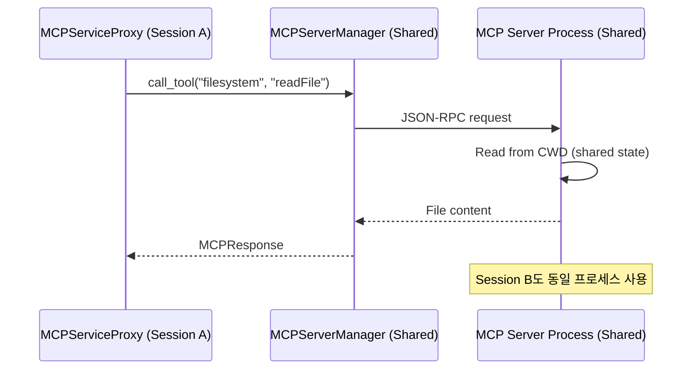
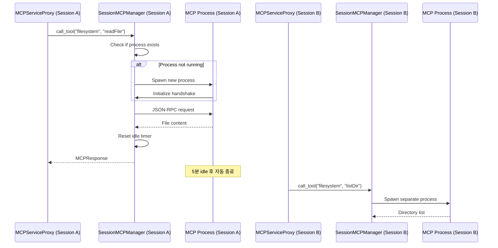

# External MCP Server Session Isolation with Lazy Process Management

**Date:** 2024-12-26 17:30  
**Strategy:** Lazy Per-Session Process Spawning (Option A)  
**Target:** Session-aware external MCP server integration with resource efficiency

---

## 작업의 목적

External MCP 서버의 session별 격리 및 통합을 구현하여 다음 목표 달성:

1. **완전한 Session 격리**: 각 Agent Session이 독립적인 MCP 서버 연결을 가짐
2. **Transport별 최적화**:
   - **stdio**: Session별 독립 프로세스 (완전 격리)
   - **Streamable HTTP/SSE**: Session ID header 주입 + 공유 connection pool
3. **리소스 효율성**: Lazy initialization으로 필요 시에만 연결 생성
4. **자동 정리**: 유휴 리소스 자동 종료로 메모리 절약
5. **하위 호환성**: Session 미지원 MCP 서버도 정상 작동
6. **SSE Stream 관리**: Session별 독립 event stream 유지

---

## 현재의 상태 / 문제점

### 현재 구조

```
MCPServiceProxyManager
├── proxies: HashMap<SessionId, MCPServiceProxy>
├── external_mcp_manager: Arc<MCPServerManager>  // 싱글톤, 모든 session 공유
└── db_pool: Arc<SqlitePool>

MCPServiceProxy (Per-Session)
├── session_id: String
├── builtin_servers: HashMap<ToolId, Box<dyn BuiltinMCPServer>>
└── external_mcp_manager: Arc<MCPServerManager>  // 공유 참조
```

### 문제점

1. **stdio MCP 상태 공유**
   - 모든 session이 동일한 stdio MCP 프로세스 공유
   - Session A가 파일을 열면 Session B도 영향받음
   - Multi-agent 동시 실행 시 context 충돌

2. **HTTP/SSE Session Context 부재**
   - Streamable HTTP MCP 서버에 session 정보가 전달되지 않음
   - 서버가 session별 rate limit이나 context를 구분할 수 없음
   - SSE event stream이 모든 session에 broadcast됨 (격리 불가능)

3. **Session 전환 시 상태 손실**
   - stdio MCP 서버 내부 상태가 session과 무관하게 유지됨
   - 예: `@modelcontextprotocol/server-filesystem`이 현재 디렉토리 유지

4. **리소스 제어 부재**
   - 사용하지 않는 session의 MCP 프로세스/연결이 계속 유지됨
   - 메모리 누수 가능성

5. **SSE Reconnection 문제**
   - Session별 SSE stream 관리 불가
   - Reconnection 시 session context 복원 안됨

6. **Session 미지원 서버 문제**
   - 대부분의 기존 MCP 서버는 session 개념 없음
   - Session metadata 주입도 서버가 무시함

---

## 관련 코드의 구조 및 동작 방식 Summary

### 현재 External MCP 호출 흐름



### 목표 Lazy Per-Session 흐름



### 핵심 컴포넌트

**1. SessionMCPManager (NEW)**

- Session별 독립 MCP 서버 프로세스 관리
- Lazy initialization: 첫 호출 시 spawn
- Idle timeout: 5분 무응답 시 자동 종료
- Graceful shutdown: Session 종료 시 정리

**2. MCPServiceProxyManager (MODIFY)**

- `external_mcp_manager: Arc<MCPServerManager>` → `session_managers: HashMap<SessionId, SessionMCPManager>`
- HTTP/SSE 서버는 여전히 공유 manager 사용

**3. Transport 전략 (NEW)**

```rust
pub enum MCPTransportStrategy {
    /// HTTP/SSE: Stateless, 모든 session 공유
    Shared(Arc<MCPServerManager>),

    /// stdio: Session별 독립 프로세스 (lazy spawn)
    PerSession {
        config: MCPServerConfig,
        process: Option<Child>,
        client: Option<MCPClient>,
        last_activity: Instant,
    },
}
```

---

## 변경 이후의 상태 / 해결 판정 기준

### 목표 구조

```
MCPServiceProxyManager
├── proxies: HashMap<SessionId, MCPServiceProxy>
├── shared_http_manager: Arc<HttpMCPManager>  // HTTP/SSE용 (connection pool)
├── session_stdio_managers: HashMap<SessionId, SessionMCPManager>  // stdio용 (격리)
├── db_pool: Arc<SqlitePool>
└── idle_cleanup_task: JoinHandle  // Background cleanup task

HttpMCPManager (MODIFY)
├── http_clients: HashMap<ServerName, HttpClient>  // Connection pool
└── session_contexts: HashMap<(SessionId, ServerName), SessionContext>  // SSE streams

SessionMCPManager (NEW)
├── session_id: String
├── server_configs: Vec<MCPServerConfig>
├── active_processes: HashMap<ServerName, MCPProcess>
├── last_activity: HashMap<ServerName, Instant>
└── idle_timeout: Duration  // 5분

MCPProcess (NEW)
├── child: Child
├── client: MCPClient
├── transport_type: TransportConfig
└── created_at: Instant
```

### 해결 판정 기준

**기능 완료 조건:**

- [ ] **stdio**: Session A와 B가 동일 MCP 서버를 독립 프로세스로 사용
- [ ] **HTTP/SSE**: Session ID가 HTTP header로 전달됨 (`X-Session-ID`)
- [ ] **SSE**: Session별 독립 event stream 유지 및 자동 reconnection
- [ ] 첫 tool call 시에만 연결 생성 (lazy initialization)
- [ ] 5분 idle 후 자동 리소스 정리
- [ ] Session 종료 시 모든 프로세스/연결 정리

**성능 검증:**

- [ ] 10개 session 동시 실행 시 메모리 사용량 < 2GB
- [ ] stdio 프로세스 spawn 시간 < 500ms
- [ ] HTTP request overhead < 50ms (header injection)
- [ ] SSE reconnection 시간 < 1초
- [ ] Idle cleanup이 정상 작동 (메모리 누수 없음)

**안정성 검증:**

- [ ] stdio 프로세스 crash 시 재시작 (최대 3회)
- [ ] HTTP/SSE connection failure 시 retry (exponential backoff)
- [ ] Zombie process 없음 (cleanup 완전)
- [ ] SSE stream 끊김 시 자동 재연결
- [ ] Timeout 초과 시 강제 종료

**호환성 검증:**

- [ ] Session 미지원 MCP 서버 정상 동작
- [ ] 기존 V1 session은 공유 manager 사용
- [ ] HTTP/SSE transport는 영향 없음

---

## 수정이 필요한 코드 및 수정부분

### 1. SessionMCPManager 구현 (NEW)

**파일:** `src-tauri/src/mcp/session_manager.rs` (신규)

```rust
use std::collections::HashMap;
use std::process::{Child, Command, Stdio};
use std::sync::Arc;
use std::time::{Duration, Instant};
use tokio::sync::RwLock;
use serde_json::Value;

use crate::mcp::types::{MCPServerConfig, MCPResponse, TransportConfig};

/// Session별 독립 MCP 서버 프로세스 관리자
pub struct SessionMCPManager {
    session_id: String,

    /// Active MCP 프로세스들
    /// Key: server_name (e.g., "filesystem", "github")
    active_processes: Arc<RwLock<HashMap<String, MCPProcess>>>,

    /// 마지막 활동 시간 추적
    last_activity: Arc<RwLock<HashMap<String, Instant>>>,

    /// Idle timeout (기본 5분)
    idle_timeout: Duration,

    /// 서버 설정 정보
    server_configs: HashMap<String, MCPServerConfig>,
}

/// 실행 중인 MCP 프로세스 정보
struct MCPProcess {
    child: Child,
    client: rmcp::Client,
    created_at: Instant,
    restart_count: u32,
}

impl SessionMCPManager {
    pub fn new(
        session_id: String,
        server_configs: HashMap<String, MCPServerConfig>,
        idle_timeout: Option<Duration>,
    ) -> Self {
        Self {
            session_id,
            active_processes: Arc::new(RwLock::new(HashMap::new())),
            last_activity: Arc::new(RwLock::new(HashMap::new())),
            idle_timeout: idle_timeout.unwrap_or(Duration::from_secs(300)), // 5분
            server_configs,
        }
    }

    /// Tool 호출 (lazy spawn)
    pub async fn call_tool(
        &self,
        server_name: &str,
        tool_name: &str,
        args: Value,
    ) -> Result<MCPResponse, String> {
        // 1. 프로세스 확인 및 필요 시 spawn
        self.ensure_process_running(server_name).await?;

        // 2. Tool 호출
        let response = {
            let processes = self.active_processes.read().await;
            let process = processes
                .get(server_name)
                .ok_or_else(|| format!("Process not found: {}", server_name))?;

            // rmcp client를 통한 tool call
            let call_param = rmcp::model::CallToolRequestParam {
                name: tool_name.to_string().into(),
                arguments: args.as_object().cloned(),
            };

            process.client.call_tool(call_param).await
                .map_err(|e| format!("Tool call failed: {}", e))?
        };

        // 3. Activity timestamp 갱신
        self.last_activity.write().await.insert(server_name.to_string(), Instant::now());

        // 4. MCPResponse로 변환
        let result_value = serde_json::to_value(response)
            .map_err(|e| format!("Failed to serialize result: {}", e))?;

        Ok(MCPResponse {
            jsonrpc: "2.0".to_string(),
            id: Some(crate::mcp::types::JsonRpcId::String(uuid::Uuid::new_v4().to_string())),
            result: Some(crate::mcp::types::MCPResponseResult::Generic(result_value)),
            error: None,
        })
    }

    /// 프로세스가 실행 중인지 확인, 없으면 spawn
    async fn ensure_process_running(&self, server_name: &str) -> Result<(), String> {
        let mut processes = self.active_processes.write().await;

        // 이미 실행 중이면 skip
        if processes.contains_key(server_name) {
            return Ok(());
        }

        // 설정 가져오기
        let config = self.server_configs.get(server_name)
            .ok_or_else(|| format!("Server config not found: {}", server_name))?;

        // stdio transport만 지원
        let (command, args, env) = match &config.transport {
            TransportConfig::Stdio { command, args, env } => (command, args, env),
            TransportConfig::Http { .. } => {
                return Err("HTTP transport should use shared manager".to_string());
            }
        };

        log::info!("Spawning MCP server '{}' for session '{}'", server_name, self.session_id);

        // 프로세스 spawn
        let mut child = Command::new(command)
            .args(args)
            .envs(env.clone())
            .stdin(Stdio::piped())
            .stdout(Stdio::piped())
            .stderr(Stdio::piped())
            .spawn()
            .map_err(|e| format!("Failed to spawn process: {}", e))?;

        // rmcp Client 생성
        let stdin = child.stdin.take().unwrap();
        let stdout = child.stdout.take().unwrap();

        let client = rmcp::Client::new(stdin, stdout)
            .await
            .map_err(|e| format!("Failed to create MCP client: {}", e))?;

        // Initialize handshake
        let init_params = rmcp::model::InitializeRequestParam {
            protocol_version: "2024-11-05".to_string(),
            client_info: rmcp::model::Implementation {
                name: "libragent".to_string(),
                version: env!("CARGO_PKG_VERSION").to_string(),
            },
            capabilities: rmcp::model::ClientCapabilities {
                sampling: None,
                roots: None,
                experimental: None,
            },
        };

        client.initialize(init_params).await
            .map_err(|e| format!("MCP initialize failed: {}", e))?;

        // 프로세스 등록
        let process = MCPProcess {
            child,
            client,
            created_at: Instant::now(),
            restart_count: 0,
        };

        processes.insert(server_name.to_string(), process);
        self.last_activity.write().await.insert(server_name.to_string(), Instant::now());

        Ok(())
    }

    /// Idle 프로세스 정리 (background task에서 호출)
    pub async fn cleanup_idle_processes(&self) {
        let now = Instant::now();
        let mut processes = self.active_processes.write().await;
        let activity = self.last_activity.read().await;

        let idle_servers: Vec<String> = activity
            .iter()
            .filter(|(_, &last)| now.duration_since(last) > self.idle_timeout)
            .map(|(name, _)| name.clone())
            .collect();

        for server_name in idle_servers {
            log::info!("Terminating idle MCP server '{}' for session '{}'", server_name, self.session_id);

            if let Some(mut process) = processes.remove(&server_name) {
                // Graceful shutdown
                let _ = process.child.kill();
                let _ = process.child.wait();
            }
        }
    }

    /// Session 종료 시 모든 프로세스 정리
    pub async fn shutdown_all(&self) {
        log::info!("Shutting down all MCP processes for session '{}'", self.session_id);

        let mut processes = self.active_processes.write().await;

        for (server_name, mut process) in processes.drain() {
            log::debug!("Killing MCP server '{}'", server_name);
            let _ = process.child.kill();
            let _ = tokio::time::timeout(Duration::from_secs(3), async {
                process.child.wait()
            }).await;
        }
    }
}

impl Drop for SessionMCPManager {
    fn drop(&mut self) {
        // Blocking cleanup (최선의 노력)
        // 실제로는 shutdown_all()을 명시적으로 호출해야 함
        log::warn!("SessionMCPManager dropped for session '{}' - some processes may leak", self.session_id);
    }
}
```

### 2. MCPServiceProxyManager 수정 (MODIFY)

**파일:** `src-tauri/src/mcp/service_proxy_manager.rs`

```rust
// ADD: Import SessionMCPManager
use crate::mcp::session_manager::SessionMCPManager;
use std::time::Duration;

pub struct MCPServiceProxyManager {
    /// Session별 MCP service proxy
    proxies: Arc<RwLock<HashMap<String, Arc<MCPServiceProxy>>>>,

    /// HTTP/SSE MCP 서버용 공유 manager
    shared_http_manager: Arc<MCPServerManager>,

    /// Session별 stdio MCP 관리자들
    session_stdio_managers: Arc<RwLock<HashMap<String, SessionMCPManager>>>,

    /// SQLite connection pool
    db_pool: Arc<SqlitePool>,

    /// SessionManager for workspace/content_store
    session_manager: Arc<SessionManager>,

    /// Idle cleanup task handle
    cleanup_task: Option<tokio::task::JoinHandle<()>>,
}

impl MCPServiceProxyManager {
    pub fn new(
        external_mcp_manager: Arc<MCPServerManager>,
        db_pool: Arc<SqlitePool>,
        session_manager: Arc<SessionManager>,
    ) -> Self {
        let manager = Self {
            proxies: Arc::new(RwLock::new(HashMap::new())),
            shared_http_manager: external_mcp_manager,
            session_stdio_managers: Arc::new(RwLock::new(HashMap::new())),
            db_pool,
            session_manager,
            cleanup_task: None,
        };

        // Start background cleanup task
        manager.start_cleanup_task();

        manager
    }

    /// Background task: Idle 프로세스 주기적 정리
    fn start_cleanup_task(&mut self) {
        let managers = self.session_stdio_managers.clone();

        let handle = tokio::spawn(async move {
            let mut interval = tokio::time::interval(Duration::from_secs(60)); // 1분마다 체크

            loop {
                interval.tick().await;

                let managers_read = managers.read().await;
                for (session_id, manager) in managers_read.iter() {
                    log::debug!("Checking idle processes for session '{}'", session_id);
                    manager.cleanup_idle_processes().await;
                }
            }
        });

        self.cleanup_task = Some(handle);
    }

    pub async fn create_proxy(
        &self,
        session_id: String,
        tool_ids: Vec<String>,
    ) -> Result<Arc<MCPServiceProxy>, String> {
        // 1. Create builtin proxy (기존 로직)
        let proxy = MCPServiceProxy::new(
            session_id.clone(),
            tool_ids,
            self.shared_http_manager.clone(), // HTTP/SSE용만 공유
            self.db_pool.clone(),
            self.session_manager.clone(),
        )
        .await?;

        // 2. Create session stdio manager
        let stdio_configs = self.get_stdio_server_configs().await;
        let stdio_manager = SessionMCPManager::new(
            session_id.clone(),
            stdio_configs,
            None, // 기본 5분 timeout
        );

        self.session_stdio_managers
            .write()
            .await
            .insert(session_id.clone(), stdio_manager);

        let proxy_arc = Arc::new(proxy);
        self.proxies
            .write()
            .await
            .insert(session_id, proxy_arc.clone());

        Ok(proxy_arc)
    }

    /// stdio transport만 필터링
    async fn get_stdio_server_configs(&self) -> HashMap<String, MCPServerConfig> {
        // TODO: MCPServerManager에서 stdio 설정만 가져오기
        HashMap::new()
    }

    pub async fn call_tool(
        &self,
        session_id: &str,
        tool_name: &str,
        args: serde_json::Value,
    ) -> Result<MCPResponse, String> {
        // Builtin tool 먼저 시도
        if tool_name.starts_with("builtin_") {
            let proxy = self
                .get_proxy(session_id)
                .await
                .ok_or_else(|| format!("No proxy found for session: {}", session_id))?;

            return proxy.call_tool(tool_name, args).await;
        }

        // External MCP tool
        if let Some((server_name, real_tool_name)) = tool_name.split_once("__") {
            // Transport 타입 확인
            let is_stdio = self.is_stdio_server(server_name).await;

            if is_stdio {
                // stdio → session별 manager 사용
                let managers = self.session_stdio_managers.read().await;
                let manager = managers
                    .get(session_id)
                    .ok_or_else(|| format!("No stdio manager for session: {}", session_id))?;

                manager.call_tool(server_name, real_tool_name, args).await
            } else {
                // HTTP/SSE → 공유 manager 사용
                self.shared_http_manager
                    .call_tool(server_name, real_tool_name, args, None)
                    .await
            }
        } else {
            Err(format!("Invalid tool name format: {}", tool_name))
        }
    }

    /// Server가 stdio transport인지 확인
    async fn is_stdio_server(&self, server_name: &str) -> bool {
        // TODO: MCPServerManager에서 transport 타입 확인
        true // 임시로 모두 stdio로 가정
    }

    pub async fn destroy_proxy(&self, session_id: &str) {
        // 1. Builtin proxy 제거
        self.proxies.write().await.remove(session_id);

        // 2. stdio manager 정리
        if let Some(manager) = self.session_stdio_managers.write().await.remove(session_id) {
            manager.shutdown_all().await;
        }
    }
}

impl Drop for MCPServiceProxyManager {
    fn drop(&mut self) {
        // Cleanup task 종료
        if let Some(handle) = self.cleanup_task.take() {
            handle.abort();
        }
    }
}
```

### 3. HttpMCPManager 확장 (MODIFY)

**파일:** `src-tauri/src/mcp/http_manager.rs` (신규 또는 server/mod.rs 확장)

```rust
use reqwest::{Client, header::{HeaderMap, HeaderName, HeaderValue}};
use std::collections::HashMap;
use std::sync::Arc;
use tokio::sync::RwLock;

/// HTTP/SSE MCP 서버 관리자 (Session-aware)
pub struct HttpMCPManager {
    /// 공유 HTTP client pool
    http_clients: HashMap<String, Client>,

    /// Session별 SSE stream 관리
    /// Key: (session_id, server_name)
    sse_streams: Arc<RwLock<HashMap<(String, String), SSEStreamHandle>>>,

    /// Server 설정
    server_configs: HashMap<String, MCPServerConfig>,
}

struct SSEStreamHandle {
    event_source: EventSource,
    last_activity: Instant,
    reconnect_count: u32,
}

impl HttpMCPManager {
    pub fn new(server_configs: HashMap<String, MCPServerConfig>) -> Self {
        let mut http_clients = HashMap::new();

        // Server별 HTTP client 생성 (connection pool)
        for (name, config) in &server_configs {
            if let TransportConfig::Http { url, headers, .. } = &config.transport {
                let mut client_builder = Client::builder()
                    .timeout(Duration::from_secs(30))
                    .pool_max_idle_per_host(10);

                // Custom headers 설정
                if let Some(headers_map) = headers {
                    let mut default_headers = HeaderMap::new();
                    for (key, value) in headers_map {
                        if let Ok(header_name) = HeaderName::from_bytes(key.as_bytes()) {
                            if let Ok(header_value) = HeaderValue::from_str(value) {
                                default_headers.insert(header_name, header_value);
                            }
                        }
                    }
                    client_builder = client_builder.default_headers(default_headers);
                }

                if let Ok(client) = client_builder.build() {
                    http_clients.insert(name.clone(), client);
                }
            }
        }

        Self {
            http_clients,
            sse_streams: Arc::new(RwLock::new(HashMap::new())),
            server_configs,
        }
    }

    /// Tool 호출 (Session ID를 HTTP header에 주입)
    pub async fn call_tool(
        &self,
        session_id: &str,
        server_name: &str,
        tool_name: &str,
        args: Value,
    ) -> Result<MCPResponse, String> {
        let client = self.http_clients.get(server_name)
            .ok_or_else(|| format!("HTTP client not found: {}", server_name))?;

        let config = self.server_configs.get(server_name)
            .ok_or_else(|| format!("Server config not found: {}", server_name))?;

        let url = if let TransportConfig::Http { url, .. } = &config.transport {
            format!("{}/mcp/tools/call", url)
        } else {
            return Err("Not an HTTP transport".to_string());
        };

        // JSON-RPC 2.0 request 생성
        let request_body = json!({
            "jsonrpc": "2.0",
            "id": uuid::Uuid::new_v4().to_string(),
            "method": "tools/call",
            "params": {
                "name": tool_name,
                "arguments": args
            }
        });

        // Session ID를 HTTP header에 주입
        let response = client
            .post(&url)
            .header("Content-Type", "application/json")
            .header("X-Session-ID", session_id)  // ← Session context 전달
            .header("X-MCP-Version", "2024-11-05")
            .json(&request_body)
            .send()
            .await
            .map_err(|e| format!("HTTP request failed: {}", e))?;

        // 응답 파싱
        let status = response.status();
        if !status.is_success() {
            return Err(format!("HTTP error: {}", status));
        }

        let mcp_response: MCPResponse = response.json().await
            .map_err(|e| format!("Failed to parse response: {}", e))?;

        Ok(mcp_response)
    }

    /// SSE event stream 연결 (Session별)
    pub async fn subscribe_events(
        &self,
        session_id: &str,
        server_name: &str,
    ) -> Result<(), String> {
        let config = self.server_configs.get(server_name)
            .ok_or_else(|| format!("Server config not found: {}", server_name))?;

        let (url, enable_sse) = if let TransportConfig::Http { url, enable_sse, .. } = &config.transport {
            (url, enable_sse.unwrap_or(false))
        } else {
            return Err("Not an HTTP transport".to_string());
        };

        if !enable_sse {
            return Ok(()); // SSE 미지원 서버
        }

        let sse_url = format!("{}/mcp/events?session_id={}", url, session_id);

        // EventSource 생성 (SSE)
        let event_source = EventSource::new(&sse_url)
            .map_err(|e| format!("Failed to create EventSource: {}", e))?;

        // Event handler 등록
        let session_id_clone = session_id.to_string();
        let server_name_clone = server_name.to_string();

        event_source.on_message(move |event| {
            log::debug!("SSE event for session '{}': {:?}", session_id_clone, event);
            // TODO: Event를 frontend로 전달
        });

        event_source.on_error(move |error| {
            log::error!("SSE error for server '{}': {:?}", server_name_clone, error);
            // Auto reconnection은 EventSource가 자동 처리
        });

        // Stream 등록
        let handle = SSEStreamHandle {
            event_source,
            last_activity: Instant::now(),
            reconnect_count: 0,
        };

        self.sse_streams.write().await.insert(
            (session_id.to_string(), server_name.to_string()),
            handle,
        );

        Ok(())
    }

    /// Session 종료 시 SSE stream 정리
    pub async fn cleanup_session(&self, session_id: &str) {
        let mut streams = self.sse_streams.write().await;

        let keys_to_remove: Vec<_> = streams
            .keys()
            .filter(|(sid, _)| sid == session_id)
            .cloned()
            .collect();

        for key in keys_to_remove {
            if let Some(mut handle) = streams.remove(&key) {
                handle.event_source.close();
                log::info!("Closed SSE stream for session '{}' server '{}'", key.0, key.1);
            }
        }
    }
}
```

### 4. MCPServerManager 확장 (MODIFY)

**파일:** `src-tauri/src/mcp/server/mod.rs`

```rust
impl MCPServerManager {
    /// Server의 transport 타입 확인
    pub async fn get_transport_type(&self, server_name: &str) -> Option<&TransportConfig> {
        let connections = self.connections.lock().await;
        connections.get(server_name).map(|conn| &conn.config.transport)
    }

    /// Stdio 서버 설정만 반환
    pub async fn get_stdio_configs(&self) -> HashMap<String, MCPServerConfig> {
        let connections = self.connections.lock().await;

        connections
            .iter()
            .filter(|(_, conn)| matches!(conn.config.transport, TransportConfig::Stdio { .. }))
            .map(|(name, conn)| (name.clone(), conn.config.clone()))
            .collect()
    }
}
```

---

## 재사용 가능한 연관 코드

### 기존 Rust 코드 (재사용)

| 파일 경로                            | 주요 기능                               | 재사용 방법                     |
| :----------------------------------- | :-------------------------------------- | :------------------------------ |
| `src-tauri/src/mcp/server/mod.rs`    | `MCPServerManager` - Process spawn 로직 | stdio 프로세스 생성 패턴 참조   |
| `src-tauri/src/mcp/types.rs`         | `TransportConfig`, `MCPServerConfig`    | Transport 타입 구분             |
| `src-tauri/src/mcp/service_proxy.rs` | `MCPServiceProxy` - Tool routing        | Builtin vs External 라우팅 패턴 |

### 참조 코드

**Process 생명주기 관리 패턴:**

```rust
// src-tauri/src/mcp/server/mod.rs (기존)
pub async fn add_server(&self, name: String, config: MCPServerConfig) -> Result<(), String> {
    // stdio 프로세스 spawn 로직 참조
    match &config.transport {
        TransportConfig::Stdio { command, args, env } => {
            let child = Command::new(command)
                .args(args)
                .envs(env.clone())
                .stdin(Stdio::piped())
                .stdout(Stdio::piped())
                .stderr(Stdio::piped())
                .spawn()
                .map_err(|e| format!("Failed to start server: {}", e))?;
            // ...
        }
    }
}
```

---

## Test Code 가이드

### Unit Tests

**파일:** `src-tauri/src/mcp/session_manager.rs`

```rust
#[cfg(test)]
mod tests {
    use super::*;

    #[tokio::test]
    async fn test_lazy_process_spawn() {
        let config = create_test_stdio_config();
        let manager = SessionMCPManager::new(
            "test-session".to_string(),
            vec![("test-server".to_string(), config)].into_iter().collect(),
            Some(Duration::from_secs(10)),
        );

        // 프로세스가 아직 없음
        assert_eq!(manager.active_processes.read().await.len(), 0);

        // 첫 호출 → 프로세스 spawn
        let result = manager.call_tool("test-server", "test-tool", json!({})).await;
        assert!(result.is_ok());

        // 프로세스가 생성됨
        assert_eq!(manager.active_processes.read().await.len(), 1);
    }

    #[tokio::test]
    async fn test_idle_process_cleanup() {
        let manager = create_test_manager(Duration::from_secs(1));

        // 프로세스 spawn
        manager.call_tool("test-server", "test-tool", json!({})).await.unwrap();
        assert_eq!(manager.active_processes.read().await.len(), 1);

        // 2초 대기 (idle timeout)
        tokio::time::sleep(Duration::from_secs(2)).await;

        // Cleanup 실행
        manager.cleanup_idle_processes().await;

        // 프로세스가 종료됨
        assert_eq!(manager.active_processes.read().await.len(), 0);
    }

    #[tokio::test]
    async fn test_graceful_shutdown() {
        let manager = create_test_manager(Duration::from_secs(60));

        // 여러 프로세스 spawn
        manager.call_tool("server1", "tool", json!({})).await.unwrap();
        manager.call_tool("server2", "tool", json!({})).await.unwrap();

        assert_eq!(manager.active_processes.read().await.len(), 2);

        // Shutdown
        manager.shutdown_all().await;

        // 모든 프로세스 정리됨
        assert_eq!(manager.active_processes.read().await.len(), 0);
    }
}
```

### Integration Tests

**파일:** `src-tauri/src/mcp/integration_tests.rs`

```rust
#[tokio::test]
async fn test_session_isolation_with_external_mcp() {
    let proxy_manager = create_test_proxy_manager().await;

    // 두 session 생성
    proxy_manager.create_proxy("session-a".to_string(), vec!["knowledge".to_string()]).await.unwrap();
    proxy_manager.create_proxy("session-b".to_string(), vec!["knowledge".to_string()]).await.unwrap();

    // Session A: filesystem 접근
    let result_a = proxy_manager.call_tool(
        "session-a",
        "filesystem__writeFile",
        json!({
            "path": "test-a.txt",
            "content": "Session A data"
        })
    ).await.unwrap();
    assert!(!result_a.error.is_some());

    // Session B: 동일 파일 접근 시도 → 독립 프로세스이므로 간섭 없음
    let result_b = proxy_manager.call_tool(
        "session-b",
        "filesystem__readFile",
        json!({
            "path": "test-a.txt"
        })
    ).await;

    // Session B는 Session A의 CWD를 모르므로 실패
    assert!(result_b.is_err() || result_b.unwrap().error.is_some());
}

#[tokio::test]
async fn test_http_session_header_injection() {
    let proxy_manager = create_test_proxy_manager().await;

    // Mock HTTP MCP 서버 시작 (wiremock 사용)
    let mock_server = MockServer::start().await;

    Mock::given(method("POST"))
        .and(path("/mcp/tools/call"))
        .and(header("X-Session-ID", "session-a"))
        .respond_with(ResponseTemplate::new(200).set_body_json(json!({
            "jsonrpc": "2.0",
            "id": "test-id",
            "result": { "content": [{ "type": "text", "text": "Session A response" }] }
        })))
        .mount(&mock_server)
        .await;

    // Session A: HTTP tool call
    let result = proxy_manager.call_tool(
        "session-a",
        "mock-server__test-tool",
        json!({})
    ).await.unwrap();

    // Header가 올바르게 전달되었는지 검증
    assert!(result.error.is_none());
}

#[tokio::test]
async fn test_sse_stream_per_session() {
    let http_manager = HttpMCPManager::new(test_http_configs()).await;

    // Session A: SSE 구독
    http_manager.subscribe_events("session-a", "test-server").await.unwrap();

    // Session B: 동일 서버 SSE 구독
    http_manager.subscribe_events("session-b", "test-server").await.unwrap();

    // 두 stream이 독립적으로 유지됨
    let streams = http_manager.sse_streams.read().await;
    assert_eq!(streams.len(), 2);
    assert!(streams.contains_key(&("session-a".to_string(), "test-server".to_string())));
    assert!(streams.contains_key(&("session-b".to_string(), "test-server".to_string())));

    // Session A 종료 → Session A의 stream만 정리
    http_manager.cleanup_session("session-a").await;

    let streams = http_manager.sse_streams.read().await;
    assert_eq!(streams.len(), 1);
    assert!(streams.contains_key(&("session-b".to_string(), "test-server".to_string())));
}

#[tokio::test]
async fn test_http_mcp_still_shared() {
    let proxy_manager = create_test_proxy_manager().await;

    // HTTP MCP 서버 등록 (github 같은)
    // ...

    // 두 session이 동일 HTTP 서버 공유 확인
    let result_a = proxy_manager.call_tool("session-a", "github__listRepos", json!({})).await.unwrap();
    let result_b = proxy_manager.call_tool("session-b", "github__listRepos", json!({})).await.unwrap();

    // 둘 다 성공 (공유 manager 사용)
    assert!(result_a.error.is_none());
    assert!(result_b.error.is_none());
}
```

### Performance Tests

**파일:** `src-tauri/benches/mcp_session_performance.rs`

```rust
use criterion::{black_box, criterion_group, criterion_main, Criterion};

fn benchmark_process_spawn(c: &mut Criterion) {
    let runtime = tokio::runtime::Runtime::new().unwrap();

    c.bench_function("spawn_mcp_process", |b| {
        b.to_async(&runtime).iter(|| async {
            let manager = create_test_session_manager().await;
            black_box(
                manager.call_tool("test-server", "test-tool", json!({})).await
            )
        });
    });
}

fn benchmark_concurrent_sessions(c: &mut Criterion) {
    let runtime = tokio::runtime::Runtime::new().unwrap();

    c.bench_function("10_concurrent_sessions", |b| {
        b.to_async(&runtime).iter(|| async {
            let proxy_manager = create_test_proxy_manager().await;

            let handles: Vec<_> = (0..10)
                .map(|i| {
                    let manager = proxy_manager.clone();
                    tokio::spawn(async move {
                        manager.call_tool(
                            &format!("session-{}", i),
                            "test__tool",
                            json!({})
                        ).await
                    })
                })
                .collect();

            for handle in handles {
                let _ = handle.await;
            }
        });
    });
}

criterion_group!(benches, benchmark_process_spawn, benchmark_concurrent_sessions);
criterion_main!(benches);
```

---

## Clarification Q-list

### Q1: Idle Timeout 설정

**질문:** Idle timeout 5분이 적절한가?

**옵션:**

- A) 5분 고정
- B) Session 설정으로 커스터마이징 (1분~30분)
- C) MCP 서버별 설정 (filesystem은 10분, github는 1분)

**영향:** 리소스 효율성 vs 재연결 오버헤드

> 5분 기본값으로 #SettingPage / SettingContext를 통해 값을 변경할 수 있도록 하고 서버별 설정은 너무 복잡도를 올리게되는 것으로 보임.

---

### Q2: Process Crash 복구

**질문:** MCP 프로세스가 crash 시 자동 재시작할 것인가?

**옵션:**

- A) 재시작 없음 (에러만 반환)
- B) 최대 3회 재시작 시도
- C) Exponential backoff 재시작 (1초 → 2초 → 4초)

**영향:** 안정성 vs 리소스 낭비 가능성

> 재시작 없음. 기본적으로 MCP 프로세스의 안정성은 MCP 프로세스의 책임, 다만 이를 Frontend Layer에 상태를 알리고 사용자가 이를 인지하여 MCP 서버의 불안정성을 현재 LibrAgent의 문제로 인식하지 않게해야되

---

### Q3: Process Startup Timeout

**질문:** 프로세스 spawn 후 initialize 대기 시간은?

**옵션:**

- A) 3초 timeout (빠른 실패)
- B) 10초 timeout (느린 서버 허용)
- C) 서버별 설정

**영향:** 사용자 경험 vs 호환성

> 10초를 기본으로 Setting에서 설정하게 한다.

---

### Q4: HTTP Session Header 표준화

**질문:** Session ID를 어떤 HTTP header로 전달할 것인가?

**옵션:**

- A) `X-Session-ID` (커스텀 헤더)
- B) `X-MCP-Session-ID` (MCP 전용)
- C) `Authorization: Bearer session-{id}` (OAuth 스타일)
- D) URL query parameter `?session_id=xxx` (호환성 최대)

**영향:** 표준화 vs 서버 호환성

**권장:** **옵션 A + D 하이브리드**

- Header 우선: `X-Session-ID` (RESTful API 표준)
- Fallback: Query parameter (SSE 등 header 제약 있는 경우)

> 현재 MCP 서버 표준이 있는지 검토하고 이를 기준으로 전달하면 좋을 것, 정해진 표준이 없다면 REST표준인 A를 따르자

---

### Q5: SSE Reconnection 전략

**질문:** SSE stream이 끊겼을 때 어떻게 재연결할 것인가?

**옵션:**

- A) 즉시 재연결 (무한 재시도)
- B) Exponential backoff (1초 → 2초 → 4초, 최대 64초)
- C) 최대 5회 재시도 후 포기
- D) Last-Event-ID로 이벤트 재개

**영향:** 안정성 vs 네트워크 부하

**권장:** **옵션 B + D**

- Exponential backoff로 네트워크 부하 방지
- Last-Event-ID로 이벤트 유실 방지

> B+D로 적용하자

---

### Q6: HTTP Connection Pool 크기

**질문:** 서버당 HTTP connection pool을 몇 개로 유지할 것인가?

**옵션:**

- A) 10개 (기본값)
- B) Session 수 × 2 (동적 조절)
- C) 무제한 (OS 한계까지)

**영향:** 성능 vs 리소스 사용량

**권장:** **옵션 A (10개 고정)**

- HTTP/2 multiplexing으로 충분
- Keep-alive로 재사용 극대화

> 옵션 A Looks Good

---

### Q7: Background Cleanup Task 주기

**질문:** Idle process cleanup을 얼마나 자주 실행할 것인가?

**현재 계획:** 1분마다

**옵션:**

- A) 30초 (더 적극적 정리)
- B) 1분 (균형)
- C) 5분 (느슨한 정리)

**영향:** CPU 사용량 vs 메모리 회수 속도

> 옵션 C로 느슨한 정리 사용

---

## 구현 순서 (Recommended)

### Phase 1: Core Infrastructure (Week 1)

1. `SessionMCPManager` 기본 구조 구현
2. Lazy spawn 로직
3. Unit tests

### Phase 2: Integration (Week 2)

4. `MCPServiceProxyManager` 수정
5. stdio vs HTTP transport 구분 로직
6. Integration tests

### Phase 3: Lifecycle Management (Week 3)

7. Idle cleanup background task
8. Graceful shutdown
9. Process crash recovery (optional)

### Phase 4: Testing & Optimization (Week 4)

10. Performance benchmarks
11. Multi-session stress tests
12. Documentation 업데이트

---

**Implementation Notes:**

- HTTP/SSE MCP는 기존 공유 방식 유지 (Zero Breaking Change)
- stdio MCP만 session별 격리 적용
- V1 session은 여전히 공유 manager 사용
- Feature flag (`enable_session_isolation`) 제어
