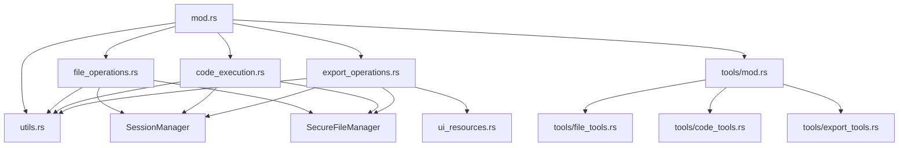

# WorkspaceServer 모듈 분리 리팩토링 계획

## 작업의 목적

WorkspaceServer의 단일 파일(workspace.rs)이 2024줄로 비대해져 유지보수성이 떨어지는 문제를 해결하고, 기능별로 명확히 분리된 모듈 구조로 개선하여 코드의 가독성과 확장성을 향상시킨다.

## 현재의 상태 / 문제점

### 현재 상태

- `src-tauri/src/mcp/builtin/workspace.rs` 파일이 정확히 2024줄
- 파일 작업, 코드 실행, 내보내기 기능이 단일 파일에 혼재
- 도구 정의와 핸들러 구현이 동일 파일에 위치
- UI 리소스 생성 로직도 포함되어 복잡성 증가
- 11개의 MCP 도구 정의 함수와 11개의 핸들러 함수가 모두 한 파일에 존재

### 문제점

1. **단일 책임 원칙 위반**: 하나의 파일이 너무 많은 책임을 담당
2. **코드 가독성 저하**: 관련 없는 기능들이 섞여 있어 이해가 어려움
3. **유지보수 어려움**: 특정 기능 수정 시 전체 파일을 파악해야 함
4. **테스트 복잡성**: 개별 기능별 단위 테스트가 어려움
5. **확장성 제약**: 새로운 기능 추가 시 파일 크기가 더욱 증가

### 현재 파일 구조 분석

현재 workspace.rs는 다음과 같은 주요 섹션으로 구성되어 있음:

#### 1. 구조체 및 기본 메서드 (라인 1-90)

- WorkspaceServer 구조체 정의
- 생성자 및 유틸리티 메서드들
- 경로 검증, 응답 생성 등 공통 기능

#### 2. 파일 작업 도구 정의 (라인 91-320)

- `create_read_file_tool()` (라인 91-124)
- `create_write_file_tool()` (라인 125-157)
- `create_list_directory_tool()` (라인 158-174)
- `create_search_files_tool()` (라인 175-215)
- `create_replace_lines_in_file_tool()` (라인 216-276)
- `create_grep_tool()` (라인 277-318)

#### 3. 코드 실행 도구 정의 (라인 319-420)

- `create_execute_python_tool()` (라인 319-349)
- `create_execute_typescript_tool()` (라인 350-381)
- `create_execute_shell_tool()` (라인 382-420)

#### 4. 파일 작업 핸들러 (라인 421-1000)

- `handle_read_file()` 및 관련 헬퍼 메서드들 (라인 421-600)
- `handle_write_file()` (라인 545-600)
- `handle_list_directory()` (라인 602-681)
- `handle_search_files()` 및 헬퍼들 (라인 682-940)
- `handle_replace_lines_in_file()` (라인 797-937)
- `handle_grep()` (라인 938-1000)

#### 5. 코드 실행 핸들러 (라인 1001-1420)

- `execute_code_in_sandbox()` 공통 실행 로직 (라인 1001-1135)
- `handle_execute_python()` (라인 1136-1159)
- `handle_execute_typescript()` (라인 1160-1327)
- `handle_execute_shell()` (라인 1328-1420)

#### 6. UI 리소스 및 Export 기능 (라인 1421-1950)

- UI 리소스 생성 관련 메서드들 (라인 1421-1666)
- HTML 생성 및 Export 디렉토리 관리 (라인 1467-1666)
- `handle_export_file()` (라인 1667-1764)
- `handle_export_zip()` (라인 1765-1908)
- Export 도구 정의들 (라인 1909-1970)

#### 7. BuiltinMCPServer 구현 (라인 1971-2024)

- `tools()` 메서드: 모든 도구 반환
- `call_tool()` 메서드: 도구별 핸들러 라우팅

## 추가 분석 과제

1. **의존성 분석**: 각 모듈 간 의존성 관계를 명확히 파악하여 순환 의존성 방지
2. **성능 영향 평가**: 모듈 분리가 컴파일 시간과 런타임 성능에 미치는 영향 분석
3. **에러 처리 일관성**: 분리된 모듈들에서 일관된 에러 처리 패턴 적용 방안 검토
4. **테스트 전략 수립**: 각 모듈별 단위 테스트 및 통합 테스트 전략 계획

## 변경 이후의 상태 / 해결 판정 기준

### 목표 구조

```rust
src-tauri/src/mcp/builtin/workspace/
├── mod.rs                    # 메인 WorkspaceServer 구조체 (< 150줄)
├── file_operations.rs        # 파일 작업 핸들러들 (< 600줄)
├── code_execution.rs         # 코드 실행 핸들러들 (< 500줄)
├── export_operations.rs      # 내보내기 작업 핸들러들 (< 400줄)
├── tools/
│   ├── mod.rs               # 도구 정의 통합 (< 50줄)
│   ├── file_tools.rs        # 파일 작업 도구 정의 (< 250줄)
│   ├── code_tools.rs        # 코드 실행 도구 정의 (< 150줄)
│   └── export_tools.rs      # 내보내기 도구 정의 (< 100줄)
├── ui_resources.rs           # UI 리소스 생성 로직 (< 300줄)
└── utils.rs                  # 공통 유틸리티 및 상수 (< 100줄)
```

### 해결 판정 기준

1. **파일 크기**: 각 개별 파일이 600줄 이하
2. **기능 분리**: 관련 기능들이 명확히 분리된 모듈에 위치
3. **컴파일 성공**: 기존 기능이 모두 정상 작동
4. **테스트 통과**: 모든 기존 테스트가 통과
5. **API 호환성**: 외부 인터페이스 변경 없음
6. **성능 동등성**: 리팩토링 후 성능 저하 없음

## 수정이 필요한 코드 및 수정부분의 코드 스니핏

### 1. 메인 모듈 파일 (mod.rs)

```rust
// 기존 workspace.rs 상단 부분을 간소화
use async_trait::async_trait;
use serde_json::Value;
use std::sync::Arc;
use tracing::info;

use super::BuiltinMCPServer;
use crate::mcp::{MCPResponse, MCPTool};
use crate::session::SessionManager;
use crate::services::SecureFileManager;

// 모듈 임포트
mod file_operations;
mod code_execution;
mod export_operations;
mod tools;
mod ui_resources;
mod utils;

use file_operations::*;
use code_execution::*;
use export_operations::*;

pub struct WorkspaceServer {
    session_manager: Arc<SessionManager>,
}

impl WorkspaceServer {
    pub fn new(session_manager: Arc<SessionManager>) -> Self {
        info!("WorkspaceServer using session-based workspace management");
        Self { session_manager }
    }

    // 공통 유틸리티 메서드들만 유지
    pub fn get_workspace_dir(&self) -> std::path::PathBuf {
        self.session_manager.get_session_workspace_dir()
    }

    pub fn get_file_manager(&self) -> Arc<SecureFileManager> {
        self.session_manager.get_file_manager()
    }

    // 공통 응답 생성 메서드들
    pub fn generate_request_id() -> Value {
        Value::String(cuid2::create_id())
    }

    pub fn success_response(request_id: Value, message: &str) -> MCPResponse {
        utils::create_success_response(request_id, message)
    }

    pub fn error_response(request_id: Value, code: i32, message: &str) -> MCPResponse {
        utils::create_error_response(request_id, code, message)
    }
}

#[async_trait]
impl BuiltinMCPServer for WorkspaceServer {
    fn name(&self) -> &str {
        "workspace"
    }

    fn description(&self) -> &str {
        "Integrated workspace for file operations and code execution"
    }

    fn tools(&self) -> Vec<MCPTool> {
        let mut tools = Vec::new();
        tools.extend(tools::file_tools());
        tools.extend(tools::code_tools());
        tools.extend(tools::export_tools());
        tools
    }

    async fn call_tool(&self, tool_name: &str, args: Value) -> MCPResponse {
        match tool_name {
            // 파일 작업 도구들
            "read_file" => self.handle_read_file(args).await,
            "write_file" => self.handle_write_file(args).await,
            "list_directory" => self.handle_list_directory(args).await,
            "search_files" => self.handle_search_files(args).await,
            "replace_lines_in_file" => self.handle_replace_lines_in_file(args).await,
            "grep" => self.handle_grep(args).await,
            // 코드 실행 도구들
            "execute_python" => self.handle_execute_python(args).await,
            "execute_typescript" => self.handle_execute_typescript(args).await,
            "execute_shell" => self.handle_execute_shell(args).await,
            // Export 도구들
            "export_file" => self.handle_export_file(args).await,
            "export_zip" => self.handle_export_zip(args).await,
            _ => {
                let request_id = Self::generate_request_id();
                Self::error_response(
                    request_id,
                    -32601,
                    &format!("Tool '{}' not found", tool_name),
                )
            }
        }
    }
}
```

### 2. 파일 작업 모듈 (file_operations.rs)

```rust
// 기존 handle_read_file 등 파일 작업 핸들러들을 이동
use async_trait::async_trait;
use serde_json::{json, Value};
use std::collections::HashMap;
use tokio::fs;
use tracing::{error, info};

use super::{utils, WorkspaceServer};
use crate::mcp::MCPResponse;

impl WorkspaceServer {
    pub async fn handle_read_file(&self, args: Value) -> MCPResponse {
        let request_id = Self::generate_request_id();
        // 기존 구현 유지...
    }

    pub async fn handle_write_file(&self, args: Value) -> MCPResponse {
        let request_id = Self::generate_request_id();
        // 기존 구현 유지...
    }

    pub async fn handle_list_directory(&self, args: Value) -> MCPResponse {
        // 기존 구현 이동
    }

    pub async fn handle_search_files(&self, args: Value) -> MCPResponse {
        // 기존 구현 이동
    }

    pub async fn handle_replace_lines_in_file(&self, args: Value) -> MCPResponse {
        // 기존 구현 이동
    }

    pub async fn handle_grep(&self, args: Value) -> MCPResponse {
        // 기존 구현 이동
    }

    // 헬퍼 메서드들도 함께 이동
    async fn read_file_lines(&self, path: &std::path::Path) -> Result<Vec<String>, String> {
        // 기존 구현 이동
    }

    async fn read_file_lines_range(
        &self,
        path: &std::path::Path,
        start_line: Option<usize>,
        end_line: Option<usize>,
    ) -> Result<String, String> {
        // 기존 구현 이동
    }

    async fn search_files_by_pattern(
        &self,
        root_path: &std::path::Path,
        pattern: &str,
        max_depth: Option<usize>,
        file_type: &str,
    ) -> Result<Vec<serde_json::Value>, String> {
        // 기존 구현 이동
    }
}
```

### 3. 코드 실행 모듈 (code_execution.rs)

```rust
// 기존 코드 실행 관련 핸들러들을 이동
use serde_json::Value;
use std::time::Duration;
use tempfile::TempDir;
use tokio::process::Command;
use tokio::time::timeout;
use tracing::{error, info};

use super::{utils::constants::*, WorkspaceServer};
use crate::mcp::MCPResponse;

impl WorkspaceServer {
    pub async fn handle_execute_python(&self, args: Value) -> MCPResponse {
        // 기존 구현 이동
    }

    pub async fn handle_execute_typescript(&self, args: Value) -> MCPResponse {
        // 기존 구현 이동
    }

    pub async fn handle_execute_shell(&self, args: Value) -> MCPResponse {
        // 기존 구현 이동
    }

    // 공통 코드 실행 로직
    async fn execute_code_in_sandbox(
        &self,
        command: &str,
        args: &[&str],
        code: &str,
        file_extension: &str,
        timeout_secs: u64,
    ) -> MCPResponse {
        // 기존 구현 이동 (라인 1001-1135)
    }
}
```

### 4. Export 작업 모듈 (export_operations.rs)

```rust
// Export 관련 핸들러들과 UI 리소스 생성 로직
use serde_json::{json, Value};
use std::collections::HashMap;
use tracing::{error, info};
use zip::write::FileOptions;

use super::{ui_resources, WorkspaceServer};
use crate::mcp::MCPResponse;

impl WorkspaceServer {
    pub async fn handle_export_file(&self, args: Value) -> MCPResponse {
        // 기존 구현 이동 (라인 1667-1764)
    }

    pub async fn handle_export_zip(&self, args: Value) -> MCPResponse {
        // 기존 구현 이동 (라인 1765-1908)
    }

    // Export 관련 헬퍼 메서드들
    fn ensure_exports_directory(&self) -> Result<std::path::PathBuf, String> {
        // 기존 구현 이동
    }
}
```

### 5. 도구 정의 모듈 (tools/mod.rs)

```rust
// 기존 create_*_tool 함수들을 기능별로 분리
pub mod file_tools;
pub mod code_tools;
pub mod export_tools;

pub use file_tools::*;
pub use code_tools::*;
pub use export_tools::*;

use crate::mcp::MCPTool;

pub fn file_tools() -> Vec<MCPTool> {
    vec![
        file_tools::create_read_file_tool(),
        file_tools::create_write_file_tool(),
        file_tools::create_list_directory_tool(),
        file_tools::create_search_files_tool(),
        file_tools::create_replace_lines_in_file_tool(),
        file_tools::create_grep_tool(),
    ]
}

pub fn code_tools() -> Vec<MCPTool> {
    vec![
        code_tools::create_execute_python_tool(),
        code_tools::create_execute_typescript_tool(),
        code_tools::create_execute_shell_tool(),
    ]
}

pub fn export_tools() -> Vec<MCPTool> {
    vec![
        export_tools::create_export_file_tool(),
        export_tools::create_export_zip_tool(),
    ]
}
```

### 6. UI 리소스 모듈 (ui_resources.rs)

```rust
// UI 리소스 생성 관련 로직 분리
use serde_json::{json, Value};

pub fn create_export_ui_resource(
    request_id: u64,
    title: &str,
    files: &[String],
    export_type: &str,
    download_path: &str,
    content: String,
) -> Value {
    // 기존 구현 이동 (라인 1442-1466)
}

pub fn create_html_export_ui(
    title: &str,
    files: &[String],
    export_type: &str,
    download_path: &str,
    _display_name: &str,
) -> String {
    // 기존 구현 이동 (라인 1467-1666)
}

pub fn success_response_with_text_and_resource(
    request_id: Value,
    message: &str,
    ui_resource: Value,
) -> crate::mcp::MCPResponse {
    // 기존 구현 이동 (라인 1421-1441)
}
```

### 7. 공통 유틸리티 모듈 (utils.rs)

```rust
// 공통 유틸리티 함수들과 상수들
use serde_json::{json, Value};
use crate::mcp::MCPResponse;

pub mod constants {
    pub const DEFAULT_EXECUTION_TIMEOUT: u64 = 30;
    pub const MAX_EXECUTION_TIMEOUT: u64 = 300;
    pub const MAX_CODE_SIZE: usize = 1024 * 1024;
    pub const MAX_FILE_SIZE: usize = 10 * 1024 * 1024;
}

// 공통 응답 생성 함수들
pub fn create_success_response(request_id: Value, message: &str) -> MCPResponse {
    MCPResponse::success(
        request_id,
        json!({
            "content": [{
                "type": "text",
                "text": message
            }]
        }),
    )
}

pub fn create_error_response(request_id: Value, code: i32, message: &str) -> MCPResponse {
    MCPResponse::error(request_id, code, message)
}

// 경로 검증 헬퍼
pub fn validate_timeout(timeout: Option<u64>) -> u64 {
    timeout.unwrap_or(constants::DEFAULT_EXECUTION_TIMEOUT)
        .min(constants::MAX_EXECUTION_TIMEOUT)
}
```

## 재사용 가능한 연관 코드

### 관련 파일들

1. **`src-tauri/src/mcp/builtin/mod.rs`**: BuiltinMCPServer 트레이트 정의
2. **`src-tauri/src/mcp/mod.rs`**: MCPResponse, MCPTool 타입 정의
3. **`src-tauri/src/mcp/utils/schema_builder.rs`**: 스키마 빌더 유틸리티
4. **`src-tauri/src/services/mod.rs`**: SecureFileManager 정의
5. **`src-tauri/src/session/mod.rs`**: SessionManager 정의
6. **`src-tauri/src/mcp/builtin/utils/constants.rs`**: 공통 상수 정의

### 주요 인터페이스 (변경 없음)

```rust
// BuiltinMCPServer 트레이트 (변경 없음)
#[async_trait]
pub trait BuiltinMCPServer: Send + Sync {
    fn name(&self) -> &str;
    fn description(&self) -> &str;
    fn tools(&self) -> Vec<MCPTool>;
    async fn call_tool(&self, tool_name: &str, args: Value) -> MCPResponse;
}

// 공통 응답 타입들 (변경 없음)
pub struct MCPResponse {
    pub id: Value,
    pub result: Option<Value>,
    pub error: Option<MCPError>,
}

pub struct MCPTool {
    pub name: String,
    pub title: Option<String>,
    pub description: String,
    pub input_schema: Value,
    pub output_schema: Option<Value>,
    pub annotations: Option<Value>,
}
```

### 모듈 간 의존성 관계



### 공통 사용 함수들

```rust
// utils.rs에서 제공할 공통 함수들
pub mod constants {
    pub const DEFAULT_EXECUTION_TIMEOUT: u64 = 30;
    pub const MAX_EXECUTION_TIMEOUT: u64 = 300;
    pub const MAX_CODE_SIZE: usize = 1024 * 1024;
    pub const MAX_FILE_SIZE: usize = 10 * 1024 * 1024;
}

// 공통 헬퍼 함수들
pub fn validate_timeout(timeout: Option<u64>) -> u64 {
    timeout.unwrap_or(constants::DEFAULT_EXECUTION_TIMEOUT)
        .min(constants::MAX_EXECUTION_TIMEOUT)
}

pub fn create_temp_script_file(code: &str, extension: &str) -> Result<TempDir, String> {
    // 임시 스크립트 파일 생성 로직
}

pub fn validate_path_with_session(
    session_manager: &SessionManager,
    path_str: &str,
    request_id: &Value,
) -> Result<std::path::PathBuf, Box<MCPResponse>> {
    // 세션 기반 경로 검증 로직
}
```

## 상세 분석 및 구현 고려사항

### 1. 의존성 분석 결과

**순환 의존성 방지 전략**:

- `utils.rs`를 최하위 레벨 모듈로 설정
- 각 핸들러 모듈은 서로 직접 의존하지 않고 `mod.rs`를 통해서만 접근
- UI 리소스는 export 모듈에서만 사용하도록 제한

**외부 의존성**:

- `SessionManager`: 모든 핸들러에서 사용 (WorkspaceServer를 통해 접근)
- `SecureFileManager`: 파일 관련 모듈에서 사용
- `MCPResponse/MCPTool`: 모든 모듈에서 사용

### 2. 성능 영향 평가

**컴파일 시간**:

- 예상 개선: 모듈 분리로 인한 병렬 컴파일 가능
- 부분 컴파일 가능 (특정 기능 수정 시 해당 모듈만 재컴파일)

**런타임 성능**:

- 함수 호출 오버헤드 최소화를 위해 인라인 힌트 적용 검토
- 메모리 사용량은 거의 동일 유지 예상

### 3. 에러 처리 일관성

**통일된 에러 처리 패턴**:

```rust
// utils.rs에서 제공할 표준 에러 처리
pub fn handle_validation_error(request_id: Value, error: &str) -> MCPResponse {
    MCPResponse::error(request_id, -32602, error)
}

pub fn handle_execution_error(request_id: Value, error: &str) -> MCPResponse {
    MCPResponse::error(request_id, -32603, error)
}

pub fn handle_not_found_error(request_id: Value, resource: &str) -> MCPResponse {
    MCPResponse::error(request_id, -32601, &format!("{} not found", resource))
}
```

### 4. 테스트 전략

**단위 테스트**:

- 각 모듈별 독립적인 테스트 작성 가능
- Mock SessionManager 및 SecureFileManager 사용

**통합 테스트**:

- 기존 WorkspaceServer 통합 테스트 유지
- 새로운 모듈 구조에서도 동일한 API 제공 확인

**성능 테스트**:

- 리팩토링 전후 벤치마크 비교
- 메모리 사용량 및 실행 시간 측정

## 리팩토링 완료 후 기대 효과

### 1. 개발 생산성 향상

- **코드 탐색성**: 특정 기능을 찾기 위해 2000줄을 스캔할 필요 없음
- **병렬 개발**: 여러 개발자가 다른 모듈을 동시에 작업 가능
- **버그 격리**: 특정 기능의 버그가 다른 기능에 영향을 주지 않음

### 2. 유지보수성 개선

- **부분 수정**: 특정 기능 수정 시 해당 모듈만 변경
- **테스트 용이성**: 각 모듈별 독립적인 테스트 작성 가능
- **코드 리뷰**: 작은 단위의 변경으로 리뷰 품질 향상

### 3. 확장성 증대

- **새 기능 추가**: 새로운 도구 타입 추가 시 새 모듈로 격리 가능
- **기능 제거**: 불필요한 기능 제거 시 해당 모듈만 삭제
- **플러그인 아키텍처**: 향후 플러그인 시스템 도입 기반 마련

이 종합적인 리팩토링 계획을 통해 WorkspaceServer의 복잡성을 체계적으로 해결하고, 장기적인 프로젝트 성장을 위한 견고한 기반을 구축할 수 있을 것입니다.

## 작업 단계별 계획

### 1단계: 디렉토리 구조 생성 및 준비 작업

```bash
# 새로운 workspace 모듈 디렉토리 구조 생성
mkdir -p src-tauri/src/mcp/builtin/workspace/tools
```

**예상 소요 시간**: 15분

**작업 내용**:

- `workspace/` 디렉토리 생성
- 각 모듈 파일들의 빈 템플릿 생성
- 모듈 구조 설계 검토

### 2단계: 공통 유틸리티 및 상수 분리

**예상 소요 시간**: 30분

**작업 내용**:

- `utils.rs` 생성 및 공통 상수 이동 (라인 16-20의 constants 사용)
- 공통 응답 생성 함수들 이동 (라인 43-73)
- 경로 검증 헬퍼 함수 이동 (라인 75-89)

**이동할 코드**:

- `generate_request_id()`, `success_response()`, `error_response()`
- `validate_path_with_error()` 메서드
- 모든 상수 정의들

### 3단계: 도구 정의 분리

**예상 소요 시간**: 45분

**작업 내용**:

- `tools/file_tools.rs` 생성 (라인 91-318)
- `tools/code_tools.rs` 생성 (라인 319-420)
- `tools/export_tools.rs` 생성 (라인 1909-1970)
- `tools/mod.rs` 통합 모듈 생성

**분리할 도구들**:

파일 작업 도구 (6개):

- `create_read_file_tool()`
- `create_write_file_tool()`
- `create_list_directory_tool()`
- `create_search_files_tool()`
- `create_replace_lines_in_file_tool()`
- `create_grep_tool()`

코드 실행 도구 (3개):

- `create_execute_python_tool()`
- `create_execute_typescript_tool()`
- `create_execute_shell_tool()`

Export 도구 (2개):

- `create_export_file_tool()`
- `create_export_zip_tool()`

### 4단계: UI 리소스 모듈 분리

**예상 소요 시간**: 30분

**작업 내용**:

- `ui_resources.rs` 생성
- UI 관련 함수들 이동 (라인 1421-1666)

**이동할 함수들**:

- `success_response_with_text_and_resource()`
- `create_export_ui_resource()`
- `create_html_export_ui()`

### 5단계: 핸들러 모듈들 분리

**예상 소요 시간**: 90분

#### 5-1. 파일 작업 핸들러 분리 (`file_operations.rs`)

**이동할 코드 (라인 421-1000)**:

- `handle_read_file()` 및 관련 헬퍼들
- `handle_write_file()`
- `handle_list_directory()`
- `handle_search_files()` 및 `search_files_by_pattern()`
- `handle_replace_lines_in_file()`
- `handle_grep()`
- `read_file_lines()`, `read_file_lines_range()` 헬퍼 메서드들

#### 5-2. 코드 실행 핸들러 분리 (`code_execution.rs`)

**이동할 코드 (라인 1001-1420)**:

- `execute_code_in_sandbox()` 공통 실행 로직
- `handle_execute_python()`
- `handle_execute_typescript()`
- `handle_execute_shell()`

#### 5-3. Export 핸들러 분리 (`export_operations.rs`)

**이동할 코드 (라인 1421-1908)**:

- `handle_export_file()`
- `handle_export_zip()`
- `ensure_exports_directory()` 헬퍼 메서드

### 6단계: 메인 모듈 정리 및 통합

**예상 소요 시간**: 45분

**작업 내용**:

- `mod.rs` 생성 및 WorkspaceServer 구조체 정의
- 모든 하위 모듈 임포트 설정
- `BuiltinMCPServer` 트레이트 구현 (라인 1971-2024)
- 기존 `workspace.rs` 파일 제거

**최종 mod.rs 구조**:

- WorkspaceServer 구조체 및 생성자만 유지
- 각 핸들러를 해당 모듈로 위임하는 `call_tool()` 구현
- 모든 도구를 통합하는 `tools()` 메서드 구현

### 7단계: 컴파일 검증 및 테스트

**예상 소요 시간**: 30분

**작업 내용**:

- 모든 모듈의 import/export 관계 검증
- 컴파일 오류 해결
- 기존 기능 동작 확인
- 성능 테스트 수행

**검증 항목**:

- [ ] 모든 11개 도구가 정상 등록되는지 확인
- [ ] 각 핸들러가 올바른 모듈에서 호출되는지 확인
- [ ] 세션 관리 및 파일 매니저 연동 정상 작동
- [ ] UI 리소스 생성 및 Export 기능 정상 작동

### 총 예상 소요 시간: 4시간 45분

### 리스크 및 대응 방안

1. **모듈 간 순환 의존성 발생**
   - 대응: 공통 기능은 utils 모듈로, 각 핸들러는 독립적으로 구현

2. **컴파일 오류 다발 발생**
   - 대응: 단계별로 진행하며 각 단계마다 컴파일 검증

3. **성능 저하 우려**
   - 대응: 리팩토링 전후 벤치마크 비교, 필요시 inline 최적화 적용
