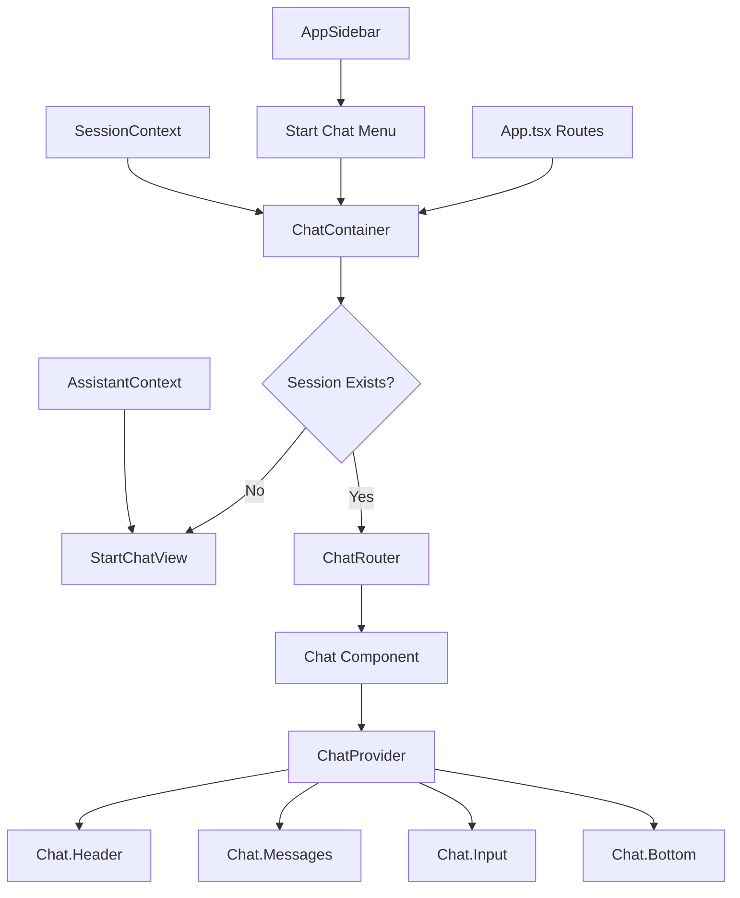
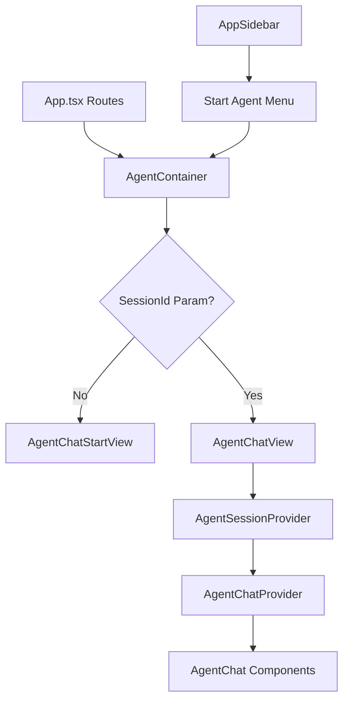

# Legacy Chat (V1) System Removal - Refactoring Plan

## 작업의 목적

LibrAgent는 Agent V2 아키텍처로 전환됨에 따라 기존 Legacy Chat (V1) 시스템이 더 이상 사용되지 않습니다. 이 작업의 목적은:

1. 사용되지 않는 V1 Chat 시스템 코드를 제거하여 코드베이스 단순화
2. 유지보수 부담 감소 및 개발자 혼란 방지
3. Agent V2 시스템을 단일 진입점으로 명확화
4. 불필요한 컨텍스트 프로바이더 및 라우트 정리

## 현재의 상태 / 문제점

### 문제점

1. **중복된 채팅 시스템**: V1 Chat과 Agent V2가 공존하여 혼란 야기
2. **사용되지 않는 라우트**: `/`, `/chat/single` 라우트가 더 이상 필요 없음
3. **불필요한 사이드바 메뉴**: "Start Chat" 메뉴 항목이 Agent V2와 중복
4. **복잡한 컨텍스트 구조**: `ChatContext`와 `AgentChatContext`가 분리되어 있음
5. **죽은 코드**: 전체 `src/features/chat/` 폴더의 대부분 파일이 미사용

### 현재 구조

```
App.tsx
├─ Routes:
│  ├─ "/" → ChatContainer (V1) ❌
│  ├─ "/chat/single" → ChatContainer (V1) ❌
│  ├─ "/agent" → AgentContainer (V2) ✅
│  └─ "/agent/:sessionId" → AgentContainer (V2) ✅
│
AppSidebar.tsx
├─ "Start Chat" → /chat/single ❌
└─ "Start Agent" → /agent ✅

Features:
├─ chat/ (V1 - 대부분 제거 대상)
│  ├─ ChatContainer.tsx
│  ├─ StartChatView.tsx
│  ├─ Chat.tsx
│  ├─ components/ (10+ files)
│  ├─ context/ (2 files)
│  └─ hooks/ (2+ files)
│
└─ agent/ (V2 - 유지)
   ├─ AgentContainer.tsx
   ├─ AgentChatView.tsx
   └─ components/ (10+ files)

Context:
├─ ChatContext.tsx (V1 - 제거 대상) ❌
└─ AgentChatContext.tsx (V2 - 유지) ✅
```

## 관련 코드의 구조 및 동작 방식 Summary

### V1 Chat System Architecture



### V2 Agent System Architecture (유지)



### 주요 차이점

| 구분                   | V1 Chat                      | V2 Agent                                     |
| ---------------------- | ---------------------------- | -------------------------------------------- |
| **Context Provider**   | `ChatProvider` (React 기반)  | `AgentChatProvider` (Rust 오케스트레이션)    |
| **Architecture**       | Single-turn request/response | Multi-turn Think-Act-Observe loop            |
| **Backend Control**    | Frontend-driven              | Rust backend-driven                          |
| **Tool Execution**     | Frontend manages             | Backend orchestrates                         |
| **Session Management** | `SessionContext` (shared)    | `AgentSessionContext` (isolated per session) |

## 변경 이후의 상태 / 해결 판정 기준

### 목표 상태

```
App.tsx
├─ Routes:
│  ├─ "/agent" → AgentContainer (Default/Landing) ✅
│  ├─ "/agent/:sessionId" → AgentContainer ✅
│  ├─ "/assistants" → AssistantList ✅
│  ├─ "/history" → History ✅
│  └─ "/settings" → SettingsPage ✅
│
AppSidebar.tsx
├─ "Start Agent" → /agent (Primary CTA) ✅
├─ "Assistants" → /assistants ✅
├─ "History" → /history ✅
└─ "Settings" → /settings ✅

Features:
├─ agent/ (V2 - Primary) ✅
├─ assistant/ ✅
├─ history/ ✅
└─ settings/ ✅

Context:
└─ AgentChatContext.tsx (Single source of truth) ✅
```

### 해결 판정 기준

- [ ] `src/features/chat/` 폴더 완전 제거
- [ ] `ChatContext.tsx` 제거
- [ ] `/`, `/chat/single` 라우트 제거
- [ ] AppSidebar "Start Chat" 메뉴 제거
- [ ] `pnpm lint` 통과 (no errors)
- [ ] `pnpm build` 성공
- [ ] `pnpm dead-code` 실행 후 chat 관련 dead code 없음
- [ ] Agent V2 기능 정상 동작 (수동 테스트)
- [ ] 기본 라우트 `/`가 `/agent`로 리다이렉트

## 수정이 필요한 코드 및 수정 부분

### 1. App.tsx - 라우트 정리

**파일 경로**: `src/app/App.tsx`

**현재 코드**:

```tsx
// Lazy-load route components
const ChatContainer = lazy(() => import('@/features/chat/ChatContainer'));
const AgentContainer = lazy(() => import('@/features/agent'));
// ...

<Routes>
  <Route path="/" element={<ChatContainer />} />
  <Route path="/chat/single" element={<ChatContainer />} />
  <Route path="/agent" element={<AgentContainer />} />
  <Route path="/agent/:sessionId" element={<AgentContainer />} />
  // ...
</Routes>;
```

**수정 후**:

```tsx
// Lazy-load route components
const AgentContainer = lazy(() => import('@/features/agent'));
// ...

<Routes>
  <Route path="/" element={<Navigate to="/agent" replace />} />
  <Route path="/agent" element={<AgentContainer />} />
  <Route path="/agent/:sessionId" element={<AgentContainer />} />
  // ...
</Routes>;
```

### 2. AppSidebar.tsx - 메뉴 정리

**파일 경로**: `src/components/layout/AppSidebar.tsx`

**현재 코드**:

```tsx
<SidebarGroup>
  <SidebarGroupLabel>Chat</SidebarGroupLabel>
  <SidebarGroupContent>
    <SidebarMenu>
      <SidebarMenuItem>
        <Link to="/chat/single">
          <SidebarMenuButton isActive={location.pathname === '/chat/single'}>
            <MessageSquare size={16} />
            <span>Start Chat</span>
          </SidebarMenuButton>
        </Link>
      </SidebarMenuItem>
      <SidebarMenuItem>
        <Link to="/agent">
          <SidebarMenuButton isActive={location.pathname.startsWith('/agent')}>
            <Bot size={16} />
            <span>Start Agent</span>
          </SidebarMenuButton>
        </Link>
      </SidebarMenuItem>
    </SidebarMenu>
  </SidebarGroupContent>
</SidebarGroup>;

// Recent Sessions 표시 로직 (lines 124-138)
{
  currentView !== 'history' && sessions.length > 0 && (
    <SidebarGroup>
      <SessionList sessions={sessions.slice(0, 5)} />
    </SidebarGroup>
  );
}
```

**수정 후**:

```tsx
<SidebarGroup>
  <SidebarGroupLabel>Agent</SidebarGroupLabel>
  <SidebarGroupContent>
    <SidebarMenu>
      <SidebarMenuItem>
        <Link to="/agent">
          <SidebarMenuButton isActive={location.pathname.startsWith('/agent')}>
            <Bot size={16} />
            <span>Start Agent</span>
          </SidebarMenuButton>
        </Link>
      </SidebarMenuItem>
    </SidebarMenu>
  </SidebarGroupContent>
</SidebarGroup>

// Recent Sessions는 Agent V2 세션 리스트로 대체 (AgentSessionListContext 활용)
```

### 3. 제거할 파일 목록

**완전 제거**:

```
src/features/chat/
├── ChatContainer.tsx ❌
├── StartChatView.tsx ❌
├── Chat.tsx ❌
├── index.tsx ❌
├── MessageBubble.tsx ❌
├── MessageBubbleRouter.tsx ❌
├── ToolCallDetails.tsx ❌
├── ToolCallGroupBubble.tsx ❌
├── ToolCallResultBubble.tsx ❌
├── ContentBubble.tsx ❌
├── ErrorBubble.tsx ❌
├── ModelPicker.tsx ❌
├── components/
│   ├── ChatHeader.tsx ❌
│   ├── ChatMessages.tsx ❌
│   ├── ChatInput.tsx ❌
│   ├── ChatStatusBar.tsx ❌
│   ├── ChatAttachedFiles.tsx ❌
│   ├── ChatBottom.tsx ❌
│   ├── ChatPlanningPanel.tsx ❌
│   ├── WorkspaceFilesPanel.tsx ❌
│   └── SessionFilesPopover.tsx ❌
├── context/
│   ├── ChatPlanningContext.tsx ❌
│   └── ChatWorkspaceContext.tsx ❌
└── hooks/
    ├── useChatState.ts ❌
    └── useFileAttachment.ts ❌

src/context/
└── ChatContext.tsx ❌

src/hooks/
├── use-session-navigation.ts ❌ (또는 수정 필요 - /chat/single 참조 제거)
└── use-message-trigger.ts ❌
```

### 4. 수정 필요 파일

#### MessageRenderer.tsx

**파일 경로**: `src/components/MessageRenderer.tsx`

**현재**: `useChatActions` from `ChatContext` 사용

**수정 방안**:

```tsx
// BEFORE
import { useChatActions } from '@/context/ChatContext';

// AFTER - Option 1: AgentChatContext로 전환
import { useAgentChatActions } from '@/context/AgentChatContext';

// AFTER - Option 2: 컨텍스트 독립적으로 리팩토링 (props로 콜백 전달)
interface MessageRendererProps {
  onToolResult?: (result: ToolResult) => void;
  onError?: (error: Error) => void;
}
```

#### use-session-navigation.ts

**파일 경로**: `src/hooks/use-session-navigation.ts`

**현재**: `/chat/single`로 네비게이션

**수정 후**:

```tsx
// Line 39: navigate('/chat/single');
// 변경 →
navigate('/agent');
```

## 재사용 가능한 연관 코드

### Agent V2 System (참고용)

Agent V2 시스템은 V1의 개선된 버전으로, 유사한 UI 패턴을 사용합니다:

| V1 Component          | V2 Equivalent         | 파일 경로                                               |
| --------------------- | --------------------- | ------------------------------------------------------- |
| `ChatHeader`          | `AgentChatHeader`     | `src/features/agent/components/AgentChatHeader.tsx`     |
| `ChatMessages`        | `AgentChatMessages`   | `src/features/agent/components/AgentChatMessages.tsx`   |
| `ChatInput`           | `AgentChatInput`      | `src/features/agent/components/AgentChatInput.tsx`      |
| `ChatStatusBar`       | `AgentChatStatusBar`  | `src/features/agent/components/AgentChatStatusBar.tsx`  |
| `ChatPlanningPanel`   | `AgentPlanningPanel`  | `src/features/agent/components/AgentPlanningPanel.tsx`  |
| `WorkspaceFilesPanel` | `AgentWorkspacePanel` | `src/features/agent/components/AgentWorkspacePanel.tsx` |

### 재사용 가능한 유틸리티/훅

다음 코드는 V1, V2 모두에서 사용되므로 **유지**:

- `src/context/SessionContext.tsx` - 세션 관리 (공유)
- `src/context/AssistantContext.tsx` - Assistant 관리
- `src/context/MCPServerContext.tsx` - MCP 서버 관리
- `src/hooks/use-mcp-server.ts` - MCP 서버 훅
- `src/lib/ai-service/` - AI 서비스 레이어 (공유)

## Test Code 추가 및 수정 필요 부분

### 제거할 테스트

```bash
# ChatContext 관련 테스트 제거
src/context/__tests__/ChatContext.test.tsx (존재 시)
```

### 유지/검증할 테스트

```bash
# Agent V2 관련 테스트는 유지
src/context/__tests__/AgentChatContext.test.tsx ✅
```

### 추가 테스트 필요 (권장)

1. **라우팅 테스트**

   ```tsx
   // src/app/__tests__/App.routing.test.tsx
   describe('App Routing', () => {
     it('should redirect root "/" to "/agent"', () => {
       render(<App />);
       expect(location.pathname).toBe('/agent');
     });

     it('should not have /chat/single route', () => {
       // Verify route does not exist
     });
   });
   ```

2. **AppSidebar 테스트**

   ```tsx
   // src/components/layout/__tests__/AppSidebar.test.tsx
   describe('AppSidebar', () => {
     it('should not render "Start Chat" menu item', () => {
       render(<AppSidebar />);
       expect(screen.queryByText('Start Chat')).not.toBeInTheDocument();
     });

     it('should render "Start Agent" as primary CTA', () => {
       render(<AppSidebar />);
       expect(screen.getByText('Start Agent')).toBeInTheDocument();
     });
   });
   ```

## 작업 단계 (Phased Approach) - REVISED

### Phase 0: Architecture Preparation ⚠️ NEW

- [ ] Create new `AgentBuiltInToolProvider` for V2
- [ ] Create new `AgentBuiltInToolContext` for V2
- [ ] Integrate into `AgentSessionProvider` (session-scoped)
- [ ] Test V2 tools work with new provider
- [ ] Verify no V2→V1 dependencies remain

### Phase 1: 준비 및 분석 ✅ COMPLETE

- [x] Dead code analysis 실행: `pnpm dead-code`
- [x] SessionContext 사용처 전체 파악
- [x] Architecture analysis 완료
- [x] 결정: Session-scoped tool provider 생성

### Phase 2: V2 Tool Provider 구축

- [ ] `src/features/agent/contexts/AgentBuiltInToolContext.tsx` 생성
- [ ] Session-scoped tool management 구현
- [ ] `AgentSessionProvider`에 통합
- [ ] Planning, Knowledge, UI tools V2 버전 확인
- [ ] Test tool execution with Agent V2 sessions

### Phase 3: V2 Dependencies 검증

- [ ] Agent V2 코드베이스 전체 스캔
- [ ] SessionContext import 없는지 확인
- [ ] BuiltInToolProvider (legacy) import 없는지 확인
- [ ] MessageRenderer (legacy) 사용 없는지 확인
- [ ] V1 전용 hooks 사용 없는지 확인

### Phase 4: 라우트 및 네비게이션 정리

- [ ] App.tsx 라우트 수정 (V1 제거, redirect 추가)
- [ ] AppSidebar.tsx 메뉴 정리 ("Start Chat" 제거)
- [ ] AppSidebar.tsx Recent Sessions 제거
- [ ] use-session-navigation.ts 제거 (V2는 직접 navigate 사용)

### Phase 5: V1 Chat Feature 제거

- [ ] `src/features/chat/` 폴더 전체 삭제
- [ ] `src/context/ChatContext.tsx` 삭제
- [ ] `src/hooks/use-message-trigger.ts` 삭제
- [ ] `src/components/MessageRenderer.tsx` 삭제 (V1 버전)
- [ ] `src/features/tools/index.tsx` 삭제 (legacy BuiltInToolProvider)

### Phase 6: 검증

- [ ] `pnpm lint` 실행
- [ ] `pnpm format` 실행
- [ ] `pnpm build` 실행
- [ ] `pnpm dead-code` 재실행
- [ ] Agent V2 기능 수동 테스트:
  - [ ] 세션 생성
  - [ ] 메시지 전송
  - [ ] Tool 실행 (Planning, Browser, etc.)
  - [ ] 세션 전환 (다른 세션으로 이동)
  - [ ] Tool context가 세션별로 격리되는지 확인
- [ ] 모든 라우트 동작 확인

### Phase 7: 문서화

- [ ] CHANGELOG.md 업데이트
- [ ] Architecture 문서 업데이트 (V1 참조 제거)
- [ ] README.md 업데이트 (V1 언급 제거)
- [ ] agents.md 업데이트 (Dual-Track 설명 제거)

## Clarification Q-List - RESOLVED ✅

### 1. BuiltInToolProvider Architecture

**결정**: Option A - Session-Scoped (V2 전용 신규 구현)

- ✅ 새로운 `AgentBuiltInToolProvider` 생성
- ✅ `AgentSessionProvider` 내부에 배치
- ✅ 각 세션이 독립된 tool context 보유

### 2. SessionContext Dependency

**결정**: Agent V2는 SessionContext를 사용하지 않음

- ✅ `AgentSessionContext`가 유일한 session 정보 소스
- ✅ `AgentSessionListContext`가 전역 세션 목록 관리
- ✅ SessionContext는 V1 전용으로 제한 (향후 제거 대상)

### 3. Refactoring Strategy

**결정**: Don't refactor legacy, build new for V2

- ✅ Legacy `BuiltInToolProvider` 유지 (V1용)
- ✅ 새로운 `AgentBuiltInToolProvider` 생성 (V2용)
- ✅ V1 제거 전까지 병렬 운영
- ✅ V1 제거 후 legacy provider도 제거

### 4. Recent Sessions Display

**결정**: Remove from AppSidebar

- ✅ V1 "Start Chat" 메뉴 제거
- ✅ Recent Sessions 표시 제거
- ✅ 사용자는 `/agent` 또는 `/history`에서 세션 관리

### 5. Root Route

**결정**: Redirect to `/agent`

- ✅ `<Route path="/" element={<Navigate to="/agent" replace />} />`

## 위험 요소 및 대응 방안

### 1. MessageRenderer 의존성 이슈

**위험**: MessageRenderer가 Agent V2에서도 사용될 수 있음
**대응**: Agent V2에 별도 `AgentMessageRenderer`가 있는지 확인

### 2. SessionContext 공유 이슈

**위험**: SessionContext 제거 시 V2에 영향
**대응**: SessionContext는 유지, ChatContext만 제거

### 3. 빌드 실패 가능성

**위험**: 숨겨진 의존성으로 인한 빌드 실패
**대응**: Phase별 점진적 제거 + 각 단계마다 빌드 검증

### 4. 사용자 혼란

**위험**: 기존 `/chat/single` 북마크 사용자
**대응**: `/chat/single` → `/agent` 리다이렉트 추가 (임시)

## 참고 자료

- **Agent V2 Architecture**: `docs/architecture/agent-workflow-architecture.md`
- **Chat Feature Docs**: `docs/architecture/chat-feature-architecture.md` (V1 - 제거 예정)
- **Coding Guidelines**: `.github/copilot-instructions.md`
- **Refactoring Validation**: `pnpm refactor:validate`

---

**작성일**: 2026-01-09  
**작성자**: GitHub Copilot  
**대상 브랜치**: dev/0.4.0  
**예상 작업 시간**: 2-3 hours  
**위험도**: Medium (점진적 제거로 리스크 최소화)
