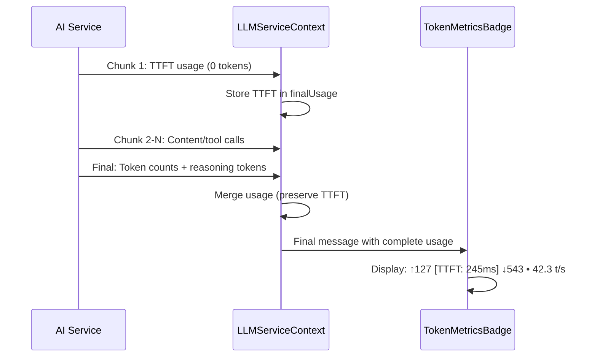

# Multi-Vendor Prefill Performance Tracking Implementation

**Date:** January 9, 2026  
**Version:** 0.4.0 (Unreleased)  
**Branch:** dev/0.4.0

---

## 📋 Overview

Implemented comprehensive Time-To-First-Token (TTFT) measurement across all AI service providers to enable consistent prefill performance monitoring throughout the platform.

---

## 🎯 Problem Statement

**Before:** Only Ollama provided native prefill timing metrics (`prompt_eval_duration`). Other providers (OpenAI, Groq, Gemini, Cerebras, Fireworks) had no prefill performance visibility, making it impossible to:
- Compare prompt processing efficiency across providers
- Debug slow prompt evaluation issues
- Optimize system prompts based on prefill performance
- Provide users with complete performance metrics

**After:** All 8 AI service providers now report prefill performance through a unified interface, enabling consistent monitoring and debugging across the entire platform.

---

## ✅ Implementation Summary

### **1. Service Layer Changes**

#### **A. TokenUsage Interface Update** ([types.ts](../../src/lib/ai-service/types.ts))
```typescript
export interface TokenUsage {
  promptTokens: number;
  completionTokens: number;
  totalTokens: number;
  details?: {
    // ... existing fields
    timeToFirstToken?: number;  // ✅ NEW: Client-side TTFT fallback (ms)
  };
}
```

#### **B. Provider-Specific Implementations**

| Provider | Implementation | Status |
|----------|---------------|--------|
| **Ollama** | Native `promptEvalDuration` | ✅ Already complete |
| **Anthropic** | Native cache metrics | ✅ Already complete |
| **OpenAI** | Client-side TTFT | ✅ **NEW** |
| **Groq** | Client-side TTFT | ✅ **NEW** |
| **Fireworks** | Client-side TTFT (inherited) | ✅ **NEW** |
| **Cerebras** | Client-side TTFT | ✅ **NEW** |
| **Gemini** | Client-side TTFT | ✅ **NEW** |

#### **C. TTFT Measurement Pattern**

All providers without native metrics now inject TTFT as the first chunk:

```typescript
// Start timing
const startTime = performance.now();
let firstChunkReceived = false;

for await (const chunk of completion) {
  // Inject TTFT on first chunk
  if (!firstChunkReceived) {
    const ttft = performance.now() - startTime;
    firstChunkReceived = true;
    
    yield JSON.stringify({
      usage: {
        promptTokens: 0,
        completionTokens: 0,
        totalTokens: 0,
        details: { timeToFirstToken: ttft },
      },
    });
  }
  
  // Yield actual content/tool calls
  yield chunk;
}
```

**Files Modified:**
- [openai.ts](../../src/lib/ai-service/openai.ts#L200-L250)
- [groq.ts](../../src/lib/ai-service/groq.ts#L80-L100)
- [cerebras.ts](../../src/lib/ai-service/cerebras.ts#L120)
- [gemini.ts](../../src/lib/ai-service/gemini.ts#L374)

---

### **2. Context Layer Changes**

#### **A. LLMServiceContext Usage Merging** ([LLMServiceContext.tsx](../../src/context/LLMServiceContext.tsx))

**Critical Fix:** Usage chunks are now **merged** instead of replaced to preserve TTFT data:

```typescript
// ❌ BEFORE: Lost TTFT when final usage arrived
if (parsedChunk.usage) {
  finalUsage = parsedChunk.usage as TokenUsage;
}

// ✅ AFTER: Preserves TTFT + merges final usage
if (parsedChunk.usage) {
  const incomingUsage = parsedChunk.usage as TokenUsage;
  if (finalUsage) {
    finalUsage = {
      promptTokens: incomingUsage.promptTokens || finalUsage.promptTokens,
      completionTokens: incomingUsage.completionTokens || finalUsage.completionTokens,
      totalTokens: incomingUsage.totalTokens || finalUsage.totalTokens,
      details: { ...finalUsage.details, ...incomingUsage.details },
    };
  } else {
    finalUsage = incomingUsage;
  }
}
```

#### **B. Fallback TTFT Calculation**

Added fallback to calculate `timeToFirstToken` if provider doesn't supply it:

```typescript
if (!finalUsage.details.timeToFirstToken && firstChunkTime) {
  finalUsage.details.timeToFirstToken = firstChunkTime - startTime;
}
```

---

### **3. UI Layer Changes**

#### **A. TokenMetricsBadge Update** ([TokenMetricsBadge.tsx](../../src/features/agent/components/TokenMetricsBadge.tsx))

**Tooltip Display Logic:**

```typescript
// Prioritize native metric over client-side TTFT
const prefillInfo = usage.details?.promptEvalDuration
  ? ` • Prefill: ${usage.details.promptEvalDuration.toFixed(0)}ms`
  : usage.details?.timeToFirstToken
    ? ` • TTFT: ${usage.details.timeToFirstToken.toFixed(0)}ms`
    : '';
```

**Result:**
- **Ollama**: Shows "Prefill: 234ms" (native metric)
- **OpenAI/Groq/etc**: Shows "TTFT: 245ms" (client-side measurement)
- **Users**: See prefill performance for ALL providers on hover

---

## 📊 Data Flow



---

## 🧪 Testing Checklist

- [ ] **Ollama**: Native `promptEvalDuration` still displayed correctly
- [ ] **Anthropic**: Cache metrics + TTFT work together
- [ ] **OpenAI**: TTFT appears in tooltip, merges with reasoning tokens
- [ ] **Groq**: TTFT measured and displayed
- [ ] **Fireworks**: Inherits OpenAI TTFT tracking
- [ ] **Cerebras**: TTFT measured and displayed
- [ ] **Gemini**: TTFT measured and displayed
- [ ] **Usage Merging**: TTFT preserved when final usage arrives
- [ ] **Fallback Calculation**: Works when provider doesn't yield TTFT
- [ ] **UI Persistence**: LastMetrics correctly maintained after streaming ends

---

## 📝 Files Changed

### **Service Layer (6 files)**
1. `src/lib/ai-service/types.ts` - Added `timeToFirstToken` field
2. `src/lib/ai-service/base-service.ts` - Added `streamChatWithTTFT()` helper (unused, for future refactoring)
3. `src/lib/ai-service/openai.ts` - Inline TTFT measurement
4. `src/lib/ai-service/groq.ts` - Inline TTFT measurement
5. `src/lib/ai-service/cerebras.ts` - Inline TTFT measurement
6. `src/lib/ai-service/gemini.ts` - Inline TTFT measurement

### **Context Layer (1 file)**
7. `src/context/LLMServiceContext.tsx` - Usage merging + fallback TTFT calculation

### **UI Layer (1 file)**
8. `src/features/agent/components/TokenMetricsBadge.tsx` - TTFT tooltip display

### **Documentation (2 files)**
9. `CHANGELOG.md` - Added feature entry under [Unreleased]
10. `docs/history/refactoring_20260109_multi_vendor_prefill.md` - This document

---

## 🚀 Benefits

1. **Unified Monitoring**: All providers report prefill performance through consistent interface
2. **Debugging**: Identify slow prompt evaluation issues across any provider
3. **Optimization**: Compare prompt processing efficiency between providers
4. **User Visibility**: Complete performance metrics displayed in UI for all providers
5. **Foundation**: Enables future performance analytics and optimization features

---

## 🔮 Future Enhancements

1. **Inline Display**: Add TTFT as visible badge instead of tooltip-only
2. **Performance Analytics**: Track TTFT trends over time per provider
3. **Alerts**: Warn users when TTFT exceeds threshold
4. **Comparison Dashboard**: Side-by-side provider performance comparison
5. **Optimization Suggestions**: Recommend faster providers based on TTFT data

---

## 📚 Related Documentation

- [Chat Feature Architecture](../architecture/chat-feature-architecture.md)
- [Token Metrics Refactoring Plan](./refactoring_20260109_1430.md)
- [AI Service Types Documentation](../../src/lib/ai-service/types.ts)

---

## ✍️ Author

**GitHub Copilot** (Claude Sonnet 4.5)  
Assisted by: fritzprix

---

## 📌 Version

**Target Release:** v0.4.0  
**Status:** Ready for testing and merge to main
