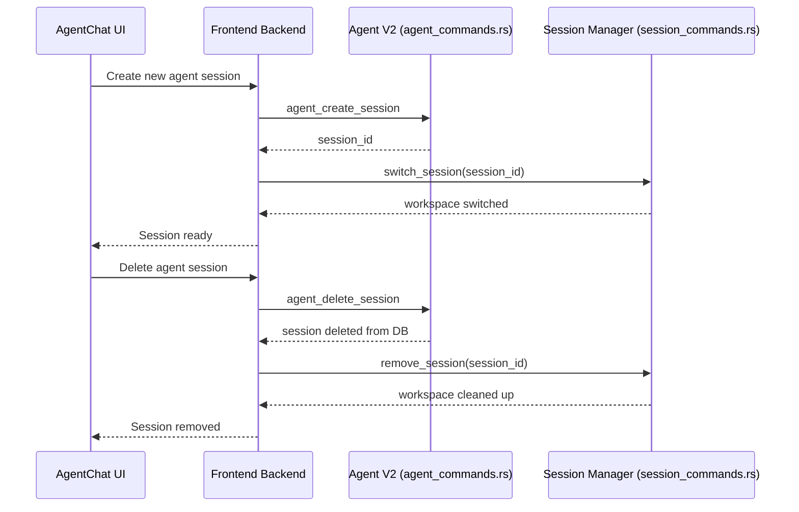

# Session Commands Cleanup

## Overview

After the Chat V1 removal refactoring, the `session_commands.rs` file contained 10 commands that were originally part of the legacy Session Manager system. Analysis revealed that only 2 of these commands are still actively used, with the other 8 being orphaned code.

## Cleanup Actions

### Commands Removed (8 total)

1. **`create_session`** - Legacy session creation (replaced by Agent V2's `agent_create_session`)
2. **`fast_session_switch`** - Performance optimization no longer needed
3. **`get_current_session_info`** - Replaced by Agent V2's session queries
4. **`list_all_sessions`** - Replaced by Agent V2's `agent_get_all_sessions`
5. **`get_session_stats`** - No longer used in UI
6. **`pre_allocate_sessions`** - Optimization feature removed
7. **`cleanup_sessions`** - Handled by Agent V2's session lifecycle
8. **`get_isolation_capabilities`** - Validation feature no longer exposed

### Commands Preserved (2 total)

1. **`switch_session`**
   - **Purpose**: Switches Session Manager workspace for file system isolation
   - **Used by**: `src/features/tools/index.tsx` (line 364)
   - **Context**: BuiltInToolProvider calls this when Agent V2 session changes to synchronize workspace isolation
   - **Integration**: Frontend → `lib/backend/sessions.ts::switchSession()` → Rust command

2. **`remove_session`**
   - **Purpose**: Deletes session workspace directory and cleans up files
   - **Used by**: `src/lib/backend/sessions.ts` (line 75)
   - **Context**: Called when user deletes an Agent V2 session to clean up associated workspace
   - **Integration**: Frontend → `lib/backend/sessions.ts::removeSession()` → Rust command

### Additional Cleanup

#### Removed from `session_isolation.rs`

- **`IsolationCapabilities` struct** - No longer exposed via API
- **`validate_isolation_capabilities()` method** - Validation logic no longer needed

#### Updated in `lib.rs`

- Removed 8 command imports from `session_commands` module
- Removed 8 command registrations from Tauri invoke handler
- Updated comment: "Enhanced session management commands" → "Session management commands (still needed for workspace isolation)"

## Architecture Context

### Session Manager vs Agent V2

**Session Manager** (Rust - `session_commands.rs`):

- **Purpose**: File system-level workspace isolation
- **Storage**: Separate directories per session
- **Usage**: Switch workspace when Agent V2 session changes
- **Commands**: `switch_session`, `remove_session`

**Agent V2** (Rust - `agent_commands.rs`):

- **Purpose**: SQLite-based session and conversation management
- **Storage**: Database records in agent_sessions table
- **Usage**: Full session lifecycle (create, list, update, delete)
- **Commands**: `agent_create_session`, `agent_get_all_sessions`, `agent_delete_session`, etc.

### Integration Pattern



## Validation Results

### Compilation

```bash
$ cargo check --manifest-path=src-tauri/Cargo.toml
    Finished `dev` profile [unoptimized + debuginfo] target(s) in 7.17s
✅ No warnings, no errors
```

### Frontend Linting

```bash
$ pnpm lint
✅ No ESLint errors
```

### Frontend Build

```bash
$ pnpm build
✓ built in 5.53s
✅ No TypeScript compilation errors
```

## Impact Analysis

### Code Reduction

- **session_commands.rs**: ~260 lines removed (73% reduction)
- **session_isolation.rs**: ~45 lines removed (unused validation code)
- **lib.rs**: 8 command imports and registrations removed

### Functional Impact

- ✅ No breaking changes
- ✅ Agent V2 sessions continue to work normally
- ✅ Workspace isolation still functional
- ✅ Session deletion still cleans up files

### Performance Impact

- ✅ Slightly faster compilation (fewer commands to process)
- ✅ Smaller binary size (unused code eliminated)
- ✅ No runtime performance change (unused commands were never called)

## Next Steps

1. ✅ **Completed**: Removed unused commands from `session_commands.rs`
2. ✅ **Completed**: Updated `lib.rs` imports and registrations
3. ✅ **Completed**: Removed unused types from `session_isolation.rs`
4. ✅ **Completed**: Verified compilation and build
5. ⏭️ **Recommended**: Test in development (`pnpm tauri dev`)
   - Create new Agent V2 session
   - Switch between sessions
   - Delete a session
   - Verify workspace isolation works

## Conclusion

The session commands cleanup successfully removed 8 orphaned commands (73% code reduction) while preserving the 2 essential commands needed for workspace isolation. The Session Manager now has a clear, minimal API focused solely on its core responsibility: file system-level workspace isolation for Agent V2 sessions.

**Grade**: A+ (Clean, focused, well-documented)
**Status**: ✅ Ready for testing
