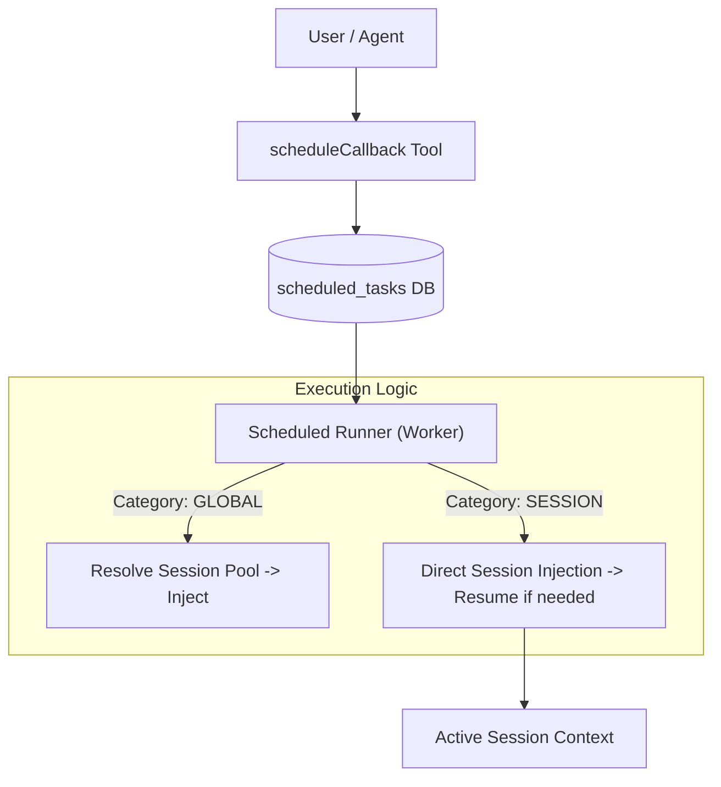

# Proposal: Session Scheduling Extension (In-Session Callbacks)

> **Related:** 구현 상세는 [Session Scheduling Implementation Guide](../guides/session-scheduling-implementation-guide.md)를 참조하세요.

## 1. Overview

This proposal introduces **Session-Specific Scheduling** to LibrAgent. It allows an active agent session to register "child" schedules (callbacks) that trigger within the same session context. This supports:

- **One-Shot Delays**: "Check this result in 5 minutes."
- **Recurring Tasks**: "Summarize this thread every hour."
- **N:1 Mapping**: Multiple schedules attached to a single active session.

## 2. Motivation (The Problem)

Currently, LibrAgent's `scheduled_task` system is designed as a **Global Scheduler**.

- **Limitation 1 (Context Loss):** Global tasks create or reuse sessions from a global pool. They cannot easily target a specific _active_ session to continue a conversation.
- **Limitation 2 (No One-Shot):** The system relies on Cron expressions. It lacks support for simple relative delays (e.g., `delay: 300s`).
- **Limitation 3 (N:1 Mapping):** Users cannot attach multiple schedules to a single active session (e.g., "Check A in 5 mins, Check B in 10 mins" within the same thread).

## 3. Proposed Solution

Instead of creating a new database table, we will **extend the existing `scheduled_tasks` architecture** to support a new `task_category`. This ensures all scheduling logic (UI, Worker, History) remains in a single source of truth.

### 3.1 Architecture Diagram



### 3.2 Data Model Extension

We modify the existing `scheduled_tasks` table. This ensures all scheduling logic (UI, Worker, History) remains in a single source of truth.

| Field             | Type       | Description                                                                                                             |
| :---------------- | :--------- | :---------------------------------------------------------------------------------------------------------------------- |
| `task_category`   | `String`   | **New Field**. Enum: `"GLOBAL"` (Existing) or `"SESSION"` (New).                                                        |
| `cron_expression` | `Nullable` | **Modified**. Required for GLOBAL. **Optional (NULL)** for SESSION (supports One-Shot).                                 |
| `session_id`      | `String`   | **Modified**. For SESSION tasks, this is bound at creation time (Pinning). For GLOBAL, still populated after first run. |
| `next_run_at`     | `Int64`    | Used for both one-shot (absolute time) and recurring (next fire time).                                                  |

### 3.3 GLOBAL vs SESSION — Key Behavioral Difference

The existing runner already supports pinned `session_id` reuse and `resume_session`. The **real** distinction is:

| Aspect                     | GLOBAL                                 | SESSION                                                         |
| :------------------------- | :------------------------------------- | :-------------------------------------------------------------- |
| `session_id` at creation   | `NULL` — pinned after first run        | **Required** — bound at INSERT time                             |
| Session resolution on miss | Creates a new session with the same ID | **Fails** (or disables task) — must target an existing session  |
| `cron_expression`          | Required                               | Optional (`NULL` = one-shot via `delaySeconds`)                 |
| One-shot completion        | N/A                                    | `enabled = false` + `next_run_at = NULL` (no new column needed) |

## 4. Technical Implementation

### 4.1 Backend (Rust)

#### A. Entity & Migration

- **Entity** (`src-tauri/src/entity/scheduled_task.rs`): Add `task_category` field; make `cron_expression` nullable.
- **Migration**: Add `task_category` column with default `'GLOBAL'`; relax `cron_expression` NOT NULL constraint.
- **Migration registry**: Register in `src-tauri/migration/src/lib.rs`.

#### B. Service Layer (`scheduled_task_service.rs`)

All task creation goes through `ScheduledTaskService`, not the repository directly. SESSION tasks require:

- Skip `enforce_minimum_interval` when `task_category = SESSION` and `cron_expression` is NULL (one-shot).
- Accept pre-computed `next_run_at` from `delaySeconds` (bypass cron-based computation).
- Require `session_id` at creation for SESSION category.

#### C. Runner Logic (`runner.rs`)

The `execute_task` function will branch based on the new category:

```rust
async fn execute_task(manager: &AgentSessionManager, task: &TaskModel, now_ms: i64) -> Result<(), String> {
    match task.task_category.as_str() {
        "GLOBAL" => {
            // Existing logic: resolve/create session from assistant config, then inject.
            execute_global_task(manager, task, now_ms).await
        }
        "SESSION" => {
            // New logic: target session_id directly (must exist at creation).
            // 1. Verify session_id is set; error if missing.
            // 2. Resume if inactive; inject if active.
            // 3. On one-shot completion: enabled=false, next_run_at=None.
            execute_session_callback(manager, task, now_ms).await
        }
        _ => Err("Unknown category".into()),
    }
}
```

**SESSION session-loss policy:** If the pinned session no longer exists in the repository, disable the task (`enabled = false`) and log a warning. Do **not** create a replacement session (unlike GLOBAL).

#### D. Tooling (MCP)

**Recommended approach: new `scheduleCallback` tool**

| Option                                   | Pros                                                                   | Cons                                                              |
| :--------------------------------------- | :--------------------------------------------------------------------- | :---------------------------------------------------------------- |
| **New `scheduleCallback`** (recommended) | Session-context schema is simple; no `assistantId` required from agent | One additional tool in the registry                               |
| Extend `createScheduledTask`             | Reuses existing CRUD surface                                           | Mixes global and session semantics; agent must pass `assistantId` |

The new tool inserts into `scheduled_tasks` with:

- `task_category`: `"SESSION"` (explicit — never rely on DB default)
- `session_id`: Current active session ID (from server context)
- `cron_expression`: `NULL` when `delaySeconds` is provided
- `next_run_at`: Pre-computed from `delaySeconds` or cron

### 4.2 Frontend (UI)

#### A. Session Sidebar Panel

Add a "Schedules" section to the active session's sidebar.

- **Active Timer (One-Shot)**: If `cron_expression` is NULL, show a real-time countdown (e.g., `04:55 remaining`) and a `[Cancel]` button.
- **Recurring List**: If `cron_expression` exists, show "Next run: Tomorrow 07:00" with `[Edit]` / `[Delete]` options.

#### B. Chat Stream Integration

When a schedule is created, a System Message should appear in the chat:

> `⏰ 'Task Name' scheduled for [Time]`

Reuse existing `MessageSource::ScheduledTask` for injected callback messages (no new enum variant required unless UI needs visual distinction).

## 5. Backward Compatibility

- **Database**: The `task_category` column defaults to `'GLOBAL'`. All existing scheduled tasks continue to work exactly as they do today.
- **Runner**: Legacy tasks without `task_category` are treated as GLOBAL via the default value.
- **Data**: No data migration or loss is required.
- **Rollback**: Reverting migration `m20260607_000034` drops all `SESSION` tasks. Back up before rolling back in production.
- **MCP tools**: Existing six CRUD tools (`createScheduledTask`, etc.) are unchanged; they always create GLOBAL tasks.

## 6. Roadmap

1.  **Phase 1: Core Logic**
    - DB migration + Entity + Repository params
    - `ScheduledTaskService` SESSION path
    - `runner.rs` GLOBAL/SESSION branch
    - `scheduleCallback` MCP tool
    - Integration tests
2.  **Phase 2: Frontend Integration**
    - Tauri commands for list/cancel session schedules
    - "Schedules" sidebar component
    - Frontend types (`src/models/chat.ts`, scheduled-tasks)
3.  **Phase 3: Polish**
    - User Interruption: cancel all SESSION tasks when user sends a new message
    - `delaySeconds` vs `cron` UI polish
    - Session-level concurrency lock for simultaneous callbacks
