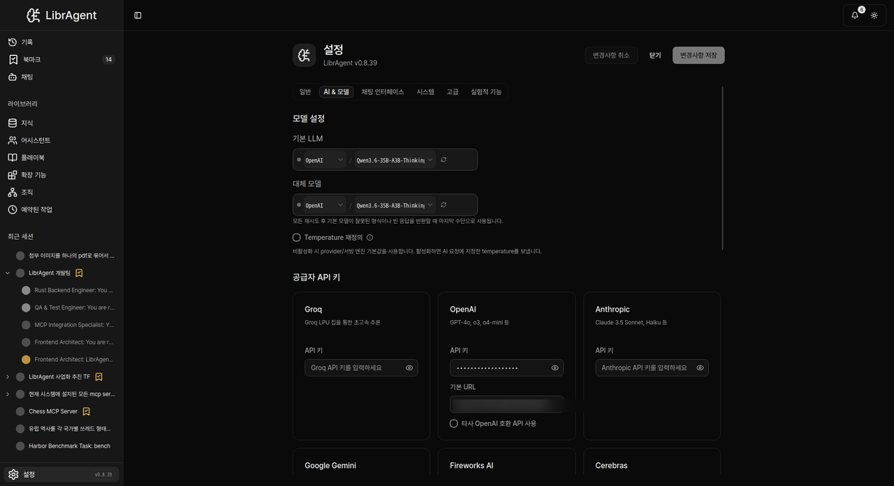

# 5-minute tutorial

> Install LibrAgent and complete your first agent chat. **No dev setup** — download the desktop app.

---

## What you will learn

1. Launch LibrAgent
2. Set an API key and default model in Settings
3. Start a session from an assistant card in **Chat**
4. Use **App Wizard** and **setup-wizard** (alias `bootstrap`) for environment setup

**Time**: ~5 minutes  
**Need**: LibrAgent app, network, a provider API key

---

## Step 1: Launch LibrAgent

Download the installer for your OS from [GitHub Releases](https://github.com/fritzprix/libr-agent/releases), install, and open the app.

The left **sidebar** shows **Chat**, **Settings**, and more. Settings is **sidebar → Settings**, not a top-right gear alone.


---

## Step 2: Connect a model (API key)

You need an API key to chat. Field details: [Connecting models](connecting-models.md).

1. Open **Settings** (`/settings`).
2. Select the **AI & Models** tab.
3. Under **Provider API Keys**, open a provider card (Anthropic, OpenAI, Google Gemini, …).
4. Paste the **API Key** and click **Save Changes**.
5. Under **Model Preferences**, choose **Default LLM**.



> There is no menu named **「LLM Provider」**. Keys live under **Provider API Keys**; the default model is **Default LLM**.

---

## Step 3: Start your first session

1. Open **Chat**.
2. Click a card under **Built-in Assistants** (e.g. **Libr Assistant**, **Coding Expert**, **App Wizard**).
3. The draft title is **New Session**. Type a message and send.

```
Hi! Who are you? Give a short intro.
```

The agent typically thinks → (optionally) calls tools → returns a final answer.

> There is no dedicated **「+ New Session」** button. **Chat → pick an assistant** starts a session.

---

## Step 4: App Wizard and setup-wizard

There is no separate “install wizard” window. Use a **built-in assistant** and **built-in tools**.

### App Wizard (assistant)

**Chat → Built-in Assistants → App Wizard**

- Role: environment / agent / MCP helper
- App copy: _Environment and configuration specialist for MCP setup, agent management, and system readiness._

Example:

```
Check whether Python and Node are installed on this machine, and tell me how to install them if not.
```

### setup-wizard (builtin, alias bootstrap)

- Service name: **setup-wizard** (Setup Wizard Server)
- **`bootstrap`** in README docs is an **alias** for the same service.
- App Wizard uses it to detect the OS and guide Python / Node.js / uv installs.

Talk to App Wizard once before heavy coding/MCP use.

There is also a skill: `@skill:setup-wizard`. Full catalog: [Skills](../guides/skills.md).

> **Settings → Advanced → Shell runtime bootstrap** (conda/nvm PATH) is a **different** feature. For install guidance use **App Wizard / setup-wizard**.

---

## Done

| Next             | Doc                                             |
| ---------------- | ----------------------------------------------- |
| Settings details | [Connecting models](connecting-models.md)       |
| Chat / sessions  | [First agent chat](first-agent.md)              |
| Symptom fixes    | [Troubleshooting](../guides/troubleshooting.md) |

---

_End-user guide. Contributor setup: [getting-started.md](https://github.com/fritzprix/libr-agent/blob/main/docs/guides/getting-started.md)._
