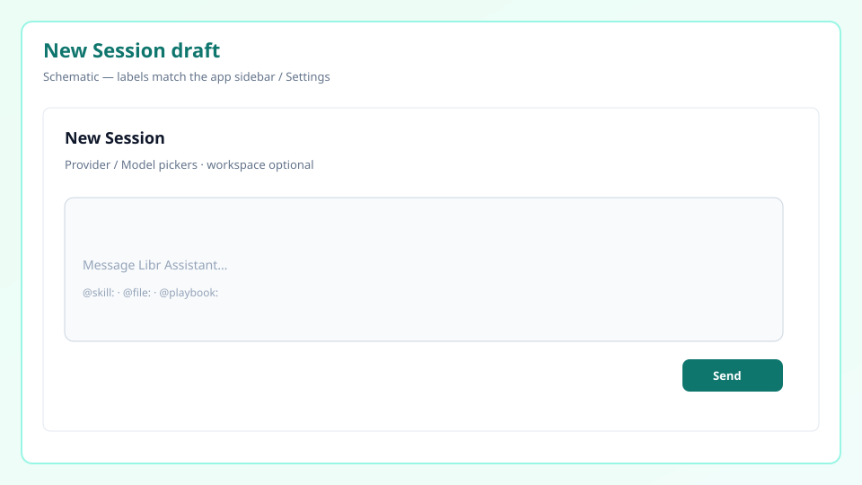

# First agent chat

> Pick an assistant on the **Chat** hub and learn how to read session replies.

---

## What you will learn

1. Chat hub and Built-in Assistants  
2. Session flow (assistant card → draft → send)  
3. Provider / Model pickers  
4. **App Wizard** for environment and MCP  
5. Response structure and history  

---

## 1. Chat hub

Open **Chat**. You typically see:

- Headline: **What would you like to do today?**  
- **Built-in Assistants** — Master Mind, Libr Assistant, Coding Expert, **App Wizard**, …  
- **My Assistants** — your custom profiles  
- **+ Manage Assistants** — manage configs  

Start a session by clicking an assistant card.


---

## 2. Start a new session

1. Click a Built-in or My Assistants card.  
2. Draft header title: **New Session**.  
3. Type a prompt and **Send**.

```
Find Python files in this folder that lack tests.
```

> There is no sidebar **「+ New Session」** starter.



### Provider / Model

Use the **Provider** / **Model** pickers (and **Refresh models**). Defaults come from Settings **Default LLM**. See [Connecting models](connecting-models.md).

### What is an assistant?

- System prompt (role / behavior)  
- Allowed builtin tools  
- Optional external MCP servers  

Create customs via **+ Manage Assistants** / **Create New Assistant**.

---

## 3. App Wizard and setup-wizard

### App Wizard

**Built-in Assistants → App Wizard** helps with environment, MCP, and agent setup.

```
Check whether Python, Node, and uv are available; if not, give an install guide.
How do I attach a filesystem MCP server?
```

### setup-wizard (alias bootstrap)

Builtin service **setup-wizard**. **`bootstrap`** in docs is the same alias.

- Detect platform  
- Guide missing runtimes  

Run App Wizard once before heavy coding sessions.

---

## 4. Chatting

### `@` mentions

| Example | Meaning |
|---------|---------|
| `@skill:docx` | Insert skill procedure into context |
| `@skill:setup-wizard` | Runtime install skill |

Catalog: [Skills](../guides/skills.md).

### Reading replies

1. **Thinking** — internal plan  
2. **Tool calls** — Browser / Workspace / Terminal / setup-wizard, …  
3. **Final answer** — what you read as the response  

---

## 5. History

- Recent sessions: Chat / sidebar list  
- Search: **History**  
- Bookmark / delete on the session card (delete is permanent)  

---

## Done

| Next | Doc |
|------|-----|
| API keys / Default LLM | [Connecting models](connecting-models.md) |
| Quick path | [5-minute tutorial](5-minute-tutorial.md) |
| Skills | [Skills](../guides/skills.md) |
| Fixes | [Troubleshooting](../guides/troubleshooting.md) |
