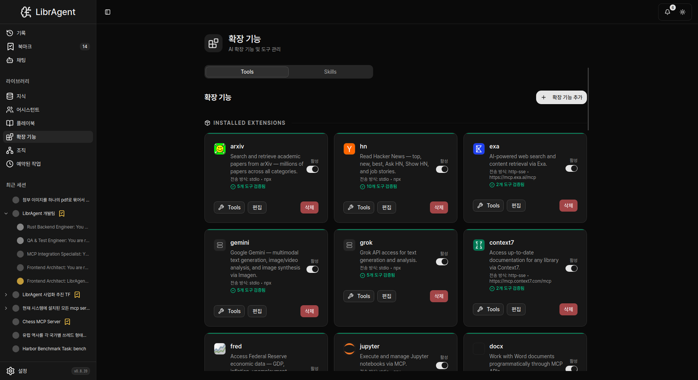

# Extensions

> Easy MCP: browse and enable packaged MCP servers from **Extensions**.

---

## Open Extensions

Sidebar → **Extensions** (route `/mcp-servers`).

> MCP is **not** a Settings tab. Do not look for 「MCP Servers」 under Settings.

---

## Enable an extension

1. Browse or search the catalog.  
2. Open a card → enable / connect.  
3. Complete any required config (paths, tokens).  
4. Attach the server to an [Assistant](assistants.md) if needed.

---

## Tips

- Start with one extension and verify tools appear in a session.  
- For hand-written MCP configs, see [Custom MCP](custom-mcp.md).  
- Runtime issues: ask **App Wizard** or see [Troubleshooting](troubleshooting.md).

---

## Related

- [Custom MCP](custom-mcp.md) · [Assistants](assistants.md)
