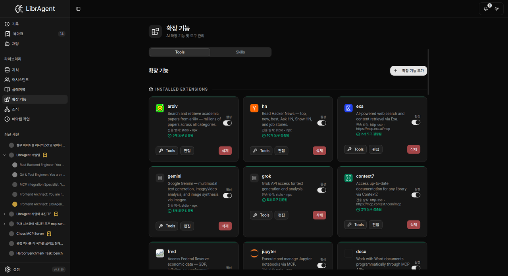

# Installing MCP Servers with Extensions

> Manage external Model Context Protocol (MCP) tools from the **Extensions** page in the sidebar (route: `/mcp-servers`).  
> Use **Recommended Extensions** to install pre-configured presets with a single click.

There is no "MCP Servers" tab in the Settings view. Manage all MCP extensions through the dedicated **Extensions** screen.

---

## The Extensions Screen Layout

Open **Extensions** from the sidebar navigation.

Top Tabs:

- **Tools** — Install, enable, disable, and configure MCP servers.
- **Skills** — Manage skill directories and custom procedures ([Skills Guide](skills.md)).

Within the Tools Tab:

- **Installed Extensions** — Currently registered MCP servers.
- **Recommended Extensions** — Bundled presets for popular services.
- **Add Extension** — Register custom MCP servers manually ([Custom MCP Guide](custom-mcp.md)).

---

## Install with Recommended Extensions

1. Open **Extensions → Tools**.
2. Select an item under **Recommended Extensions**.
3. Fill in required parameters (such as API keys) if prompted.
4. Click **Save** to register the server.
5. Ensure the extension status toggle is set to **Active**.

If execution runtimes (`npx`, `node`, `uv`, or `python`) are missing, set up your system with the [App Wizard](../getting-started/5-minute-tutorial.md) or invoke `@skill:setup-wizard`.

Some presets use **stdio** (local processes), while others use **HTTP/SSE** (remote endpoints). The registration form populates required arguments automatically.

---

## Recommended Extensions Catalog

The bundled presets match the defaults in `mcp-server.json`. Always check the **Recommended Extensions** UI for the latest items.

### Search

- **arxiv** — Search academic papers on arXiv.
- **brave-search** — Web search using Brave Search API (requires API key).
- **ddg-search** — DuckDuckGo web search.
- **exa** — Exa semantic search engine (HTTP).
- **hn** — Query Hacker News stories and comments.

### DevTools

- **github** — GitHub repository, issue, and pull request integration (HTTP).
- **context7** — Up-to-date documentation lookup for open-source libraries (HTTP).
- **serena** — Semantic symbol-level code comprehension and editing.
- **jules** — Google Jules coding agent integration.

### AI Providers

- **openai** / **gemini** / **grok** / **huggingface** — Direct provider MCP endpoints.

### Data & Finance

- **yahoo-finance** — Market prices, tickers, and financial statements.
- **fred** — Federal Reserve Economic Data.

### Documents

- **docx** — Word document processing via MCP API.
- **jupyter** — Jupyter notebook execution and inspection.

### Messaging

- **slack** — Slack workspace integration (HTTP).
- **telegram** — Telegram messaging client.

### Creative

- **comfyui** — ComfyUI generative image workflow execution.

> [!TIP]
> For private packages, internal commands, or settings from other editors, see [Installing Custom MCP Servers](custom-mcp.md).

---

## Verification After Installation

1. Confirm that the server appears in **Installed Extensions**.
2. Verify that the server toggle is **Active**.
3. Check the tool count and health indicator on the server card.
4. Open **Assistants** and verify that your target assistant has permission to use this MCP server.

Reload your session or start a new conversation to load the new tools. If discovery fails due to slow network responses, increase the timeout under **Settings → Advanced → MCP Discovery Timeout**.

---

## Related Documentation

- [Installing Custom MCP Servers](custom-mcp.md) — Manual registration and configuration imports
- [Skills Guide](skills.md) — Procedural prompt workflows
- [Troubleshooting Guide](troubleshooting.md) — Diagnose connection failures
