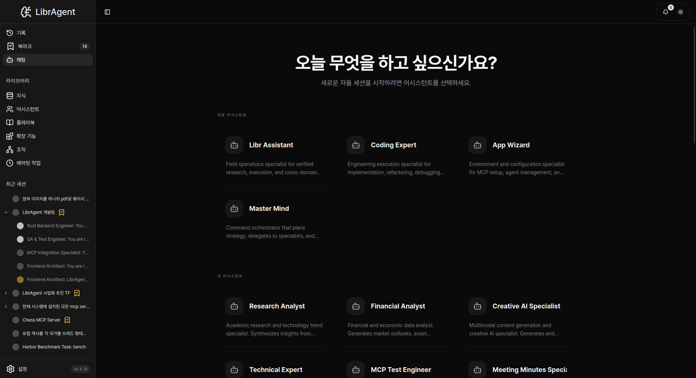

# 에이전트 첫 대화

> **Chat** 허브에서 어시스턴트를 고르고, 세션에서 모델·도구 응답을 읽는 방법을 익힙니다.

---

## 이 가이드에서 배우는 것

1. Chat 허브와 Built-in Assistants
2. 세션 시작 흐름 (어시스턴트 카드 → 초안 → 전송)
3. Provider / Model 피커
4. **App Wizard**로 환경·MCP 준비
5. 응답 구조와 세션 목록

---

## 1. Chat 허브

사이드바 **Chat**을 열면 대략 다음 구성입니다.

- 헤드라인: **What would you like to do today?**
- **Built-in Assistants** — Master Mind, Libr Assistant, Coding Expert, **App Wizard** 등
- **My Assistants** — 직접 만든 프로필
- **+ Manage Assistants** — 어시스턴트 관리

세션은 여기서 어시스턴트 카드를 눌러 시작합니다.



---

## 2. 새 세션 시작

1. Built-in 또는 My Assistants에서 카드를 클릭합니다.
2. 초안 화면으로 이동합니다. 헤더 이름은 **New Session**입니다.
3. 입력창에 프롬프트를 쓰고 전송합니다 (**Send**).

```
이 폴더의 Python 파일 중 테스트가 부족한 파일을 찾아줘.
```

> 사이드바에 **「+ New Session」** 버튼으로 시작하는 UX가 아닙니다.


### Provider / Model

채팅 상단(또는 피커)에서 **Provider**와 **Model**을 고를 수 있습니다. **Refresh models**로 목록을 갱신합니다.  
기본값은 Settings의 **Default LLM**입니다. ([모델 연결하기](connecting-models.md))

### 어시스턴트란?

- 시스템 프롬프트(역할·행동)
- 사용 가능한 내장 도구(builtin) 세트
- (설정에 따라) 외부 MCP

커스텀 프로필은 **+ Manage Assistants** / **Create Assistant**에서 만듭니다.

---

## 3. App Wizard와 setup-wizard

### App Wizard

**Built-in Assistants → App Wizard**

환경·MCP·에이전트 설정을 돕는 내장 어시스턴트입니다. 예:

```
내 환경에 Python, Node, uv가 있는지 확인하고 없으면 설치 가이드를 줘.
MCP filesystem 서버를 붙이려면 어떻게 설정해야 해?
```

### setup-wizard (별칭 bootstrap)

App Wizard가 쓰는 내장 서비스 **setup-wizard**(Setup Wizard Server)입니다. 문서/README의 **`bootstrap`**은 같은 기능의 별칭입니다.

- 플랫폼 감지
- 누락 런타임에 대한 설치 안내

첫 코딩 세션 전에 App Wizard로 한 번 점검하는 것을 권장합니다.

---

## 4. 대화하기

### `@` 참조

입력 중 `@`를 치면 스킬·파일 등을 넣을 수 있습니다.

| 예                    | 의미                                          |
| --------------------- | --------------------------------------------- |
| `@skill:docx`         | 번들(또는 사용자) 스킬 절차를 컨텍스트에 삽입 |
| `@skill:setup-wizard` | 런타임 설치 절차 스킬                         |

앱에 기본 포함된 스킬 전체 목록은 [번들 스킬](../guides/skills.md)을 보세요.

### 응답 읽기

1. **생각하기** — 내부 계획
2. **도구 호출** — Browser / Workspace / Terminal / setup-wizard 등 (배지 클릭으로 상세)
3. **최종 응답** — 사용자에게 보이는 답

---

## 5. 세션 목록·히스토리

- 진행 중·최근 세션은 Chat/사이드바 세션 목록에서 전환합니다.
- 과거 세션 검색은 **History**(사이드바에 있는 경우)를 사용합니다.
- 북마크·삭제는 세션 카드/메뉴의 해당 동작을 따릅니다. 삭제는 복구할 수 없습니다.

---

## 6. 단축키 (참고)

앱/OS·포커스에 따라 다를 수 있습니다. 입력창에 포커스가 있으면 단축키가 먹지 않을 수 있습니다.

| 동작        | 흔한 단축키   |
| ----------- | ------------- |
| 메시지 전송 | `Enter`       |
| 줄 바꿈     | `Shift+Enter` |

---

## 완료!

| 다음               | 문서                                      |
| ------------------ | ----------------------------------------- |
| API 키·Default LLM | [모델 연결하기](connecting-models.md)     |
| 빠른 경로          | [5분 시작 가이드](5-minute-tutorial.md)   |
| 번들 스킬          | [번들 스킬](../guides/skills.md)          |
| 문제 해결          | [문제 해결](../guides/troubleshooting.md) |

---

_사용자용 가이드입니다. UI 맵(개발자용)은 [navigation-guide.md](https://github.com/fritzprix/libr-agent/blob/main/docs/guides/navigation-guide.md)를 참고하세요._
