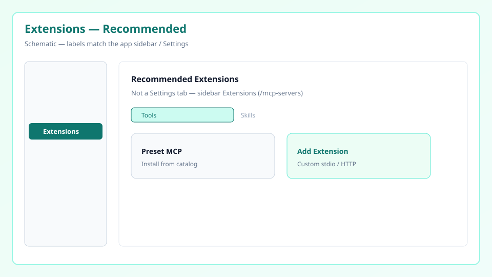

# Extensions로 MCP 설치하기

> LibrAgent에서 외부 MCP 도구는 사이드바 **Extensions**(경로 `/mcp-servers`)에서 관리합니다.  
> **Recommended Extensions**를 누르면 설정 대부분을 채운 뒤 저장만 하면 됩니다.

Settings에 **「MCP Servers」** 탭은 없습니다. MCP/확장 기능은 **Extensions** 페이지입니다.

---

## Extensions 페이지 구성

사이드바 **Extensions**를 엽니다.

상단 탭:

- **Tools** — MCP 확장(서버) 설치·활성/비활성·편집
- **Skills** — 스킬 디렉터리 관리 ([스킬 가이드](skills.md))

Tools 탭에서:

- **Installed Extensions** — 이미 등록된 확장
- **Recommended Extensions** — 앱에 내장된 추천 프리셋 (원클릭에 가깝게 추가)
- **Add Extension** — 직접 커스텀 MCP 등록 → [커스텀 MCP 설치](custom-mcp.md)

---

## 추천 확장으로 설치 (가장 쉬움)

1. **Extensions → Tools**
2. **Recommended Extensions**에서 원하는 항목을 고릅니다.
3. 필요한 값(API 키 등)이 있으면 입력합니다.
4. **Save**로 저장합니다.
5. 목록에서 **Active**로 켜 둡니다.

런타임(Node/`npx`, Python/`uv` 등)이 없으면 먼저 [App Wizard](../getting-started/5-minute-tutorial.md) / `@skill:setup-wizard`로 환경을 맞추세요.

일부 추천 항목은 **stdio**(로컬 프로세스), 일부는 **HTTP/SSE**(원격 URL)입니다. 폼이 프리셋에 맞게 채워집니다.

---

## 추천 확장 목록 (번들 프리셋)

앱에 포함된 `mcp-server.json` 기준입니다. 버전마다 늘어날 수 있으니 UI의 **Recommended Extensions**가 최신입니다.

### search

- **arxiv** — arXiv 논문 검색
- **brave-search** — Brave Search (API 키)
- **ddg-search** — DuckDuckGo 검색
- **exa** — Exa 웹 검색 (HTTP)
- **hn** — Hacker News

### devtools

- **github** — 저장소·이슈·PR (HTTP)
- **context7** — 라이브러리 문서 (HTTP)
- **serena** — 심볼 단위 코드 이해·편집
- **jules** — Google Jules 코딩 에이전트
- **benchmark** — GAIA 등 벤치
- **fre4x-inspector-bridge** — 외부 MCP를 LibrAgent에 연결하는 브리지

### ai

- **openai** / **gemini** / **grok** / **huggingface** — 각 Provider MCP

### data

- **yahoo-finance** — 시세·재무 (키 불필요인 경우 많음)
- **fred** — 연준 경제 데이터

### documents

- **docx** — Word 문서 MCP API
- **jupyter** — Jupyter 노트북

### messaging

- **slack** — Slack (HTTP)
- **telegram** — Telegram

### creative

- **comfyui** — ComfyUI 이미지 생성

> 위 목록은 **추천 프리셋**입니다. npm 패키지·자체 서버·다른 에디터 설정은 [커스텀 MCP 설치](custom-mcp.md)를 보세요.

---

## 설치 후 확인

1. **Installed Extensions**에 나타나는지
2. **Active**인지
3. 카드에서 도구 개수/검증 상태가 보이는지 (연결 후)
4. **Assistants**에서 해당 어시스턴트가 그 MCP를 쓰도록 허용했는지 (어시스턴트별 MCP 선택)

세션을 새로 열거나 다음 턴에서 도구가 보이면 성공입니다. 시간 초과 시 **Settings → Advanced**의 MCP discovery timeout을 늘릴 수 있습니다.

---

## 관련 문서

- [커스텀 MCP 설치](custom-mcp.md) — Add Extension, stdio/HTTP, `@skill:tool-installer`
- [스킬](skills.md)
- [문제 해결](troubleshooting.md)
