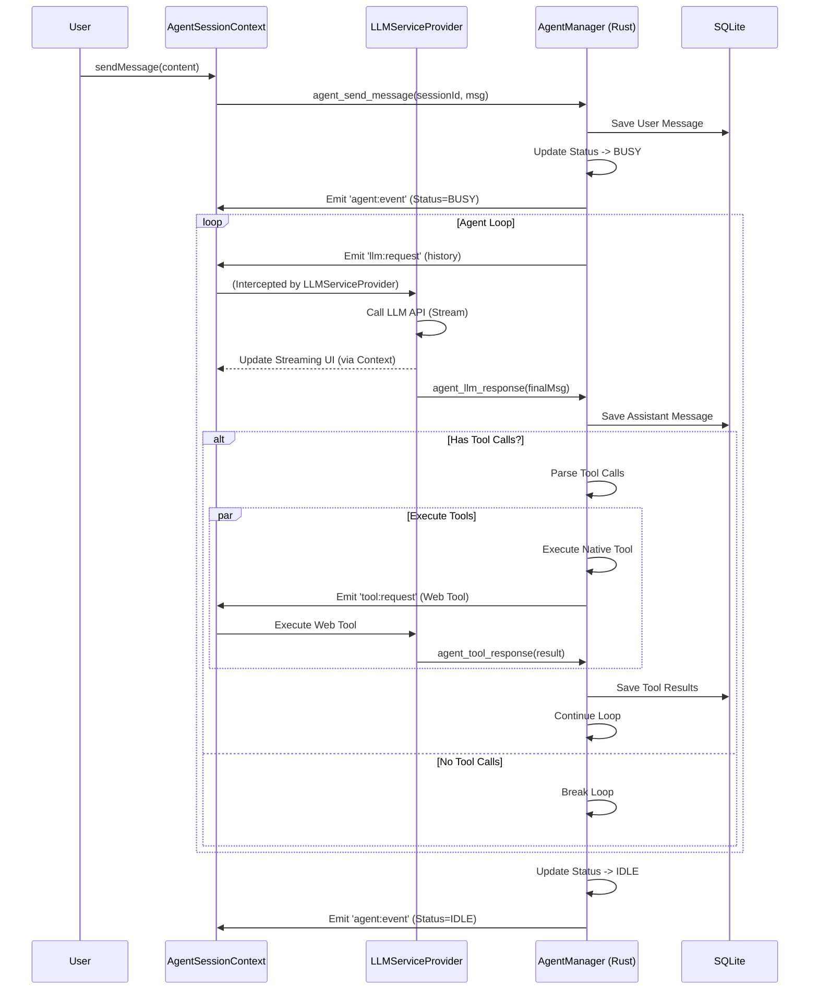
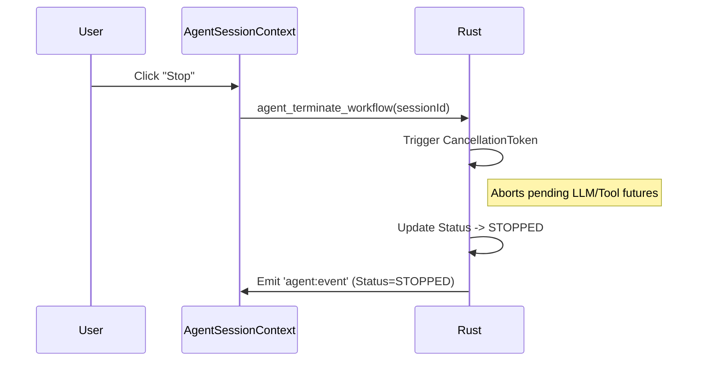

# Agentic Workflow Backend Migration: Elaborated Architecture (Additive Strategy)

**Date:** 2024-12-25
**Based on:** `idea.md` & `refactoring_20241225_1500.md`
**Strategy:** Additive & Safe Migration (Dual-Track System)

## 1. Problem Statement & Motivation

### Current Limitations

- **Session Interruption:** The current Agentic Workflow is tightly coupled to the React Component Lifecycle (`ChatContext`). Switching sessions unmounts the component, killing active tool loops and LLM streams.
- **State Fragmentation:** Message history lives in IndexedDB (Frontend) while session metadata is in Rust. This split makes it hard to maintain a single source of truth.
- **Limited Multi-Agent Support:** Running multiple agents in the background is impossible because the execution logic is tied to the visible UI.

### Goal

Migrate the **Orchestration Logic** (the "Brain" that loops through Think -> Act -> Observe) to the **Rust Backend**.
This ensures agents continue running regardless of UI state, enabling true background execution and multi-agent collaboration.

---

## 2. Solution: Dual-Track Hybrid Architecture

We adopt a **"Dual-Track"** model to ensure 100% stability for existing features while introducing the new Rust-based orchestration.

- **Track 1 (Legacy)**: Existing `ChatContext` + `useAIService` (Frontend Orchestration). Used for existing sessions.
- **Track 2 (Agent V2)**: New `AgentSessionContext` + `AgentSessionManager` (Rust Orchestration). Used for new Agent sessions.

### Core Components (V2 Track)

#### A. Rust Backend (The Orchestrator)

- **`AgentSessionManager`**: The central authority. Manages active session loops, handles state transitions (Idle -> Busy -> Paused), and persists data.
- **`MessageRepository` (SQLite)**: The Single Source of Truth for all chat history.
- **`MCPServiceProxy`**: **Session-aware tool aggregator**. Manages connections to both External MCP servers (stdio/http) and Built-in Rust servers. Automatically propagates session context to all registered tools via `switch_context()`, ensuring session-scoped state isolation without requiring tools to handle session parameters explicitly.

#### B. Frontend Service Layer (The Worker)

- **`LLMServiceProvider`**: A global React Context (never unmounts). Listens for LLM requests from Rust, executes them using existing `useAIService` logic, and streams results back.
- **`AgentSessionContext`**: **(NEW)** Replaces `ChatContext` for V2 sessions. Manages the view state and interaction for Rust-driven sessions. It subscribes to `agent:event` to sync UI with backend state.
- **`ToolBridgeProvider`**: **(Transitional)** Exposes Web-based MCP tools during migration phase. As Web MCP tools are migrated to Rust Built-in servers, this bridge will be gradually deprecated and eventually removed.

#### C. IPC Bridge (The Nervous System)

- **Commands (TS -> Rust)**: `agent_create_session`, `agent_send_message`, `agent_terminate_workflow`.
- **Events (Rust -> TS)**: `agent:event` (Status updates), `llm:request` (Ask TS to call LLM), `tool:request` (Ask TS to run Web Tool).

---

## 3. Detailed Technical Specifications

### 3.1. Lifecycle Management

- **App Window**: The application window is expected to remain open (or minimized). We do _not_ support headless execution (tray-only with closed window) in this phase.
- **Session Termination**:
  - Users can explicitly stop an agent via `stop_agent_session`.
  - Rust uses `CancellationToken` to immediately abort running loops (LLM generation or Tool execution).

### 3.2. Data Sovereignty

- **SQLite is King**: All messages are stored in Rust's SQLite (`messages` table).
- **Session-Scoped Data**: Built-in tools (Knowledge, Planning, Playbook, etc.) store their data in SQLite with `session_id` foreign keys, ensuring complete isolation between sessions.
- **IndexedDB Deprecation**: IndexedDB is no longer used for chat history or tool state in V2. Web MCP tools are being migrated to Rust Built-in servers with SQLite persistence.

### 3.3. LLM Integration (The "Wrap First" Strategy)

Instead of rewriting all LLM logic in Rust immediately:

1.  **Rust** decides _when_ to call the LLM.
2.  **Rust** emits `llm:request` with the conversation history and config.
3.  **TS** (`LLMServiceProvider`) receives the event, performs token counting/context pruning, and calls the API.
4.  **TS** streams the response to the UI (for immediate feedback) and sends the final result back to Rust.

### 3.4. Tool Execution Architecture

#### Tool Aggregation via MCPServiceProxy

The `MCPServiceProxy` acts as a unified interface for all tool execution, managing both External and Built-in servers:

```rust
pub struct MCPServiceProxy {
    external_servers: Arc<MCPServerManager>,    // stdio/http MCP servers
    builtin_servers: Arc<BuiltinServerRegistry>, // Rust native servers
    current_context: Arc<RwLock<ServiceContextOptions>>, // session_id, assistant_id
}
```

**Session Context Management:**
- `AgentSessionManager` calls `proxy.switch_session(session_id, assistant_id)` before each workflow.
- `MCPServiceProxy` propagates this context to all registered Built-in servers via their `switch_context()` method.
- Tools **never receive session parameters** directly—they query the proxy's current context internally.

**Tool Execution Flow:**
1. Rust calls `proxy.call_tool(tool_name, args)`
2. Proxy routes based on tool prefix:
   - `builtin_*` → `BuiltinServerRegistry`
   - Others → `MCPServerManager` (External)
3. Built-in tools use `self.current_context` to filter data by session automatically.

#### Migration Strategy: Web MCP → Rust Built-in

Web MCP tools are being migrated in phases to eliminate the ToolBridge dependency:

**Phase 1: System Tools (Session-Independent)**
- `bootstrap-server` → `BootstrapServer` (Rust)
  - Platform detection, installation guides
  - No session state required
- `mcp-manager` → Extended `MCPServerManager` API
  - Server CRUD operations
  - Global configuration

**Phase 2: Session-Scoped Data Tools**
- `knowledge-server` → `KnowledgeServer` (Rust + SQLite)
  - Table: `knowledge (session_id, assistant_id, title, content, ...)`
  - BM25 search implementation in Rust
- `planning-server` → `PlanningServer` (Rust + SQLite)
  - Tables: `goals`, `todos`, `scratchpad`
  - Foreign key: `session_id`
- `assistant-manager` → `AssistantServer` (Rust + SQLite)
  - Unified with existing assistant repository

**Phase 3: UI Resource Tools**
- `playbook-store` → `PlaybookServer` (Rust + Handlebars)
  - HTML templates rendered server-side
  - Returns UI resources via `MCPResult::with_ui_resource()`
- `ui-tools` → Integrated into `WorkspaceServer`
  - Interactive prompts using Handlebars templates

**Tool State Isolation Example:**
```rust
impl KnowledgeServer {
    async fn call_tool(&self, tool_name: &str, args: Value) -> Result<MCPResult, String> {
        let ctx = self.current_context.read().await;
        let session_id = ctx.session_id.as_ref().ok_or("No session")?;
        
        match tool_name {
            "saveKnowledge" => {
                // INSERT INTO knowledge (session_id, ...) VALUES (?, ...)
                self.db.insert_knowledge(session_id, args).await
            }
            "searchKnowledge" => {
                // SELECT * FROM knowledge WHERE session_id = ?
                self.db.search_knowledge(session_id, args).await
            }
            _ => Err(format!("Unknown tool: {}", tool_name))
        }
    }
}
```

#### Transitional Bridge (Web MCP Tools)

During migration, `ToolBridgeProvider` handles unmigrated Web MCP tools:
- Rust emits `tool:execute-request` event
- TS executes via `useUnifiedMCP().executeToolCall()`
- TS returns result via `agent_handle_tool_result` command

**Deprecation Timeline:**
- Phase 1-2 complete → Remove 70% of ToolBridge usage
- Phase 3 complete → Full removal of `ToolBridgeProvider`

---

## 4. Sequence Diagrams

### 4.1. Starting a Workflow (User Message)



### 4.2. Terminating a Session



---

## 5. Migration & Coexistence Strategy (The "Additive" Approach)

To guarantee zero regression and safe rollout:

1.  **Parallel Contexts**:
    - We do **not** modify `ChatContext` or `SessionContext` logic.
    - We introduce `AgentSessionContext` as a parallel provider.
    - `SessionContext` remains the "List View" provider but delegates runtime management to `AgentSessionContext` for V2 sessions.

2.  **Feature Flagging**:
    - `Session` struct gets `use_v2_agent: boolean`.
    - `false` (Default) -> Uses `ChatContext` (Legacy Track).
    - `true` -> Uses `AgentSessionContext` (Agent Track).

3.  **UI Routing**:
    - The Chat Container detects the session type.
    - If V2, it renders `<AgentChatView />` (connected to `AgentSessionContext`).
    - If V1, it renders `<ChatView />` (connected to `ChatContext`).

4.  **Gradual Rollout**:
    - Initially, only specific "Agent" types created via the new UI flow will have `use_v2_agent=true`.
    - Existing sessions remain on V1 indefinitely until a migration tool is built (future scope).

---

## 6. Error Handling

- **Crash Recovery**: On App restart, Rust checks for sessions stuck in `BUSY` state and resets them to `PAUSED` or `IDLE` to prevent "zombie" states.
- **Network Failure**: If the LLM call fails in TS, it reports an error back to Rust. Rust records the error in DB and pauses the workflow, allowing the user to retry.
- **Tool Execution Errors**: 
  - Built-in tools return structured errors via `MCPResult::error()`
  - Proxy catches errors and converts to tool result messages
  - Session continues with error feedback to LLM for recovery

---

## 7. Built-in Tool Architecture (BuiltinMCPServer Trait)

All Built-in servers implement a standardized interface:

```rust
#[async_trait]
pub trait BuiltinMCPServer: Send + Sync + Debug {
    fn name(&self) -> &str;
    fn description(&self) -> &str;
    fn tools(&self) -> Vec<MCPTool>;
    
    /// Called by MCPServiceProxy when session changes
    async fn switch_context(&self, options: ServiceContextOptions) -> Result<(), String> {
        // Default: no-op (for stateless servers)
        Ok(())
    }
    
    /// Returns current server state as context for system prompt
    fn get_service_context(&self, options: Option<&Value>) -> ServiceContext {
        // Default: minimal context
    }
    
    /// Execute tool with current session context
    async fn call_tool(&self, tool_name: &str, args: Value) -> Result<MCPResult, String>;
}
```

**Session Context Flow:**
1. `AgentSessionManager.start_workflow()` calls `proxy.switch_session(session_id, assistant_id)`
2. Proxy iterates all Built-in servers: `server.switch_context(options).await`
3. Each server updates internal `Arc<RwLock<ServiceContextOptions>>`
4. Tool calls automatically use the updated context without explicit parameters

**Registration:**
```rust
// src-tauri/src/mcp/builtin/mod.rs
impl BuiltinServerRegistry {
    pub fn new_with_session_manager(session_manager: Arc<SessionManager>) -> Self {
        let mut registry = Self { servers: HashMap::new() };
        
        // Register all built-in servers
        registry.register_server(Box::new(WorkspaceServer::new(session_manager.clone())));
        registry.register_server(Box::new(ContentStoreServer::new(session_manager.clone())));
        registry.register_server(Box::new(KnowledgeServer::new(session_manager.clone())));
        registry.register_server(Box::new(PlanningServer::new(session_manager.clone())));
        registry.register_server(Box::new(PlaybookServer::new(session_manager.clone())));
        registry.register_server(Box::new(BootstrapServer::new()));
        
        registry
    }
}
```
