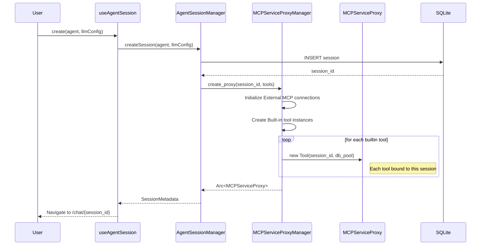
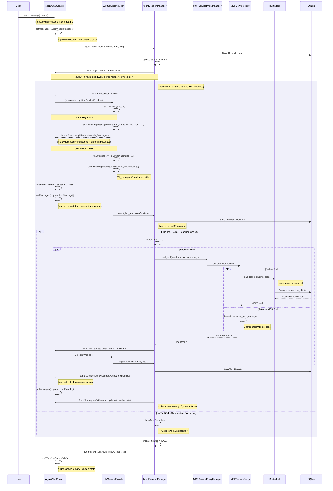
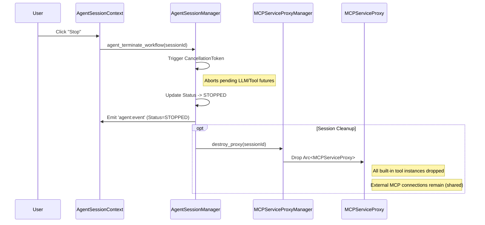

# Agentic Workflow Backend Migration: Elaborated Architecture (Additive Strategy)

**Date:** 2024-12-25
**Based on:** `idea.md` & `refactoring_20241225_1500.md`
**Strategy:** Additive & Safe Migration (Dual-Track System)

## 1. Problem Statement & Motivation

### Current Limitations

- **Session Interruption:** The current Agentic Workflow is tightly coupled to the React Component Lifecycle (`ChatContext`). Switching sessions unmounts the component, killing active tool loops and LLM streams.
- **State Fragmentation:** Message history lives in IndexedDB (Frontend) while session metadata is in Rust. This split makes it hard to maintain a single source of truth.
- **Limited Multi-Agent Support:** Running multiple agents in the background is impossible because the execution logic is tied to the visible UI.

### Goal

Migrate the **Orchestration Logic** (the "Brain" that cycles through Think -> Act -> Observe via event-driven state transitions) to the **Rust Backend**.
This ensures agents continue running regardless of UI state, enabling true background execution and multi-agent collaboration.

**Implementation Pattern**: Not a traditional while loop or recursion, but a **conditional event-driven cycle** where each `handle_llm_response` call completes and returns, then emits an event to trigger the next cycle if tool calls exist. **No call stack accumulation** - each cycle is an independent function invocation.

---

## 2. Solution: Dual-Track Hybrid Architecture

We adopt a **"Dual-Track"** model to ensure 100% stability for existing features while introducing the new Rust-based orchestration.

- **Track 1 (Legacy)**: Existing `ChatContext` + `useAIService` (Frontend Orchestration). Used for existing sessions.
- **Track 2 (Agent V2)**: New `AgentSessionContext` + `AgentSessionManager` (Rust Orchestration). Used for new Agent sessions.

### Core Components (V2 Track)

#### A. Rust Backend (The Orchestrator)

- **`AgentSessionManager`**: The central authority. Manages active session workflows via event-driven state machine, handles state transitions (Idle -> Busy -> Paused), and persists data. Each `handle_llm_response` call conditionally triggers the next cycle by checking for tool calls.
- **`MessageRepository` (SQLite)**: The Single Source of Truth for all chat history.
- **`MCPServiceProxyManager`**: Global manager that creates and manages session-specific `MCPServiceProxy` instances. Ensures complete isolation between concurrent agent sessions while sharing common resources (External MCP processes, DB connection pools).
- **`MCPServiceProxy`**: **Per-session tool aggregator**. Each session has its own dedicated proxy instance with isolated Built-in tool instances. External MCP servers are shared via references. Enables true multi-agent parallel execution without context interference.

#### B. Frontend Service Layer (The Worker)

- **`LLMServiceProvider`**: A global React Context (never unmounts). Listens for LLM requests from Rust, executes them using existing `useAIService` logic, and streams results back. **Critical role**: Sets `isStreaming: false` on completion to trigger message persistence in `AgentChatContext`.
- **`AgentChatContext`**: **(NEW)** Replaces `ChatContext` for V2 sessions. **Owns the message stack** per `idea.md` architecture. Manages local message state via React hooks:
  - Optimistically adds user messages immediately
  - Detects `isStreaming: false` via useEffect and adds completed assistant messages
  - Listens to `agent:event(MessageAdded)` for tool result messages
  - **No DB reload during active workflow** - maintains complete message history in React state
- **`ToolBridgeProvider`**: **(Transitional)** Exposes Web-based MCP tools during migration phase. As Web MCP tools are migrated to Rust Built-in servers, this bridge will be gradually deprecated and eventually removed.

#### C. IPC Bridge (The Nervous System)

- **Commands (TS -> Rust)**: `agent_create_session`, `agent_send_message`, `agent_terminate_workflow`.
- **Events (Rust -> TS)**: `agent:event` (Status updates), `llm:request` (Ask TS to call LLM), `tool:request` (Ask TS to run Web Tool).

---

## 3. Detailed Technical Specifications

### 3.1. Lifecycle Management

- **App Window**: The application window is expected to remain open (or minimized). We do _not_ support headless execution (tray-only with closed window) in this phase.
- **Session Termination**:
  - Users can explicitly stop an agent via `stop_agent_session`.
  - Rust uses `CancellationToken` to immediately abort active workflows and pending async operations (LLM generation or Tool execution).

### 3.2. Data Sovereignty

- **SQLite is King**: All messages are stored in Rust's SQLite (`messages` table).
- **Session-Scoped Data**: Built-in tools (Knowledge, Planning, Playbook, etc.) store their data in SQLite with `session_id` foreign keys, ensuring complete isolation between sessions.
- **IndexedDB Deprecation**: IndexedDB is no longer used for chat history or tool state in V2. Web MCP tools are being migrated to Rust Built-in servers with SQLite persistence.

### 3.3. LLM Integration (The "Wrap First" Strategy)

Instead of rewriting all LLM logic in Rust immediately:

1.  **Rust** decides _when_ to call the LLM.
2.  **Rust** emits `llm:request` with the conversation history and config.
3.  **TS** (`LLMServiceProvider`) receives the event, performs token counting/context pruning, and calls the API.
4.  **TS** streams the response to the UI (for immediate feedback):
    - During streaming: Updates `streamingMessages` with `isStreaming: true`
    - On completion: Sets `isStreaming: false` to trigger `AgentChatContext` effect
    - Effect adds message to local React state (`setMessages`)
5.  **TS** sends the final result back to Rust for DB persistence (backup only).

**Key Principle**: React maintains the authoritative message stack during workflow execution. Rust's DB serves as persistent backup and initial load source, not real-time UI state.

### 3.4. Tool Execution Architecture

#### Multi-Agent Architecture: Session-Per-Proxy Design

To support **concurrent multi-agent execution**, we adopt a **session-per-proxy** architecture:

```rust
pub struct MCPServiceProxyManager {
    proxies: Arc<RwLock<HashMap<String, Arc<MCPServiceProxy>>>>, // sessionId -> proxy
    external_mcp_manager: Arc<MCPServerManager>, // Shared across all sessions
    db_pool: Arc<SqlitePool>, // Shared DB connection pool
}

pub struct MCPServiceProxy {
    session_id: String,
    builtin_servers: HashMap<String, Box<dyn BuiltinMCPServer>>, // Isolated per session
    external_mcp_manager: Arc<MCPServerManager>, // Reference to shared manager
}
```

**Resource Sharing Strategy:**

| Component                   | Scope           | Rationale                                         |
| :-------------------------- | :-------------- | :------------------------------------------------ |
| **MCPServiceProxy**         | Per-session     | Complete state isolation for concurrent agents    |
| **Built-in Tool Instances** | Per-session     | Each session needs independent tool state         |
| **External MCP Processes**  | Global (shared) | Expensive resources, safe to share via manager    |
| **SQLite Connection Pool**  | Global (shared) | Efficient connection reuse, isolation via queries |

**Session Context Management:**

1. **Proxy Creation:**

   ```rust
   impl MCPServiceProxyManager {
       pub async fn create_proxy(&self, session_id: String, tools: Vec<String>)
           -> Result<Arc<MCPServiceProxy>, String> {

           // Create session-specific built-in tool instances
           let mut builtin_servers = HashMap::new();
           for tool_id in tools {
               let server = create_builtin_server(
                   &tool_id,
                   session_id.clone(),
                   self.db_pool.clone()
               ).await?;
               builtin_servers.insert(tool_id, server);
           }

           let proxy = Arc::new(MCPServiceProxy {
               session_id: session_id.clone(),
               builtin_servers,
               external_mcp_manager: self.external_mcp_manager.clone(),
           });

           self.proxies.write().await.insert(session_id, proxy.clone());
           Ok(proxy)
       }
   }
   ```

2. **Tool Execution Flow:**

   ```rust
   impl MCPServiceProxy {
       pub async fn call_tool(&self, tool_name: &str, args: Value)
           -> Result<MCPResponse, String> {

           if tool_name.starts_with("builtin_") {
               // Use this session's dedicated built-in tool instance
               self.builtin_servers.get(tool_name)
                   .ok_or("Tool not found")?
                   .call_tool(tool_name, args).await
           } else {
               // Route to shared external MCP manager
               // External servers are stateless or use tool-level session handling
               self.external_mcp_manager
                   .call_tool(tool_name, args).await
           }
       }
   }
   ```

**Multi-Agent Isolation Example:**

```rust
// Session A (Agent analyzing code)
let proxy_a = manager.create_proxy("session-a", vec!["knowledge", "planning"]).await?;
proxy_a.call_tool("saveKnowledge", json!({"title": "Code Review"})).await?;

// Session B (Agent writing documentation) - concurrent execution
let proxy_b = manager.create_proxy("session-b", vec!["knowledge", "playbook"]).await?;
proxy_b.call_tool("saveKnowledge", json!({"title": "API Docs"})).await?;

// ✅ No interference: Each proxy has its own KnowledgeServer instance
// ✅ DB isolation: Both write to same table but with different session_ids
```

#### Migration Strategy: Web MCP → Rust Built-in

Web MCP tools are being migrated in phases to eliminate the ToolBridge dependency:

**Phase 1: System Tools (Session-Independent)**

- `bootstrap-server` → `BootstrapServer` (Rust)
  - Platform detection, installation guides
  - No session state required
- `mcp-manager` → Extended `MCPServerManager` API
  - Server CRUD operations
  - Global configuration

**Phase 2: Session-Scoped Data Tools**

- `knowledge-server` → `KnowledgeServer` (Rust + SQLite)
  - Table: `knowledge (session_id, assistant_id, title, content, ...)`
  - BM25 search implementation in Rust
- `planning-server` → `PlanningServer` (Rust + SQLite)
  - Tables: `goals`, `todos`, `scratchpad`
  - Foreign key: `session_id`
- `assistant-manager` → `AssistantServer` (Rust + SQLite)
  - Unified with existing assistant repository

**Phase 3: UI Resource Tools**

- `playbook-store` → `PlaybookServer` (Rust + Handlebars)
  - HTML templates rendered server-side
  - Returns UI resources via `MCPResult::with_ui_resource()`
- `ui-tools` → Integrated into `WorkspaceServer`
  - Interactive prompts using Handlebars templates

**Tool State Isolation Example:**

```rust
pub struct KnowledgeServer {
    session_id: String, // Bound at initialization
    db_pool: Arc<SqlitePool>, // Shared connection pool
}

impl KnowledgeServer {
    pub fn new(session_id: String, db_pool: Arc<SqlitePool>) -> Self {
        Self { session_id, db_pool }
    }

    async fn call_tool(&self, tool_name: &str, args: Value) -> Result<MCPResult, String> {
        // No need to extract session_id from context - it's bound to this instance
        match tool_name {
            "saveKnowledge" => {
                // INSERT INTO knowledge (session_id, ...) VALUES (?, ...)
                self.db_pool.insert_knowledge(&self.session_id, args).await
            }
            "searchKnowledge" => {
                // SELECT * FROM knowledge WHERE session_id = ?
                self.db_pool.search_knowledge(&self.session_id, args).await
            }
            _ => Err(format!("Unknown tool: {}", tool_name))
        }
    }
}
```

#### Transitional Bridge (Web MCP Tools)

During migration, `ToolBridgeProvider` handles unmigrated Web MCP tools:

- Rust emits `tool:execute-request` event
- TS executes via `useUnifiedMCP().executeToolCall()`
- TS returns result via `agent_handle_tool_result` command

**Deprecation Timeline:**

- Phase 1-2 complete → Remove 70% of ToolBridge usage
- Phase 3 complete → Full removal of `ToolBridgeProvider`

---

## 4. Sequence Diagrams

### 4.1. Creating a New Session



### 4.2. Starting a Workflow (User Message)



**Implementation Note**:  
The diagram shows one cycle iteration. The "loop" is **implicit** - each `handle_llm_response` with tool calls emits `llm:request` **and then returns** (function ends, stack freed), causing TypeScript to call `agent_llm_response` again after LLM completion, creating a new independent invocation. No explicit `while` loop or recursion exists - each cycle is a fresh function call with no stack accumulation.

**React State Management (Key Principle from idea.md)**:

- **React owns the message stack**: `AgentChatContext.messages` is the primary state
- **User messages**: Optimistically added to React state immediately
- **Assistant messages**: Added when `isStreaming: false` is detected via useEffect
- **Tool result messages**: Added via `agent:event(MessageAdded)` listener
- **Rust DB**: Acts as persistent backup, not the UI's source of truth during workflow
- **No DB reload during workflow**: React maintains complete message history locally

### 4.3. Terminating a Session



---

## 5. Migration & Coexistence Strategy (The "Additive" Approach)

To guarantee zero regression and safe rollout, we adopt a **complete separation strategy** with no modifications to existing code:

1.  **Complete Frontend Separation**:
    - **V1 (Legacy Track)**: Existing route `/chat/*` → `SessionContext` → `ChatView` → IndexedDB
    - **V2 (Agent Track)**: New route `/agent/*` → `AgentSessionContext` → `AgentChatView` → Rust SQLite
    - **No shared Session models** - Each track maintains completely independent data structures and storage
    - Both contexts coexist as parallel providers in the same app, with zero cross-talk

2.  **Independent Route Space**:
    - Legacy route: `/chat/:sessionId` continues using IndexedDB-based sessions
    - Agent route: `/agent/:sessionId` (future) uses Rust SQLite-based sessions
    - Users navigate between tracks via UI (future: migration tool for data transfer)
    - No conditional logic or type detection in existing routing components

3.  **Zero Modification Guarantee**:
    - **No changes** to existing files: `ChatContext.tsx`, `ChatView.tsx`, `Session` model, `ChatContainer.tsx`
    - **No feature flags** added to existing models or contexts
    - V2 components live in separate directories with independent implementations
    - Legacy functionality remains 100% intact and untouched

4.  **Provider Architecture**:

    ```tsx
    <SettingsProvider>
      <SessionContextProvider>
        {' '}
        {/* V1: Manages IndexedDB sessions */}
        <AgentSessionProvider>
          {' '}
          {/* V2: Manages Rust SQLite sessions */}
          {/* Both providers coexist independently */}
          <Routes>
            <Route path="/chat/*" /> {/* V1 routes - untouched */}
            <Route path="/agent/*" /> {/* V2 routes - new addition */}
          </Routes>
        </AgentSessionProvider>
      </SessionContextProvider>
    </SettingsProvider>
    ```

5.  **Migration Path** (Future Scope):
    - Users continue using V1 sessions indefinitely - no forced migration
    - Optional migration tool will transfer V1 session data to V2 format
    - V1 and V2 sessions can coexist in the same app permanently

**Key Principle**: This is **not** a "feature flag" or "conditional rendering" approach. It's a complete duplication of the frontend stack for V2, ensuring V1 remains frozen and untouched.

---

## 6. Error Handling

- **Crash Recovery**: On App restart, Rust checks for sessions stuck in `BUSY` state and resets them to `PAUSED` or `IDLE` to prevent "zombie" states.
- **Network Failure**: If the LLM call fails in TS, it reports an error back to Rust. Rust records the error in DB and pauses the workflow, allowing the user to retry.
- **Tool Execution Errors**:
  - Built-in tools return structured errors via `MCPResult::error()`
  - Proxy catches errors and converts to tool result messages
  - Session continues with error feedback to LLM for recovery

---

## 7. Built-in Tool Architecture (BuiltinMCPServer Trait)

All Built-in servers implement a standardized interface:

```rust
#[async_trait]
pub trait BuiltinMCPServer: Send + Sync + Debug {
    fn name(&self) -> &str;
    fn description(&self) -> &str;
    fn tools(&self) -> Vec<MCPTool>;

    /// Returns current server state as context for system prompt
    fn get_service_context(&self, options: Option<&Value>) -> ServiceContext {
        // Default: minimal context
    }

    /// Execute tool (session context is bound at construction)
    async fn call_tool(&self, tool_name: &str, args: Value) -> Result<MCPResult, String>;
}
```

**Session-Per-Instance Pattern:**

Built-in tools are instantiated **per session** with bound session context:

```rust
// Factory function for creating session-specific tool instances
pub async fn create_builtin_server(
    tool_id: &str,
    session_id: String,
    db_pool: Arc<SqlitePool>,
) -> Result<Box<dyn BuiltinMCPServer>, String> {
    match tool_id {
        "knowledge" => Ok(Box::new(KnowledgeServer::new(session_id, db_pool))),
        "planning" => Ok(Box::new(PlanningServer::new(session_id, db_pool))),
        "playbook" => Ok(Box::new(PlaybookServer::new(session_id, db_pool))),
        "bootstrap" => Ok(Box::new(BootstrapServer::new())), // Stateless
        _ => Err(format!("Unknown builtin tool: {}", tool_id)),
    }
}
```

**Lifecycle Management:**

```rust
impl MCPServiceProxyManager {
    pub async fn create_proxy(&self, session_id: String, tools: Vec<String>)
        -> Result<Arc<MCPServiceProxy>, String> {

        // Create fresh tool instances for this session
        let mut builtin_servers = HashMap::new();
        for tool_id in tools {
            let server = create_builtin_server(
                &tool_id,
                session_id.clone(),
                self.db_pool.clone(),
            ).await?;
            builtin_servers.insert(tool_id.clone(), server);
        }

        let proxy = Arc::new(MCPServiceProxy {
            session_id: session_id.clone(),
            builtin_servers,
            external_mcp_manager: self.external_mcp_manager.clone(),
        });

        self.proxies.write().await.insert(session_id, proxy.clone());
        Ok(proxy)
    }

    pub async fn destroy_proxy(&self, session_id: &str) {
        // Remove proxy and drop all associated tool instances
        self.proxies.write().await.remove(session_id);
    }
}
```

**Advantages of Session-Per-Instance:**

1. **No Race Conditions:** Each session has completely isolated tool state
2. **Simple Implementation:** No need for `switch_context()` or context locking
3. **Clean Lifecycle:** Tools are created with session, destroyed when session ends
4. **Multi-Agent Ready:** Concurrent sessions never interfere with each other
5. **Type Safety:** Session context is compile-time bound, not runtime-checked
