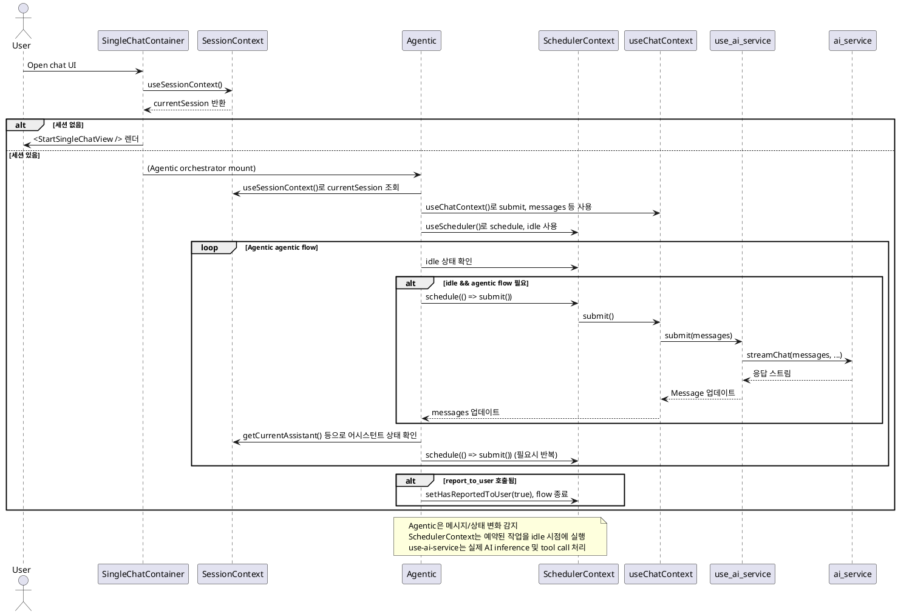

# Refactoring Plan

## Task 1 - Scheduler 구현 (SchedulerContext)

### 목표

- idle(유휴) 상태를 감지하고, 예약된 작업을 안전하게 실행하는 SchedulerContext를 구현한다.
- ToolCaller, Agentic 등 orchestrator에서 scheduler를 통해 tool call, recurring logic 등을 제어할 수 있도록 한다.

### 아키텍처 및 역할

- SchedulerContext는 전역적으로 제공되며, 다음을 담당한다:
  - idle 상태 감지 (예: 메시지 처리 대기, 네트워크 응답 대기 등)
  - schedule(fn): 예약된 작업을 큐에 넣고, idle 시점에 실행
  - idle: 현재 시스템이 유휴 상태인지 boolean으로 제공
  - recurring logic 지원 (예: agentic assistant의 반복적 submit 등)

### 연동 구조

- ToolCaller, Agentic 등 orchestrator는 SchedulerContext의 schedule, idle을 활용해 비동기 작업을 제어한다.
- 예시: tool call이 필요할 때 schedule(() => execute(...)) 호출
- 예시: agentic assistant가 idle일 때 자동 submit 예약

---

#### 일반적인 tool call 처리 예시

```tsx
const { schedule, idle } = useScheduler();
const { messages } = useChatContext();
const { execute } = useMCPServer();

useEffect(() => {
  // 메시지 배열의 마지막 메시지가 tool call이면, idle 상태에서 실행 예약
  const lastMessage = messages[messages.length - 1];
  if (isToolCall(lastMessage)) {
    schedule(() => execute(lastMessage));
  }
}, [schedule, execute, messages]);
```

---

#### Recurring logic (agentic assistant 자동 반복) 예시

```tsx
const { schedule, idle } = useScheduler();
const { messages, submit } = useChatContext();
const { select, currentAssistant } = useAssistantContext();
const agenticPolicyAssistant: Assistant = ... // 명확한 타입 지정 권장

// idle 상태가 되면 agentic assistant를 선택
useEffect(() => {
  if (idle) {
    select(agenticPolicyAssistant);
  }
}, [idle, select, agenticPolicyAssistant]);

// agentic assistant가 선택되어 있고 idle이면 submit 예약
useEffect(() => {
  if (
    currentAssistant?.id === agenticPolicyAssistant.id &&
    idle
  ) {
    schedule(() => submit());
  }
}, [currentAssistant, agenticPolicyAssistant, idle, schedule, submit]);
```

---

### SchedulerContext.tsx 설계안

- React context로 구현, useScheduler() hook 제공
- 내부적으로 작업 큐(queue)와 idle 상태 관리
- schedule(fn): 작업 예약, idle 시점에 실행
- idle: boolean, 현재 유휴 상태
- (선택) 작업 우선순위, 중복 예약 방지 등 확장 고려

#### 예시 스켈레톤

```tsx
// src/context/SchedulerContext.tsx
import React, { createContext, useContext, useState, useCallback } from 'react';

interface SchedulerContextType {
  schedule: (fn: () => void) => void;
  idle: boolean;
}

const SchedulerContext = createContext<SchedulerContextType | undefined>(
  undefined,
);

export const SchedulerProvider: React.FC<{ children: React.ReactNode }> = ({
  children,
}) => {
  // ...작업 큐, idle 상태 관리 로직 구현 예정
  return (
    <SchedulerContext.Provider value={{ schedule: () => {}, idle: true }}>
      {children}
    </SchedulerContext.Provider>
  );
};

export function useScheduler() {
  const ctx = useContext(SchedulerContext);
  if (!ctx)
    throw new Error('useScheduler must be used within SchedulerProvider');
  return ctx;
}
```

---

### 다음 단계

- [ ] SchedulerContext.tsx 실제 구현 (작업 큐, idle 감지, 예약 실행)
- [ ] ToolCaller, Agentic 등 orchestrator에서 useScheduler로 통합
- [ ] 테스트 및 edge case 검증 (중복 예약, 에러 처리 등)
- [ ] 문서화 및 예제 추가

