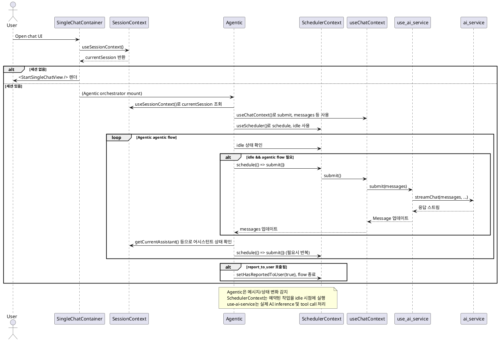

# Refactoring Plan: SchedulerContext 및 Tool/Agentic 연동

## 목표
- SchedulerContext를 전역적으로 구현하여, idle(유휴) 상태 감지 및 예약 작업(schedule) 실행을 일관적으로 관리한다.
- Tool 실행, agentic assistant의 반복 submit 등 orchestrator의 모든 비동기 작업을 SchedulerContext를 통해 직렬화/제어한다.

- SchedulerContext는 React Context로 제공되며, useScheduler() hook으로 schedule, idle을 노출한다.
- Tool 실행(예: LocalToolContext, MCPServerContext의 executeToolCall), 메시지 submit(use-chat.tsx의 handleSubmit) 등 핵심 실행부에서만 schedule을 적용한다.
- 그 외의 곳에서는 schedule을 직접 호출할 필요 없이, 위 3군데만 통합 적용하면 전체 동작이 직렬화된다.
#### 1. Tool 실행부 (LocalToolContext, MCPServerContext)

```tsx
import { useScheduler } from '../context/SchedulerContext';
// ...
const { schedule } = useScheduler();

const executeToolCall = useCallback(
  (toolCall) => {
    return new Promise((resolve, reject) => {
      schedule(async () => {
        try {
          // 기존 tool 실행 로직
          const result = await handler(toolCall);
          resolve(result);
        } catch (e) {
          reject(e);
        }
      });
    });
  },
  [schedule],
);
```

#### 2. 메시지 submit (use-chat.tsx)

```tsx
import { useScheduler } from '../context/SchedulerContext';
// ...
const { schedule } = useScheduler();

const handleSubmit = useCallback((messageToAdd) => {
  return new Promise((resolve, reject) => {
    schedule(async () => {
      try {
        // 기존 handleSubmit 로직
        const aiResponse = await triggerAIService(...);
        resolve(aiResponse);
      } catch (e) {
        reject(e);
      }
    });
  });
}, [schedule, ...]);
```

#### 3. Agentic/Orchestrator에서의 반복 submit

```tsx
const { schedule, idle } = useScheduler();
useEffect(() => {
  if (idle) {
    schedule(() => submit());

---

## SchedulerContext 설계안

- 작업 큐(queue)와 idle 상태를 관리하며, schedule(fn)로 예약된 작업을 idle 시점에 순차 실행
- (확장) 작업 우선순위, 중복 예약 방지 등 고려 가능

```tsx
  useCallback,
  useEffect,
  useMemo,
} from 'react';
import { useAsyncFn, useQueue } from 'react-use';

type Task = () => Promise<void>;

interface SchedulerContextType {
  schedule: (task: Task) => void;
  idle: boolean;
}

const SchedulerContext = createContext<SchedulerContextType | undefined>(
  undefined,
);

export const SchedulerProvider: React.FC<{ children: ReactNode }> = ({
  children,
}) => {
  const { remove, size, add, first } = useQueue<Task>();
  const [{ loading }, run] = useAsyncFn(async (task: Task) => {
    try {
      await task();
    } catch (e) {
      console.error('Scheduled task failed:', e);
    }
  }, []);

  useEffect(() => {
    if (first && !loading) {
      run(first).finally(() => {
        remove();
      });
    }
  }, [loading, first, run, remove]);

  const idle = useMemo(() => !loading && size === 0, [loading, size]);

  const schedule = useCallback(
    (task: Task) => {
      add(task);
    },
    [add],
  );

  const value = { schedule, idle };

  return (
    <SchedulerContext.Provider value={value}>
      {children}
    </SchedulerContext.Provider>
  );
};

export function useScheduler() {
  const context = useContext(SchedulerContext);
  if (context === undefined) {
    throw new Error('useScheduler must be used within a SchedulerProvider');
  }
  return context;
}
```

---

## 연동 구조 PlantUML


