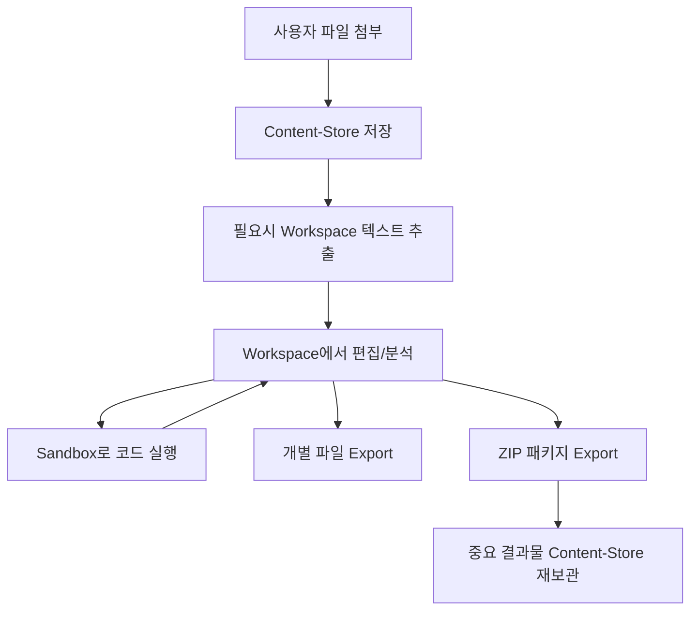

# Builtin Tools 개선 기획서

## 🚨 기존 문제점

### 1. 도구 간 역할 혼재

- **content-store vs filesystem**: 기능적 중복으로 사용자 혼란
- **filesystem**: 전체 시스템 접근처럼 보이나 실제로는 제한된 디렉토리만 접근
- **불명확한 워크플로우**: 파일 입력 → 처리 → 출력의 연결점 부족

### 2. 네이밍 직관성 부족

- `filesystem`: 기술적 용어로 일반 사용자에게 어려움
- 제한된 접근 범위와 이름이 불일치

### 3. 도구 간 연결성 부족

- content-store의 파싱된 텍스트를 편집 가능한 형태로 활용 어려움
- 샌드박스 실행 결과와 파일 시스템 간 단절
- 최종 결과물 제공 방식의 일관성 부족

### 4. 사용자 경험 문제

- 파일별 개별 다운로드만 가능
- 관련 파일들을 묶어서 제공하는 방법 없음
- 작업 결과물의 체계적 관리 어려움

---

## 🔧 수정 사항

### 1. 네이밍 체계 개선

```diff
- builtin_filesystem__*
+ builtin_workspace__*
```

- **의도**: 사용자의 "작업공간"이라는 직관적 개념 전달
- **효과**: 제한된 디렉토리 접근 권한과 용어 일치

### 2. 역할 명확화

| 도구              | 역할                         | 특성                     |
| ----------------- | ---------------------------- | ------------------------ |
| **Content-Store** | 불변 참조 문서, 검색 최적화  | Immutable, Parsed Text   |
| **Workspace**     | 편집 가능한 작업 파일        | Mutable, Original Format |
| **Sandbox**       | Workspace 컨텍스트 코드 실행 | Working Directory 통합   |
| **Export**        | 최종 결과물 사용자 제공      | 개별/패키지 선택 가능    |

### 3. 샌드박스 도구 workspace 통합

```javascript
// 기존 도구 확장
builtin_sandbox__execute_shell
- working_dir: "/workspace" (기본값 설정)

builtin_sandbox__execute_python
+ workingDir: "/workspace" (새 파라미터 추가)
```

---

## ✨ 새롭게 추가되는 기능

### 1. Content-Store ↔ Workspace 브릿지

```javascript
builtin_workspace__extractFromContentStore
- contentId의 파싱된 텍스트를 workspace에 저장
- 메타데이터를 JSON으로 별도 보관
- 편집 가능한 형태로 변환 (원본 복원 불가 명시)
```

### 2. 통합 Export 시스템

#### 개별 파일 Export

```javascript
builtin_export__exportFile
- source: {type: "workspace"|"content-store", ...}
- displayName: 사용자 친화적 파일명
- description: 파일 설명
```

#### ZIP 패키지 Export

```javascript
builtin_export__createZipPackage
- packageName: 패키지명
- files: 파일 목록 (폴더 구조 포함)
- includeMetadata: 자동 메타데이터 생성 옵션
```

### 3. 구조화된 패키지 제공

```
분석결과_2025-09-04.zip
├── README.md              // 자동 생성 설명서
├── reports/               // 분석 리포트
├── data/                  // 데이터 파일
├── scripts/               // 실행 코드
└── metadata.json          // 생성 정보
```

---

## 🔄 새로운 워크플로우

### 표준 작업 흐름



### 사용자 관점 워크플로우

1. **입력**: 문서 첨부 → 자동으로 검색 가능한 라이브러리에 저장
2. **작업**: 필요한 텍스트를 작업공간으로 가져와 편집
3. **분석**: 코드 실행하여 분석 결과 생성
4. **출력**: 단일 파일 또는 완성된 프로젝트 패키지로 제공
5. **보관**: 중요한 결과물은 다시 라이브러리에 저장

---

## 🎯 기대 효과

### 사용자 경험 개선

- **직관적 이해**: Workspace, Library, Export의 명확한 역할 구분
- **매끄러운 연결**: 파일 입력부터 최종 결과 제공까지 자연스러운 흐름
- **전문적 결과물**: ZIP 패키지로 체계적인 프로젝트 전달

### 개발 관점 개선

- **일관된 아키텍처**: 각 도구의 명확한 책임 분리
- **확장성**: 새로운 파일 타입이나 Export 형식 추가 용이
- **유지보수성**: 역할별 도구 분리로 수정 영향도 최소화
