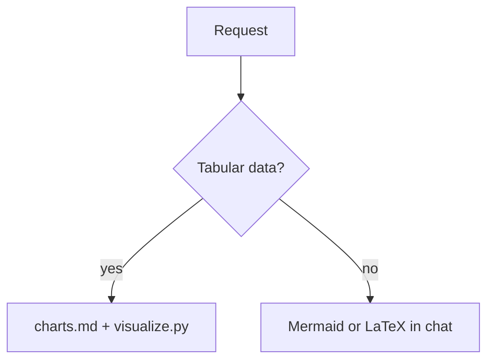
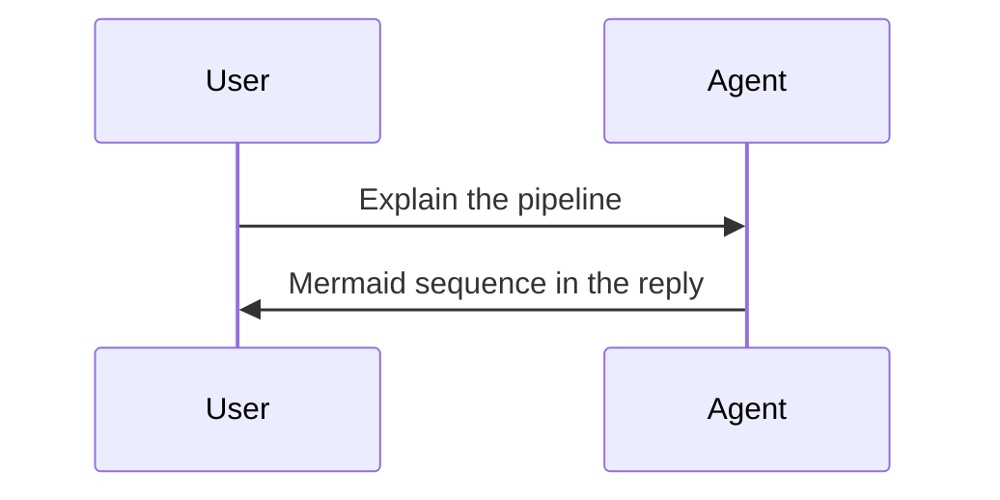

# Diagrams & math (chat / UI markdown)

Use these in assistant replies, `ui__presentInteractive` (`format: "markdown"` / `auto`), or `ui__reportResult`. No skill script required.

## Mermaid

Supported for visualization asks: `flowchart`, `sequenceDiagram`, `classDiagram`, `erDiagram`, `stateDiagram-v2`, `mindmap`, `gantt` (as needed).

Mindmap:

````markdown
```mermaid
mindmap
  root((Visualize))
    Diagrams
      Mermaid
      Mindmap
    Math
      LaTeX
    Charts
      CSV
      Excel
```
````

Flowchart:

````markdown

````

Sequence:

````markdown

````

## LaTeX (KaTeX)

Inline: `$L = \frac{1}{n}\sum_i (y_i - \hat{y}_i)^2$`.

Display:

````markdown
$$
\nabla_\theta \mathcal{L}(\theta) = 0
$$
````

## UI tools

- Prefer markdown mode for Mermaid/LaTeX — it already renders.
- Do not switch to `format: "html"` only to show a diagram.
